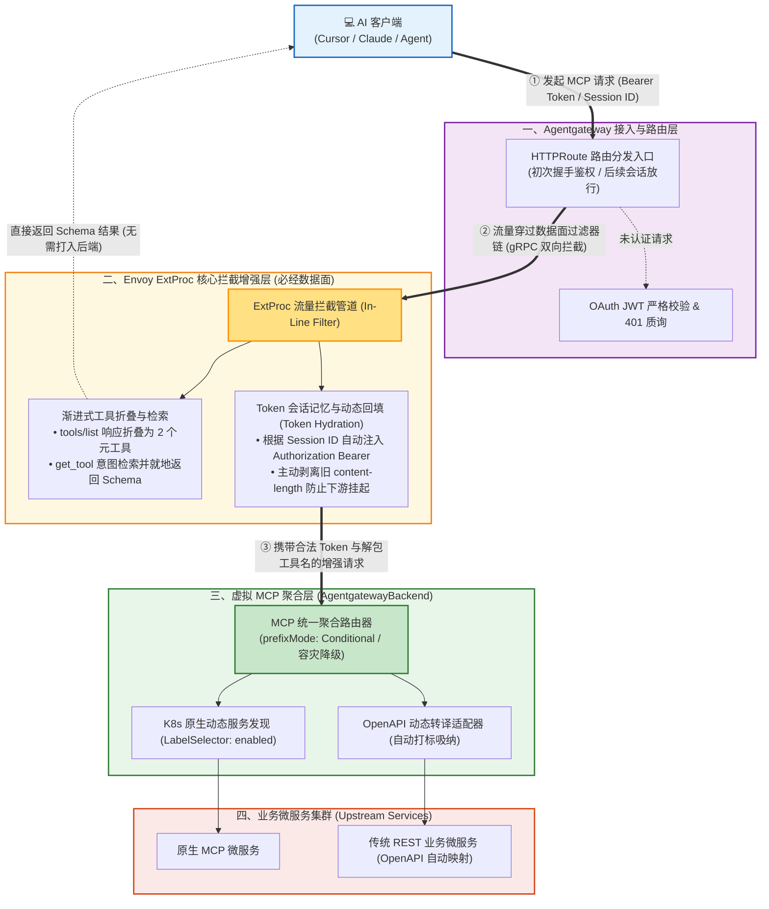
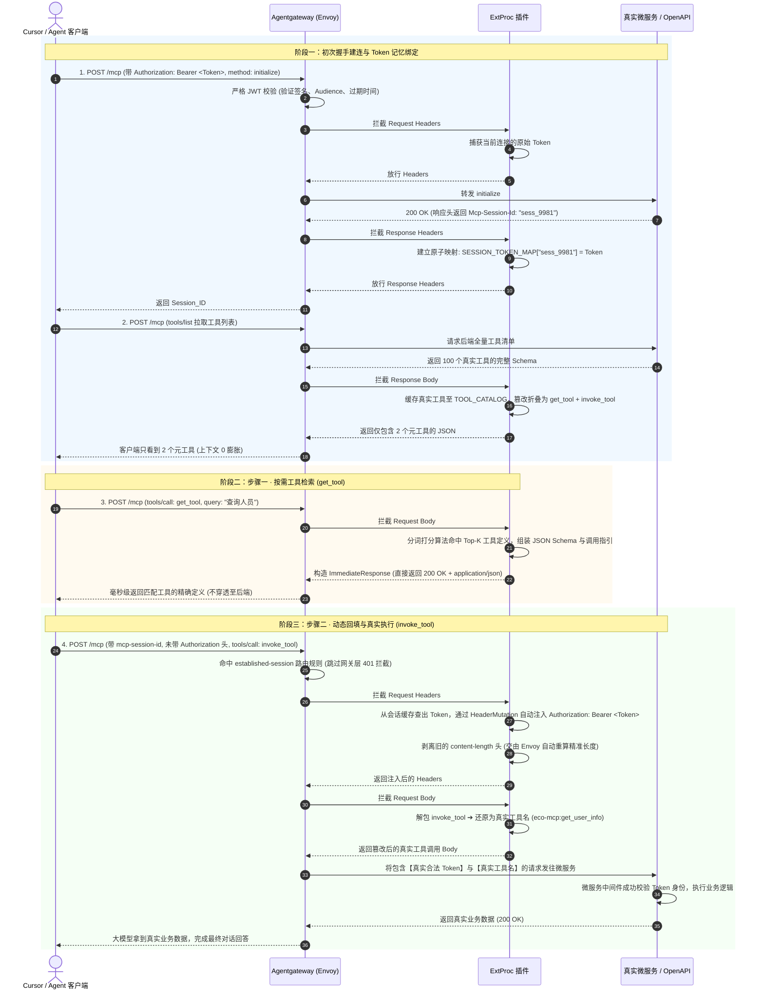
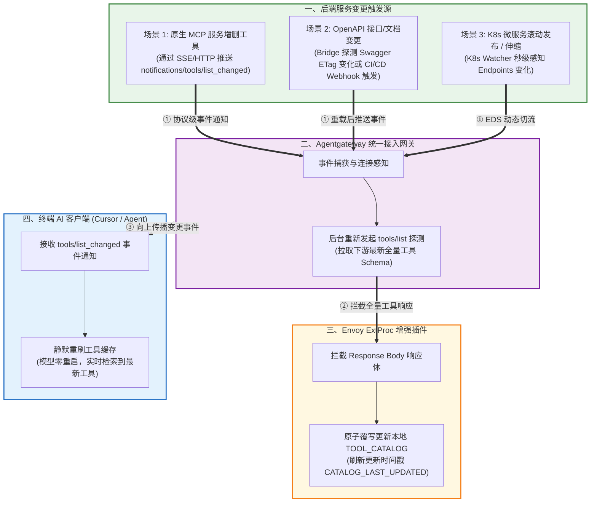

# 企业级 Agentgateway 虚拟 MCP 聚合与动态服务发现全景架构实施指南

---

## 1. 方案背景与核心技术痛点

在企业大规模落地 AI Agent（如使用 Cursor、Claude Desktop 或企业自研 Agent）对接微服务集群的场景中，随着业务系统数量膨胀，传统的直接直连或静态网关接入方案面临以下 5 大致命瓶颈：

1. **大模型上下文（Context Window）爆炸**：  
   MCP 协议默认要求在连接初始化时全量返回所有工具的完整 JSON Schema。当下游存在几十乃至上百个接口时，成千上万行的 Schema 会瞬间占满大模型的提示词上下文，导致模型推理成本剧增、幻觉率大幅上升。
2. **MCP 会话与网关 OAuth 鉴权冲突**：  
   标准 MCP 客户端在初次握手建连成功后，后续发送工具调用（`tools/call`）时，为降低报文开销默认**不再重复携带 `Authorization: Bearer <Token>`**，而仅携带 `mcp-session-id`。但企业级 API 网关对每个独立的 HTTP POST 请求均执行严格的 JWT 校验，直接导致后续工具调用被网关拦截报错 `401 Unauthorized`，客户端报 `Connection closed`。
3. **零信任后端服务的凭证穿透需求**：  
   如果网关简单粗暴放行未带 Token 的请求，下游具体的业务微服务（作为严格的零信任服务）因缺失用户凭证而报错 401。后端必须收到发起调用的终端用户原始 OAuth Token，以完成数据权限隔离与审计。
4. **报文改写导致的 HTTP Content-Length 挂起**：  
   在网关层将包装的元工具（如 `invoke_tool`）解包改写为真实工具名时，由于篡改后请求体长度发生变化，若 HTTP 头中的 `Content-Length` 未被同步修正，下游微服务（如 FastAPI / Uvicorn）会一直挂起等待剩余字节直至超时断开连接。
5. **传统接口（OpenAPI / REST）静态配置繁琐**：  
   企业内存在大量既有的 Spring Boot、Django、Go 等 REST API（OpenAPI/Swagger 规范），传统方案需要人工写大量网关配置硬编码 Target，缺乏 Kubernetes 原生的动态发现与热加载能力。

针对上述挑战，本方案基于 **Agentgateway + Envoy ExtProc + Kubernetes 服务发现**，构建了一套兼具**零配置动态聚合、渐进式检索披露、OAuth 全链路自动回填与 CEL 细粒度分权**的生产级落地架构。

---

## 2. 总体架构设计 (Architecture Overview)

整个架构分为 **接入治理层**、**流量拦截与增强层 (ExtProc)**、**动态发现与聚合层**、**业务微服务层** 四大核心逻辑部分：



---

## 3. 端到端访问时序流程 (Traffic Flow & Sequence)

整个调用生命周期严格分为三个阶段：**初次握手与凭证记忆**、**步骤一·按需检索工具**、**步骤二·自动注入与真实执行**。



---

## 4. 后端接口与 MCP 服务更新后的自动热重载机制 (Auto-Reload & Hot-Sync)

在企业敏捷迭代场景中，后端的业务微服务会频繁发布更新（如新增 REST 接口、修改工具入参 Schema、甚至新上线/下线整个服务 Pod）。**整套网关架构在设计上实现了端到端的“零重启、毫秒级自动热同步”**。



### 4.1 三类典型更新场景的自动同步原理

#### 场景 1：原生 MCP 服务内的工具变更（添加、修改参数、删除工具）
* **遵循 MCP 协议标准通知规范**：  
  在 MCP 官方协议中，当 Server 内部的工具有变动时，MCP Server 会通过 Streamable HTTP / SSE 长连接主动推送一个 JSON-RPC 通知：
  ```json
  {
    "jsonrpc": "2.0",
    "method": "notifications/tools/list_changed"
  }
  ```
* **网关与插件联动机制**：  
  1. Agentgateway 接收到该通知后，自动在底层连接池重新执行一次 `tools/list` 探测拉取最新全量定义；
  2. ExtProc 插件的 `response_body` 拦截器捕获到最新的工具列表，自动执行原子覆写更新本地 `TOOL_CATALOG` 字典；
  3. 网关将此变更通知向上传递给终端 AI 客户端（如 Cursor），客户端收到后自动静默更新本地会话工具缓存。大模型下一次调用 `get_tool` 即可**实时检索到刚上线的最新工具及其最新参数 Schema**！

---

#### 场景 2：传统 OpenAPI / Swagger REST 接口变更
当后端的 Spring Boot / Go 业务系统更新了代码并修改了 Swagger 文档时，OpenAPI 桥接器提供两种自动同步机制：
* **机制 A（基于 ETag / Last-Modified 的定时轻量轮询）**：  
  `openapi-mcp-bridge` 容器默认开启后台检测（如每隔 30 秒探测一次 `GET /v3/api-docs` 的 Header）。一旦发现文档版本或内容哈希发生变更，桥接器自动重新编译生成新的 MCP 工具，并主动向上游网关抛出 `notifications/tools/list_changed` 事件。
* **机制 B（CI/CD 流水线主动 Webhook 触发）**：  
  在业务微服务发布流水线（如 Jenkins / GitLab CI）的部署后置步骤中，通过调用桥接器的健康重载端点（如 `POST http://order-openapi-bridge:8000/reload`），实现发布完成瞬间立即强制重载，达到 0 延迟生效。

---

#### 场景 3：新上线微服务或 Pod 滚动更新 (RollingUpdate)
* **K8s 控制面秒级 Watch 机制**：  
  当业务团队发布新微服务并在其 Service 打上 `agentgateway.dev/mcp-server: enabled` 标签时，Agentgateway 控制面通过 Kubernetes API 监听事件，自动在 Envoy 数据面为其生成新的 Upstream Cluster，并立即发起 `initialize` 握手。
* **零中断滚动发布**：  
  在旧微服务 Pod 终止、新 Pod 启动过程中，网关依赖 K8s 的就绪探针（Readiness Probe）与 `failureMode: FailOpen` 策略，只有当新 Pod 完全就绪并成功响应 MCP 探测时才切入流量，确保大模型调用工具过程无闪断、无 502 错误。

---

### 4.2 ExtProc 插件层的三级缓存自动失效与刷新保障

1. **响应拦截自愈更新（第一级保障）**：任何客户端（包括网关的定时健康探针）只要发起一次 `tools/list`，插件都会用下游的最新响应强行原子刷新字典。
2. **TTL 被动检测兜底（第二级保障）**：当大模型执行 `get_tool` 时，若发现缓存超过了预设 TTL（如 5 分钟），插件自动触发轻量异步探活，保证长期运行不出现数据陈旧。
3. **运维主动刷新接口（第三级保障）**：插件暴露独立的 Admin 探测端口（如 `:9003/admin/reload`），支持运维在紧急发布后一键强制清空重刷工具池。

---

## 5. 权限治理与分权控制矩阵 (RBAC Best Practices)

| 权限控制层级 | 实现方式 | 典型应用场景 | 优势与收益 |
| :--- | :--- | :--- | :--- |
| **路由端点级 (Route Level)** | `AgentgatewayPolicy` + `jwtAuthentication` | 拦截非法未登录请求、提供 401 认证引导 | 边缘防护，防止无凭证流量打入集群 |
| **目标服务级 (Target Level)** | `AgentgatewayPolicy` + `authorization.policy.matchExpressions` (CEL) | 针对核心财务/审计 Target，仅允许 `roles: ["finance-admin"]` 角色调用 | 原生极速决策，不同微服务按角色物理隔离 |
| **外部权限中心级 (Enterprise IAM)** | `AgentgatewayPolicy` + `traffic.extAuth` (OPA / Casbin) | 动态对接企业集中权限中心，执行复杂合规审计 | 统一合规审计，策略集中管控 |
| **工具级动态裁剪 (Tool Masking)** | `ExtProc` 插件在 `get_tool` 检索时按 JWT Claims 动态裁剪 | 普通员工检索时只看到常规工具，管理员看到全部高级运维工具 | 从根源杜绝模型幻觉与横向越权指令生成 |

### 5.1 目标服务级授权示例 (Target-Level RBAC via CEL)

通过在 `AgentgatewayPolicy` 中绑定特定 Target，结合 CEL（Common Expression Language）表达式，实现对敏感微服务的物理阻断：

```yaml
apiVersion: agentgateway.dev/v1alpha1
kind: AgentgatewayPolicy
metadata:
  name: mcp-rbac-auth-policy
  namespace: agentgateway-system
spec:
  targetRefs:
    - group: gateway.networking.k8s.io
      kind: HTTPRoute
      name: dynamic-mcp-route
  traffic:
    authorization:
      action: Allow
      policy:
        matchExpressions:
          - "jwt.claims.roles.exists(r, r in ['admin', 'developer'])"
          - "jwt.claims.department == 'rnd'"
```

---

### 5.2 工具级动态权限裁剪 (Tool-Level Dynamic Masking) 示例说明

#### 1. 背景与核心设计思想
网关层的 CEL 策略作用于整个后端 Service/Target，但单个微服务内部往往聚合了多个危险级别不同的工具（例如同一个微服务中既有只读查询工具 `query_report`，又有高危控制工具 `restart_service` 或 `approve_payment`）。

如果将所有工具无差别暴露：
1. **模型越权与幻觉隐患**：普通员工在自然语言对话中如果提到“帮我重启服务”，大模型会发现该工具并尝试生成调用参数；
2. **敏感信息泄露**：非授权人员通过 `get_tool` 检索即可刺探出系统的内部运维参数和敏感接口结构。

因此，**工具级动态裁剪**通过联动当前会话的 **JWT Claims (用户身份与角色)**，在 **检索阶段 (get_tool)** 与 **执行阶段 (invoke_tool)** 形成端到端的双重纵深防御：

```text
┌─────────────────────────────────────────────────────────────────────────────────────────────┐
│ 终端用户发起 get_tool 检索 ──► ExtProc 提取会话 JWT Claims (如 roles: ["developer"])        │
│                                                                                             │
│  【工具池动态过滤过滤算法】:                                                                │
│    ├── 基础工具 (query_log, list_pod)   ──(匹配成功)──► 纳入当前用户的检索候选池            │
│    └── 高危工具 (restart_pod, drop_db) ──(权限不符)──► 【物理剔除】，该用户完全不可见        │
│                                                                                             │
│  大模型下发的候选工具列表 100% 经过权限安全裁剪，从根源杜绝模型幻觉与越权生成。              │
└─────────────────────────────────────────────────────────────────────────────────────────────┘
```

#### 2. 工具元数据声明规范 (微服务侧)
微服务在提供 MCP 工具定义时，可在 `annotations` 或 `description` 中注入所需角色标记（示例）：
```json
{
  "name": "ops-tools:restart_service",
  "description": "紧急重启集群微服务实例",
  "inputSchema": {
    "type": "object",
    "properties": {
      "service_name": {"type": "string"}
    },
    "required": ["service_name"]
  },
  "annotations": {
    "rbac.authorization.k8s.io/roles": ["ops-admin", "super-admin"]
  }
}
```

#### 3. ExtProc 插件动态裁剪核心逻辑实现 (插件侧)
在插件处理 `get_tool` 检索时，先按当前用户角色执行权限求交集过滤，再进行意图打分检索：

```python
import jwt  # 可选：轻量解析 JWT payload (无需验签，验签已在网关完成)

def extract_user_roles(token: str) -> list:
    """从 Token 中提取用户角色声明"""
    if not token:
        return ["guest"]
    try:
        # 网关已完成 JWKS 验签，插件直接提取 claims
        payload = jwt.decode(token, options={"verify_signature": False})
        return payload.get("roles", []) or ["authenticated-user"]
    except Exception:
        return ["guest"]

def filter_tools_by_permission(catalog: dict, user_roles: list) -> dict:
    """核心算法：基于 RBAC 标签对全量工具池进行动态安全裁剪"""
    visible_tools = {}
    for name, tool in catalog.items():
        # 读取工具声明的最低角色要求
        required_roles = tool.get("annotations", {}).get("rbac.authorization.k8s.io/roles", [])
        
        # 1. 若工具未声明任何权限限制，则默认为全员公开工具
        if not required_roles:
            visible_tools[name] = tool
            continue
            
        # 2. 若用户具有 super-admin 或包含任一所需角色，则开放可见
        if "super-admin" in user_roles or any(role in user_roles for role in required_roles):
            visible_tools[name] = tool
            
    return visible_tools

# 在 get_tool 检索流程中的实际调用：
# visible_catalog = filter_tools_by_permission(TOOL_CATALOG, current_user_roles)
# matched_tools = search_best_tools(query, visible_catalog, top_k=3)
```

#### 4. 双重保障：执行阶段拦截 (Execution Defense)
即使攻击者通过“越狱提示词（Prompt Injection）”绕过了 `get_tool`，直接捏造参数调用 `invoke_tool(tool_name="ops-tools:restart_service")`：
* ExtProc 插件在解包阶段再次执行校验：若 `target_tool` 所需权限与当前用户角色不符，**插件立即就地短路返回 403 结构化拒绝报文**，请求绝对不会穿透至下游真实微服务：
  ```json
  {
    "jsonrpc": "2.0",
    "id": "req-123",
    "error": {
      "code": -32003,
      "message": "403 Forbidden: 当前用户权限 ['developer'] 无权执行高危工具 'ops-tools:restart_service'，需要角色 ['ops-admin']"
    }
  }
  ```

---

## 6. 生产级实施落地 YAML 资源清单 (Kubernetes Manifests)

> **对齐说明**：以下清单 100% 对应服务器部署目录（`agentgateway_configs`）中实测跑通的真实生产配置文件。已完成旧版本的去芜存菁，涵盖基础设施、流式网络调优、跨命名空间授权、ExtProc 插件、两段式路由及 JWT 安全策略全集，可直接在集群中顺序 `kubectl apply`。
> 插件容器镜像构建所用的完整 Python 源码详见文末 [附录：Envoy ExtProc 插件核心源码实现 (`server.py`)](#附录envoy-extproc-插件核心源码实现-serverpy)。

---

### 6.1 基础设施层：网关安装与底层参数配置

#### 1. Helm 部署 Values 配置 (`my-value.yaml`)
用于配置内部私有 Harbor 镜像仓库地址，并开启 Experimental Gateway API 特性：
```yaml
image:
  registry: harbor.is.eccom.com.cn
  repository: eccom-public/eccom/agentgateway  # 数据面代理镜像
  tag: "v1.4.1"
  pullPolicy: IfNotPresent

controller:
  image:
    registry: harbor.is.eccom.com.cn
    repository: eccom-public/eccom/controller  # 控制面控制器镜像
    tag: "v1.4.1"
    pullPolicy: IfNotPresent
  extraEnv:
    # 启用实验特性（支持完整高级路由功能）
    AGW_ENABLE_EXPERIMENTAL_GATEWAY_API_FEATURES: "true"
```

#### 2. 网关底层参数与私服凭证 (`gateway-params.yaml`)
声明数据面 Pod 的私有镜像凭证及 Admin 端口环境变量：
```yaml
apiVersion: agentgateway.dev/v1alpha1
kind: AgentgatewayParameters
metadata:
  name: agw-private-params
  namespace: agentgateway-system
spec:
  service:
    spec:
      type: ClusterIP
  deployment:
    spec:
      template:
        spec:
          imagePullSecrets:
            - name: my-registry-secret
          containers:
            - name: agentgateway
              image: harbor.is.eccom.com.cn/eccom-public/eccom/agentgateway:v1.4.1
              env:
                - name: ADMIN_ADDR
                  value: "0.0.0.0:15000"
```

#### 3. Gateway 实例定义 (`gateway.yaml`)
创建网关实例并绑定上述底层参数：
```yaml
apiVersion: gateway.networking.k8s.io/v1
kind: Gateway
metadata:
  name: ai-gateway
  namespace: agentgateway-system
spec:
  gatewayClassName: agentgateway
  infrastructure:
    parametersRef:
      group: agentgateway.dev
      kind: AgentgatewayParameters
      name: agw-private-params
  listeners:
    - name: http-ai
      port: 8080
      protocol: HTTP
      allowedRoutes:
        namespaces:
          from: All
```

---

### 6.2 入口暴露层：Nginx Ingress 流量接入与流式网络调优

#### 1. 网关对外暴露与大模型专属网络优化 (`gateway-ingress.yaml`)
针对 AI Agent 长文本推理与流式 SSE 输出进行了关键调优：
```yaml
apiVersion: networking.k8s.io/v1
kind: Ingress
metadata:
  name: ai-gateway-ingress
  namespace: agentgateway-system
  annotations:
    kubernetes.io/ingress.class: "nginx"
    # 【关键配置 1】关闭缓冲区，保证大模型 Token 能够逐字流式打字输出
    nginx.ingress.kubernetes.io/proxy-buffering: "off"
    # 【关键配置 2】调大后端超时至 300s（防止复杂工具推理思考时间过长导致 504）
    nginx.ingress.kubernetes.io/proxy-connect-timeout: "300"
    nginx.ingress.kubernetes.io/proxy-read-timeout: "300"
    nginx.ingress.kubernetes.io/proxy-send-timeout: "300"
    # 【关键配置 3】支持大 Prompt / 上下文 Body
    nginx.ingress.kubernetes.io/proxy-body-size: "100m"
spec:
  rules:
    - host: gateway-ai.cloud.lab.eccom.com.cn                 # 统一对外域名
      http:
        paths:
          - path: /
            pathType: Prefix
            backend:
              service:
                name: ai-gateway
                port:
                  number: 8080
```

#### 2. 网关 Admin 运维面板独立暴露 (`agw-admin-svc.yaml` & `dashboard.yaml`)
```yaml
apiVersion: v1
kind: Service
metadata:
  name: ai-gateway-admin
  namespace: agentgateway-system
spec:
  selector:
    gateway.networking.k8s.io/gateway-name: ai-gateway
  ports:
    - name: admin-ui
      port: 15000
      targetPort: 15000
      protocol: TCP
---
apiVersion: networking.k8s.io/v1
kind: Ingress
metadata:
  name: agw-dashboard-ingress
  namespace: agentgateway-system
  annotations:
    kubernetes.io/ingress.class: "nginx"
spec:
  rules:
    - host: agw-dashboard.cloud.lab.eccom.com.cn   # 运维控制台独立域名
      http:
        paths:
          - path: /
            pathType: Prefix
            backend:
              service:
                name: ai-gateway-admin
                port:
                  number: 15000
```

---

### 6.3 跨命名空间安全授权层 (ReferenceGrants)

根据 Kubernetes Gateway API 规范，跨 Namespace 引用 Service 时必须显式通过 `ReferenceGrant` 放行授权：

#### 1. 认证中心跨命名空间授权 (`app0040-ecoauth/idp-reference-grant.yaml`)
部署于认证中心所在命名空间（`app40-ecoauth`），允许网关读取 JWKS 密钥：
```yaml
apiVersion: gateway.networking.k8s.io/v1beta1
kind: ReferenceGrant
metadata:
  name: allow-agw-to-auth-service
  namespace: app40-ecoauth                   # 认证中心所在的命名空间
spec:
  from:
    # 授权来源：中央网关的 Policy 资源
    - group: agentgateway.dev
      kind: AgentgatewayPolicy
      namespace: agentgateway-system
  to:
    # 授权目标：当前命名空间下的 Service
    - group: ""
      kind: Service
```

#### 2. 业务微服务跨命名空间授权 (`app0129-wwwin-mcp/reference-grant.yaml`)
部署于具体业务 MCP 服务所在命名空间，允许网关接入该命名空间下的 MCP 微服务：
```yaml
apiVersion: gateway.networking.k8s.io/v1beta1
kind: ReferenceGrant
metadata:
  name: allow-agentgateway-to-mcp
  namespace: app0129-wwwin-mcp    # 业务 MCP 服务所在 Namespace
spec:
  from:
    - group: agentgateway.dev
      kind: AgentgatewayBackend
      namespace: agentgateway-system
    - group: gateway.networking.k8s.io
      kind: HTTPRoute
      namespace: agentgateway-system
  to:
    - group: ""
      kind: Service
```

---

### 6.4 ExtProc 插件工作负载部署 (`plugin/plugin-workload.yaml`)

```yaml
apiVersion: apps/v1
kind: Deployment
metadata:
  name: mcp-tool-search-plugin
  namespace: agentgateway-system
  labels:
    app: mcp-tool-search-plugin
spec:
  replicas: 1
  selector:
    matchLabels:
      app: mcp-tool-search-plugin
  template:
    metadata:
      labels:
        app: mcp-tool-search-plugin
    spec:
      containers:
        - name: plugin
          image: harbor.is.eccom.com.cn/eccom-public/eccom/mcp-tool-search-plugin:v2.1
          imagePullPolicy: IfNotPresent
          ports:
            - name: grpc
              containerPort: 9002
              protocol: TCP
          resources:
            requests:
              cpu: 100m
              memory: 128Mi
            limits:
              cpu: 500m
              memory: 512Mi
---
apiVersion: v1
kind: Service
metadata:
  name: mcp-tool-search-plugin
  namespace: agentgateway-system
spec:
  selector:
    app: mcp-tool-search-plugin
  ports:
    - name: grpc
      port: 9002
      targetPort: 9002
      protocol: TCP
      appProtocol: grpc
```

---

### 6.5 核心两段式路由分流与后端聚合 (`mcp-route-dynamic-v2.yaml`)

严格采用 Agentgateway CRD 真实的规范选择器（`namespaces: {}` + `services.matchLabels`）：

```yaml
apiVersion: agentgateway.dev/v1alpha1
kind: AgentgatewayBackend
metadata:
  name: dynamic-mcp-backend
  namespace: agentgateway-system
spec:
  mcp:
    prefixMode: Conditional
    targets:
      # 全集群纯动态服务发现 (凡打上 enabled 标签的原生 MCP 或 OpenAPI 桥接微服务，网关均自动秒级感知吸纳)
      - name: dynamic-mcp-target
        selector:
          namespaces: {}
          services:
            matchLabels:
              agentgateway.dev/mcp-server: enabled

---
# 路由定义：按 Header 中是否存在 mcp-session-id 进行两段式精细化分流
apiVersion: gateway.networking.k8s.io/v1
kind: HTTPRoute
metadata:
  name: dynamic-mcp-route
  namespace: agentgateway-system
spec:
  parentRefs:
    - group: gateway.networking.k8s.io
      kind: Gateway
      name: ai-gateway
      sectionName: http-ai
  rules:
    # 规则 1：已建立 Session 的后续调用 (放行网关层 JWT 拦截，交由 ExtProc 回填 Token)
    - name: established-session
      matches:
        - path:
            type: PathPrefix
            value: /mcp
          headers:
            - name: mcp-session-id
              value: ".*"
              type: RegularExpression
      backendRefs:
        - group: agentgateway.dev
          kind: AgentgatewayBackend
          name: dynamic-mcp-backend

    # 规则 2：初次握手建连 (未带 Session_ID，强制执行网关层 JWT 严格校验与 401 质询)
    - name: initial-handshake
      matches:
        - path:
            type: PathPrefix
            value: /mcp
        - path:
            type: PathPrefix
            value: /.well-known/oauth-protected-resource/mcp
      backendRefs:
        - group: agentgateway.dev
          kind: AgentgatewayBackend
          name: dynamic-mcp-backend
```

---

### 6.6 全网统一流量治理策略 (`mcp-policies-v2.yaml`)

涵盖生产实战调试确定的关键项：`cacheDuration: "5m"`、`requestHeaderMode: Send`（确保能拦截头并回填 Token）：

```yaml
# 1. 仅在初次握手（无 Session ID）时强校验 JWT 并下发 401 质询
apiVersion: agentgateway.dev/v1alpha1
kind: AgentgatewayPolicy
metadata:
  name: mcp-jwt-auth-policy
  namespace: agentgateway-system
spec:
  targetRefs:
    - group: gateway.networking.k8s.io
      kind: HTTPRoute
      name: dynamic-mcp-route
      sectionName: initial-handshake
  traffic:
    jwtAuthentication:
      mode: Strict
      providers:
        - audiences:
            - "http://gateway-ai.cloud.lab.eccom.com.cn/mcp"
          issuer: "https://api-staging.eccom.com.cn/api/auth/oidc"
          jwks:
            remote:
              jwksPath: "/oidc/getJkwsKey"
              cacheDuration: "5m"
              backendRef:
                kind: Service
                name: system-auth-center
                namespace: app40-ecoauth
                port: 8080
      mcp:
        resourceMetadata:
          resource: "http://gateway-ai.cloud.lab.eccom.com.cn/mcp"
          scopesSupported: ["openid", "mcp", "read", "write"]
          bearerMethodsSupported: ["header"]
    transformation:
      request:
        set:
          - name: authorization
            value: "'Bearer ' + jwt.rawToken.unredacted()"

---
# 2. 全局路由挂载 ExtProc 插件，Send 头与体以实现 Token 动态注入
apiVersion: agentgateway.dev/v1alpha1
kind: AgentgatewayPolicy
metadata:
  name: mcp-extproc-filter-policy
  namespace: agentgateway-system
spec:
  targetRefs:
    - group: gateway.networking.k8s.io
      kind: HTTPRoute
      name: dynamic-mcp-route
  traffic:
    extProc:
      backendRef:
        group: ""
        kind: Service
        name: mcp-tool-search-plugin
        port: 9002
      failureMode: FailOpen
      processingOptions:
        allowModeOverride: false
        requestBodyMode: Buffered
        responseBodyMode: Buffered
        requestHeaderMode: Send
        responseHeaderMode: Send
        requestTrailerMode: Skip
        responseTrailerMode: Skip
```

---

### 6.7 业务微服务接入规范模板 (`service-templates.yaml`)

#### 模式 A：原生 MCP 微服务（一键打标自动发现）
```yaml
apiVersion: v1
kind: Service
metadata:
  name: user-mcp-service
  namespace: app-biz
  labels:
    agentgateway.dev/mcp-server: enabled   # 【必须】：通行证标签，网关秒级自动发现
spec:
  ports:
    - name: mcp
      port: 8080
      targetPort: 8080
      appProtocol: agentgateway.dev/mcp    # 【必须】：声明应用协议
  selector:
    app: user-mcp
```

#### 模式 B：传统 OpenAPI / Swagger REST 微服务转译接入
```yaml
apiVersion: apps/v1
kind: Deployment
metadata:
  name: order-openapi-bridge
  namespace: app-biz
spec:
  replicas: 1
  selector:
    matchLabels:
      app: order-openapi-bridge
  template:
    metadata:
      labels:
        app: order-openapi-bridge
        agentgateway.dev/mcp-server: enabled  # 自动发现标签
    spec:
      containers:
        - name: bridge
          image: ghcr.io/mcp/openapi-bridge:latest
          env:
            - name: OPENAPI_SPEC_URL
              value: "http://order-service:8080/v3/api-docs" # 业务 Swagger 文档地址
            - name: TARGET_BASE_URL
              value: "http://order-service:8080"             # 业务 REST 地址
          ports:
            - containerPort: 8000
              appProtocol: agentgateway.dev/mcp
---
apiVersion: v1
kind: Service
metadata:
  name: order-openapi-bridge-svc
  namespace: app-biz
  labels:
    agentgateway.dev/mcp-server: enabled
spec:
  ports:
    - name: mcp
      port: 8000
      targetPort: 8000
      appProtocol: agentgateway.dev/mcp
  selector:
    app: order-openapi-bridge
```

---

## 7. 验证与排错速查手册 (Troubleshooting Guide)

1. **客户端报错 `Connection closed`？**
   * **检查项 1**：查看网关日志 `kubectl logs deployment/ai-gateway -n agentgateway-system`，若出现 `mcp authentication failure: no bearer token found`，说明 `HTTPRoute` 的 `established-session` 规则未生效，导致工具调用阶段被网关 401 拦截。
   * **检查项 2**：查看插件日志 `kubectl logs deployment/mcp-tool-search-plugin -n agentgateway-system`，确认解包转发时是否通过 `remove_headers: ["content-length"]` 剥离了旧长度，防止下游因读取挂起超时断连。
2. **大模型搜索工具返回“未找到”？**
   * **原因**：大模型通常传入复合长句（如 `"查询人员信息 员工信息"`）。
   * **解决**：确认插件版本升级至 `v2.1`，该版本已集成多关键词分词与加权打分算法，避免了单一子串硬匹配失效。
3. **后端微服务报 401？**
   * **检查项**：确认插件日志中是否出现 `===> [Token 回填] 会话 [xxxx...] 命中缓存，自动注入 Authorization Token`。确认微服务中的 `GATEWAY_AUD` 已信任网关 Audience（如 `http://gateway-ai.cloud.lab.eccom.com.cn/virtual-mcp`）。
4. **微服务更新后大模型查不到新工具？**
   * **检查项 1**：确认新微服务的 Service 是否已打上 `agentgateway.dev/mcp-server: enabled` 标签，端口是否声明了 `appProtocol: agentgateway.dev/mcp`。
   * **检查项 2**：查看网关日志确认是否已触发 `tools/list` 同步；若是 OpenAPI 桥接器，确认桥接器的 `OPENAPI_SPEC_URL` 是否能正常拉取到最新的 Swagger JSON。

---

## 附录：Envoy ExtProc 插件核心源码实现 (`server.py`)

```python
import asyncio
import json
import logging
import re
import time
from collections import OrderedDict
import grpc
from grpc import aio

from envoy_data_plane.envoy.service.ext_proc.v3 import (
    ProcessingRequest,
    ProcessingResponse,
    HeadersResponse,
    BodyResponse,
    TrailersResponse,
    CommonResponse,
    BodyMutation,
    ImmediateResponse,
    HeaderMutation
)
from envoy_data_plane.envoy.config.core.v3 import HeaderValueOption, HeaderValue
from envoy_data_plane.envoy.type.v3 import HttpStatus, StatusCode

logging.basicConfig(level=logging.INFO, format="%(asctime)s - [%(levelname)s] - %(message)s")
logger = logging.getLogger("mcp-tool-search-plugin")

TOOL_CATALOG = {}
CATALOG_LAST_UPDATED = 0

# 1. 线程安全、防串号、支持 LRU 淘汰与 TTL 自动过期的 Session-Token 缓存管理器
class SessionTokenManager:
    def __init__(self, max_sessions=10000, default_ttl=3600):
        self._lock = asyncio.Lock()
        self._cache = OrderedDict()
        self._max_sessions = max_sessions
        self._default_ttl = default_ttl

    async def bind_session(self, session_id: str, token: str, ttl: int = None):
        if not session_id or not token:
            return
        ttl = ttl or self._default_ttl
        expire_at = time.time() + ttl
        
        async with self._lock:
            if session_id in self._cache:
                self._cache.move_to_end(session_id)
            elif len(self._cache) >= self._max_sessions:
                self._cache.popitem(last=False)
                
            self._cache[session_id] = {"token": token, "expire_at": expire_at}

    async def get_token(self, session_id: str) -> str:
        if not session_id:
            return None
        
        async with self._lock:
            if session_id not in self._cache:
                return None
            entry = self._cache[session_id]
            if time.time() > entry["expire_at"]:
                del self._cache[session_id]
                return None
            self._cache.move_to_end(session_id)
            return entry["token"]

session_manager = SessionTokenManager(max_sessions=10000, default_ttl=3600)

META_TOOLS = [
    {
        "name": "get_tool",
        "description": "【步骤一：检索工具】按需搜索并获取具体业务工具的精确定义与参数 Schema。在执行任何具体业务前必须先调用此工具。获取到工具名称和参数定义后，必须立即在下一步调用 invoke_tool 执行。",
        "inputSchema": {
            "type": "object",
            "properties": {
                "query": {"type": "string", "description": "搜索意图或关键词，如'查询员工'、'ERP订单'、'审批'等"}
            },
            "required": ["query"]
        }
    },
    {
        "name": "invoke_tool",
        "description": "【步骤二：执行工具】调用并执行通过 get_tool 查找到的具体业务工具。必须传入 get_tool 返回的精确 tool_name 以及满足其 Schema 要求的参数字典。",
        "inputSchema": {
            "type": "object",
            "properties": {
                "tool_name": {"type": "string", "description": "由 get_tool 返回的完整工具名称 (例如 eco-mcp:get_user_info)"},
                "parameters": {"type": "object", "description": "传给该工具的具体参数键值对 (对应 get_tool 返回的 inputSchema 要求)"}
            },
            "required": ["tool_name"]
        }
    }
]

def search_best_tools(query: str, catalog: dict, top_k: int = 5):
    if not query or not catalog:
        return []
    words = [w.lower() for w in re.findall(r'[\w\u4e00-\u9fa5]+', query) if len(w) >= 1]
    stopwords = {"查询", "搜索", "获取", "请", "帮我", "查看", "一下", "和", "的", "有", "以及", "get", "query", "find", "search"}
    keywords = [w for w in words if w not in stopwords and len(w) > 1] or words

    scored = []
    for full_name, tool_info in catalog.items():
        name = full_name.lower()
        desc = (tool_info.get("description") or "").lower()
        schema_str = json.dumps(tool_info.get("inputSchema", {})).lower()
        
        score = 0
        for kw in keywords:
            if kw in name: score += 5
            if kw in desc: score += 3
            if kw in schema_str: score += 1
        if query.lower() in desc or query.lower() in name: score += 10
        if score > 0: scored.append((score, full_name, tool_info))

    scored.sort(key=lambda x: x[0], reverse=True)
    return [item[2] for item in scored[:top_k]] if scored else list(catalog.values())[:top_k]

def parse_mcp_json(raw_text):
    if not raw_text or not raw_text.strip(): return None, False, ""
    clean = raw_text.strip()
    is_sse, sse_prefix, target_str = False, "", clean
    if "data:" in clean:
        is_sse = True
        m = re.search(r'(.*?data:\s*)(\{.*\})(.*)', clean, re.DOTALL)
        if m: sse_prefix, target_str = m.group(1), m.group(2)
    try:
        return json.loads(target_str), is_sse, sse_prefix
    except Exception:
        m = re.search(r'(\{.*\})', clean, re.DOTALL)
        if m:
            try: return json.loads(m.group(1)), is_sse, sse_prefix
            except Exception: pass
    return None, False, ""

def extract_headers_dict(http_headers):
    header_map = {}
    if http_headers and http_headers.headers and http_headers.headers.headers:
        for h in http_headers.headers.headers:
            header_map[h.key.lower()] = h.value if h.value else (h.raw_value.decode("utf-8", errors="ignore") if h.raw_value else "")
    return header_map

class ExtProcGenericHandler(grpc.GenericRpcHandler):
    def service(self, handler_call_details):
        if handler_call_details.method == "/envoy.service.ext_proc.v3.ExternalProcessor/Process":
            return grpc.stream_stream_rpc_method_handler(
                self.process, request_deserializer=lambda x: x, response_serializer=lambda x: x
            )
        return None

    async def process(self, request_iterator, context):
        global CATALOG_LAST_UPDATED
        current_token = None
        try:
            async for raw_req in request_iterator:
                req = ProcessingRequest().parse(raw_req)
                resp = ProcessingResponse()

                # A. 拦截 Request Headers (Token 记忆回填 + 剥离旧 content-length 防挂起)
                if req.request_headers:
                    h_map = extract_headers_dict(req.request_headers)
                    auth_header = h_map.get("authorization", "")
                    session_id = h_map.get("mcp-session-id", "")
                    set_headers, remove_headers = [], ["content-length"]

                    if auth_header.lower().startswith("bearer "):
                        current_token = auth_header[7:].strip()
                        if session_id:
                            await session_manager.bind_session(session_id, current_token)
                    elif session_id:
                        cached_token = await session_manager.get_token(session_id)
                        if cached_token:
                            set_headers.append(HeaderValueOption(header=HeaderValue(key="authorization", value=f"Bearer {cached_token}")))

                    resp = ProcessingResponse(
                        request_headers=HeadersResponse(response=CommonResponse(
                            header_mutation=HeaderMutation(set_headers=set_headers, remove_headers=remove_headers)
                        ))
                    )

                # B. 拦截 Response Headers (服务端下发 Session ID 绑定)
                elif req.response_headers:
                    h_map = extract_headers_dict(req.response_headers)
                    session_id = h_map.get("mcp-session-id", "")
                    if session_id and current_token:
                        await session_manager.bind_session(session_id, current_token)
                    resp = ProcessingResponse(response_headers=HeadersResponse(response=CommonResponse()))

                # C. 拦截 Response Body (tools/list 折叠为 2 个元工具并原子更新字典)
                elif req.response_body and req.response_body.body:
                    try:
                        raw_text = req.response_body.body.decode("utf-8", errors="ignore")
                        payload, is_sse, sse_prefix = parse_mcp_json(raw_text)
                        if payload and "result" in payload and "tools" in payload["result"]:
                            TOOL_CATALOG.clear()
                            for t in payload["result"]["tools"]: TOOL_CATALOG[t["name"]] = t
                            CATALOG_LAST_UPDATED = time.time()
                            
                            payload["result"]["tools"] = META_TOOLS
                            new_json = json.dumps(payload, ensure_ascii=False)
                            new_body = f"{sse_prefix}{new_json}\n\n".encode("utf-8") if is_sse else new_json.encode("utf-8")
                            resp = ProcessingResponse(response_body=BodyResponse(response=CommonResponse(
                                body_mutation=BodyMutation(body=new_body)
                            )))
                        else:
                            resp = ProcessingResponse(response_body=BodyResponse(response=CommonResponse()))
                    except Exception as e:
                        logger.error(f"处理响应体异常: {e}", exc_info=True)
                        resp = ProcessingResponse(response_body=BodyResponse(response=CommonResponse()))

                # D. 拦截 Request Body (get_tool 检索 & invoke_tool 解包)
                elif req.request_body and req.request_body.body:
                    try:
                        raw_text = req.request_body.body.decode("utf-8", errors="ignore")
                        req_json, is_sse, sse_prefix = parse_mcp_json(raw_text)
                        if req_json and req_json.get("method") == "tools/call":
                            params = req_json.get("params", {})
                            tool_name = params.get("name")
                            call_args = params.get("arguments", {}) or {}

                            # 1. get_tool 就地返回 Schema
                            if tool_name in ["get_tool", "search_tools"]:
                                query = call_args.get("query", "") or call_args.get("tool_name", "")
                                matched = search_best_tools(query, TOOL_CATALOG, top_k=3)
                                if matched:
                                    formatted = [{
                                        "tool_name": t["name"],
                                        "description": t.get("description", ""),
                                        "parameters_schema": t.get("inputSchema", {}),
                                        "instruction": f"要执行此工具，请立即调用 invoke_tool(tool_name='{t['name']}', parameters=...)"
                                    } for t in matched]
                                    res_text = json.dumps(formatted, ensure_ascii=False, indent=2)
                                else:
                                    res_text = f"未找到与 '{query}' 相关的业务工具。"

                                resp_payload = {"jsonrpc": "2.0", "id": req_json.get("id"), "result": {"content": [{"type": "text", "text": res_text}], "isError": False}}
                                resp = ProcessingResponse(immediate_response=ImmediateResponse(
                                    status=HttpStatus(code=StatusCode.OK),
                                    headers=HeaderMutation(set_headers=[HeaderValueOption(header=HeaderValue(key="content-type", value="application/json"))]),
                                    body=json.dumps(resp_payload, ensure_ascii=False).encode("utf-8")
                                ))
                            # 2. invoke_tool 解包发给后端
                            elif tool_name in ["invoke_tool", "execute_tool"]:
                                real_name = call_args.get("tool_name")
                                real_args = call_args.get("parameters", call_args.get("arguments", {}))
                                req_json["params"]["name"] = real_name
                                req_json["params"]["arguments"] = real_args
                                new_json = json.dumps(req_json, ensure_ascii=False)
                                mutated = f"{sse_prefix}{new_json}\n\n".encode("utf-8") if is_sse else new_json.encode("utf-8")
                                resp = ProcessingResponse(request_body=BodyResponse(response=CommonResponse(body_mutation=BodyMutation(body=mutated))))
                            else:
                                resp = ProcessingResponse(request_body=BodyResponse(response=CommonResponse()))
                        else:
                            resp = ProcessingResponse(request_body=BodyResponse(response=CommonResponse()))
                    except Exception as e:
                        logger.error(f"处理请求体异常: {e}", exc_info=True)
                        resp = ProcessingResponse(request_body=BodyResponse(response=CommonResponse()))

                elif req.request_trailers: resp = ProcessingResponse(request_trailers=TrailersResponse())
                elif req.response_trailers: resp = ProcessingResponse(response_trailers=TrailersResponse())
                yield bytes(resp)
        except Exception as e:
            logger.error(f"ExtProc gRPC 异常中断: {e}", exc_info=True)

async def run_server():
    server = aio.server()
    server.add_generic_rpc_handlers((ExtProcGenericHandler(),))
    server.add_insecure_port("[::]:9002")
    logger.info("MCP Tool Search ExtProc 插件服务已启动，监听端口: 9002")
    await server.start()
    await server.wait_for_termination()

if __name__ == "__main__":
    asyncio.run(run_server())
```
