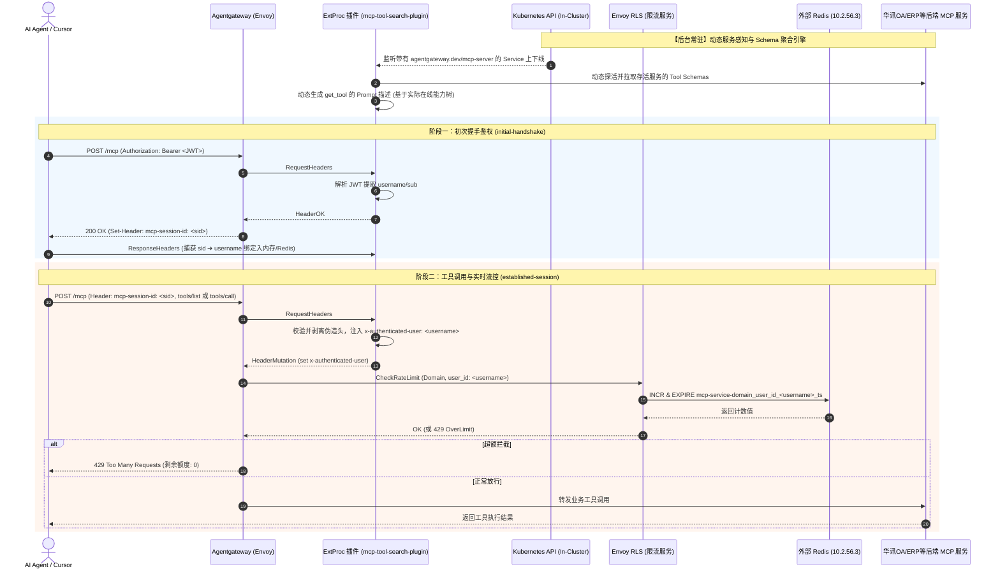

# ExtProc 插件增强功能需求规格说明书 (SRS)

> **版本**：v2.1.0 (动态自适应增强版)  
> **状态**：待实现 (Ready for Implementation)  
> **适用模块**：`mcp-tool-search-plugin` (ExtProc gRPC 扩展处理器)  
> **协作组件**：Agentgateway v1.5.0, Envoy RLS, 外部 Redis (10.2.56.3), Kubernetes API  

---

## 1. 架构总览与交互流程



---

## 2. 核心功能需求详述

### 需求 1：用户身份动态透传与多租户精准限流支持 (Security & Rate Limit)

#### 1.1 现状与痛点
* 在 `established-session` 工具调用阶段，客户端请求头仅携带 `mcp-session-id`，缺失用户身份明文；
* 网关只能基于 `session-id` 进行限流，无法跨会话累计同一用户的实际总消耗；
* 外部 Redis 中生成的键为长哈希串，无法在 ConfigMap 中按用户名（如 `admin`、`zhangsan`）精确配置限额；
* 客户端自主在 Header 中声明 `x-user-id` 存在极高的伪造仿冒安全风险，必须由网关内部受信插件强制提取和注入。

#### 1.2 改造规范
1. **初次握手（捕获身份映射）**：
   * 在捕获到网关生成的 `mcp-session-id` 及客户端携带的 `Authorization: Bearer <token>` 时，ExtProc 插件解密 JWT Payload，提取字段 `username`（若无则取 `sub`）；
   * 存入会话映射表（带过期时间）：`session_user_map[session_id] = username`。
2. **安全防仿冒清洗 (Header Sanitization)**：
   * 在处理后续任何工具调用请求时，检查客户端请求头中是否包含 `x-authenticated-user`；
   * **强制删除客户端自带的此 Header**，防止外部仿冒特权用户。
3. **动态注入受信 Header**：
   * 依据当前请求的 `mcp-session-id`，从映射表中获取真实用户名；
   * 向 Envoy 返回 `HeaderMutation.set_headers`，动态补入：
     ```http
     x-authenticated-user: <username>
     ```
4. **网关 Policy 适配**：
   * `AgentgatewayPolicy` 的 CEL 表达式定义为：
     ```yaml
     expression: "'x-authenticated-user' in request.headers ? request.headers['x-authenticated-user'] : ('mcp-session-id' in request.headers ? request.headers['mcp-session-id'] : source.address)"
     ```
   * 确保外部 Redis 生成的键格式严格为：`mcp-service-domain_user_id_<username>_<timestamp>`。

---

### 需求 2：`get_tool` 描述基于后端 MCP Schema 动态自适应聚合 (Adaptive Schema Prompt)

#### 2.1 现状与痛点
* **硬编码失真**：如果将 `get_tool` 描述写死为“华讯OA工具包”，未来接入财务 ERP、IT 运维诊断或供应链等新 MCP 服务时，大模型在处理非 OA 意图时将不会调用该工具；
* **服务失联风险**：如果当前集群内 OA 服务已下线或未部署，硬编码依然承诺拥有 OA 能力，导致大模型意图落空。
* **业务诉求**：`get_tool` 的描述必须是**“活的”**，能够根据当前实际在线的后端 MCP 服务及其提供的 Tool Schema 自动提炼、动态拼接生成最贴切的上下文提示。

#### 2.2 改造规范（动态 Prompt 生成引擎）
1. **能力特征动态提取**：
   * ExtProc 插件维护一个动态能力注册表 `active_service_capabilities`：
     ```python
     # 结构示例
     {
       "eccom-oa-service": {
         "display_name": "华讯OA协同办公",
         "capabilities": ["流程发起与审批", "考勤打卡与休假", "员工通讯录"],
         "sample_tools": ["eccom_oa_approval", "eccom_attendance_leave"]
       },
       "eccom-erp-service": {
         "display_name": "华讯ERP财务中心",
         "capabilities": ["采购订单核销", "发票报销", "合同资产查询"],
         "sample_tools": ["eccom_erp_invoice", "eccom_order_query"]
       }
     }
     ```
   * **提取来源优先级**：
     1. 优先读取 Service 的注解（如 `agentgateway.dev/display-name` 及 `agentgateway.dev/capabilities`）；
     2. 若无注解，自动分析该后端返回的 Tool Schemas，根据工具名及 descriptions 智能提取业务领域标签。
2. **动态渲染 `get_tool` 的 Description**：
   当大模型发起 `tools/list` 询问虚拟网关时，ExtProc 动态组装并下发该描述：

```text
【企业统一工具中心 / Enterprise MCP Gateway】：当前系统已动态接入并实时就绪以下业务能力池：
• [华讯OA协同办公]：涵盖流程审批、考勤打卡、请假休假、员工与部门查询等；
• [华讯ERP财务系统]：涵盖报销发票审核、订单合同、资产明细等；
(注：当上述服务增删时，列表自动实时增减)

当你需要执行或查询上述任何业务域的操作时，必须首先调用此工具，按需检索并激活目标工具的精确参数规范。
```

3. **动态补全参数 Prompt (`inputSchema`)**：
   `name` 参数的描述中，自动插入当前实际在线的工具样本关键词，例如：
   ```json
   {
     "name": "get_tool",
     "description": "<上述动态生成的描述>",
     "inputSchema": {
       "type": "object",
       "properties": {
         "name": {
           "type": "string",
           "description": "业务意图关键词或具体工具名。当前系统可用范围包括：" + ", ".join(all_active_keywords)
         }
       },
       "required": ["name"]
     }
   }
   ```

---

### 需求 3：动态服务感知与下线旧服务实时清理机制 (Lifecycle & Eviction)

#### 3.1 现状与痛点
* 目前 `mcp-tool-search-plugin` 在启动后一次性加载工具库，或采用永久缓存；
* 当开发团队使用 `kubectl delete service <name>` 删除某个下线的旧 MCP 服务，或者从 Service 移除标签 `agentgateway.dev/mcp-server: enabled` 时，ExtProc 插件并未感知；
* 大模型通过 `get_tool` 依然能搜索并获取到该已下线工具的入参，但发起真实工具调用时必定遭遇 503 Service Unavailable 或 404 Not Found。

#### 3.2 改造规范
采用 **“K8s 动态监听 + TTL 主动探活双重保障机制”**：

1. **机制一：Kubernetes Service 事件监听 (Informer / Watch)**：
   * 插件复用 Pod 挂载的 In-Cluster ServiceAccount 凭证，初始化 `kubernetes.client.CoreV1Api`；
   * 后台异步协程监听带有标签 `agentgateway.dev/mcp-server: enabled` 的 Service 变动；
   * 当收到 `DELETED` 事件，或 `MODIFIED` 事件中移除该标签时：
     * 自动提取该 Service 关联的工具列表；
     * 从插件内存工具注册表 `active_tools_registry` 中执行物理剔除，立即停止提供该工具的检索与元数据返回；
     * **触发 `get_tool` 的动态描述重新渲染**，将已下线业务域从能力大纲中抹去！
2. **机制二：探活自愈与 TTL 缓存机制（兜底保障）**：
   * 工具缓存设置 TTL（建议 180 秒）；
   * 在向后端发起 `tools/list` 刷新探测时，若目标后端连接超时（如持续 3 次失败或返回 404/503），自动将该工具状态置为 `OFFLINE`，不向大模型返回，并动态移出描述。

---

## 3. 验收测试矩阵 (Acceptance Criteria)

| 编号 | 测试场景 | 操作步骤 | 预期判定结果 |
| :--- | :--- | :--- | :--- |
| **TC-01** | **身份伪造防御测试** | 客户端伪造 Header `-H "x-authenticated-user: admin"`，但使用普通员工 `zhangsan` 的 Session 发起请求 | ExtProc 强制剥离该伪造 Header，重新注入真实的 `x-authenticated-user: zhangsan`；外部 Redis 限流键记入 `zhangsan` 桶。 |
| **TC-02** | **跨会话累计限流** | 用户 `zhangsan` 分别通过 2 个不同 Session 发起高频请求 | 2 个会话的请求统一在 Redis 的 `mcp-service-domain_user_id_zhangsan_<ts>` 下累加；达到配额上限后统一返回 `HTTP 429`。 |
| **TC-03** | **Schema 动态渲染** | 1. 部署仅包含“华讯OA”的微服务；<br>2. 随后部署一个“华讯资产管理”微服务 | 1. `get_tool` 的 description 仅包含华讯OA能力说明；<br>2. 部署资产管理服务 3 秒后刷新 `tools/list`，`get_tool` 的描述中自动新增“华讯资产管理”条目。 |
| **TC-04** | **旧服务下线实时清理** | 1. 执行 `kubectl delete svc legacy-oa-service`<br>2. 立即发起 `tools/list` 或 `get_tool` 检索该旧工具 | 插件在 3 秒内完成感知与剔除，`get_tool` 描述中 OA 条目自动消失，检索该工具明确返回“工具已下线或不存在”，绝不触发 503 脏调用。 |
