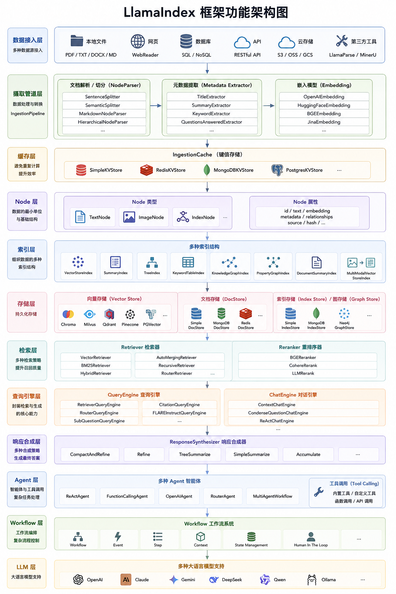
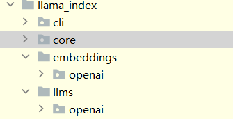
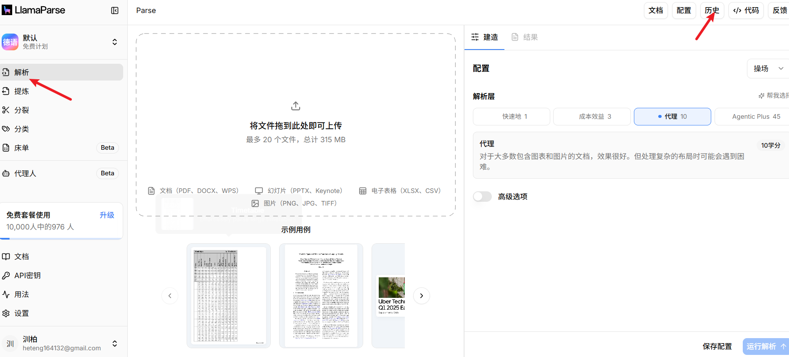
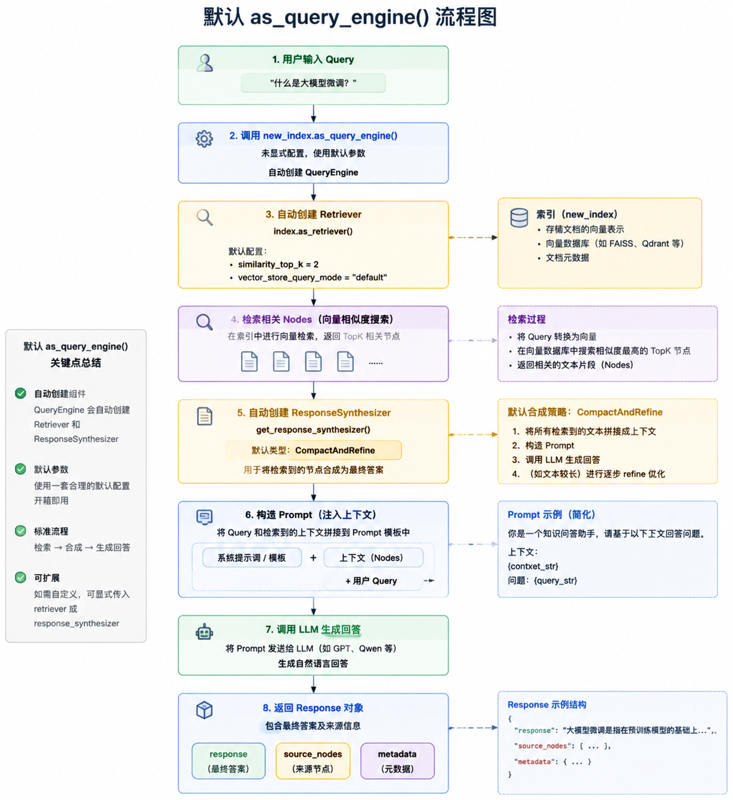
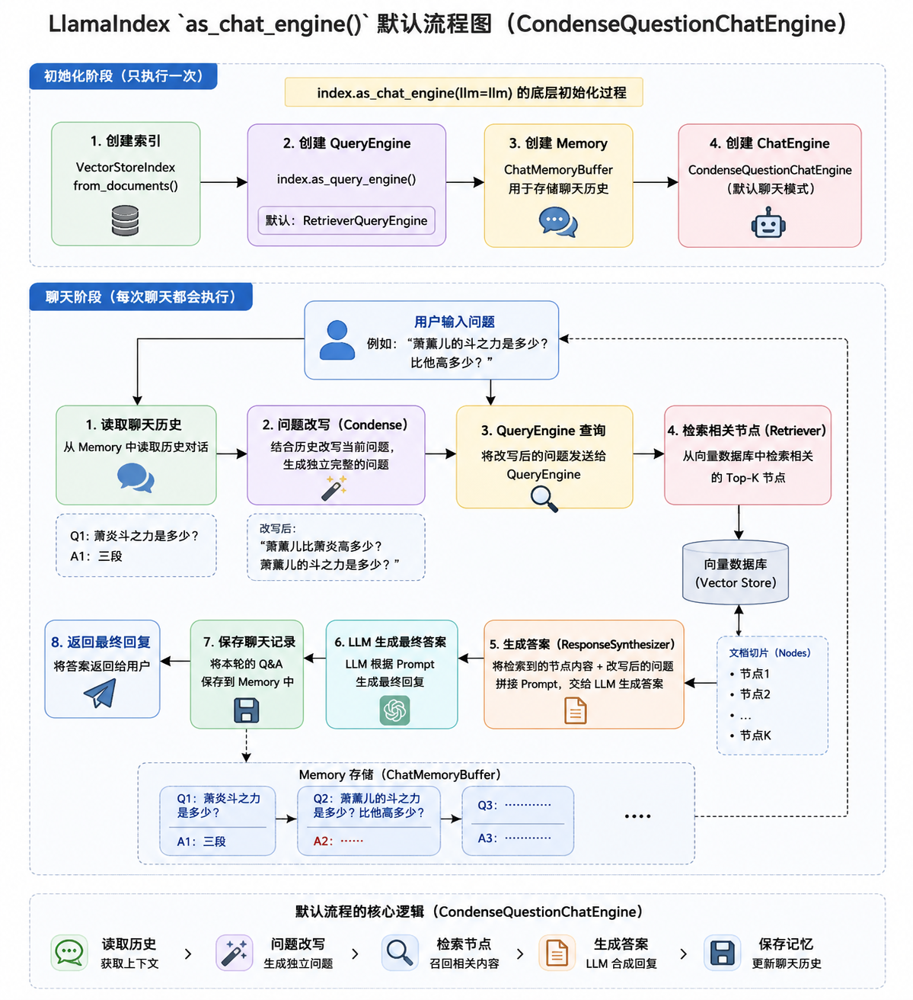

# 02\-llama\_index框架

## `llama_index`框架

**学习目标:**

1. 熟悉 llamaindex使用方式

2. 熟悉 llamaindex模块功能实现

3. 熟悉 llamaindex提示词使用

4. 熟悉 llamaindex文本分割

5. 熟悉 llamaindex存储体系

### 一\. 简介

api文档地址:https://developers\.llamaindex\.ai/python/framework\-api\-reference/

官网地址: https://developers\.llamaindex\.ai/python/framework/getting\_started/starter\_example/

项目地址:https://github\.com/run\-llama/llama\_index

LlamaHub \(开源的“插件市场\): https://llamahub\.ai/

`LlamaIndex`（最早名为 **GPT Index**）是目前大语言模型（LLM）生态中最核心的数据框架之一。它的出现解决了一个痛点：**如何让 AI 访问和理解你的私有数据\(RAG\)？**

#### 1\. 发展历史

##### 1\.1 核心人物

- `LlamaIndex` 的灵魂人物是 **Jerry Liu**。

    - **背景：** 在全职投入 `LlamaIndex` 之前，Jerry Liu 在硅谷有着深厚的 AI 和工程背景。他曾就职于 **Robust Intelligence**（一家 AI 安全初创公司），并在 **Uber** 从事过机器学习相关的研发工作。

    - **初衷：** 2022 年底，随着 GPT\-3\.5 的爆发，Jerry 发现虽然模型很强，但它们无法直接处理模型训练日期之后的数据，也无法访问企业的私有文档。为了解决这种“知识断层”，他写下了第一行代码。

目前，`LlamaIndex` 已成立专门的公司进行商业化运营，Jerry Liu 担任联合创始人兼 CEO，另一位联合创始人是 **Simon Suo**（曾任职于 NVIDIA）。

##### 1\.2 版本演进历史

- 2022 年 11 月：Jerry Liu 提交第一个 commit，项目名为 GPT Index（或 GPT Tree Index）。最初非常简单，主要是一个 Tree Index，用于将信息组织成树状结构，支持 GPT\-3。当时还扩展了 List Index 和 Keyword Index。

- 2022 年 12 月：增加嵌入（Embedding）和向量存储支持，以及 Notion、Slack、Google Drive 等早期数据加载器。

- 2023 年 1 月：项目首次登上 GitHub Trending，获得广泛关注。

- 2023 年 2 月：与 Jesse Zhang 共同推出 LlamaHub:https://llamahub\.ai/（数据加载器仓库），并通过活动征集了 50\+ 个数据加载器。

- 2023 年 3 月：ChatGPT API 和 Plugins 发布后，快速支持新 API 和插件集成。

- 2023 年初：项目正式更名为 LlamaIndex（提前更名以避免与后来 Meta 的 Llama 模型名称冲突）。

- 2023 年 3 月：获得 850 万美元种子轮融资，由 Greylock 领投。Jerry Liu 与前 Uber 同事 Simon Suo 共同创立公司，全职投入开发。

- 2024 年：功能从基础向量检索扩展到高级 RAG、多代理系统、评估框架等，成为 RAG 领域主流框架。

- 2025 年：重大升级，包括 LlamaIndex Workflows（事件驱动异步流程）、LlamaParse（高精度文档解析引擎，专注复杂文档 OCR 和结构化）、LlamaAgents 等企业级工具。重点转向 Agentic RAG 和生产级文档自动化。

- 2026 年至今：持续迭代 LlamaParse v2、LlamaSplit、LlamaSheets 等产品，强化多模态、异步处理、企业级部署和社区生态。已成为构建生产级 RAG 和 Agentic AI 应用的首选框架之一。

#### 2\. 核心架构图



#### 3\. 核心模块

- 下载命令

```Plaintext
pip install llama-index
```

- 指令捆绑包

```Plaintext
llama-index-core
llama-index-llms-openai
llama-index-embeddings-openai
llama-index-readers-file
```

##### 1\. 模块介绍




|模块名称|主要功能|重要性与典型用途|
|---|---|---|
|**llama\-index\-core**|LlamaIndex 框架的**心脏和基础**。提供所有核心抽象类和构建块，包括： • Document / Node（文档和文本块） • Indexes（索引） • Retrievers（检索器） • Query Engines / Response Synthesizers（查询引擎和答案合成） • Settings（全局配置 LLM、Embedding 等） • Workflows 基础（事件驱动异步流程） • Node Parsers（文本切分）、Storage、Memory 等|**最重要**。几乎所有 LlamaIndex 应用都必须依赖它。|
|**llama\-index\-llms\-openai**|OpenAI 大模型的集成包。|提供默认的 **生成能力**（LLM）。让你可以轻松调用 OpenAI 模型|
|**llama\-index\-embeddings\-openai**|OpenAI 嵌入模型集成包。|提供 **向量表示能力**。向量检索|
|**llama\-index\-readers\-file**|文件读取器集成包（默认文件加载器）。 支持读取常见文件格式，包括： • PDF、DOCX、PPTX、Markdown、CSV、HTML、EPUB、IPYNB、图像、视频音频等 • 内置多种 Parser|**数据摄入入口**。负责把文件转换成 LlamaIndex 能处理的对象|

#### 4\. llama\_index实现rag

```Plaintext
pip install llama-index-embeddings-huggingface # 使用本地的embedding模型
pip install llama-index-llms-dashscope     # 加载千问模型
```

```Plaintext
import os
from llama_index.core import PromptTemplate, Settings, SimpleDirectoryReader, VectorStoreIndex
from llama_index.llms.dashscope import DashScope
from llama_index.embeddings.huggingface import HuggingFaceEmbedding
from dotenv import load_dotenv


load_dotenv()

Settings.llm = DashScope(
    model="qwen-plus",
    api_key=os.getenv("DASHSCOPE_API_KEY"),
    api_base=os.getenv("DASHSCOPE_API_BASE")
)
Settings.embed_model = HuggingFaceEmbedding(
    model_name=r"D:\LLM\Local_model\BAAI\bge-large-zh-v1___5",
)

qa_prompt_str = """你是一个有帮助的AI助手。请根据下面提供的上下文信息，准确、简洁地回答用户的问题。
如果上下文无法回答问题，请直接说“我不知道”或“上下文没有相关信息”，不要编造答案。

上下文信息如下：
{context_str}

用户问题：{query_str}

请用中文回答：
"""

qa_prompt = PromptTemplate(qa_prompt_str)

documents = SimpleDirectoryReader(
    input_files=['./data/deepseek介绍.txt']  # 可选：限制文件类型
).load_data()

print(f"加载了 {len(documents)} 个文档")

# 构建向量索引（会自动 chunk + embedding）
index = VectorStoreIndex.from_documents(
    documents,
    show_progress=True
)

# 创建 Query Engine，并使用自定义提示词
query_engine = index.as_query_engine(
    similarity_top_k=5,           # 检索前 5 个最相关片段
    text_qa_template=qa_prompt,   # 使用自定义提示词
    streaming=False               # 如果想流式输出可设为 True
)

question = 'deepseek什么时候遭到攻击?'

response = query_engine.query(question)
print("\n回答：")
print(response.response)

# 如果想看检索到的上下文来源：
print("\n--- 来源节点 ---")
for node in response.source_nodes:
    print(f"相似度: {node.score:.4f} | 文件: {node.metadata.get('file_name')}")
```

### 二\. llama\_index模型调用

#### 1\. `OpenAI` 默认调用

- 专门为 官方 OpenAI 设计

```Plaintext
from llama_index.llms.openai import OpenAI

llm = OpenAI(model="gpt-4o-mini")   # 或 gpt-4o 等
response = llm.complete("你的问题")
```

#### 2\. 其他厂商模型调用

##### 1\. OpenAILike 执行

- OpenAILike 是 OpenAI 模型的一个轻量级封装，使其能够与提供 OpenAI 兼容 API 的第三方工具兼容。

```Plaintext
pip install llama-index-llms-openai-like 
```

- 加载在线模型

```Plaintext
import os
from dotenv import load_dotenv
from llama_index.llms.openai_like import OpenAILike

load_dotenv()

llm = OpenAILike(
    model="qwen3.5-plus",
    api_key=os.getenv("DASHSCOPE_API_KEY"),
    api_base=os.getenv("DASHSCOPE_BASE_URL"),
    is_chat_model=True,   # 是否是 Chat Model
)

response = llm.complete("你好")
print(response)
```

- 加载离线模型

```Plaintext
from llama_index.llms.openai_like import OpenAILike

llm = OpenAILike(
    model="qwen2.5:7b",
    api_key='1111',   # 本地key可以随便填
    api_base='http://localhost:11434/v1',
    # is_chat_model=True,   # 是否是 Chat Model
)

response = llm.complete("你好")
print(response)
```

##### 2\. 各个厂商接口封装

- 接口地址:https://developers\.llamaindex\.ai/python/framework\-api\-reference/llms/

- 模型厂商都会开放sdk接口,LlamaIndex 团队基于这个官方 SDK，编写了适配层，让 模型厂商 的 API 能无缝符合 LlamaIndex 的 LLM 抽象接口（支持 chat\(\)、complete\(\)、stream\_chat\(\)、工具调用、Function Calling 等）

- 给厂商封装的接口,相比较OpenAILike实现的功能会更加精细

- 模块下载

```Plaintext
pip install llama-index-llms-dashscope   # 后面的dashscope 是针对不同厂商的名称
pip install llama-index-llms-ollama    # 加载ollma本地模型
```

- 实现代码

```Plaintext
from llama_index.llms.dashscope import DashScope
import os
from dotenv import load_dotenv
load_dotenv()

# 推荐写法
llm = DashScope(
    model_name=DashScopeGenerationModels.QWEN_PLUS,   # 或 QWEN_MAX、QWEN_TURBO 等
    api_key=os.getenv("DASHSCOPE_API_KEY"),           # 或直接传入
)

response = llm.complete("介绍一下 Qwen-Plus 和 Qwen-Max 的区别")
print(response)
```

```Plaintext
from llama_index.llms.ollama import Ollama

llm = Ollama(
    model='qwen2.5:7b',
    request_timeout=60,   # 默认30秒, 模型响应时间较长, 可适当调大
)

response = llm.complete("介绍一下 Qwen-Plus 和 Qwen-Max 的区别")
print(response)
```

#### 3\. 模型调用方式

|方法|输入类型|输出类型|是否支持多轮对话历史|是否实时输出（流式）|推荐使用场景|
|---|---|---|---|---|---|
|**complete**|纯字符串（prompt）|完整响应（CompletionResponse）|不支持|否（一次性返回）|简单单句补全、测试、快速实验|
|**stream\_complete**|纯字符串（prompt）|生成器（逐 token 返回）|不支持|是|需要实时显示文字（如聊天框打字效果）|
|**chat**|ChatMessage 列表|完整响应（ChatResponse）|支持|否（一次性返回）|多轮对话、带 system prompt、正式对话|
|**stream\_chat**|ChatMessage 列表|生成器（逐 token 返回）|支持|是|多轮实时对话（最推荐用于聊天界面）|

##### 1\.stream\_complete

```Plaintext
from llama_index.llms.ollama import Ollama
import time

llm = Ollama(
    model='qwen2.5:7b',
    request_timeout=60,   # 默认30秒, 模型响应时间较长, 可适当调大
)

response = llm.stream_complete("你好")
for chunk in response:
    # print("类型:", type(chunk))
    # print("repr:", repr(chunk))    # 对象原始显示 
    time.sleep(0.3)
    print(chunk.delta, end='', flush=True)
```

##### 2\. chat

```Plaintext
from llama_index.llms.ollama import Ollama
from llama_index.core.llms import ChatMessage

llm = Ollama(
    model='qwen2.5:7b',
    request_timeout=60,   # 默认30秒, 模型响应时间较长, 可适当调大
)

messages = [
    ChatMessage(role="user", content="你好")
]

response = llm.chat(messages)
print(type(response))
print(repr(response))
print(response)  # 
print(response.message.role)
print(response.message.content)
```

##### 3\.stream\_chat

```Plaintext
from llama_index.llms.ollama import Ollama
from llama_index.core.llms import ChatMessage

llm = Ollama(
    model='qwen2.5:7b',
    request_timeout=60,   # 默认30秒, 模型响应时间较长, 可适当调大
)

messages = [
    ChatMessage(role="user", content="你好")
]


response = llm.stream_chat(messages)
print(type(response))
print(repr(response))
for chunk in response:
    print(repr(chunk))
    print(chunk.delta, end='', flush=True)
```

#### 4\. 文本嵌入模型

llama\_index\.embeddings是一个用于与嵌入进行交互的类。有许多嵌入提供商（OpenAI、Cohere、Hugging Face等\)\- 这个类旨在为所有这些提供商提供一个标准接口。

文档地址:https://developers\.llamaindex\.ai/python/framework\-api\-reference/embeddings/

##### 1\. 在线模型调用

```Plaintext

# pip install llama-index-embeddings-dashscope
import os
from llama_index.embeddings.dashscope import DashScopeEmbedding
from dotenv import load_dotenv
load_dotenv()

embed_model = DashScopeEmbedding(
    model_name="text-embedding-v3",
    api_key=os.getenv("DASHSCOPE_API_KEY")
)

# get_query_embedding 问题向量转换
query_emb = embed_model.get_query_embedding('你好')
print(query_emb)
# 文档向量转换
text_emb = embed_model.get_text_embedding('你好')
print(text_emb)

# 批量处理
text_emb = embed_model.get_text_embedding_batch(['你好', '你好'])
print(text_emb)
```

##### 2\. 离线模型调用

- **调用HuggingFaceBgeEmbeddings**

    - 国内的镜像地址：[https://hf\-mirror\.com/](https://hf-mirror.com/)

    - 魔塔： [https://www\.modelscope\.cn/models/maidalun/bce\-embedding\-base\_v1](https://www.modelscope.cn/models/maidalun/bce-embedding-base_v1)

- 下载modelscope Embedding的模型

```Plaintext
# 安装模块
# pip install sentence_transformers
from modelscope import snapshot_download
# BAAI/bge-m3 模型名字   cache_dir：下载位置

model_dir = snapshot_download('BAAI/bge-m3', cache_dir=r"D:\LLM\Local_model")
```

- 使用方式

```Plaintext
from llama_index.embeddings.huggingface import HuggingFaceEmbedding

embed_model = HuggingFaceEmbedding(
    model_name=r"D:\LLM\Local_model\BAAI\bge-m3",
    # 模型运行在哪个硬件上
    device="cpu"
)

query_emb = embed_model.get_query_embedding('你好')
print(query_emb)

# 生成向量
embedding = embed_model.get_text_embedding("你好")
print(embedding)
```

#### 5\. Settings 全局配置

Settings 是 LlamaIndex 中非常重要的全局配置对象（singleton 单例模式）。

它的作用是：为整个应用提供默认的 LLM、Embedding、文本切分器等组件。 一旦设置，后续的 组件如果没有显式传入对应参数，就会自动使用 Settings 中的配置。

```Plaintext
from llama_index.core import Settings
from llama_index.llms.ollama import Ollama
from llama_index.embeddings.huggingface import HuggingFaceEmbedding


# 全局配置 LLM（以后所有组件都会自动使用这个模型）
Settings.llm = Ollama(
    model='qwen2.5:7b',
    request_timeout=120,      # 强烈建议调大，本地模型容易超时
)

Settings.embed_model = HuggingFaceEmbedding(
    model_name=r"D:\LLM\Local_model\BAAI\bge-m3",
)


response = Settings.llm.complete("你好")
print(response.text)

embedding = Settings.embed_model.get_query_embedding('你好')
print(embedding)
```

### 三\. 提示词模版

`LlamaIndex` 提供了灵活的提示词模板系统，用于自定义模型的行为、控制输出格式、减少幻觉

#### 1\. `PromptTemplate`

`PromptTemplate` 是 `LlamaIndex` 中**较早**、**最简单**的提示词模板类。它使用 **f\-string**（单大括号 \{variable\}）来构建普通文本提示，适合不需要复杂逻辑的场景。

**特点**：

- 语法简单，易于理解。

- 仅支持纯文本提示（不支持直接构建聊天消息列表）。

- 变量使用单大括号 \{context\_str\}。

- 目前官方已将其归类为 **older\-style simple templating**。

```Plaintext
from llama_index.core import PromptTemplate
from llama_index.llms.ollama import Ollama

# 定义普通文本模板
simple_template = PromptTemplate(
    """你是一个严谨的技术专家，请用专业且易懂的语言回答以下问题：

问题：{user_query}

请用中文回答，并分点说明：
"""
)
user_input = "请用介绍一下python"
# 格式化模板
formatted_prompt = simple_template.format(user_query=user_input)

llm = Ollama(
    model='qwen2.5:7b',
    request_timeout=60
)


# 直接调用 complete
response = llm.complete(formatted_prompt)
print(response.text)
```

#### 2\. `ChatPromptTemplate`

`ChatPromptTemplate` 是 `LlamaIndex` 中专门用于构建多消息对话提示的模板类。它属于旧式简单模板，主要通过消息列表（ChatMessage）来组织 system、user、assistant 等不同角色的内容。

**特点**：

- 专为聊天模型（Chat Model）设计。

- 使用消息列表 \+ f\-string 方式构建提示。

- 适合需要明确区分 **System Prompt** 和 **User Prompt** 的场景。

- 目前官方已将其归类为旧式模板，推荐新项目优先使用 RichPromptTemplate。

- 但在很多遗留代码和简单聊天场景中仍然非常常用。

```Plaintext
from llama_index.core import ChatPromptTemplate
from llama_index.core.llms import ChatMessage, MessageRole
from llama_index.llms.ollama import Ollama
# 定义 ChatPromptTemplate
chat_prompt_template = ChatPromptTemplate(
    message_templates=[
        # System 消息（系统角色设定）
        ChatMessage(
            role=MessageRole.SYSTEM,
            content="你是一个严谨、专业且友好的中文AI技术助手。请只基于用户提供的信息回答问题，不要编造内容。"
        ),
        # User 消息（用户输入）
        ChatMessage(
            role=MessageRole.USER,
            content="用户问题：{query_str}\n\n请用中文回答："
        ),
    ]
)

llm = Ollama(
    model='qwen2.5:7b',
    request_timeout=60
)
# complete不推荐
# response = llm.complete(chat_prompt_template.format(query_str="请用介绍下python"))
# print(response)
# print(repr(response))

response = llm.chat(chat_prompt_template.format_messages(query_str="请用介绍下python"))
print(response)
print(repr(response))
```

#### 3\. `RichPromptTemplate`

`RichPromptTemplate` 是 LlamaIndex 在 2025\-2026 年推出的**最新提示词模板**，基于 **Jinja2** 模板引擎，是目前官方最推荐的提示词构建方式。

**特点**：

- 支持 Jinja2 强大语法（变量、if/else 条件判断、for 循环、过滤器等）

- 原生支持 \{% chat role="xxx" %\} 语法，轻松定义 system、user、assistant 等角色

- 支持多模态提示（可插入图片、音频等）

- 同一个模板既可以输出纯文本（\.format\(\)），也可以输出消息列表（\.format\_messages\(\)）

- 功能最强大、最灵活，已成为生产级应用的首选

##### 1\. 基础语法

```Plaintext


from llama_index.core.prompts import RichPromptTemplate
from llama_index.llms.ollama import Ollama

llm = Ollama(model='deepseek-r1:1.5b', request_timeout=120.0, temperature=0.7)
'''
固定写法  role有system, user, assistant


'''
# 定义 RichPromptTemplate（推荐写法）
qa_template_str = """
你是一个严格、准确且有帮助的AI助手。





以下是检索到的上下文信息：
{{ context_str }}

用户问题：{{ query_str }}

请用中文简洁、清晰地回答：

"""

context_str = """
    DeepSeek，全称杭州深度求索人工智能基础技术研究有限公司 [40]。DeepSeek是一家创新型科技公司 [3]，成立于2023年7月17日 [40]，使用数据蒸馏技术 [41]，得到更为精练、有用的数据 [41]。
    由知名私募巨头幻方量化孕育而生 [3]，专注于开发先进的大语言模型（LLM）和相关技术 [40]。注册地址 [6]：浙江省杭州市拱墅区环城北路169号汇金国际大厦西1幢1201室 [6]。法定代表人为裴湉 [6]，
    经营范围包括技术服务、技术开发、软件开发等 [6]。
"""

# 创建模板对象
qa_template = RichPromptTemplate(qa_template_str)

# 准备变量
query = 'deepseek成立于哪一年？'

# 方法一：生成纯文本提示（用于 complete / stream_complete）
prompt_text = qa_template.format(
    query_str=query,
    context_str=context_str
)
print('-----------------字符串提示-------------------------')
print(prompt_text)

res = llm.complete(prompt_text)
print(res)

# 方法二：生成聊天消息列表（推荐，用于 chat / stream_chat）
messages = qa_template.format_messages(
    query_str=query,
    context_str=context_str
)
print('-----------------聊天消息列表-------------------------')
print(messages)
res = llm.stream_chat(messages)
for chunk in res:
    print(chunk.delta, end="", flush=True)
```

##### 2\. 高级jinja语法

###### 1\.格式判断

- 根据用户的问题,有些提示词的内容并不需要传递,可以通过语法做去除

```Plaintext
from llama_index.core.prompts import RichPromptTemplate

advanced_template = RichPromptTemplate(
    """
你是一个智能助手。




上下文信息：
{{ context_str }}


问题：{{ query_str }}


请同时给出完整的可运行代码示例。


请用中文回答。
"""
)

context_str = """
    DeepSeek，全称杭州深度求索人工智能基础技术研究有限公司 [40]。DeepSeek是一家创新型科技公司 [3]，成立于2023年7月17日 [40]，使用数据蒸馏技术 [41]，得到更为精练、有用的数据 [41]。
    由知名私募巨头幻方量化孕育而生 [3]，专注于开发先进的大语言模型（LLM）和相关技术 [40]。注册地址 [6]：浙江省杭州市拱墅区环城北路169号汇金国际大厦西1幢1201室 [6]。法定代表人为裴湉 [6]，
    经营范围包括技术服务、技术开发、软件开发等 [6]。
"""
query = 'deepseek成立于哪一年？'
messages = advanced_template.format(
    context_str=context_str,
    query_str=query,
    # 有些模型需要代码，有些模型不需要  可以通过 need_code 参数控制
    need_code="false"
)

print(messages)
```

###### 2\. 样本提示词

- 静态 Few\-Shot 写法

- jinja for循环语句

```Plaintext



```

```Plaintext
from llama_index.core.prompts import RichPromptTemplate

few_shot_template_str = """
你是一个严谨的技术助手。请参考以下示例的回答风格和结构。




问题：{{ example.question }}


{{ example.answer }}




问题：{{ query_str }}

"""

few_shot_template = RichPromptTemplate(few_shot_template_str)

# 调用时传入示例列表
examples = [
    {"question": "Qwen-Plus 适合什么场景？", "answer": "Qwen-Plus 适合日常任务、长上下文处理，性价比高。"},
    {"question": "什么是 RAG？", "answer": "RAG（Retrieval-Augmented Generation）是检索增强生成技术，能让大模型使用外部知识回答问题。"}
]

prompt_text = few_shot_template.format(
    examples=examples,
    query_str="Qwen-Max 的优势是什么？"
)

print(prompt_text)
```

- 动态 Few\-Shot \- function\_mappings

- `function_mappings` 是一个非常强大且灵活的特性。简单来说，它的核心作用是：“动态处理”或“拦截” Prompt 中的变量，在变量填入模板之前，先运行一个自定义函数进行加工。

```Plaintext
from llama_index.core.prompts import RichPromptTemplate


def get_few_shot_examples(**kwargs):
    """根据用户查询动态返回最相关的示例（可结合向量检索）"""
    query = kwargs.get("query_str", "")
    # 这里可以写逻辑：从预定义示例中筛选，或从向量库检索
    return [
        {"question": "Qwen-Plus 和 Qwen-Max 哪个更快？",
         "answer": "Qwen-Plus 通常响应更快，Qwen-Max 能力更强但速度稍慢。"},
        {"question": "如何调用 Ollama？", "answer": "使用 Ollama(model='qwen2.5:7b') 初始化模型。"}
    ]


dynamic_template = RichPromptTemplate(
    """你是一个专业助手，请参考下面的示例回答。

        
        
        问题：{{ ex.question }}
        答案：{{ ex.answer }}
        
        
        现在回答：{{ query_str }}
        
        
""",
    function_mappings={"examples": get_few_shot_examples}  # 关键：动态注入
)

messages = dynamic_template.format_messages(query_str="Qwen-Plus 和 Qwen-Max 的价格区别？")
print(messages)
```

###### 3\. 多模态提示词

- 随着多模态大模型（Multi\-Modal LLM，如 GPT\-4o、Qwen\-VL、Llama\-3\.2\-Vision 等）的普及，LlamaIndex 支持在提示词中同时传入文本 \+ 图片（甚至音频、视频）。 RichPromptTemplate 是实现多模态提示词的最推荐方式，它支持使用 \| image 过滤器来插入图片。

- 必须使用多模态模型

- 图片插入语法

```Plaintext
{{ path | image }}
{{ ... }} ：Jinja2 的变量/表达式输出语法（和普通变量一样）
path  ：图片的路径或 URL（你自己传入的变量）
|：管道符（pipe），表示“把左边的值传给右边的过滤器”
image：LlamaIndex 自定义的一个过滤器（filter），作用是把图片转换为模型能理解的多模态格式, 转换成base64格式
from llama_index.core.base.llms.types import ImageBlock  代码位置
```

```Plaintext
from llama_index.core.prompts import RichPromptTemplate

multi_modal_template_str = """
你是一个专业的图像理解专家。请仔细观察图片内容，并回答用户的问题。




图片 {{ loop.index }}：
{{ image_path | image }}



用户问题：{{ query_str }}
请用中文回答，并分别描述每张图片的关键内容，最后总结它们的共同点。



"""

multi_modal_template = RichPromptTemplate(multi_modal_template_str)


# ==================== 生成消息并调用 ====================
messages = multi_modal_template.format_messages(
    image_list=[
        "./data/img.png",
        "./data/img_1.png"
    ],

    query_str="这些图片里有什么共同点？"

)
print(messages)


# 目前llamaindex 对国内多模态模型支持不够好
```

#### 4\. 默认提示词模板

LlamaIndex 内置了一系列经过优化的默认提示词模板，位于 `llama_index.core.prompts.default_prompts` 中。可以直接使用或复制修改。

常用默认模板示例：

- `DEFAULT_TEXT_QA_PROMPT`：标准问答模板

- `DEFAULT_REFINE_PROMPT`：用于 Refine（迭代优化答案）的模板

- `DEFAULT_SUMMARY_PROMPT`：总结模板

- `DEFAULT_TREE_SUMMARIZE_PROMPT`：树状总结模板

```Plaintext
from llama_index.core.prompts.default_prompts import (
    DEFAULT_TEXT_QA_PROMPT,
    DEFAULT_REFINE_PROMPT,
    DEFAULT_SUMMARY_PROMPT,
    DEFAULT_TREE_SUMMARIZE_PROMPT,
)

print("=== 标准问答模板  ===")
print(DEFAULT_TEXT_QA_PROMPT.template)

print("\n=== 迭代优化答案模板 ===")
# 高级检索 refine响应模式用的提示词 把检索到的内容先根据一个检索内容生成回答  在那第二个检索内容和上一次的回答在基础上进行迭代优化
print(DEFAULT_REFINE_PROMPT.template)


print("\n=== 总结模板  ===")
print(DEFAULT_SUMMARY_PROMPT.template)

print("\n=== 树状总结模板  ===")
# 高级检索 tree_summarize响应模式用的提示词
# 把检索到的多个 chunk 调用 LLM 进行总结，逐步从“很多小总结”合并成“一个大总结”，最终只返回 1 个连贯的答案。 适合于 长文本 省上下文。
print(DEFAULT_TREE_SUMMARIZE_PROMPT.template)
```

### 四\. 文档处理

#### 1\. 文档加载

- 文档加载是 LlamaIndex 构建 RAG 应用的第一步，其核心是将外部数据转换为 LlamaIndex 可处理的 Document 对象。

##### 1\. 核心概念

- **Document:** LlamaIndex 中的基本数据容器。包含 text（主要文本内容）和 metadata（元数据，如文件名、页码、创建时间、自定义标签等）。 Document 可以从加载器自动生成，也可以手动构造。

- **Node**（节点）：Document 被切分后的“原子块”。后续索引（Index）实际上是对 Node 进行 Embedding 和存储。Node 继承自 Document，并额外带有 relationships（父子、上下级关系等）。

- **Reader**（加载器）：负责从不同数据源读取并解析成 Document 的类。所有 Reader 都继承自 BaseReader。

    - 各个加载器地址:https://developers\.llamaindex\.ai/python/framework\-api\-reference/readers/

##### 2\. 手动创建Document

```Plaintext
from llama_index.core import Document

text_list = ["text1", "text2"]
# 创建文档对象，并添加元数据
documents = [Document(text=t, metadata={"filename": "文件名称", "category": "类别"}) for t in text_list]
print(documents)
```

#### 2\. 常见加载器

##### 1\. SimpleDirectoryReader

- SimpleDirectoryReader 是官方最推荐的通用文件加载器，几乎所有入门和中型项目都从它开始。

```Plaintext
from llama_index.core import SimpleDirectoryReader


def parser():
    pass

reader = SimpleDirectoryReader(
    input_dir="./data",                    # 文件夹路径
    required_exts=[".pdf", ".docx", ".md", ".txt"],  # 只加载指定类型
    recursive=True,                        # 递归子文件夹
    exclude_hidden=True,                   # 排除隐藏文件
    exclude_empty=True,                    # 排除空文件
    filename_as_id=True,                   # 使用文件名作为 doc_id
    file_extractor={".pdf": parser},       # 自定义 PDF 解析器
    exclude=['111.txt'],                   # 忽略某个文件
    num_files_limit=1000,                  # 最大文件数
)

# show_progress 显示精度条  num_workers 鬓发数
documents = reader.load_data(show_progress=True, num_workers=3)
print(documents)
print(f"成功加载 {len(documents)} 个 Document 对象")
```

- 迭代处理\-`iter_data`

```Plaintext
from llama_index.core import SimpleDirectoryReader


def parser():
    pass

reader = SimpleDirectoryReader(
    input_dir="./data",                    # 文件夹路径
)

# 迭代处理   避免全部文档一次性加载
data = reader.iter_data(show_progress=True)
for i in data:
    print("*"*100)
    print(i)
```

- Document对象

    - id\_ : 文档的唯一标识符

    - text : 文档的主要文本内容

    - metadata : 一个字典（Dict\[str, Any\]），存放文档的元数据信息。

        - file\_path：文件的完整路径（包含文件名）

        - file\_name：文件名（含后缀）

        - file\_type：文件 MIME 类型（如 application/pdf、text/plain）

        - file\_size：文件大小（字节数）

        - creation\_date、last\_modified\_date、last\_accessed\_date：文件的创建、修改、访问时间

        - 你可以手动添加自定义元数据，例如 doc\.metadata\["category"\] = "AI公司" 或 doc\.metadata\["language"\] = "zh"。

    - embedding : 该文档的向量嵌入 , 在单纯加载阶段（load\_data\(\)）通常为 None，只有在构建索引时才会生成并填充。

    - relationships : 用于记录节点之间的关系\(图关系\)

    - excluded\_embed\_metadata\_keys : 列表，在生成向量嵌入的时候，告诉 LlamaIndex 这些 metadata 字段不要放进向量里\(避免不必要的数据进行检索干扰\)

##### 2\. 文档数据加载

llama\-index\-readers\-file : LlamaIndex 中最基础、最重要的文件读取集成包

提供给 SimpleDirectoryReader 的一个“文件处理插件集合”

```Plaintext
pip install llama-index-readers-file # 下载方式
```

安装后，你可以直接从 llama\_index\.readers\.file 导入以下常用 Reader：

|文件类型|Reader 类名|说明|推荐使用场景|
|---|---|---|---|
|PDF|PDFReader / PyMuPDFReader|读取 PDF（支持文本层或 OCR）|普通 PDF|
|Word|DocxReader|读取 \.docx 文件|Word 文档|
|PowerPoint|PptxReader|读取 \.pptx 文件|演示文稿|
|Markdown|MarkdownReader|读取 \.md 文件（保留格式）|笔记、文档|
|CSV / Excel|CSVReader、PandasCSVReader|结构化表格数据|数据表格|
|Jupyter|IPYNBReader|读取 \.ipynb 文件|代码笔记本|
|纯文本|TextFileReader / FlatReader|读取 \.txt 等纯文本|简单文本|
|图像|ImageReader|读取图片（可结合多模态模型提取文字）|截图、照片|
|HTML|HTMLReader|读取 \.html 文件|网页保存文件|

- 使用方式

```Plaintext
from llama_index.readers.file import PDFReader, DocxReader
from llama_index.core import SimpleDirectoryReader

file_extractor = {
    ".pdf": PDFReader(),   # 处理pdf文件 以页的形式加载成Document
    ".docx": DocxReader(), # 处理docx文件 整个文件是一个Document
}

documents = SimpleDirectoryReader(
    input_dir="./data",
    required_exts=[".pdf", ".docx", ".md", ".txt"],
    file_extractor=file_extractor,
    recursive=True,
    exclude_empty=True,
).load_data()

for doc in documents:
    print(repr(doc))
```

##### 3\. 网页数据加载

- llama\-index\-readers\-web : 提供多种 Web Reader（网页加载器），让开发者能轻松从网页或网站抓取内容。

- https://developers\.llamaindex\.ai/python/framework\-api\-reference/readers/web/\#llama\_index\.readers\.web\.FireCrawlWebReader

```Plaintext
pip install llama-index-readers-web
```

```Plaintext
from llama_index.readers.web import FireCrawlWebReader
import os
from dotenv import load_dotenv

load_dotenv()

reader = FireCrawlWebReader(
    api_key=os.getenv("FIRECRAWL_API_KEY"),   # 需要去 https://firecrawl.dev 免费注册获取
    mode="scrape",          # "scrape" 单页 | "crawl" 整站爬取
)

# 加载单个或多个 URL
documents = reader.load_data("https://careers.tencent.com/jobdesc.html?postId=2001186280909725696")

print(documents[0].text)
```

#### 3\. LlamaParse 高精度文档解析

##### 1\. 为什么需要 LlamaParse

前面介绍的本地加载器（`PDFReader`、`DocxReader` 等）在处理**结构简单、文字层完整**的文档时表现良好，但在以下场景中会遇到明显瓶颈：

|场景|本地加载器的问题|LlamaParse 的解决方案|
|---|---|---|
|**扫描件 / 图片型 PDF**|无法提取文字，返回空内容|内置 OCR 引擎，精准识别文字|
|**复杂表格**|表格结构丢失，变成混乱的纯文本|保留表格结构，输出为 Markdown 表格|
|**多栏排版**|文字顺序错乱，左右栏内容混在一起|智能识别版面布局，按正确阅读顺序输出|
|**嵌套结构（标题层级、列表嵌套）**|层级关系丢失|保留文档的层级结构（Markdown 格式）|
|**图表、公式**|直接忽略或乱码|提取图表描述，识别数学公式|
|**混合内容（文字\+图片\+表格穿插）**|只能提取部分文字|完整解析所有元素并按顺序排列|

- 本地加载器解决的是"能不能读"的问题，LlamaParse 解决的是"读得好不好"的问题。

##### 2\. LlamaParse 简介

`LlamaParse` 是 LlamaIndex 官方推出的**云端高精度文档解析引擎**，专注于复杂文档的 OCR 和结构化提取。

**核心特点**：

- **云端处理**：文档上传到 LlamaCloud 服务器解析，不占用本地资源

- **高精度 OCR**：基于先进的视觉模型，识别准确率远超传统 OCR

- **结构化输出**：将文档解析为干净的 **Markdown 格式**，保留标题、表格、列表、代码块等结构

- **多语言支持**：支持中文、英文、日文等多种语言

- **与 LlamaIndex 无缝集成**：解析结果直接就是 `Document` 对象，可以直接进入后续的索引构建流程

- **支持多种文件格式**：PDF、DOCX、PPTX、XLSX、图片（PNG/JPG）等

**官方网站**：https://cloud\.llamaindex\.ai/

使用 LlamaParse 需要先注册 LlamaCloud 账号并获取 API Key：

**步骤：**

- 访问 https://cloud\.llamaindex\.ai/ ，点击注册（支持 Google / GitHub 账号登录）

- 注册成功后，进入控制台，在 **API Keys** 页面生成一个 API Key

- 免费账户每月有一定的免费解析额度（具体额度以官网最新公告为准）

##### 3\. 安装与基础用法

文档:https://developers\.llamaindex\.ai/llamaparse/?gl=1*oruz34*\_gcl\_au*MTY2MjAwMjExLjE3NzQ0NDE2OTM\.*\_ga*NjczMjQ2ODgwLjE3NzQ0NDE2OTM\.*\_ga\_09S9Q9J2EP\*czE3NzcyMDg4MzgkbzMyJGcxJHQxNzc3MjEwMTEwJGo0OCRsMCRoMTI0NjMwNzkwMg\.\.

`llama-parse` 是一个独立的包，不包含在 `llama-index` 主包中，需要单独安装。

```Plaintext
pip install llama-cloud>=2.1
```

> **注意**：旧版的 `llama-parse` 包已废弃，官方已将 LlamaParse 整合进统一的 `llama-cloud` SDK 中。本课件全部使用新版 `llama-cloud` SDK 编写。

- 调用步骤

```Plaintext
第一步：上传文件 → client.files.create()
         ↓
第二步：解析文件 → client.parsing.parse()
         ↓
       获取结果（Markdown 格式的页面列表）
```

- 基础使用

```Plaintext
import os
from dotenv import load_dotenv
from llama_cloud import LlamaCloud

load_dotenv()


# 初始化链接
client = LlamaCloud(api_key=os.getenv('LLAMA_CLOUD_API_KEY'))

# 第一步：上传文件
file = client.files.create(
    file="./data/财务管理文档.pdf",   # 本地文件路径
    purpose="parse",              # 固定写法，表示用于解析
)

print(f"文件上传成功，file_id: {file.id}")

# 第二步：解析文件
result = client.parsing.parse(
    file_id=file.id,
    tier="agentic",        # 解析层级（推荐 agentic，最高精度）
    version="latest",      # 使用最新版本的解析引擎
    expand=["markdown"],   # 返回 Markdown 格式
)

# print(result)

with open('财务管理文档.md', 'a', encoding='utf-8')as f:
    # 第三步：获取解析结果
    for i, page in enumerate(result.markdown.pages):
        print(f"========== 第 {i+1} 页 ==========")
        print(repr(page.markdown))
        f.write(page.markdown)
        # print()
```

###### 1\. create

- create做的事情

```Plaintext
你的本地文件  
构造 HTTP 请求
     - 把你的文件封装成 multipart/form-data 格式
     - 附带上 purpose、project_id 等参数
发送到 LlamaCloud 服务器 
     - POST 请求到 LlamaCloud 的 files API 端点
服务端接收并存储文件  
     - 存到 LlamaCloud 的文件存储系统
     - 给文件分配一个唯一 ID
返回一个 FileCreateResponse 对象
       - 包含文件的 id、name、status 等元信息
```

###### 2\. parse

**逻辑拆解:**

```Plaintext
1. 下发解析指令
        客户端发送 file_id 和配置参数（如 tier="agentic"）。
        触发 LlamaCloud 服务端的任务队列。
2. 多模态 AI 引擎介入（核心步骤）
        视觉布局分析（Layout Analysis）： 引擎像人眼一样扫描页面，识别哪里是标题、哪里是正文、哪里是表格。
        OCR 识别： 如果是扫描件或 PDF 中的图片文字，调用高精度 OCR 进行字符转录。
        逻辑重组： 识别表格的行列结构，将复杂的层级关系（如嵌套列表）转换为对应的 Markdown 语法。
3. Agentic 智能增强（若指定 tier="agentic"）
        引擎会反复核对解析结果，如果遇到模糊的公式或复杂的财务报表，会启动“自我修正”机制，确保数据的准确性。
4. 数据格式化生成
        根据 expand=["markdown"] 参数，将解析出的结构化信息包装成标准的 Markdown 字符串。
        按照原始文件的分页信息，切分成 pages 列表。
5. 返回 Result 对象
        返回一个包含执行状态、解析内容（Markdown/Text/JSON）的复合对象。
```

- 上传文件位置



### 五\. 文本分割器

节点解析器的核心功能是 将加载进来的**Document** 对象（代表原始数据源，如一个文本文件、PDF 等）分解成一系列更小、更易于处理的 带有结构化信息的**Node** 对象（也称为“文本块”或 "Chunks"）（也就是RAG中的切片步骤）

**为什么需要节点解析器？**

1. **LLM 上下文窗口限制:** 大型语言模型（LLM）通常有输入长度限制（即上下文窗口大小）。你无法将一个非常大的文档（比如一本几百页的书）一次性全部输入给 LLM。通过将文档分割成小的 `Node`，你可以在后续的检索阶段只找出与用户查询最相关的几个 `Node`，并将它们作为上下文提供给 LLM。\(**问题加上大模型的输出算作一次上下文大小**\)

2. **提高检索效率和相关性:** 将信息分解成更小的、语义集中的单元（`Node`），可以使得向量嵌入（Embeddings）更精确地捕捉每个单元的含义。在检索时，这有助于更准确地找到与查询匹配的信息片段，而不是返回包含大量无关信息的大块文本。

3. **精细化处理:** 每个 `Node` 可以包含独立的元数据（Metadata），并且可以建立与其他 `Node` 的关系（例如，上一个节点、下一个节点、父节点等），这为更复杂的检索策略（如分层检索）提供了基础。

分割器网址: https://developers\.llamaindex\.ai/python/framework\-api\-reference/node\_parsers/

#### 1\. 定义节点

- 节点\*\*\(Node\)\*\*表示源文档 \(Document\) 的“块”，可以是文本块、图像块或其他。与文档类似，节点包含元数据以及与其他节点的关系信息。

- 节点是 LlamaIndex 中的高级类。可以选择直接定义节点及其所有属性。也可以选择对应的`NodeParser`类将源文档“解析”为节点。默认情况下，每个从文档派生的节点都会从该文档继承相同的元数据（例如，文档中记录的“file\_name”会传播到每个节点）。

```Plaintext
from llama_index.core.node_parser import SentenceSplitter
from llama_index.core import SimpleDirectoryReader

# 加载文件
documents = SimpleDirectoryReader(input_files=['../data_file/公司规章制度.txt']).load_data()
# 进行切片
parser = SentenceSplitter()
# 将文档解析成节点
nodes = parser.get_nodes_from_documents(documents)
print(repr(nodes[1]))
```

- 节点类型

|节点类型|用途|常见场景|
|---|---|---|
|**TextNode**|文本片段|基础 RAG，最常用|
|**ImageNode**|图像数据|多模态 RAG|
|**IndexNode**|指向子索引|递归检索、摘要\+细节检索\(文档多的时候先把整个文档规整起来\)|

- 节点数据内容

|属性|默认值|说明|
|---|---|---|
|`id_`|UUID|节点唯一ID|
|`text`|`""`|文本内容|
|`mimetype`|`"text/plain"`|MIME类型|
|`embedding`|`None`|向量嵌入|
|`start_char_idx`|`None`|起始字符位置|
|`end_char_idx`|`None`|结束字符位置|
|`relationships`|`{}`|节点关系|
|`metadata`|`{}`|元数据|
|`metadata_seperator`|`"\n"`|元数据分隔符|
|`metadata_template`|`"{key}: {value}"`|元数据格式|
|`text_template`|`{metadata_str}\n\n{content}"`|文本格式|
|`excluded_embed_metadata_keys`|`[]`|嵌入时排除的metadata|
|`excluded_llm_metadata_keys`|`[]`|送LLM时排除的metadata|

- 手动构建节点

```Plaintext

from llama_index.core.schema import TextNode, NodeRelationship, RelatedNodeInfo

def link_bidirectional(a: TextNode, b: TextNode, a_note: str, b_note: str):
    a.relationships[NodeRelationship.NEXT] = RelatedNodeInfo(
        node_id=b.node_id,  # 关联的目标节点ID（b的唯一标识）
        metadata={"desc": a_note}  # 关系的描述元数据，方便后续追溯
    )
    b.relationships[NodeRelationship.PREVIOUS] = RelatedNodeInfo(
        node_id=a.node_id,  # 关联的目标节点ID（a的唯一标识）
        metadata={"desc": b_note}  # 关系的描述元数据
    )

node1 = TextNode(text="deepseek")  # 节点1：文本内容"deepseek"
node2 = TextNode(text="chatgpt")   # 节点2：文本内容"chatgpt"
print(repr(node1))

link_bidirectional(node1, node2, a_note="这是节点2", b_note="这是节点1")

print(repr(node1))
```

#### 2\. 分割器

##### 1\. 句子分割器

- 专门用于将文本按自然语言句子边界拆分的工具，适用于需要保留完整语义单元的 NLP 任务

- SentenceSplitter 是整个 LlamaIndex chunk 体系的基础设施之一

- 很多分割器都直接继承,或者内部使用

```Plaintext
from llama_index.core import SimpleDirectoryReader
from llama_index.core.node_parser import SentenceSplitter

# 初始化分割器
splitter = SentenceSplitter(
    # 长度不是字符串长度 是token长度
    chunk_size=512,  # 分割长度
    # 如果分割完之后小于长度,不会有重叠块
    chunk_overlap=50,  # 重叠长度
)
# 读取文件
documents = SimpleDirectoryReader(input_files=['../data_file/小说.txt']).load_data()

# 分割文段
nodes = splitter.get_nodes_from_documents(documents)
for node in nodes:
    print(repr(node))
    print(len(node.text))
```

##### 2\. HTML节点解析器

- 会解析原始HTML文件中的标签（p，span\.\.\.）相邻相同的标签会合并

**注意**：LlamaIndex 的一些 `Reader`（数据连接器），尤其是那些专门为网页设计的（如 `BeautifulSoupWebReader`, `TrafilaturaReader`），在加载数据的阶段**就已经进行了 HTML 解析和内容提取**。它们可能配置为只提取主要的文章内容，并去除 HTML 标签，直接生成包含干净文本的 `Document` 对象。

```Plaintext
from llama_index.core.node_parser import HTMLNodeParser
from llama_index.readers.file import FlatReader
from pathlib import Path

# 读取文件 FlatReader：从文件中提取原始文本
html_docs = FlatReader().load_data(Path("../data_file/index.html"))
print(html_docs)
# 使用 HTMLNodeParser，指定根据哪些标签创建节点
# 需要安装 pip install beautifulsoup4
parser = HTMLNodeParser(tags=["p", "h1", "li"])  # 只提取 p, h1, li 标签的内容作为节点
nodes = parser.get_nodes_from_documents(html_docs)
print(repr(nodes[1]))
```

##### 3\. JSON节点解析器

- 解析原始的JSON

```Plaintext
from llama_index.core.node_parser import JSONNodeParser
from llama_index.readers.file import FlatReader
from pathlib import Path

# 读取文件 FlatReader：从文件中提取原始文本
json_docs = FlatReader().load_data(Path("../data_file/request.json"))
print(json_docs)
# 构建JSON节点解析器
parser = JSONNodeParser()
# 生成节点
nodes = parser.get_nodes_from_documents(json_docs)
print(repr(nodes[0]))
```

##### 4\. **Markdown节点解析器**

- 解析原始的markdown文档

```Plaintext
from llama_index.core.node_parser import MarkdownNodeParser
from llama_index.readers.file import FlatReader
from pathlib import Path

# 读取文件
md_docs = FlatReader().load_data(Path("../data/test.md"))
parser = MarkdownNodeParser()
nodes = parser.get_nodes_from_documents(md_docs)
print(nodes)
```

### 六\. LlamaIndex 存储体系

#### 1\. 什么是 StorageContext

- StorageContext 是 LlamaIndex 的**存储中枢**，负责管理索引构建和查询过程中所有数据的存储位置。

- 当你构建索引时，会产生三类数据：**原始节点**、**向量嵌入**、**索引元数据**。StorageContext 决定这些数据存在哪里 —— 内存、本地磁盘、还是远程向量数据库。

**核心架构**

```Plaintext
StorageContext
                         │
         ┌───────┬──────────────┬──────────┐
         ▼       ▼              ▼          ▼
     Docstore  IndexStore  VectorStore  GraphStore
     存储原始   存储索引     存储向量     存储知识
     节点       元数据       嵌入        图谱
```

#### 2\. Docstore

地址:https://developers\.llamaindex\.ai/python/framework\-api\-reference/storage/docstore/

|项目|说明|
|---|---|
|**存什么**|所有 TextNode、ImageNode、IndexNode 的完整内容|
|**作用**|检索命中后，通过 node\_id 从 Docstore 取出完整节点|
|**默认实现**|SimpleDocumentStore（内存）|

##### 1\. 本地文件存储\(默认\)

```Plaintext
from llama_index.core import SimpleDirectoryReader
from llama_index.core.node_parser import SentenceSplitter
from llama_index.core.storage.docstore import SimpleDocumentStore
from llama_index.core import StorageContext


# 加载文档
documents = SimpleDirectoryReader(input_files=["../data_file/小说.txt"]).load_data()
# 解析成节点
nodes = SentenceSplitter().get_nodes_from_documents(documents)
print(nodes)
# 创建简单文档存储，并把节点传入
doc_store = SimpleDocumentStore()
doc_store.add_documents(nodes)

# 创建一个存储容器
storage_context = StorageContext.from_defaults(docstore=doc_store)

# 将文件进行本地存储
storage_context.persist("./documents")

# 从本地加载已存储的向量数据
new_storage_context = StorageContext.from_defaults(persist_dir="./documents")
print(new_storage_context.docstore.docs)
```

##### 2\. mongodb 文档存储

```Plaintext
pip install llama-index-storage-docstore-mongodb
pip install pymongo
```

```Plaintext
from llama_index.core import (
    SimpleDirectoryReader,
    StorageContext
)
from llama_index.core.node_parser import SentenceSplitter
from llama_index.storage.docstore.mongodb import MongoDocumentStore


# 1. 加载文档
documents = SimpleDirectoryReader(
    input_files=["../data_file/小说.txt"]
).load_data()


# 2. 文档切分
nodes = SentenceSplitter(
    chunk_size=512,
    chunk_overlap=50
).get_nodes_from_documents(documents)

print(f"切分后的 Node 数量：{len(nodes)}")

# 3. 创建 Mongo DocStore
docstore = MongoDocumentStore.from_uri(
    uri="mongodb://localhost:27017",
    db_name="llama_index",
    # 命名空间文档多了之后方便做隔离
    namespace="novel"
)

# 4. 创建 StorageContext
storage_context = StorageContext.from_defaults(
    docstore=docstore
)

# 5. 存储 Node 到 MongoDB
# storage_context.docstore.add_documents(nodes)
# print("Node 已成功存入 MongoDB")


# 6. 查看 Mongo 中的数据
print("\n=============== DocStore 数据 ===============\n")
for node_id, node in list(storage_context.docstore.docs.items())[:3]:
    print(f"Node ID: {node_id}")
    print(node.text[:100])
    print("-" * 50)
```

#### 3\. VectorStore

文档地址:https://developers\.llamaindex\.ai/python/framework\-api\-reference/storage/vector\_store/

|项目|说明|
|---|---|
|**存什么**|节点的 embedding 向量|
|**作用**|查询时做相似度计算，返回最匹配的节点|
|**默认实现**|SimpleVectorStore（本地 JSON 文件）|

##### 1\. 本地文件存储\(默认\)

```Plaintext
from llama_index.core.node_parser import SentenceSplitter

from base_llm import llm, embed_model
from llama_index.core import SimpleDirectoryReader
from llama_index.core.vector_stores import SimpleVectorStore
from llama_index.core.vector_stores.types import VectorStoreQuery

from llama_index.core import StorageContext


# 加载文档
documents = SimpleDirectoryReader(input_files=["../data_file/小说.txt"]).load_data()
print("-------------------使用最基础的内存向量进行本地存储----------------------")
# # 创建一个最基础的内存向量
vector_store = SimpleVectorStore()
# # 创建一个存储容器
storage_context = StorageContext.from_defaults(vector_store=vector_store)
nodes = SentenceSplitter().get_nodes_from_documents(documents)
# # 批量生成 embedding
for node in nodes:
    node.embedding = embed_model.get_text_embedding(node.text)

# 写入 VectorStore
storage_context.vector_store.add(nodes)
storage_context.docstore.add_documents(nodes)
# 持久化保存
storage_context.persist("./storage")
# print(storage_context.vector_store.data)
# 构建查询对象
query_embedding = embed_model.get_query_embedding('萧炎的父亲是谁?')
query = VectorStoreQuery(
    query_embedding=query_embedding,
    similarity_top_k=3
)
print(storage_context.vector_store.query(query))
```

##### 2\. Chroma 存储

- 模块下载

```Plaintext
pip install llama-index-vector-stores-chroma
pip install chromadb 
```

```Plaintext

from llama_index.core import VectorStoreIndex, SimpleDirectoryReader
from llama_index.vector_stores.chroma import ChromaVectorStore
from llama_index.core import StorageContext
from base_llm import llm, embed_model
import chromadb


# 加载文档
documents = SimpleDirectoryReader(input_files=["../data_file/小说.txt"]).load_data()

print("---------------使用chroma进行存储向量--------------------")
# 创建客户端和新的集合
# chroma_client = chromadb.Ephem =eralClient()  # 创建一个内存对象
chroma_client = chromadb.PersistentClient("./chroma_db")  # 创建一个本地存储的对象
chroma_collection = chroma_client.get_or_create_collection("quickstart")

# 设置ChromaVectorStore并加载数据
vector_store = ChromaVectorStore(chroma_collection=chroma_collection)

# 创建一个存储容器
storage_context = StorageContext.from_defaults(vector_store=vector_store)

# 创建向量索引
index = VectorStoreIndex.from_documents(
    documents, storage_context=storage_context, embed_model=embed_model
)

print(chroma_collection.count())
# 创建检索器
query_retriever = index.as_retriever()
response = query_retriever.retrieve('萧炎的妹妹是谁？')
print(response)


# print("---------------使用chroma获取存储向量--------------------")
# chroma_client = chromadb.PersistentClient("./chroma_db")  # 创建一个本地存储的对象
# chroma_collection_new = chroma_client.get_collection("quickstart")
# vector_store_new = ChromaVectorStore(chroma_collection=chroma_collection_new)
# # 加载索引（只恢复索引结构，不重新写入）
# index_new = VectorStoreIndex.from_vector_store(
#     vector_store=vector_store_new,
#     embed_model=embed_model  # 必须与原来用的一致
# )
# 
# # 可以开始查询
# query_retriever = index_new.as_retriever()
# response = query_retriever.retrieve("萧炎的妹妹是谁？")
# print(response)
```

#### 3\. IndexStore

文档地址:https://developers\.llamaindex\.ai/python/framework\-api\-reference/storage/index\_store/

|项目|说明|
|---|---|
|**存什么**|索引的结构信息（类型、包含哪些节点等）|
|**作用**|加载索引时，知道索引的结构和配置|
|**默认实现**|SimpleIndexStore（内存）|

##### 1\. 本地存储

```Plaintext
from llama_index.core import SimpleDirectoryReader
from llama_index.core import StorageContext, load_index_from_storage
from llama_index.core import VectorStoreIndex
from base_llm import llm, embed_model


# 加载文档
documents = SimpleDirectoryReader(input_files=["../data_file/小说.txt"]).load_data()

# 创建索引
index = VectorStoreIndex.from_documents(documents, embed_model=embed_model)
# 将索引存储在本地
index.storage_context.persist("./vector_store_index")
retriever = index.as_retriever()
print(retriever.retrieve('萧炎父亲是谁'))

# 从本地加载已存储的索引数据
new_storage_context = StorageContext.from_defaults(persist_dir="./vector_store_index")

new_index = load_index_from_storage(new_storage_context, embed_model=embed_model)
print(new_index.as_retriever().retrieve('古河是谁?'))
```

##### 2\. redis 索引存储

- 模块下载

```Plaintext
pip install llama-index-storage-docstore-redis
pip install llama-index-storage-index-store-redis
```

```Plaintext
import chromadb
from llama_index.core import SimpleDirectoryReader, load_index_from_storage
from llama_index.core.node_parser import SentenceSplitter
from llama_index.core import StorageContext
from llama_index.storage.index_store.redis import RedisIndexStore
from llama_index.storage.docstore.redis import RedisDocumentStore
from llama_index.core import VectorStoreIndex
from llama_index.vector_stores.chroma import ChromaVectorStore

from base_llm import llm, embed_model


chroma_client = chromadb.PersistentClient("./chroma_test")  # 创建一个本地存储的对象
chroma_collection = chroma_client.get_or_create_collection("test")
# 设置ChromaVectorStore并加载数据
vector_store = ChromaVectorStore(chroma_collection=chroma_collection)
# 重新加载文档（确保数据新鲜）
documents = SimpleDirectoryReader(input_files=["../data_file/小说.txt"]).load_data()
nodes = SentenceSplitter().get_nodes_from_documents(documents)

# 创建存储组件
storage_context = StorageContext.from_defaults(
    index_store=RedisIndexStore.from_host_and_port(
        host="127.0.0.1", port=6379, namespace="novel_index"
    ),
    docstore=RedisDocumentStore.from_host_and_port(
        host="127.0.0.1", port=6379, namespace="novel_docs"
    ),
    vector_store=vector_store
)

# 创建索引
index = VectorStoreIndex(nodes, storage_context=storage_context, embed_model=embed_model)
print(f"索引创建并存储完成，ID: {index.index_id}")
# 测试查询
print(index.as_retriever(similarity_top_k=5).retrieve("小说中古河是个什么样的人？"))
response = index.as_query_engine(llm=llm).query("小说中古河是个什么样的人？")
print(f"加载成功！查询结果: {response}")


# 重新加载修复
# 创建相同配置的存储上下文
# chroma_client = chromadb.PersistentClient("./chroma_db")  # 创建一个本地存储的对象
# chroma_collection_new = chroma_client.get_collection("quickstart")
# vector_store_new = ChromaVectorStore(chroma_collection=chroma_collection_new)
# storage_context = StorageContext.from_defaults(
#     index_store=RedisIndexStore.from_host_and_port(
#         host="127.0.0.1", port=6379, namespace="novel_index"
#     ),
#     docstore=RedisDocumentStore.from_host_and_port(
#         host="127.0.0.1", port=6379, namespace="novel_docs"
#     ),
#     vector_store=vector_store_new
# )
# 
# # 加载索引
# loaded_index = load_index_from_storage(storage_context, embed_model=embed_model)
# 
# # 测试查询
# response = loaded_index.as_query_engine(llm=llm).query("萧炎父亲是谁?")
# print(f"加载成功！查询结果: {response}")
```

### 七\. 检索器

#### 1\. 什么是 Retriever？

**Retriever（检索器）** 是 LlamaIndex 中负责**从索引中查找与用户查询最相关文本块（Node）** 的核心组件。

它只做一件事：**检索**（Retrieve），不负责生成最终答案。

- **输入**：用户的问题（query）

- **输出**：NodeWithScore 列表（带相似度分数的相关文档片段）

它是 **Query Engine** 的前置关键部件：

> **Retriever（检索） → Response Synthesizer（合成答案） → Query Engine（最终问答）**

文档地址:https://developers\.llamaindex\.ai/python/framework\-api\-reference/retrievers/

\*\*Retriever 的核心作用 \*\*

1. **决定检索质量**：RAG 效果好坏，70% 以上取决于检索器能否找到真正相关的片段。

2. **支持多种检索策略**：不止向量相似度，还支持关键词、混合、图检索、多层级检索等。

3. **为高级 RAG 提供灵活性**：后面做 rerank、HyDE、Corrective RAG、Agent 等都离不开 Retriever。

#### 2\. 常用 Retriever 类型

|Retriever 类型|检索方式|适用场景|推荐指数|备注|
|---|---|---|---|---|
|**VectorIndexRetriever**|向量相似度（默认）|绝大多数语义搜索场景|★★★★★|最常用|
|**BM25Retriever**|关键词匹配（TF\-IDF）|精确术语、专有名词搜索|★★★★|适合与向量混合|
|**HybridRetriever**|向量 \+ BM25 融合|需要同时兼顾语义和关键词|★★★★★|生产环境强烈推荐|
|**AutoMergingRetriever**|小块检索 \+ 大块返回（父子索引）|大文档、层级结构文档（目录\+正文）|★★★★★|长文档、报告、小说|

```Plaintext
from llama_index.core import VectorStoreIndex, SimpleDirectoryReader
from llama_index.core.retrievers import VectorIndexRetriever
from base_llm import embed_model

documents = SimpleDirectoryReader(input_files=["../data_file/小说.txt"]).load_data()
index = VectorStoreIndex.from_documents(documents, embed_model=embed_model)

# 创建检索器
retriever = index.as_retriever(
    similarity_top_k=6,                    # 返回前6个最相关片段
)

# 执行检索
nodes = retriever.retrieve("萧炎的父亲是谁？")

for node in nodes:
    print(f"相似度: {node.score:.4f}")
    print(f"内容: {node.text[:200]}...\n")
```

### 八\. 响应合成器

文档地址:https://developers\.llamaindex\.ai/python/framework\-api\-reference/response\_synthesizers/

```Plaintext
为什么会有合成器:
        假设 Retriever 返回:
                chunk1
                chunk2
                chunk3
                chunk4
        怎么喂给 LLM？
        不能无脑拼
        否则：
                token 爆炸
                信息冲突
                长上下文污染
                幻觉
```

> **它负责把多个检索到的文档片段（chunks），整理加工，组织语言，生成用户能读懂的一段自然语言回答。**

换句话说，它是 **文档片段到回答的“写作器”**。

- 使用方式

```Plaintext
from llama_index.core import VectorStoreIndex, SimpleDirectoryReader
from llama_index.core.response_synthesizers import get_response_synthesizer
from llama_index.core.response_synthesizers.type import ResponseMode
from base_llm import llm, embed_model


documents = SimpleDirectoryReader(input_files=["../data_file/小说.txt"]).load_data()

index = VectorStoreIndex.from_documents(documents, embed_model=embed_model)
retriever = index.as_retriever(similarity_top_k=5)

synthesizer = get_response_synthesizer(
    llm=llm,
    response_mode=ResponseMode.COMPACT,
)
response = synthesizer.synthesize(query="萧炎的父亲是谁?",
                                  nodes=retriever.retrieve("萧炎的父亲是谁?"))
print(response)
```

**响应合成器的主要类型：**

|Response Mode|实现方式|工作流程|优点|缺点|适用场景|
|---|---|---|---|---|---|
|compact|一次性拼接所有 chunk|Retriever 返回多个 Nodes → 拼接成一个 Prompt → 一次调用 LLM 生成答案|速度快、实现简单、Token 消耗低|长文本容易超 Token；Chunk 多时上下文污染；LLM 对长上下文利用率下降|普通 RAG、FAQ、企业知识库、小文档问答|
|refine|逐步迭代优化答案|chunk1 生成初始答案 → chunk2 对答案 refine → chunk3 继续 refine|长文本能力强；信息融合能力强；上下文利用率高；幻觉更少|多次调用 LLM；速度慢；Token 消耗高|法律文档、医疗问答、长 PDF、多文档分析|
|tree\_summarize|树状分层总结|多个 chunk 分组总结 → summary 合并 → 再总结生成最终答案|超长文本能力强；适合大规模总结；层次结构清晰|信息可能丢失；细节问答能力较弱|长文档总结、会议纪要、周报、多 PDF 总结|
|simple\_summarize|简单截断后总结|截取部分内容 → 直接 summary|非常快；成本低|信息损失严重；准确率低|快速摘要、低成本场景|
|generation|不使用检索内容，直接生成|query → LLM|极快；无检索依赖|容易幻觉；无知识库 grounding|通用聊天、非 RAG 场景|
|accumulate|每个 chunk 单独回答后汇总|每个 Node 单独调用 LLM → 聚合多个结果|能覆盖更多信息；适合独立问题|Token 消耗大；结果可能重复|多文档独立分析|
|compact\_accumulate|accumulate \+ compact|每组 chunk compact 后再 accumulate|平衡 Token 与覆盖率|逻辑较复杂|中大型文档分析|

### 九\.查询引擎

#### 1\. 查询引擎

查询引擎（Query Engine）是 LlamaIndex 中最高层、最常用的抽象接口，它负责接收用户问题，自动完成“检索相关文档片段 \+ 调用 LLM 生成最终答案”的完整流程，一行代码即可实现智能问答。

查询引擎的典型工作流程包括：

1. **接收查询** \- 接受自然语言问题

2. **检索相关内容** \- 从索引中检索相关文档/节点

3. **合成响应** \- 使用 LLM 基于检索到的内容生成答案

4. **返回结果** \- 提供结构化的响应对象

文档地址:https://developers\.llamaindex\.ai/python/framework\-api\-reference/query\_engine/

##### 1\. 基础使用

```Plaintext
from llama_index.core import VectorStoreIndex, SimpleDirectoryReader, StorageContext, load_index_from_storage
from base_llm import llm, embed_model

# # 加载文档
# documents = SimpleDirectoryReader(input_files=["../data_file/小说.txt"]).load_data()
# 创建索引对象
# index = VectorStoreIndex.from_documents(documents, embed_model=embed_model)
#
# index.storage_context.persist('test')

# 从本地加载已存储的索引数据
new_storage_context = StorageContext.from_defaults(persist_dir="test")
new_index = load_index_from_storage(new_storage_context, embed_model=embed_model)

# 查询引擎用来提问
# 检索对应的上下文->组合用户问题+检索的上下文交个LLM，去总结回复
res = new_index.as_query_engine(llm=llm, streaming=True).query("萧炎的爸爸叫什么名字？")
for i in res.response_gen:
    print(i)
print(repr(res))
```

- 实现架构



- 响应对象

|代码|作用|
|---|---|
|`res.response`|最终回答|
|`res.source_nodes`|召回chunk|
|`node.score`|相似度|
|`node.node.text`|chunk内容|
|`node.node.metadata`|来源信息|

##### 2\. 显式配置

```Plaintext
from llama_index.core import StorageContext, load_index_from_storage, get_response_synthesizer
from base_llm import llm, embed_model
from llama_index.core.query_engine import RetrieverQueryEngine
from llama_index.core.response_synthesizers.type import ResponseMode

new_storage_context = StorageContext.from_defaults(persist_dir="test")
index = load_index_from_storage(new_storage_context, embed_model=embed_model)
# 创建检索器
retriever = index.as_retriever(
    similarity_top_k=2,
)

# 配置响应合成器
response_synthesizer = get_response_synthesizer(
    response_mode=ResponseMode.TREE_SUMMARIZE,
    streaming=True,
    llm=llm
)

# 组装查询引擎
query_engine = RetrieverQueryEngine(
    retriever=retriever,
    response_synthesizer=response_synthesizer
)

# 提问
response = query_engine.query("萧炎的妹妹叫什么名字?")

# 普通输出
print(response)

# 流式输出
response.print_response_stream()
```

##### 3\. 自定义查询引擎

```Plaintext
from llama_index.core.base.base_retriever import BaseRetriever

from llama_index.core.query_engine import CustomQueryEngine
from llama_index.core import VectorStoreIndex, SimpleDirectoryReader, get_response_synthesizer
from llama_index.core.response_synthesizers import BaseSynthesizer
from llama_index.core.response_synthesizers.type import ResponseMode
from llama_index.core import PromptTemplate
from llama_index.llms.dashscope import DashScope

from base_llm import llm, embed_model

# 加载文档
documents = SimpleDirectoryReader(input_files=["../data_file/小说.txt"]).load_data()
# 创建索引和检索器
index = VectorStoreIndex.from_documents(documents, embed_model=embed_model)
retriever = index.as_retriever()

# 创建提示词模板
qa_prompt = PromptTemplate(
    "下面是上下文信息\n"
    "---------------------\n"
    "{context_str}\n"
    "---------------------\n"
    "请根据给定的上下文来回答问题 "
    "请回答这个问题\n"
    "Query: {query_str}\n"
    "Answer: "
)


class RAGStringQueryEngine(CustomQueryEngine):
    """RAG字符串查询引擎"""

    retriever: BaseRetriever
    response_synthesizer: BaseSynthesizer
    llm: DashScope
    qa_prompt: PromptTemplate

    def custom_query(self, query_str: str):
        nodes = self.retriever.retrieve(query_str)

        context_str = "\n\n".join([n.node.get_content() for n in nodes])
        print("查询到的上下文->", context_str)
        response = self.llm.complete(
            qa_prompt.format(context_str=context_str, query_str=query_str)
        )

        return str(response)


# 配置响应合成器
synthesizer = get_response_synthesizer(
    response_mode=ResponseMode.TREE_SUMMARIZE,
    streaming=True,
    llm=llm
)

# 使用自定义查询引擎
query_engine = RAGStringQueryEngine(
    retriever=retriever,
    response_synthesizer=synthesizer,
    llm=llm,
    qa_prompt=qa_prompt,
)

res = query_engine.query("萧炎的戒指是谁送给他的？")
print(res)
```

##### 4\. 常见查询引擎

|QueryEngine|核心定位|核心功能|工作流程|适合场景|企业重要度|
|---|---|---|---|---|---|
|`RetrieverQueryEngine`|基础RAG核心|检索文档并生成答案|Query → Retriever → Nodes → LLM → Response|知识库、FAQ、PDF问答|⭐⭐⭐⭐⭐|
|`RouterQueryEngine`|查询调度中心|自动选择合适的查询引擎|Query → Router → 选择Engine → 执行|多知识库、多系统|⭐⭐⭐⭐⭐|
|`NLSQLTableQueryEngine`|数据库AI助手|自然语言转SQL|NL Query → SQL生成 → SQL执行 → 结果总结|BI、报表、数据分析|⭐⭐⭐⭐⭐|
|`TransformQueryEngine`|Query增强层|Query改写优化|Query → Rewrite → Retrieval|HyDE、多语言检索|⭐⭐⭐|
|`RetryQueryEngine`|容错增强层|查询失败自动重试|Query → Fail → Retry → Response|提高召回质量|⭐⭐⭐|

#### 2\. 聊天引擎

在 **LlamaIndex** 中，所谓的 **聊天引擎（Chat Engine）** 是用来支持多轮对话的模块，是对传统 `QueryEngine` 的增强版本。

> 📌 简单说： **ChatEngine** **= 支持上下文记忆的 QueryEngine，用于多轮聊天场景**

如果说只是做一个RAG应用，建议用聊天引擎；

如果是将RAG当作Agent的一个工具去使用，用查询引擎，记忆功能会在Agent实现；

文档地址:https://developers\.llamaindex\.ai/python/framework\-api\-reference/chat\_engines/

##### 1\. 基础使用

```Plaintext
from llama_index.core import VectorStoreIndex, SimpleDirectoryReader
from base_llm import llm, embed_model

# # 加载文档
documents = SimpleDirectoryReader(input_files=["../data_file/小说.txt"]).load_data()
# 创建索引对象
index = VectorStoreIndex.from_documents(documents, embed_model=embed_model)
# 创建聊天引擎
chat_engine = index.as_chat_engine(llm=llm)

print(chat_engine.chat("萧炎斗之力是多少段？"))
print(chat_engine.chat("萧薰儿的斗之力是多少？比他高多少？"))
```

- 实现逻辑



##### 2\.常见模式对应引擎

|ChatMode|对应引擎|核心功能|解决的问题|核心组件|大致流程|
|---|---|---|---|---|---|
|`SIMPLE`|`SimpleChatEngine`|基础聊天|只能聊天，不会查知识|`Memory + LLM`|用户消息 → ChatHistory → LLM|
|`CONTEXT`|`ContextChatEngine`|RAG聊天|大模型不知道私有知识|`Retriever + Context + LLM`|Query → 检索 → 拼接上下文 → 回答|
|`CONDENSE_QUESTION`|`CondenseQuestionChatEngine`|问题重写|“它”、“这个”等上下文丢失|`History + Rewrite + Retriever`|History → 补全问题 → 检索 → 回答|
|`CONDENSE_PLUS_CONTEXT`|`CondensePlusContextChatEngine`|企业级多轮RAG|上下文 \+ 知识库 \+ 多轮聊天|`Rewrite + Retrieval + Memory`|History → Rewrite → Retrieval → Context → LLM|

##### 3\. 手动配置聊天引擎

```Plaintext
from llama_index.core import PromptTemplate, StorageContext, load_index_from_storage
from llama_index.core.memory import ChatMemoryBuffer
from llama_index.core.llms import ChatMessage, MessageRole
from llama_index.core.chat_engine import CondenseQuestionChatEngine

from base_llm import embed_model, llm

custom_prompt = PromptTemplate(
    """
    根据以下人类与助手之间的对话记录，以及人类提出的后续问题，
    请将该后续问题改写为一个完整的、自包含的问题，使其能够在没有对话上下文的情况下也能被准确理解。

    <对话历史>
    {chat_history}

    <后续问题>
    {question}

    <完整问题>
    """
)
chat_history = ChatMemoryBuffer.from_defaults(token_limit=1500)
# 构建历史消息
custom_chat_history = [
    ChatMessage(
        role=MessageRole.USER,
        content="萧炎斗之力是多少段？",
    ),
    ChatMessage(role=MessageRole.ASSISTANT,
                content="根据文档中的信息，萧炎的斗之力是三段。这在第一章中明确提到：“斗之力，三段！”并且还描述了他在测验魔石碑上看到这个结果时的情景。"),
]
new_storage_context = StorageContext.from_defaults(persist_dir="test")
index = load_index_from_storage(new_storage_context, embed_model=embed_model)
query_engine = index.as_query_engine(similarity_top_k=10, llm=llm)
chat_engine = CondenseQuestionChatEngine.from_defaults(
    query_engine=query_engine,
    condense_question_prompt=custom_prompt,
    chat_history=custom_chat_history,
    verbose=True,
    llm=llm
)
# 普通输出
print(chat_engine.chat("萧薰儿的斗之力是多少？比他高多少？"))
# 流式输出
streaming_response = chat_engine.stream_chat("萧薰儿的斗之力是多少？比他高多少？？")
streaming_response.print_response_stream()
```

### 十\. 记忆

LlamaIndex 的记忆功能主要用于构建有状态的对话系统（Chatbot、Agent、多轮交互），让模型记住之前的对话历史，从而实现连贯、自然的多轮对话。这是 RAG \+ Agent 应用中非常核心的一部分。

网址:https://developers\.llamaindex\.ai/python/framework\-api\-reference/memory/bedrock\_agentcore/

#### 1\. Memory组件表

|Memory组件|核心作用|记忆方式|适合场景|特点|
|---|---|---|---|---|
|`ChatMemoryBuffer`|基础聊天记忆|保存历史消息|普通聊天|最常用|
|`ChatSummaryMemoryBuffer`|历史压缩记忆|总结历史对话|长对话|节省Token|
|`VectorMemory`|长期记忆|向量化存储|长期Agent|可检索|
|`SimpleComposableMemory`|组合记忆|多Memory协同|企业Agent|可扩展|

- 基础使用

```Plaintext
from llama_index.core.memory import ChatMemoryBuffer
from llama_index.core.storage.chat_store import SimpleChatStore
from llama_index.core.llms import ChatMessage, MessageRole


# chat_store = SimpleChatStore()
#
#
# # 创建Memory
# memory = ChatMemoryBuffer(
#     token_limit=1500,   # memory.get() 最多返回约 1500 token 的历史记录，超出会裁剪旧消息
#     chat_store=chat_store,  # 指定聊天记录的存储后端；不指定时默认使用内存中的 SimpleChatStore
#     chat_store_key="user1"  # 在同一个 chat_store 中区分不同用户或不同会话的记忆
# )
#
# # 添加聊天记录
# memory.put(
#     ChatMessage(
#         role=MessageRole.USER,
#         content="我叫张三"
#     )
# )
#
# memory.put(
#     ChatMessage(
#         role=MessageRole.ASSISTANT,
#         content="你好张三"
#     )
# )
#
# # 查看历史
# print(memory.get())
# # 持久化保存
# chat_store.persist("./chat_store.json")


chat_store = SimpleChatStore.from_persist_path(
        "./chat_store.json"
    )
memory = ChatMemoryBuffer(
    token_limit=1500,
    chat_store=chat_store,
    chat_store_key="user1"
)
print(memory.get())
```

#### 2\. 接入聊天引擎

```Plaintext
from llama_index.core import VectorStoreIndex, StorageContext, load_index_from_storage
from llama_index.core.memory import ChatMemoryBuffer
from llama_index.core.storage.chat_store import SimpleChatStore

from base_llm import embed_model, llm

# # 创建ChatStore
# chat_store = SimpleChatStore()
#
# # 创建Memory
# memory = ChatMemoryBuffer(
#     token_limit=1500,
#     chat_store=chat_store,
#     chat_store_key="user1"
# )
#
# # 创建索引
# new_storage_context = StorageContext.from_defaults(persist_dir="test")
# index = load_index_from_storage(new_storage_context, embed_model=embed_model)
#
# # 创建ChatEngine
# chat_engine = index.as_chat_engine(
#     chat_mode="context",
#     memory=memory,
#     llm=llm
# )
#
# # 聊天
# response = chat_engine.chat("我叫张三")
# print(response)
#
# chat_store.persist("./chat_store.json")

chat_store = SimpleChatStore.from_persist_path(
        "./chat_store.json"
    )
memory = ChatMemoryBuffer(
    token_limit=1500,
    chat_store=chat_store,
    chat_store_key="user1"
)

new_storage_context = StorageContext.from_defaults(persist_dir="test")
index = load_index_from_storage(new_storage_context, embed_model=embed_model)
# 创建ChatEngine
chat_engine = index.as_chat_engine(
    chat_mode="context",
    memory=memory,
    llm=llm
)

response = chat_engine.chat("我叫什么")
print(response)
```

#### 3\. 记忆存储

记忆存储的核心是 ChatStore，它负责持久化、管理和检索聊天历史记录。ChatMemoryBuffer通过 chat\_store 参数来使用它。

ChatStore 主要提供以下操作：

- **按 key 组织聊天记录**：每个用户/会话用一个唯一 chat\_store\_key（如 user\_id、session\_id）来隔离数据。

- **插入消息**（Put / Add）：添加单条或多条 ChatMessage。

- **获取消息**（Get）：取出某个 key 下的完整或部分聊天历史（支持 token 限制）。

- **删除消息**（Delete）：删除指定 key 的全部或部分历史。

- **清空**（Clear）：清空某个会话的记忆。

- **持久化**：支持保存到磁盘、数据库或云服务，重启后恢复。

- **异步操作**：提供 async 版本（aput、aget 等），适合高并发。

##### 1\. 常用 ChatStore

|ChatStore 类型|存储方式|主要功能与适用场景|持久化|推荐场景|
|---|---|---|---|---|
|**SimpleChatStore**|内存 \+ JSON 文件|基础存取、persist\(\)/from\_persist\_path\(\)|是|开发、测试、小项目|
|**RedisChatStore**|Redis|高性能、高并发、分布式|是|生产、中大型应用|
|**PostgresChatStore**|PostgreSQL|事务支持、SQL 查询|是|企业级|
|**UpstashChatStore**|Serverless Redis|无服务器运维、易扩展|是|云原生应用|
|**TablestoreChatStore** 等|阿里云等云数据库|云服务集成|是|特定云平台|

##### 2\. RedisChatStore使用

RedisChatStore 是 LlamaIndex 中 ChatStore 的一种高性能实现，它使用 Redis 作为后端存储聊天历史记录（Chat Messages）。

**核心作用:**

- **远程持久化存储**：把用户的聊天历史保存到 Redis 数据库中，而不是只存在内存里。程序重启后记忆依然保留。

- **高并发 \& 高性能**：Redis 是内存数据库，读写速度极快，适合**生产环境**、多用户、大规模部署的场景。

- **多会话隔离**：通过 chat\_store\_key（user\_id / session\_id）为每个用户或每个对话独立保存历史。

- **自动管理**：支持 TTL（过期时间）、异步操作、列表式存储（使用 Redis List 数据结构）。

模块安装:

```Plaintext
pip install llama-index-storage-chat-store-redis
```

使用方式:

```Plaintext
from llama_index.core import VectorStoreIndex, SimpleDirectoryReader
from llama_index.core.memory import ChatMemoryBuffer
from llama_index.storage.chat_store.redis import RedisChatStore
from base_llm import llm, embed_model

# 创建RedisChatStore
chat_store = RedisChatStore(
    redis_url="redis://localhost:6379"
)

# 创建Memory
memory = ChatMemoryBuffer(
    token_limit=1500,
    chat_store=chat_store,
    chat_store_key="user1"
)

# 加载文档
documents = SimpleDirectoryReader(input_files=["../data_file/小说.txt"]).load_data()

# 创建索引
index = VectorStoreIndex.from_documents(documents, embed_model=embed_model)

# 创建ChatEngine
chat_engine = index.as_chat_engine(
    chat_mode="best",
    memory=memory,
    verbose=True,
    llm=llm
)


# 开始聊天
response = chat_engine.chat("萧炎的斗之力多少段")
print(response)

print('-'*100)
response = chat_engine.chat("萧薰儿比他高多少")
print(response)
```


