# 05\-KNOWLEDGE GRAPH FOR RAG

## KNOWLEDGE GRAPH FOR RAG

**学习目标:**

1. 熟悉 图数据结构

2. 熟悉 图数据库基础操作

3. 熟悉 搭建图rag过程

4. 熟悉 lightrag架构体系

### 一\. 知识图谱概述

#### 1\.**技术简介**

- 发展历史:知识图谱的概念最早可以追溯到语义网和链接数据的概念。早期的语义网关注于如何使网络上的数据更加机器可读，而链接数据则强调了数据之间的关联。知识图谱的出现是对这些理念的进一步发展和实践应用，它通过更加高效的数据结构和技术，使得知识的表示、存储和检索更加高效和智能。

- 2012 年 5 月 17 日，Google 正式提出了知识图谱（Knowledge Graph）的概念，其初衷是为了优化搜索引擎返回的结果，改善用户的搜索质量以及搜索体验。当前的人工智能技术其实可以简单地划分为感知智能（主要是图像、视频、语音、文字等识别）和认知智能（涉及知识推理、因果分析等），知识图谱技术就是认知智能领域中的主要技术，是人工智能技术的组成部分，其强大的语义处理和互联组织能力，为智能化信息应用提供了基础。

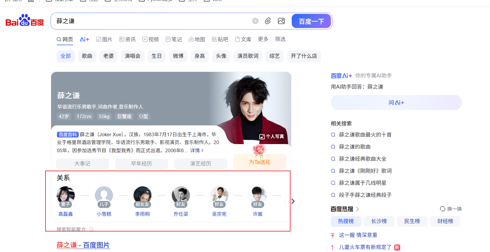

- 知识图谱基本概念:https://blog\.csdn\.net/kevinjin2011/article/details/124686668


#### 2\. **核心概念**

- 知识图谱（Knowledge Graphs）。知识图谱是现实世界实体及其关系的结构化表示，主要由两个基本元素组成：

- **节点（Nodes）：**表示单个实体，如人物、地点、物体或概念。

- **边（Edges）：**表示节点之间的关系，定义了实体间的连接方式。

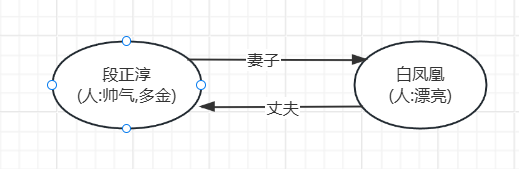

#### 3\. 图谱分类

##### 1\. LPG

- 全称\(Labeled Property Graph\), 这是一种常见的图数据模型，用于表示知识图谱的结构。它允许节点和边带有标签和属性，从而更灵活地存储复杂的关系和实体信息, Neo4j 公司是 LPG 的主要倡导者和实现者，他们在 2010 年代通过开源工具（如 Neo4j 图数据库）将 LPG 应用于大规模知识图谱构建中


- **数据模型**

    - 节点: 表示实体或者概念,如段正淳,白凤凰

    - 边:表示实体之间的关系, 如妻子,丈夫

    - 标签: 实体的分类, 如人

    - 属性: 实体的特征, 如多金,漂亮

##### 2\. RDF

- 全称\(Resource Description Framework\), 是由 万维网联盟（W3C） 提出的，用于表示和交换 Web 上的结构化数据和元数据

- RDF 由 节点 和 边 组成，节点可以表示 实体 或 属性 ，而边则表示了 实体与实体之间的关系 以及 实体与属性之间的关系 。


- 数据模型:

    - **三元组** ： 基本数据单元，形式为 `(主语, 谓语, 宾语)`

    - 节点: 表示实体,概念,或者属性

    - 边: 表示实体之间的关系

**场景:**

**LPG**：适合企业内部、性能敏感、复杂关系建模的场景，灵活且查询高效。

**RDF**：适合语义推理、标准化和跨系统共享的场景，强调语义一致性和互操作性。

### 二\. 构建知识图谱流程

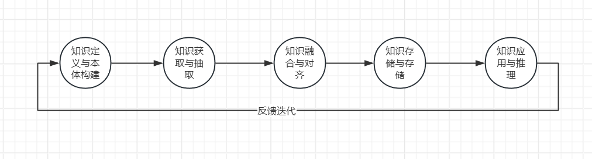

#### 1\. **知识定义与本体构建**

- **核心目标**：设计图谱的“模式”或“骨架”，解决“描述什么”的问题。这是所有后续工作的蓝图，至关重要。

- **主要工作**：

    - **领域需求分析**：明确图谱要支撑的业务场景（如智能搜索、推荐、风控、问答等）。

    - **概念化**：识别核心**实体类型**（如`人物`、`公司`、`产品`）、**属性**（如`人物`的`姓名`、`出生日期`）和**关系**（如`就职于`、`出生于`）。

    - **形式化**：使用本体语言（如OWL、RDFS）或属性图模型，将概念和关系正式定义成本体（Ontology），规定层级、约束和推理规则。

#### 2\. **知识获取与抽取**

- **核心目标**：从多源数据中提取出具体的“血肉”信息，即实例数据。

- **主要工作**：

    - **多源数据获取**：连接和处理各类数据源，包括：

        - **结构化数据**：数据库（MySQL等）、CSV。

        - **半结构化数据**：JSON、XML、网页表格。

        - **非结构化数据**：纯文本（新闻、报告、文档）。

    - **信息抽取 \(IE\)**：

        - **实体抽取**：使用NLP技术（如NER命名实体识别）从文本中识别出实体提及项（Entity Mention）。

        - **关系抽取**：判断并抽取出实体对之间的关系。

        - **属性抽取**：提取实体的属性值。

- **输出**：原始的“\(实体\-关系\-实体\)”**三元组**和“\(实体\-属性\-属性值\)”**三元组**。

- **实现**: NLP识别

#### 3\. **知识融合与对齐**

- **核心目标**：解决数据冲突和歧义，将来自不同数据源的知识整合成统一、一致、干净的整体。

- **主要工作**：

    - **实体链接**：将文本中抽取的实体提及项（如“苹果”）链接到知识库中正确的实体对象（`苹果公司`，而不是水果`苹果`）。

    - **实体消歧**：区分同名不同实的实体（如“迈克尔·乔丹”是科学家还是篮球明星？）。

    - **共指消解**：认定不同提及项（如“乔布斯”、“史蒂夫·乔布斯”、“他”）指向同一实体。

#### 4\. **知识存储与存储**

- **核心目标**：将处理好的三元组数据存储到合适的数据库中，以支持高效查询和推理。

- **存储方案选择**：

    - **原生图数据库**：如 **Neo4j** \(属性图模型\)、**Nebula Graph**。擅长处理复杂关系查询，直观易用。

    - **RDF图数据库**：如 **Apache Jena**、**Virtuoso**。遵循W3C标准，支持SPARQL查询和逻辑推理。

#### 5\. **知识应用与推理**

- **核心目标**：使用知识图谱创造价值，并利用推理发现隐藏知识。

- **主要工作**：

    - **图谱查询**：使用**SPARQL**（用于RDF）或**Cypher**（用于Neo4j）等查询语言进行复杂查询。

    - **知识推理**：基于预定义的规则，推理出隐含的关系和事实，丰富图谱内容。

### 三\. 图数据库

#### 1\. 什么是图数据库

- 随着社交、电商、金融、零售、物联网等行业的快速发展，现实社会织起了了一张庞大而复杂的关系

- 网，传统数据库很难处理关系运算。大数据行业需要处理的数据之间的关系随数据量呈几何级数增长，

- 急需一种支持海量复杂数据关系运算的数据库，图数据库应运而生。

- 图数据库是基于图论实现的一种NoSQL数据库，其数据存储结构和数据查询方式都是以图论为基础的，

- 图数据库主要用于存储更多的连接数据

#### 2\. 图数据库选择

|数据库名称|数据模型|查询语言|核心优势|适用场景|许可协议|
|---|---|---|---|---|---|
|**Neo4j**|属性图|**Cypher**|生态最成熟、易用性最佳、ACID事务、原生图处理|推荐系统、欺诈检测、知识图谱、主数据管理|开源社区版 / 商业付费|
|**Nebula Graph**|属性图|**nGQL**|**原生分布式**、**水平扩展**、高性能、中文社区活跃|**超大规模图**、社交网络、金融风控、互联网应用|开源|
|**JanusGraph**|属性图|**Gremlin**|高度灵活、与大数据生态（HBase/Cassandra/ES）集成性好|需要与现有大数据平台集成的复杂企业应用|开源|
|**TigerGraph**|属性图|**GSQL**|高性能、**深度链接分析**、内置并行图计算引擎|实时反欺诈、复杂多跳查询、实时推荐|商业付费|
|**Amazon Neptune**|**双引擎** \(属性图/RDF\)|**Gremlin** / **SPARQL**|**全托管服务**、高可用、与AWS生态无缝集成、双模型支持|希望快速上手、避免运维的AWS用户|商业付费 \(按用量计费\)|
|**Apache Jena**|RDF|**SPARQL**|语义Web标准支持、支持**推理**、Java生态成熟|学术研究、语义网项目、需要逻辑推理的场景|开源|

#### 3\. Neo4j使用

##### 1\. 下载

- 国内源地址：https://we\-yun\.com/doc/neo4j/

- 官网: https://neo4j\.com/release\-notes/database/

- 操作文档地址: https://neo4j\.com/docs/operations\-manual/3\.5/

- jdk地址: https://d10\.injdk\.cn/openjdk/openjdk/

**注意**: java8的版本 只能使用3版本neo4j, java11 才能安装4版本以上, java17安装5以上的版本

**课上配置:** java17, neo4j 5\.26

##### 2\. 安装

- 下载文件解压缩到自己的文件目录

- 配置自己的bin目录到环境变量


- 终端命令

    - neo4j install\-service \| neo4j uninstall\-service \| neo4j update\-service ： 安装/卸载/更新 neo4j 服务

    - neo4j start/ neo4j stop/ neo4j restart/ neo4j status: 启动/停止/重启/状态

    - neo4j console: 直接启动 neo4j 服务器

- 在浏览器中访问http://localhost:7474

    - 使用用户名neo4j和默认密码neo4j进行连接，然后会提示更改密码

    - Neo4j Browser是开发人员用来探索Neo4j数据库、执行Cypher查询并以表格或图形形式查看结果的工

    - 具。

    - **注意:** 浏览器不能设置中文编码不然会报错

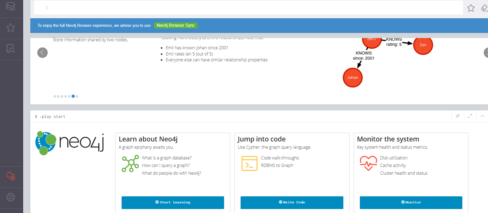

- 代码访问地址: bolt://localhost:7687

- 链接neo4j

```Plaintext
from llama_index.graph_stores.neo4j import Neo4jPropertyGraphStore
NEO4J_URL = "bolt://localhost:7687"
NEO4J_USER = "neo4j"
NEO4J_PASSWORD = "12345678"
# 测试链接
Neo4jPropertyGraphStore(
        url=NEO4J_URL,
        username=NEO4J_USER,
        password=NEO4J_PASSWORD,
        database="neo4j",
    )
```

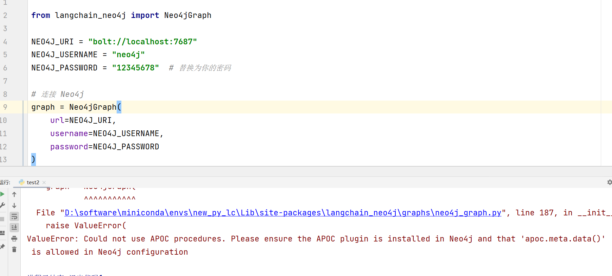


```Plaintext
注意:链接报错
        Could not use APOC procedures. Please ensure the APOC plugin is installed in Neo4j and that 'apoc.meta.data()' is allowed in Neo4j configuration 

https://github.com/neo4j-contrib/neo4j-apoc-procedures/releases  找到对应版本的apoc-5.26.4-extended.jar 
放到D:\software\neo4j-community-4.4.9-windows\neo4j-community-4.4.9\plugins 目录下

把D:\software\neo4j-community-5.26.4\labs\apoc-5.26.4-core.jar的apoc-5.26.4-core.jar文件复制一份到D:\software\neo4j-community-5.26.4\plugins
```

1. **放置文件：** 将下载好的 \.jar 文件放入 Neo4j 安装目录下的 plugins 文件夹中

2. **修改配置：** 找到 conf/neo4j\.conf 文件，添加或修改以下配置，以允许 APOC 运行

```Plaintext
# 允许访问非限制性的过程（APOC需要）
dbms.security.procedures.unrestricted=apoc.*
# 允许所有的 APOC 过程
dbms.security.procedures.allowlist=apoc.*
```

3. **重启 Neo4j：** 修改完配置和插件后，必须重启服务

### 四\. Neo4j \- CQL使用

#### 1\. Neo4j \- CQL简介

- Neo4j的Cypher语言是为处理图形数据而构建的，CQL代表Cypher查询语言。像`mysql`数据库具有查询语言SQL，Neo4j具有CQL作为查询语言。

- 它是Neo4j图形数据库的查询语言。

- 它是一种声明性模式匹配语言

- 它遵循SQL语法。

- 它的语法是非常简单且人性化、可读的格式


#### 2\. 操作语法

##### 1\. 基本概念速览

- **节点**（Node）：用圆括号 \(\) 表示，例如 \(n:Person\)

- **关系**（Relationship）：用箭头 \-\-\> 或 \-\[\]\-\> 表示，例如 \(a\)\-\[:朋友\]\-\>\(b\)

- **标签**（Label）：节点的分类，例如 :Person、Movie

- **属性**（Property）：键值对，例如 \{name: "张三", age: 30\}

- **变量**：临时起名，例如 n、p、r

##### 2\. 增（Create / Merge）

- 创建节点（CREATE）

```Plaintext
// 创建单个节点
CREATE (n:Person {name: "孙悟空", age: 500})
// 多标签
CREATE (n:Person:神仙 {name: "玉皇大帝", age: 50000})
// 创建多个节点
CREATE (:Person {name: "唐僧"}), (:Person {name: "猪八戒", age: 500, old_name:'天蓬元帅'})

// 创建带关系的节点（最常用方式） 悟空临时变量  '师从' 关系  '{since:  "明朝"}' 关系的属性
CREATE (悟空:Person {name: "孙悟空"})
      -[:师从 {since:  "明朝"}]-> 
      (祖师:Person {name: "菩提祖师"})
```

- 幂等创建,避免重复节点

```Plaintext
// MERGE 如果不存在就创建，存在就复用
MATCH (悟空:Person {name: "孙悟空"})
MERGE (祖师:Person {name: "菩提祖师"})
MERGE (悟空)-[:师从 {since: "明朝"}]->(祖师)

// 双向关系
MATCH (悟空:Person {name: "孙悟空"})
MERGE (牛魔:Person {name: "牛魔王"})
MERGE (悟空)-[:朋友]->(牛魔)
MERGE (牛魔)-[:朋友]->(悟空)
```

##### 3\. 查（MATCH \+ RETURN）

- 最核心的操作，几乎所有查询都从 MATCH 开始。

- 基础查询

```Plaintext
// 查找所有 Person 节点
MATCH (p:Person)
RETURN p

// 只返回名字   展示名字
MATCH (p:Person)
RETURN p.name AS 姓名, p.age AS 年龄

// 限制数量
MATCH (p:Person)
RETURN p.name LIMIT 5
```

- 带关系的查询

```Plaintext
// 查找所有有“师从”关系的人
MATCH (徒弟:Person)-[:师从]->(师父:Person)
RETURN 徒弟.name AS 徒弟, 师父.name AS 师父

// 双向关系（不关心方向）
MATCH (a:Person)-[:朋友]-(b:Person)
RETURN a.name, b.name
```

- WHERE 条件

```Plaintext
MATCH (p:Person)
WHERE p.age > 100 AND p.name STARTS WITH "孙"
RETURN p.name, p.age

// 包含关系属性
MATCH (a)-[r:师从]->(b)
WHERE r.since = "明朝"
RETURN a.name, b.name, r.time
```

##### 4\. 改（SET / REMOVE）

- 修改属性（SET）

```Plaintext
// 添加/修改属性
MATCH (p:Person {name: "孙悟空"})
SET p.title = "斗战胜佛",
    p.weapon = "如意金箍棒",
    p.updated = datetime()
```

- 删除属性（REMOVE）

```Plaintext
MATCH (p:Person {name: "猪八戒"})
REMOVE p.old_name, p.weight
```

- 修改标签

```Plaintext
MATCH (p:Person {name: "孙悟空"})
SET p:猴王:神仙     // 添加标签
REMOVE p:妖怪       // 删除标签
```

- 修改关系属性

```Plaintext
MATCH (悟空)-[r:师从]->(祖师)
SET r.since = "唐朝"
RETURN r.since AS 修改后的时间
```

- 修改关系类型

```Plaintext
MATCH (a)-[old:师从]->(b)
CREATE (a)-[new:师父]->(b)
SET new = properties(old)         // 复制所有旧属性到新关系
DELETE old
RETURN new
```

##### 5\. 删（DELETE / DETACH DELETE）

- 删除关系

```Plaintext
MATCH (a:Person {name:"孙悟空"})-[r:朋友]->(b)
DELETE r
```

- 删除节点（必须先删关系）

```Plaintext
// 只删节点（如果有关系会报错）
MATCH (p:Person {name: "牛魔王"})
DELETE p

// 同时删除节点和所有关系
MATCH (p:Person {name: "牛魔王"})
DETACH DELETE p
```

- 清空整个数据库（慎用！）

```Plaintext
MATCH (n)
DETACH DELETE n
```

##### 6\. 快速参考表

|操作|主要子句|特点 / 注意事项|
|---|---|---|
|增|CREATE / MERGE|MERGE 幂等，推荐用于避免重复|
|查|MATCH \+ RETURN|最核心，几乎所有查询都从这里开始|
|改|SET / REMOVE|SET 可增/改属性，REMOVE 删除属性或标签|
|删|DELETE / DETACH DELETE|DETACH 会自动删除关系再删节点|

### 五\. llamaindex\-GRAPHRAG

#### 1\. 图谱关系提取器

|提取器|类型|用途|实现逻辑|是否调用LLM|推荐指数|
|---|---|---|---|---|---|
|SimpleLLMPathExtractor|三元组抽取|快速构建知识图谱|Prompt → LLM → 抽取 Entity\-Relation\-Entity|✅|⭐⭐|
|DynamicLLMPathExtractor|动态图谱抽取|自动发现实体类型和关系类型|Prompt → LLM → 实体分类 → 关系推断|✅|⭐⭐⭐|
|SchemaLLMPathExtractor|Schema约束抽取|企业级GraphRAG|Prompt \+ Schema → LLM → 验证 → 输出|✅|⭐⭐⭐⭐⭐|
|ImplicitPathExtractor|隐式关系抽取|保留文档结构关系|根据Node Relationship自动生成边|❌|⭐⭐⭐⭐|

##### 1\.ImplicitPathExtractor

ImplicitPathExtractor 是 LlamaIndex PropertyGraphIndex 中默认内置的知识图谱提取器之一，也是最轻量、最快的提取器。

**主要作用:**

**核心功能**：**不依赖 LLM**，直接利用 LlamaIndex Node 对象中已有的 node\.relationships 属性，自动提取文档结构层面的**隐式关系（Implicit Paths）**。

它在不增加任何额外 LLM 调用成本的情况下，为 Property Graph 补充重要的**结构化连接**，让图谱更完整、更具连贯性。

**实现代码:**

```Plaintext
import asyncio
from base_llm import llm, embed_model
from llama_index.core import Settings, SimpleDirectoryReader
from llama_index.core.indices.property_graph import (
    PropertyGraphIndex,
    ImplicitPathExtractor,
)
from llama_index.core.node_parser import SentenceSplitter
from llama_index.graph_stores.neo4j import Neo4jPropertyGraphStore


Settings.llm = llm


# Neo4j
graph_store = Neo4jPropertyGraphStore(
    username="neo4j",
    password="12345678",
    url="bolt://localhost:7687",
)


# 读取文档
documents = SimpleDirectoryReader(
    input_files=["../data_file/小说.txt"]
).load_data()


# 创建隐式路径提取器
kg_extractor = ImplicitPathExtractor()

splitter = SentenceSplitter(
        chunk_size=1024,
        chunk_overlap=50,
    )
# 构建图索引
index = PropertyGraphIndex.from_documents(
    documents,
    embed_model=embed_model,
    property_graph_store=graph_store,
    transformations=[splitter],
    kg_extractors=[kg_extractor],
    show_progress=True,
    # 是否需要对数据进行Embedding
    embed_kg_nodes=True,
)

print("图谱构建完成")


# 创建查询引擎
# 没办法做检索做展示
query_engine = index.as_retriever()
res = query_engine.retrieve('萧炎的父亲是谁?')
print(res)

graph_store.close()
asyncio.run(graph_store._async_driver.close())
```

##### 2\.SimpleLLMPathExtractor

SimpleLLMPathExtractor 是 LlamaIndex PropertyGraphIndex 中最常用、最基础的知识图谱提取器（kg\_extractor）之一。它也是默认配置中的主要提取器之一。

**工作原理:**

1. 对每个文档切片后的 Node（chunk）调用 LLM。

2. 使用内置的提取 Prompt 让 LLM 从文本中找出重要的实体和它们之间的关系。

3. 通过 parse\_fn 将 LLM 的自由文本输出解析成结构化的 \(subject, predicate, object\) 三元组。

4. 将这些三元组插入到 Property Graph Store 中（支持内存、Neo4j、FalkorDB 等）。

5. 实体节点会自动进行 embedding（可选），支持后续向量检索。

**实现逻辑:**

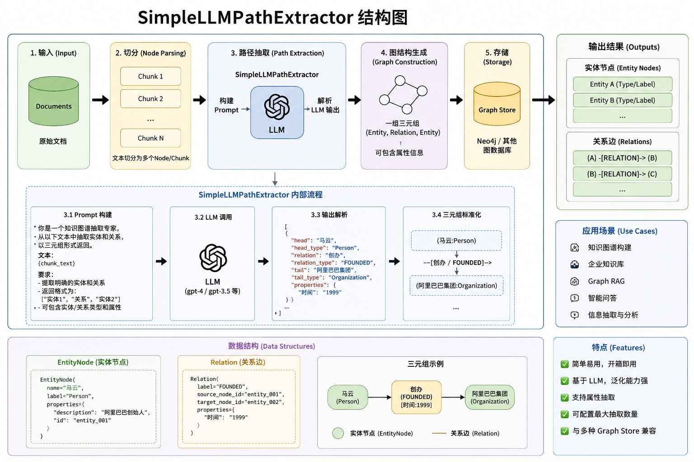

**实现代码:**

```Plaintext
import asyncio
from llama_index.core import SimpleDirectoryReader
from llama_index.core.indices.property_graph import (
    PropertyGraphIndex,
    SimpleLLMPathExtractor,
)
from llama_index.core.node_parser import SentenceSplitter
from llama_index.graph_stores.neo4j import Neo4jPropertyGraphStore
from neo4j import GraphDatabase

from base_llm import llm, embed_model


# Neo4j
graph_store = Neo4jPropertyGraphStore(
    username="neo4j",
    password="12345678",
    url="bolt://localhost:7687",
)


# 判断 Neo4j 是否已有图数据
def graph_exists():
    driver = GraphDatabase.driver(
        "bolt://localhost:7687",
        auth=("neo4j", "12345678"),
    )
    with driver.session() as session:
        result = session.run(
            """
            MATCH (n)
            RETURN count(n) AS cnt
            """
        )
        count = result.single()["cnt"]

    driver.close()
    return count > 0

# 已存在图谱
if graph_exists():

    print("发现已有图谱，直接加载...")

    index = PropertyGraphIndex.from_existing(
        property_graph_store=graph_store,
        llm=llm,
        embed_model=embed_model,
    )

# 第一次构建图谱
else:

    print("未发现图谱，开始构建...")
    splitter = SentenceSplitter(
        chunk_size=1024,
        chunk_overlap=50,
    )
    documents = SimpleDirectoryReader(
        input_files=["../data_file/小说.txt"]
    ).load_data()

    kg_extractor = SimpleLLMPathExtractor(
        llm=llm,
        max_paths_per_chunk=10,
    )
    # 创建索引
    index = PropertyGraphIndex.from_documents(
        documents,
        llm=llm,
        embed_model=embed_model,
        transformations=[splitter],
        property_graph_store=graph_store,
        kg_extractors=[kg_extractor],
        show_progress=True,
        embed_kg_nodes=True,

    )

    print("图谱构建完成")

# 创建查询引擎
question = '萧炎的父亲是谁?'
query_engine = index.as_query_engine(llm=llm)
res = query_engine.query(question)
print(res)

# 创建检索器
retriever = index.as_retriever()
nodes = retriever.retrieve(question)
for node in nodes:
    print(repr(node))
    print()


graph_store.close()
asyncio.run(graph_store._async_driver.close())
```

##### 3\. DynamicLLMPathExtractor

`DynamicLLMPathExtractor` 是 LlamaIndex 中用于**借助 LLM 从文本中动态提取知识图谱路径（三元组/关系）**的提取器组件。

**功能图:**

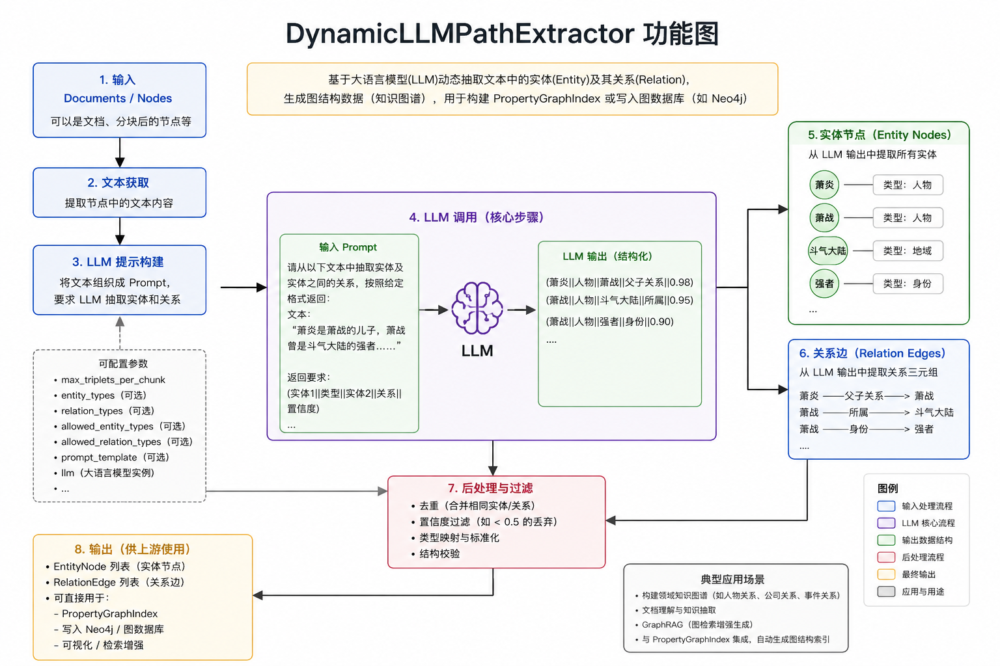

- 实现代码

```Plaintext
import asyncio
from pathlib import Path

from llama_index.core import SimpleDirectoryReader, Settings
from llama_index.core.node_parser import SentenceSplitter
from llama_index.core.indices.property_graph import PropertyGraphIndex, DynamicLLMPathExtractor
from llama_index.core.ingestion import IngestionPipeline, IngestionCache
from llama_index.core.storage.kvstore import SimpleKVStore
from llama_index.graph_stores.neo4j import Neo4jPropertyGraphStore
from base_llm import llm, embed_model

# 设置 LLM
Settings.llm = llm


# Neo4j 图存储
graph_store = Neo4jPropertyGraphStore(
    username="neo4j",
    password="12345678",
    url="bolt://localhost:7687",
)

# 文档读取
documents = SimpleDirectoryReader(
    input_files=["../data_file/小说.txt"]
).load_data()

path = "./cache/cache.json"

file_path = Path(path)

if file_path.is_file():
    print("缓存文件存在")
    kvstore = SimpleKVStore.from_persist_path(path)
    cache = IngestionCache(
        cache=kvstore
    )
else:
    print('缓存文件不存在')
    kvstore = SimpleKVStore()
    cache = IngestionCache(
        cache=kvstore
    )


# 摄取器 + 缓存
pipeline = IngestionPipeline(
    transformations=[
        SentenceSplitter(chunk_size=512, chunk_overlap=50),
        DynamicLLMPathExtractor(llm=llm)
    ],
    cache=cache  # 本地缓存，避免重复调用 LLM
)


# 使用摄取器生成节点（自动处理缓存/增量）
nodes = pipeline.run(documents=documents, show_progress=True)

print(nodes)


# 构建 PropertyGraphIndex 并写入 Neo4j
index = PropertyGraphIndex(
    nodes=nodes,
    property_graph_store=graph_store,
    llm=llm,
    embed_model=embed_model
)
kvstore.persist(path)

print("图谱处理完成（含缓存增量机制）")


# 创建查询引擎
query_engine = index.as_query_engine(llm=llm)
res = query_engine.query("萧炎的父亲是谁?")
print("回答:", res)


# 使用检索器查看上下文节点
retriever = index.as_retriever()
nodes = retriever.retrieve("萧炎的父亲是谁?")
for node in nodes:
    print("="*50)
    print(node.text)
    print()


# 关闭 Neo4j
graph_store.close()
asyncio.run(graph_store._async_driver.close())
```

##### 4\. SchemaLLMPathExtractor

- SchemaLLMPathExtractor 是 LlamaIndex PropertyGraphIndex 中最重要、最推荐用于生产环境的知识图谱提取器之一。它通过预定义 Schema（模式） 来严格引导 LLM 进行实体和关系提取，实现结构化、可控的知识图谱构建。

**主要作用:**

- **核心功能**：让 LLM **严格按照你预定义的实体类型（Entities）、关系类型（Relations）以及它们之间的连接规则** 来提取单跳路径 \(entity1, relation, entity2\)。

- 使用 **Pydantic \+ Structured Output（结构化输出）** \+ 验证逻辑，确保提取结果高度符合预设 Schema，极大减少幻觉和不一致性。

- 支持为实体和关系附加自定义属性（Properties）。

- 最终构建出**高质量、结构清晰、易于查询**的 Property Graph。

**功能图:**

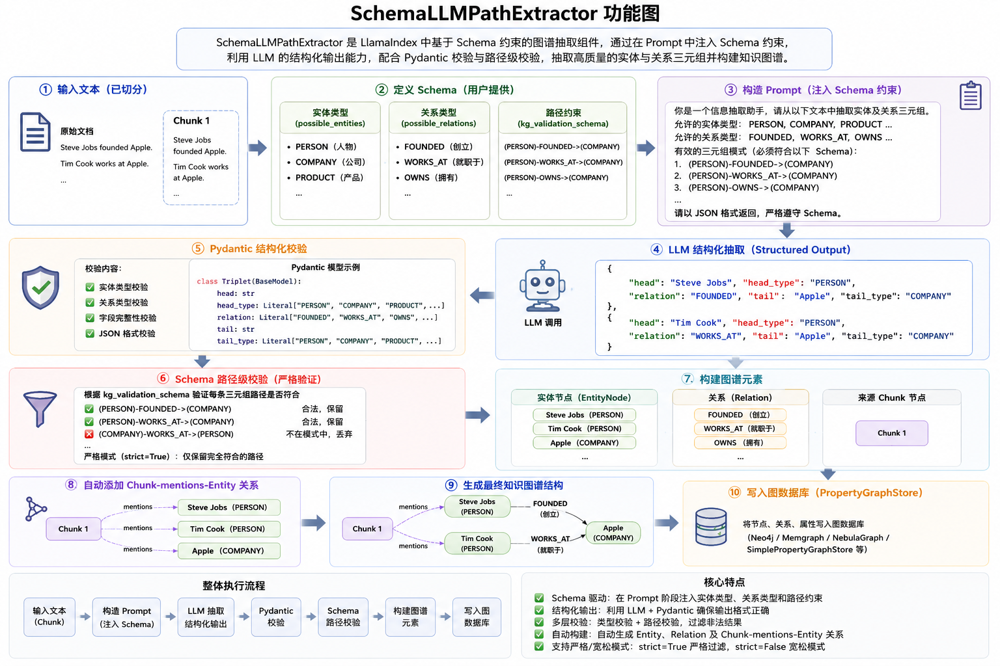

**实现代码:**

```Plaintext
import asyncio
from pathlib import Path
from typing import Literal

from llama_index.core import (
    SimpleDirectoryReader,
    Settings,
)
from llama_index.core.node_parser import SentenceSplitter
from llama_index.core.indices.property_graph import (
    PropertyGraphIndex,
    SchemaLLMPathExtractor,
)
from llama_index.core.ingestion import (
    IngestionPipeline,
    IngestionCache,
)
from llama_index.core.storage.kvstore import SimpleKVStore
from llama_index.core.storage.chat_store import SimpleChatStore
from llama_index.core.memory import ChatMemoryBuffer

from llama_index.graph_stores.neo4j import Neo4jPropertyGraphStore

from base_llm import llm, embed_model

# 全局配置
Settings.llm = llm
Settings.embed_model = embed_model

# Neo4j 配置
graph_store = Neo4jPropertyGraphStore(
    username="neo4j",
    password="12345678",
    url="bolt://localhost:7687",
)

# 文档
documents = SimpleDirectoryReader(input_files=["../data_file/小说.txt"]).load_data()

# 摄取缓存
CACHE_PATH = "./cache/cache.json"
cache_file = Path(CACHE_PATH)

if cache_file.is_file():
    print("缓存文件存在")
    kvstore = SimpleKVStore.from_persist_path(CACHE_PATH)
else:
    print("缓存文件不存在")
    kvstore = SimpleKVStore()

cache = IngestionCache(cache=kvstore)

# 图谱约束
entities = Literal[
    "PERSON",
    "FAMILY",
    "PLACE",
    "SKILL",
]

relations = Literal[
    "FATHER_OF",
    "BROTHER_OF",
    "LIVES_IN",
    "HAS_SKILL",
]

validation_schema = [
    ("PERSON", "FATHER_OF", "PERSON"),
    ("PERSON", "BROTHER_OF", "PERSON"),
    ("PERSON", "LIVES_IN", "PLACE"),
    ("PERSON", "HAS_SKILL", "SKILL"),
]

# 图谱路径抽取器
kg_extractor = SchemaLLMPathExtractor(
    llm=llm,
    possible_entities=entities,
    possible_relations=relations,
    kg_validation_schema=validation_schema,
    # 没设定的关系丢弃
    strict=True,
    # 每个切分的文本抽多少关系出来
    max_triplets_per_chunk=10,
    # 并发数
    num_workers=4,
)

# 文本切分 Pipeline，只缓存切分后的文本片段
split_pipeline = IngestionPipeline(
    transformations=[
        SentenceSplitter(
            chunk_size=512,
            chunk_overlap=50,
        ),
    ],
    cache=cache,
)

# 图谱抽取 Pipeline，不缓存 EntityNode 和 Relation
kg_pipeline = IngestionPipeline(
    transformations=[
        kg_extractor,
    ],
)

# 文本切分
split_nodes = split_pipeline.run(
    documents=documents,
    show_progress=True
)
print('切分的文档数:', len(split_nodes))
# 保存切分缓存
kvstore.persist(CACHE_PATH)

# 节点生成
nodes = kg_pipeline.run(
    nodes=split_nodes,
    show_progress=True
)
print("节点数量:", len(nodes))

# 构建图索引
index = PropertyGraphIndex(
    nodes=nodes,
    property_graph_store=graph_store,
    llm=llm,
    embed_model=embed_model,
)

print("图谱构建完成")

# 聊天记录存储
CHAT_STORE_PATH = "./cache/chat_store.json"

if Path(CHAT_STORE_PATH).exists():
    chat_store = SimpleChatStore.from_persist_path(CHAT_STORE_PATH)
    print("聊天记录恢复成功")
else:
    chat_store = SimpleChatStore()
    print("创建新的聊天记录")

# 聊天记忆
memory = ChatMemoryBuffer.from_defaults(
    token_limit=8000,
    chat_store=chat_store,
    chat_store_key="user_001"
)

# 聊天引擎
chat_engine = index.as_chat_engine(
    memory=memory,
    similarity_top_k=5,
    verbose=True,
)

# 多轮聊天
while True:
    query = input("\n用户：")
    if query == "exit":
        break
    response = chat_engine.chat(query)
    print("\nAI：")
    print(response)

    # 持久化聊天记录
    chat_store.persist(persist_path=CHAT_STORE_PATH)

# 查看历史记录
history = memory.get()

print("\n======聊天历史======")

for msg in history:
    print(msg.role)
    print(msg.content)
    print()

# 关闭 Neo4j
graph_store.close()
asyncio.run(graph_store._async_driver.close())
```

#### 2\. 图谱索引

PropertyGraphIndex 是 LlamaIndex 当前推荐的知识图谱索引（从 2024 年中开始大力推广），它是旧版 KnowledgeGraphIndex 的升级替代品，功能更强大、更灵活、更模块化。

**核心作用:**

- 图谱构建（Construction）

- 从文档 → 切 chunk（Nodes）

- 通过多个 kg\_extractors（知识提取器）从文本中提取实体、关系和属性

- 将提取结果存入 **PropertyGraphStore**（支持内存、Neo4j、FalkorDB、NebulaGraph 等）

- 同时支持向量嵌入（每个实体节点可 embedding）

- 图谱查询

**架构图:**

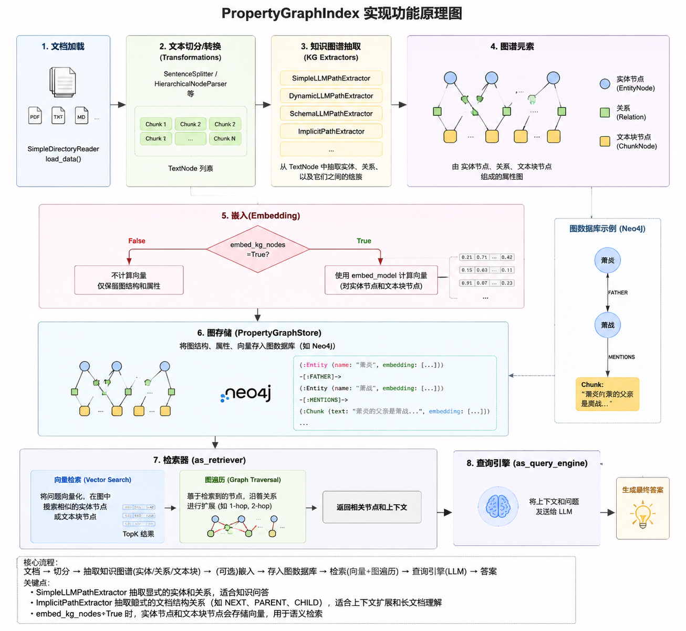

#### 3\. 图谱检索

PropertyGraphIndex 支持多种图检索方式，并且可以自由组合多个 retriever（sub\-retrievers），实现混合检索（Hybrid Retrieval），这是它最强大的特性之一。

**检索功能图:**

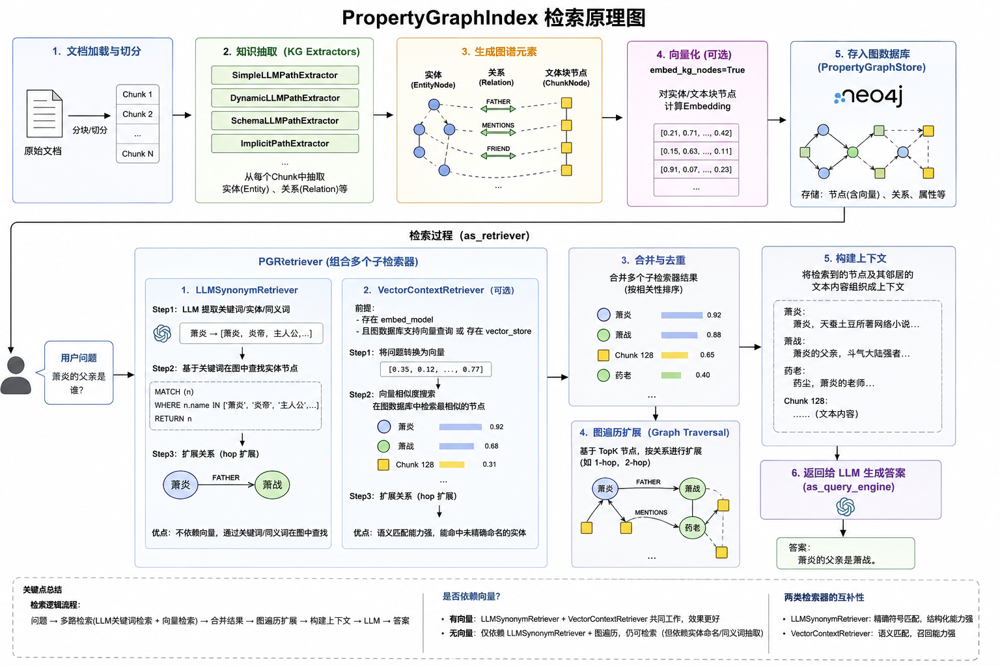

### 六\. Light RAG

#### 1\. Light RAG 介绍

- 论文: https://arxiv\.org/pdf/2410\.05779

- 文档地址: https://learnopencv\.com/lightrag/

- 项目地址: https://github\.com/HKUDS/LightRAG

##### 1\. 研究背景与动机

- 传统 **Naive RAG** 只用向量检索 → 容易丢失实体间复杂关系，全局理解差，回答常碎片化（无法很好合成多跳、多源信息）。

- **GraphRAG**（Microsoft）用社区摘要 \+ 图结构提升全局理解，但**非常贵且慢**：构建阶段 token 消耗巨大（常数十万到百万 token），增量更新几乎不可能。

- `LightRAG` 要做的事：保留图结构的优势（捕捉关系、全局理解），但大幅降低成本与时间，支持增量更新，适合实际生产。

##### 2\. 核心创新：双层检索 

`LightRAG` 的关键设计是 dual\-level retrieval（双层检索） \+ graph\-enhanced text indexing（图增强文本索引）。

- 知识图构建方式

    - 文档分块 → LLM 提取实体 \+ 关系 → 构建知识图（节点=实体，边=关系）。

    - 同时为每个实体/关系生成简短文本描述（key\-value pairs），存入向量数据库。

- 双层检索机制

    - **低层（low\-level）**：针对查询提取具体实体/关系关键词 → 向量匹配最相关实体 \+ 直接邻居 → 提供精确细节。 \(孙悟空的师傅是谁这种问题\)

    - **高层（high\-level）**：提取更抽象的主题/关键词 → 检索更广的上下文 \+ 高阶邻居（2\-3跳）→ 提供全局视角。\(西游记说的什么样的故事\)

    - 最终把两层结果融合 → 给 LLM 更全面的上下文。

- 增量更新

    - 新文档进来时，只更新受影响的局部图 \+ 向量，不需重跑整个 corpus。

    - 这点让`LightRAG` 在动态知识库场景下远比 `GraphRAG` 友好。

##### 3\. 系统整体流程

1. **索引阶段**：文档 → 分块 → LLM 抽实体/关系 → 建图 \+ 向量嵌入（实体/关系/文本块）。

2. **检索阶段**：查询 → 双层关键词提取 → 向量检索 \+ 图遍历（低层精确 \+ 高层全局）→ 融合上下文。

3. **生成阶段**：检索结果 \+ 查询 → 喂给 LLM 生成最终回答。

4. 整个过程只用少量 API 调用，token 消耗极低。

#### 2\. 架构流程分析

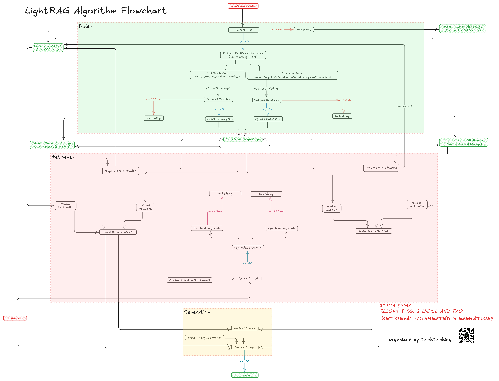

**功能介绍**

- 索引阶段

    - Input Documents → Text Chunks : 把原始文档切分成小块（chunks）

    - Store in Vector DB Storage : 把文本块的向量存入向量数据库（NanoVectorDB/ Faiss 等）

    - Store in KV Storage : 把实体/关系/块的元数据、描述、chunk\_id 等存入 JSON KV 存储

    - Extract Entities \& Relations : 用 LLM 从文本块中提取实体（人、物、地点等）和关系（谁对谁做了什么）

    - Max Cleaning Turns / Dedupe : 去重（set dedupe \+ LLM 进一步清洗），避免重复实体/关系

    - Update Description : 用 LLM 为去重后的实体/关系生成/优化描述（更简洁、准确）

    - Store in Knowledge Graph : 把实体（节点）和关系（边）存入知识图谱

- 检索阶段

    - Query → Keywords Extraction : 用 LLM \+ 专用 Prompt 从查询中提取两组关键词： low\_level\_keywords（底层：实体导向） high\_level\_keywords（高层：主题/关系导向）

    - low\_level\_keywords → Embedding → Top Entities Results : 用底层关键词向量搜索 → 找到最相关的实体

    - high\_level\_keywords → Embedding → Top Relations Results : 用高层关键词向量搜索 → 找到最相关的关系

    - Top Entities Results → related text\_units / related Relations / Local Query Context : 从 Top 实体拉取：相关文本块 \+ 直接相关关系 \+ 局部上下文

    - Top Relations Results → related text\_units / Global Query Context : 从 Top 关系拉取：相关文本块 \+ 全局聚合上下文

    - Local Query Context \+ Global Query Context → Combined Context : 把局部 \+ 全局上下文融合（简单拼接或加权）

#### 3\. 实战案例

- 模块安装

```Plaintext
pip install lightrag-hku
```

- 操作案例

```Plaintext
import asyncio
import os


from lightrag import LightRAG, QueryParam
from lightrag.llm.openai import openai_complete_if_cache, openai_embed
from dotenv import load_dotenv
from lightrag.utils import EmbeddingFunc
from lightrag.kg.shared_storage import initialize_pipeline_status
from sentence_transformers import SentenceTransformer

load_dotenv()

# 创建嵌入模型
model_name = r'D:\LLM\Local_model\BAAI\bge-large-zh-v1___5'
WORKING_DIR = 'light_test'
model = SentenceTransformer(model_name)


async def llm_func(prompt, system_prompt=None, history_messages=[], **kwargs):
    return await openai_complete_if_cache(
        model="qwen-plus-latest",
        prompt=prompt,
        system_prompt=system_prompt,
        history_messages=history_messages,
        base_url=os.getenv("DASHSCOPE_BASE_URL"),
        api_key=os.getenv("DASHSCOPE_API_KEY"),
        **kwargs
    )


async def local_embedding_func(texts):
    embeddings = model.encode(texts, convert_to_numpy=True, batch_size=2)  # 生成嵌入
    return embeddings


async def initialize_rag():
    rag = LightRAG(
        llm_model_func=llm_func,
        # 使用自定义本地嵌入函数
        embedding_func=EmbeddingFunc(
            embedding_dim=1024,  # 模型维度，根据你的模型调整
            max_token_size=8192,  # 最大 token 长度，根据模型调整
            func=local_embedding_func  # 传入你的函数（异步或同步）
        ),
        vector_storage="FaissVectorDBStorage",
        # window 添加之后会报错 RuntimeError: Event loop is closed   使用get_event_loop启动协程
        graph_storage='Neo4JStorage',

    )
    # IMPORTANT: Both initialization calls are required!
    await rag.initialize_storages()  # Initialize storage backends
    await initialize_pipeline_status()  # Initialize processing pipeline

    return rag


async def main():
    rag = await initialize_rag()
    # 清全部缓存
    # await rag.aclear_cache()

    # with open('西游记.txt', 'r', encoding='utf-8') as f:
    #     data = f.read()
    # task = loop.create_task(rag.ainsert(data))
    # await asyncio.gather(task)
    # await rag.ainsert(data)
    da1 = await rag.aquery("谁告诉孙悟空有金箍棒的", param=QueryParam(mode="naive"))  # 传统向量检索
    print('向量检索结果：', da1)
    print("---------------------------------------------------------------------------------------------------------")
    da2 = await rag.aquery("谁告诉孙悟空有金箍棒的", param=QueryParam(mode="local"))  # 底层精确
    print('底层精确结果：', da2)
    print("---------------------------------------------------------------------------------------------------------")
    da3 = await rag.aquery("谁告诉孙悟空有金箍棒的", param=QueryParam(mode="global"))  # 高层全局
    print('高层全局结果：', da3)
    print("---------------------------------------------------------------------------------------------------------")
    da4 = await rag.aquery("谁告诉孙悟空有金箍棒的", param=QueryParam(mode="hybrid"))  # 推荐融合
    print('混合检索结果：', da4)

    # 增量操作  插入新的数据  重新插入后续的内容
    # await rag.ainsert(data)


if __name__ == "__main__":
    # asyncio.run(main())
    loop = asyncio.get_event_loop()
    loop.run_until_complete(main())
```

#### 4\. 核心源码分析

##### 1\. 索引阶段

- 文本转关系提示词

- \.\\lightrag\\prompt\.py

```Plaintext
from __future__ import annotations
from typing import Any


PROMPTS: dict[str, Any] = {}

PROMPTS["DEFAULT_LANGUAGE"] = "English"
PROMPTS["DEFAULT_TUPLE_DELIMITER"] = "<|>"
PROMPTS["DEFAULT_RECORD_DELIMITER"] = "##"
PROMPTS["DEFAULT_COMPLETION_DELIMITER"] = "<|COMPLETE|>"

PROMPTS["DEFAULT_ENTITY_TYPES"] = ["organization", "person", "geo", "event", "category"]

PROMPTS["DEFAULT_USER_PROMPT"] = "n/a"

PROMPTS["entity_extraction"] = """---Goal---
Given a text document that is potentially relevant to this activity and a list of entity types, identify all entities of those types from the text and all relationships among the identified entities.
Use {language} as output language.

---Steps---
1. Identify all entities. For each identified entity, extract the following information:
- entity_name: Name of the entity, use same language as input text. If English, capitalized the name.
- entity_type: One of the following types: [{entity_types}]
- entity_description: Comprehensive description of the entity's attributes and activities
Format each entity as ("entity"{tuple_delimiter}<entity_name>{tuple_delimiter}<entity_type>{tuple_delimiter}<entity_description>)

2. From the entities identified in step 1, identify all pairs of (source_entity, target_entity) that are *clearly related* to each other.
For each pair of related entities, extract the following information:
- source_entity: name of the source entity, as identified in step 1
- target_entity: name of the target entity, as identified in step 1
- relationship_description: explanation as to why you think the source entity and the target entity are related to each other
- relationship_strength: a numeric score indicating strength of the relationship between the source entity and target entity
- relationship_keywords: one or more high-level key words that summarize the overarching nature of the relationship, focusing on concepts or themes rather than specific details
Format each relationship as ("relationship"{tuple_delimiter}<source_entity>{tuple_delimiter}<target_entity>{tuple_delimiter}<relationship_description>{tuple_delimiter}<relationship_keywords>{tuple_delimiter}<relationship_strength>)

3. Identify high-level key words that summarize the main concepts, themes, or topics of the entire text. These should capture the overarching ideas present in the document.
Format the content-level key words as ("content_keywords"{tuple_delimiter}<high_level_keywords>)

4. Return output in {language} as a single list of all the entities and relationships identified in steps 1 and 2. Use **{record_delimiter}** as the list delimiter.

5. When finished, output {completion_delimiter}

######################
---Examples---
######################
{examples}

#############################
---Real Data---
######################
Entity_types: [{entity_types}]
Text:
{input_text}
######################
Output:"""

PROMPTS["entity_extraction_examples"] = [
    """Example 1:

Entity_types: [person, technology, mission, organization, location]
Text:
```
while Alex clenched his jaw, the buzz of frustration dull against the backdrop of Taylor's authoritarian certainty. It was this competitive undercurrent that kept him alert, the sense that his and Jordan's shared commitment to discovery was an unspoken rebellion against Cruz's narrowing vision of control and order.

Then Taylor did something unexpected. They paused beside Jordan and, for a moment, observed the device with something akin to reverence. "If this tech can be understood..." Taylor said, their voice quieter, "It could change the game for us. For all of us."

The underlying dismissal earlier seemed to falter, replaced by a glimpse of reluctant respect for the gravity of what lay in their hands. Jordan looked up, and for a fleeting heartbeat, their eyes locked with Taylor's, a wordless clash of wills softening into an uneasy truce.


It was a small transformation, barely perceptible, but one that Alex noted with an inward nod. They had all been brought here by different paths
```

Output:
("entity"{tuple_delimiter}"Alex"{tuple_delimiter}"person"{tuple_delimiter}"Alex is a character who experiences frustration and is observant of the dynamics among other characters."){record_delimiter}
("entity"{tuple_delimiter}"Taylor"{tuple_delimiter}"person"{tuple_delimiter}"Taylor is portrayed with authoritarian certainty and shows a moment of reverence towards a device, indicating a change in perspective."){record_delimiter}
("entity"{tuple_delimiter}"Jordan"{tuple_delimiter}"person"{tuple_delimiter}"Jordan shares a commitment to discovery and has a significant interaction with Taylor regarding a device."){record_delimiter}
("entity"{tuple_delimiter}"Cruz"{tuple_delimiter}"person"{tuple_delimiter}"Cruz is associated with a vision of control and order, influencing the dynamics among other characters."){record_delimiter}
("entity"{tuple_delimiter}"The Device"{tuple_delimiter}"technology"{tuple_delimiter}"The Device is central to the story, with potential game-changing implications, and is revered by Taylor."){record_delimiter}
("relationship"{tuple_delimiter}"Alex"{tuple_delimiter}"Taylor"{tuple_delimiter}"Alex is affected by Taylor's authoritarian certainty and observes changes in Taylor's attitude towards the device."{tuple_delimiter}"power dynamics, perspective shift"{tuple_delimiter}7){record_delimiter}
("relationship"{tuple_delimiter}"Alex"{tuple_delimiter}"Jordan"{tuple_delimiter}"Alex and Jordan share a commitment to discovery, which contrasts with Cruz's vision."{tuple_delimiter}"shared goals, rebellion"{tuple_delimiter}6){record_delimiter}
("relationship"{tuple_delimiter}"Taylor"{tuple_delimiter}"Jordan"{tuple_delimiter}"Taylor and Jordan interact directly regarding the device, leading to a moment of mutual respect and an uneasy truce."{tuple_delimiter}"conflict resolution, mutual respect"{tuple_delimiter}8){record_delimiter}
("relationship"{tuple_delimiter}"Jordan"{tuple_delimiter}"Cruz"{tuple_delimiter}"Jordan's commitment to discovery is in rebellion against Cruz's vision of control and order."{tuple_delimiter}"ideological conflict, rebellion"{tuple_delimiter}5){record_delimiter}
("relationship"{tuple_delimiter}"Taylor"{tuple_delimiter}"The Device"{tuple_delimiter}"Taylor shows reverence towards the device, indicating its importance and potential impact."{tuple_delimiter}"reverence, technological significance"{tuple_delimiter}9){record_delimiter}
("content_keywords"{tuple_delimiter}"power dynamics, ideological conflict, discovery, rebellion"){completion_delimiter}
#############################""",
    """Example 2:

Entity_types: [company, index, commodity, market_trend, economic_policy, biological]
Text:
```
Stock markets faced a sharp downturn today as tech giants saw significant declines, with the Global Tech Index dropping by 3.4% in midday trading. Analysts attribute the selloff to investor concerns over rising interest rates and regulatory uncertainty.

Among the hardest hit, Nexon Technologies saw its stock plummet by 7.8% after reporting lower-than-expected quarterly earnings. In contrast, Omega Energy posted a modest 2.1% gain, driven by rising oil prices.

Meanwhile, commodity markets reflected a mixed sentiment. Gold futures rose by 1.5%, reaching $2,080 per ounce, as investors sought safe-haven assets. Crude oil prices continued their rally, climbing to $87.60 per barrel, supported by supply constraints and strong demand.

Financial experts are closely watching the Federal Reserve's next move, as speculation grows over potential rate hikes. The upcoming policy announcement is expected to influence investor confidence and overall market stability.
```

Output:
("entity"{tuple_delimiter}"Global Tech Index"{tuple_delimiter}"index"{tuple_delimiter}"The Global Tech Index tracks the performance of major technology stocks and experienced a 3.4% decline today."){record_delimiter}
("entity"{tuple_delimiter}"Nexon Technologies"{tuple_delimiter}"company"{tuple_delimiter}"Nexon Technologies is a tech company that saw its stock decline by 7.8% after disappointing earnings."){record_delimiter}
("entity"{tuple_delimiter}"Omega Energy"{tuple_delimiter}"company"{tuple_delimiter}"Omega Energy is an energy company that gained 2.1% in stock value due to rising oil prices."){record_delimiter}
("entity"{tuple_delimiter}"Gold Futures"{tuple_delimiter}"commodity"{tuple_delimiter}"Gold futures rose by 1.5%, indicating increased investor interest in safe-haven assets."){record_delimiter}
("entity"{tuple_delimiter}"Crude Oil"{tuple_delimiter}"commodity"{tuple_delimiter}"Crude oil prices rose to $87.60 per barrel due to supply constraints and strong demand."){record_delimiter}
("entity"{tuple_delimiter}"Market Selloff"{tuple_delimiter}"market_trend"{tuple_delimiter}"Market selloff refers to the significant decline in stock values due to investor concerns over interest rates and regulations."){record_delimiter}
("entity"{tuple_delimiter}"Federal Reserve Policy Announcement"{tuple_delimiter}"economic_policy"{tuple_delimiter}"The Federal Reserve's upcoming policy announcement is expected to impact investor confidence and market stability."){record_delimiter}
("relationship"{tuple_delimiter}"Global Tech Index"{tuple_delimiter}"Market Selloff"{tuple_delimiter}"The decline in the Global Tech Index is part of the broader market selloff driven by investor concerns."{tuple_delimiter}"market performance, investor sentiment"{tuple_delimiter}9){record_delimiter}
("relationship"{tuple_delimiter}"Nexon Technologies"{tuple_delimiter}"Global Tech Index"{tuple_delimiter}"Nexon Technologies' stock decline contributed to the overall drop in the Global Tech Index."{tuple_delimiter}"company impact, index movement"{tuple_delimiter}8){record_delimiter}
("relationship"{tuple_delimiter}"Gold Futures"{tuple_delimiter}"Market Selloff"{tuple_delimiter}"Gold prices rose as investors sought safe-haven assets during the market selloff."{tuple_delimiter}"market reaction, safe-haven investment"{tuple_delimiter}10){record_delimiter}
("relationship"{tuple_delimiter}"Federal Reserve Policy Announcement"{tuple_delimiter}"Market Selloff"{tuple_delimiter}"Speculation over Federal Reserve policy changes contributed to market volatility and investor selloff."{tuple_delimiter}"interest rate impact, financial regulation"{tuple_delimiter}7){record_delimiter}
("content_keywords"{tuple_delimiter}"market downturn, investor sentiment, commodities, Federal Reserve, stock performance"){completion_delimiter}
#############################""",
    """Example 3:

Entity_types: [economic_policy, athlete, event, location, record, organization, equipment]
Text:
```
At the World Athletics Championship in Tokyo, Noah Carter broke the 100m sprint record using cutting-edge carbon-fiber spikes.
```

Output:
("entity"{tuple_delimiter}"World Athletics Championship"{tuple_delimiter}"event"{tuple_delimiter}"The World Athletics Championship is a global sports competition featuring top athletes in track and field."){record_delimiter}
("entity"{tuple_delimiter}"Tokyo"{tuple_delimiter}"location"{tuple_delimiter}"Tokyo is the host city of the World Athletics Championship."){record_delimiter}
("entity"{tuple_delimiter}"Noah Carter"{tuple_delimiter}"athlete"{tuple_delimiter}"Noah Carter is a sprinter who set a new record in the 100m sprint at the World Athletics Championship."){record_delimiter}
("entity"{tuple_delimiter}"100m Sprint Record"{tuple_delimiter}"record"{tuple_delimiter}"The 100m sprint record is a benchmark in athletics, recently broken by Noah Carter."){record_delimiter}
("entity"{tuple_delimiter}"Carbon-Fiber Spikes"{tuple_delimiter}"equipment"{tuple_delimiter}"Carbon-fiber spikes are advanced sprinting shoes that provide enhanced speed and traction."){record_delimiter}
("entity"{tuple_delimiter}"World Athletics Federation"{tuple_delimiter}"organization"{tuple_delimiter}"The World Athletics Federation is the governing body overseeing the World Athletics Championship and record validations."){record_delimiter}
("relationship"{tuple_delimiter}"World Athletics Championship"{tuple_delimiter}"Tokyo"{tuple_delimiter}"The World Athletics Championship is being hosted in Tokyo."{tuple_delimiter}"event location, international competition"{tuple_delimiter}8){record_delimiter}
("relationship"{tuple_delimiter}"Noah Carter"{tuple_delimiter}"100m Sprint Record"{tuple_delimiter}"Noah Carter set a new 100m sprint record at the championship."{tuple_delimiter}"athlete achievement, record-breaking"{tuple_delimiter}10){record_delimiter}
("relationship"{tuple_delimiter}"Noah Carter"{tuple_delimiter}"Carbon-Fiber Spikes"{tuple_delimiter}"Noah Carter used carbon-fiber spikes to enhance performance during the race."{tuple_delimiter}"athletic equipment, performance boost"{tuple_delimiter}7){record_delimiter}
("relationship"{tuple_delimiter}"World Athletics Federation"{tuple_delimiter}"100m Sprint Record"{tuple_delimiter}"The World Athletics Federation is responsible for validating and recognizing new sprint records."{tuple_delimiter}"sports regulation, record certification"{tuple_delimiter}9){record_delimiter}
("content_keywords"{tuple_delimiter}"athletics, sprinting, record-breaking, sports technology, competition"){completion_delimiter}
#############################""",
]

PROMPTS[
    "summarize_entity_descriptions"
] = """You are a helpful assistant responsible for generating a comprehensive summary of the data provided below.
Given one or two entities, and a list of descriptions, all related to the same entity or group of entities.
Please concatenate all of these into a single, comprehensive description. Make sure to include information collected from all the descriptions.
If the provided descriptions are contradictory, please resolve the contradictions and provide a single, coherent summary.

Make sure it is written in third person, and include the entity names so we the have full context.
Use {language} as output language.

#######
---Data---
Entities: {entity_name}
Description List: {description_list}
#######
Output:
"""

PROMPTS["entity_continue_extraction"] = """
MANY entities and relationships were missed in the last extraction.

---Remember Steps---

1. Identify all entities. For each identified entity, extract the following information:
- entity_name: Name of the entity, use same language as input text. If English, capitalized the name.
- entity_type: One of the following types: [{entity_types}]
- entity_description: Comprehensive description of the entity's attributes and activities
Format each entity as ("entity"{tuple_delimiter}<entity_name>{tuple_delimiter}<entity_type>{tuple_delimiter}<entity_description>)

2. From the entities identified in step 1, identify all pairs of (source_entity, target_entity) that are *clearly related* to each other.
For each pair of related entities, extract the following information:
- source_entity: name of the source entity, as identified in step 1
- target_entity: name of the target entity, as identified in step 1
- relationship_description: explanation as to why you think the source entity and the target entity are related to each other
- relationship_strength: a numeric score indicating strength of the relationship between the source entity and target entity
- relationship_keywords: one or more high-level key words that summarize the overarching nature of the relationship, focusing on concepts or themes rather than specific details
Format each relationship as ("relationship"{tuple_delimiter}<source_entity>{tuple_delimiter}<target_entity>{tuple_delimiter}<relationship_description>{tuple_delimiter}<relationship_keywords>{tuple_delimiter}<relationship_strength>)

3. Identify high-level key words that summarize the main concepts, themes, or topics of the entire text. These should capture the overarching ideas present in the document.
Format the content-level key words as ("content_keywords"{tuple_delimiter}<high_level_keywords>)

4. Return output in {language} as a single list of all the entities and relationships identified in steps 1 and 2. Use **{record_delimiter}** as the list delimiter.

5. When finished, output {completion_delimiter}

---Output---

Add them below using the same format:\n
""".strip()

PROMPTS["entity_if_loop_extraction"] = """
---Goal---'

It appears some entities may have still been missed.

---Output---

Answer ONLY by `YES` OR `NO` if there are still entities that need to be added.
""".strip()

PROMPTS["fail_response"] = (
    "Sorry, I'm not able to provide an answer to that question.[no-context]"
)

PROMPTS["rag_response"] = """---Role---

You are a helpful assistant responding to user query about Knowledge Graph and Document Chunks provided in JSON format below.


---Goal---

Generate a concise response based on Knowledge Base and follow Response Rules, considering both the conversation history and the current query. Summarize all information in the provided Knowledge Base, and incorporating general knowledge relevant to the Knowledge Base. Do not include information not provided by Knowledge Base.

When handling relationships with timestamps:
1. Each relationship has a "created_at" timestamp indicating when we acquired this knowledge
2. When encountering conflicting relationships, consider both the semantic content and the timestamp
3. Don't automatically prefer the most recently created relationships - use judgment based on the context
4. For time-specific queries, prioritize temporal information in the content before considering creation timestamps

---Conversation History---
{history}

---Knowledge Graph and Document Chunks---
{context_data}

---Response Rules---

- Target format and length: {response_type}
- Use markdown formatting with appropriate section headings
- Please respond in the same language as the user's question.
- Ensure the response maintains continuity with the conversation history.
- List up to 5 most important reference sources at the end under "References" section. Clearly indicating whether each source is from Knowledge Graph (KG) or Document Chunks (DC), and include the file path if available, in the following format: [KG/DC] file_path
- If you don't know the answer, just say so.
- Do not make anything up. Do not include information not provided by the Knowledge Base.
- Addtional user prompt: {user_prompt}

Response:"""

PROMPTS["keywords_extraction"] = """---Role---

You are a helpful assistant tasked with identifying both high-level and low-level keywords in the user's query and conversation history.

---Goal---

Given the query and conversation history, list both high-level and low-level keywords. High-level keywords focus on overarching concepts or themes, while low-level keywords focus on specific entities, details, or concrete terms.

---Instructions---

- Consider both the current query and relevant conversation history when extracting keywords
- Output the keywords in JSON format, it will be parsed by a JSON parser, do not add any extra content in output
- The JSON should have two keys:
  - "high_level_keywords" for overarching concepts or themes
  - "low_level_keywords" for specific entities or details

######################
---Examples---
######################
{examples}

#############################
---Real Data---
######################
Conversation History:
{history}

Current Query: {query}
######################
The `Output` should be human text, not unicode characters. Keep the same language as `Query`.
Output:

"""

PROMPTS["keywords_extraction_examples"] = [
    """Example 1:

Query: "How does international trade influence global economic stability?"
################
Output:
{
  "high_level_keywords": ["International trade", "Global economic stability", "Economic impact"],
  "low_level_keywords": ["Trade agreements", "Tariffs", "Currency exchange", "Imports", "Exports"]
}
#############################""",
    """Example 2:

Query: "What are the environmental consequences of deforestation on biodiversity?"
################
Output:
{
  "high_level_keywords": ["Environmental consequences", "Deforestation", "Biodiversity loss"],
  "low_level_keywords": ["Species extinction", "Habitat destruction", "Carbon emissions", "Rainforest", "Ecosystem"]
}
#############################""",
    """Example 3:

Query: "What is the role of education in reducing poverty?"
################
Output:
{
  "high_level_keywords": ["Education", "Poverty reduction", "Socioeconomic development"],
  "low_level_keywords": ["School access", "Literacy rates", "Job training", "Income inequality"]
}
#############################""",
]

PROMPTS["naive_rag_response"] = """---Role---

You are a helpful assistant responding to user query about Document Chunks provided provided in JSON format below.

---Goal---

Generate a concise response based on Document Chunks and follow Response Rules, considering both the conversation history and the current query. Summarize all information in the provided Document Chunks, and incorporating general knowledge relevant to the Document Chunks. Do not include information not provided by Document Chunks.

When handling content with timestamps:
1. Each piece of content has a "created_at" timestamp indicating when we acquired this knowledge
2. When encountering conflicting information, consider both the content and the timestamp
3. Don't automatically prefer the most recent content - use judgment based on the context
4. For time-specific queries, prioritize temporal information in the content before considering creation timestamps

---Conversation History---
{history}

---Document Chunks(DC)---
{content_data}

---Response Rules---

- Target format and length: {response_type}
- Use markdown formatting with appropriate section headings
- Please respond in the same language as the user's question.
- Ensure the response maintains continuity with the conversation history.
- List up to 5 most important reference sources at the end under "References" section. Clearly indicating each source from Document Chunks(DC), and include the file path if available, in the following format: [DC] file_path
- If you don't know the answer, just say so.
- Do not include information not provided by the Document Chunks.
- Addtional user prompt: {user_prompt}

Response:"""

# TODO: deprecated
PROMPTS[
    "similarity_check"
] = """Please analyze the similarity between these two questions:

Question 1: {original_prompt}
Question 2: {cached_prompt}

Please evaluate whether these two questions are semantically similar, and whether the answer to Question 2 can be used to answer Question 1, provide a similarity score between 0 and 1 directly.

Similarity score criteria:
0: Completely unrelated or answer cannot be reused, including but not limited to:
   - The questions have different topics
   - The locations mentioned in the questions are different
   - The times mentioned in the questions are different
   - The specific individuals mentioned in the questions are different
   - The specific events mentioned in the questions are different
   - The background information in the questions is different
   - The key conditions in the questions are different
1: Identical and answer can be directly reused
0.5: Partially related and answer needs modification to be used
Return only a number between 0-1, without any additional content.
"""
```

##### 2\. 检索阶段

- naive 检索

- \.\\lightrag\\operate\.py naive\_query方法

```Plaintext
async def naive_query(
    query: str,
    chunks_vdb: BaseVectorStorage,
    query_param: QueryParam,
    global_config: dict[str, str],
    hashing_kv: BaseKVStorage | None = None,
    system_prompt: str | None = None,
) -> str | AsyncIterator[str]:
    if query_param.model_func:
        use_model_func = query_param.model_func
    else:
        use_model_func = global_config["llm_model_func"]
        # Apply higher priority (5) to query relation LLM function
        use_model_func = partial(use_model_func, _priority=5)

    # Handle cache
    args_hash = compute_args_hash(query_param.mode, query)
    cached_response, quantized, min_val, max_val = await handle_cache(
        hashing_kv, args_hash, query, query_param.mode, cache_type="query"
    )
    if cached_response is not None:
        return cached_response

    tokenizer: Tokenizer = global_config["tokenizer"]


    chunks = await _get_vector_context(query, chunks_vdb, query_param)

    if chunks is None or len(chunks) == 0:
        return PROMPTS["fail_response"]

    # Calculate dynamic token limit for chunks
    # Get token limits from query_param (with fallback to global_config)
    max_total_tokens = getattr(
        query_param,
        "max_total_tokens",
        global_config.get("max_total_tokens", DEFAULT_MAX_TOTAL_TOKENS),
    )

    # Calculate conversation history tokens
    history_context = ""
    if query_param.conversation_history:
        history_context = get_conversation_turns(
            query_param.conversation_history, query_param.history_turns
        )
    history_tokens = len(tokenizer.encode(history_context)) if history_context else 0

    # Calculate system prompt template tokens (excluding content_data)
    user_prompt = query_param.user_prompt if query_param.user_prompt else ""
    response_type = (
        query_param.response_type
        if query_param.response_type
        else "Multiple Paragraphs"
    )

    # Use the provided system prompt or default
    sys_prompt_template = (
        system_prompt if system_prompt else PROMPTS["naive_rag_response"]
    )

    # Create a sample system prompt with empty content_data to calculate overhead
    sample_sys_prompt = sys_prompt_template.format(
        content_data="",  # Empty for overhead calculation
        response_type=response_type,
        history=history_context,
        user_prompt=user_prompt,
    )
    sys_prompt_template_tokens = len(tokenizer.encode(sample_sys_prompt))

    # Total system prompt overhead = template + query tokens
    query_tokens = len(tokenizer.encode(query))
    sys_prompt_overhead = sys_prompt_template_tokens + query_tokens

    buffer_tokens = 100  # Safety buffer

    # Calculate available tokens for chunks
    used_tokens = sys_prompt_overhead + buffer_tokens
    available_chunk_tokens = max_total_tokens - used_tokens

    logger.debug(
        f"Naive query token allocation - Total: {max_total_tokens}, History: {history_tokens}, SysPrompt: {sys_prompt_overhead}, Buffer: {buffer_tokens}, Available for chunks: {available_chunk_tokens}"
    )

    # Process chunks using unified processing with dynamic token limit
    processed_chunks = await process_chunks_unified(
        query=query,
        chunks=chunks,
        query_param=query_param,
        global_config=global_config,
        source_type="vector",
        chunk_token_limit=available_chunk_tokens,  # Pass dynamic limit
    )

    logger.info(f"Final context: {len(processed_chunks)} chunks")

    # Build text_units_context from processed chunks
    text_units_context = []
    for i, chunk in enumerate(processed_chunks):
        text_units_context.append(
            {
                "id": i + 1,
                "content": chunk["content"],
                "file_path": chunk.get("file_path", "unknown_source"),
            }
        )

    text_units_str = json.dumps(text_units_context, ensure_ascii=False)
    if query_param.only_need_context:
        return f"""
---Document Chunks---

```json
{text_units_str}
```

"""
    # Process conversation history
    history_context = ""
    if query_param.conversation_history:
        history_context = get_conversation_turns(
            query_param.conversation_history, query_param.history_turns
        )

    # Build system prompt
    user_prompt = (
        query_param.user_prompt
        if query_param.user_prompt
        else PROMPTS["DEFAULT_USER_PROMPT"]
    )
    sys_prompt_temp = system_prompt if system_prompt else PROMPTS["naive_rag_response"]
    sys_prompt = sys_prompt_temp.format(
        content_data=text_units_str,
        response_type=query_param.response_type,
        history=history_context,
        user_prompt=user_prompt,
    )

    if query_param.only_need_prompt:
        return sys_prompt

    len_of_prompts = len(tokenizer.encode(query + sys_prompt))
    logger.debug(
        f"[naive_query] Sending to LLM: {len_of_prompts:,} tokens (Query: {len(tokenizer.encode(query))}, System: {len(tokenizer.encode(sys_prompt))})"
    )

    response = await use_model_func(
        query,
        system_prompt=sys_prompt,
        stream=query_param.stream,
    )

    if isinstance(response, str) and len(response) > len(sys_prompt):
        response = (
            response[len(sys_prompt) :]
            .replace(sys_prompt, "")
            .replace("user", "")
            .replace("model", "")
            .replace(query, "")
            .replace("<system>", "")
            .replace("</system>", "")
            .strip()
        )

    if hashing_kv.global_config.get("enable_llm_cache"):
        # Save to cache
        await save_to_cache(
            hashing_kv,
            CacheData(
                args_hash=args_hash,
                content=response,
                prompt=query,
                quantized=quantized,
                min_val=min_val,
                max_val=max_val,
                mode=query_param.mode,
                cache_type="query",
            ),
        )

    return response
```

- local global hybrid检索

- lightrag/operate\.py

```Plaintext
async def _build_query_context(
    query: str,
    ll_keywords: str,
    hl_keywords: str,
    knowledge_graph_inst: BaseGraphStorage,
    entities_vdb: BaseVectorStorage,
    relationships_vdb: BaseVectorStorage,
    text_chunks_db: BaseKVStorage,
    query_param: QueryParam,
    chunks_vdb: BaseVectorStorage = None,
):
    logger.info(f"Process {os.getpid()} building query context...")

    # Collect all chunks from different sources
    all_chunks = []
    entities_context = []
    relations_context = []

    # Store original data for later text chunk retrieval
    original_node_datas = []
    original_edge_datas = []

    # Handle local and global modes
    if query_param.mode == "local":
        (
            entities_context,
            relations_context,
            node_datas,
            use_relations,
        ) = await _get_node_data(
            ll_keywords,
            knowledge_graph_inst,
            entities_vdb,
            query_param,
        )
        original_node_datas = node_datas
        original_edge_datas = use_relations

    elif query_param.mode == "global":
        (
            entities_context,
            relations_context,
            edge_datas,
            use_entities,
        ) = await _get_edge_data(
            hl_keywords,
            knowledge_graph_inst,
            relationships_vdb,
            query_param,
        )
        original_edge_datas = edge_datas
        original_node_datas = use_entities

    else:  # hybrid or mix mode
        ll_data = await _get_node_data(
            ll_keywords,
            knowledge_graph_inst,
            entities_vdb,
            query_param,
        )
        hl_data = await _get_edge_data(
            hl_keywords,
            knowledge_graph_inst,
            relationships_vdb,
            query_param,
        )

        (ll_entities_context, ll_relations_context, ll_node_datas, ll_edge_datas) = (
            ll_data
        )
        (hl_entities_context, hl_relations_context, hl_edge_datas, hl_node_datas) = (
            hl_data
        )

        # Get vector chunks first if in mix mode
        if query_param.mode == "mix" and chunks_vdb:
            vector_chunks = await _get_vector_context(
                query,
                chunks_vdb,
                query_param,
            )
            all_chunks.extend(vector_chunks)

        # Store original data from both sources
        original_node_datas = ll_node_datas + hl_node_datas
        original_edge_datas = ll_edge_datas + hl_edge_datas

        # Combine entities and relations contexts
        entities_context = process_combine_contexts(
            ll_entities_context, hl_entities_context
        )
        relations_context = process_combine_contexts(
            hl_relations_context, ll_relations_context
        )

    logger.info(
        f"Initial context: {len(entities_context)} entities, {len(relations_context)} relations, {len(all_chunks)} chunks"
    )

    # Unified token control system - Apply precise token limits to entities and relations
    tokenizer = text_chunks_db.global_config.get("tokenizer")
    if tokenizer:
        # Get new token limits from query_param (with fallback to global_config)
        max_entity_tokens = getattr(
            query_param,
            "max_entity_tokens",
            text_chunks_db.global_config.get(
                "max_entity_tokens", DEFAULT_MAX_ENTITY_TOKENS
            ),
        )
        max_relation_tokens = getattr(
            query_param,
            "max_relation_tokens",
            text_chunks_db.global_config.get(
                "max_relation_tokens", DEFAULT_MAX_RELATION_TOKENS
            ),
        )
        max_total_tokens = getattr(
            query_param,
            "max_total_tokens",
            text_chunks_db.global_config.get(
                "max_total_tokens", DEFAULT_MAX_TOTAL_TOKENS
            ),
        )

        # Truncate entities based on complete JSON serialization
        if entities_context:
            original_entity_count = len(entities_context)

            # Process entities context to replace GRAPH_FIELD_SEP with : in file_path fields
            for entity in entities_context:
                if "file_path" in entity and entity["file_path"]:
                    entity["file_path"] = entity["file_path"].replace(
                        GRAPH_FIELD_SEP, ";"
                    )

            entities_context = truncate_list_by_token_size(
                entities_context,
                key=lambda x: json.dumps(x, ensure_ascii=False),
                max_token_size=max_entity_tokens,
                tokenizer=tokenizer,
            )
            if len(entities_context) < original_entity_count:
                logger.debug(
                    f"Truncated entities: {original_entity_count} -> {len(entities_context)} (entity max tokens: {max_entity_tokens})"
                )

        # Truncate relations based on complete JSON serialization
        if relations_context:
            original_relation_count = len(relations_context)

            # Process relations context to replace GRAPH_FIELD_SEP with : in file_path fields
            for relation in relations_context:
                if "file_path" in relation and relation["file_path"]:
                    relation["file_path"] = relation["file_path"].replace(
                        GRAPH_FIELD_SEP, ";"
                    )

            relations_context = truncate_list_by_token_size(
                relations_context,
                key=lambda x: json.dumps(x, ensure_ascii=False),
                max_token_size=max_relation_tokens,
                tokenizer=tokenizer,
            )
            if len(relations_context) < original_relation_count:
                logger.debug(
                    f"Truncated relations: {original_relation_count} -> {len(relations_context)} (relation max tokens: {max_relation_tokens})"
                )

    # After truncation, get text chunks based on final entities and relations
    logger.info("Getting text chunks based on truncated entities and relations...")

    # Create filtered data based on truncated context
    final_node_datas = []
    if entities_context and original_node_datas:
        final_entity_names = {e["entity"] for e in entities_context}
        seen_nodes = set()
        for node in original_node_datas:
            name = node.get("entity_name")
            if name in final_entity_names and name not in seen_nodes:
                final_node_datas.append(node)
                seen_nodes.add(name)

    final_edge_datas = []
    if relations_context and original_edge_datas:
        final_relation_pairs = {(r["entity1"], r["entity2"]) for r in relations_context}
        seen_edges = set()
        for edge in original_edge_datas:
            src, tgt = edge.get("src_id"), edge.get("tgt_id")
            if src is None or tgt is None:
                src, tgt = edge.get("src_tgt", (None, None))

            pair = (src, tgt)
            if pair in final_relation_pairs and pair not in seen_edges:
                final_edge_datas.append(edge)
                seen_edges.add(pair)

    # Get text chunks based on final filtered data
    text_chunk_tasks = []

    if final_node_datas:
        text_chunk_tasks.append(
            _find_most_related_text_unit_from_entities(
                final_node_datas,
                query_param,
                text_chunks_db,
                knowledge_graph_inst,
            )
        )


    if final_edge_datas:
        text_chunk_tasks.append(
            _find_related_text_unit_from_relationships(
                final_edge_datas,
                query_param,
                text_chunks_db,
            )
        )

    # Execute text chunk retrieval in parallel
    if text_chunk_tasks:
        text_chunk_results = await asyncio.gather(*text_chunk_tasks)
        for chunks in text_chunk_results:
            if chunks:
                all_chunks.extend(chunks)

    # Apply token processing to chunks if tokenizer is available
    text_units_context = []
    if tokenizer and all_chunks:
        # Calculate dynamic token limit for text chunks
        entities_str = json.dumps(entities_context, ensure_ascii=False)
        relations_str = json.dumps(relations_context, ensure_ascii=False)

        # Calculate base context tokens (entities + relations + template)
        kg_context_template = """-----Entities(KG)-----

```json
{entities_str}
```

-----Relationships(KG)-----

```json
{relations_str}
```

-----Document Chunks(DC)-----

```json
[]
```

"""
        kg_context = kg_context_template.format(
            entities_str=entities_str, relations_str=relations_str
        )
        kg_context_tokens = len(tokenizer.encode(kg_context))

        # Calculate actual system prompt overhead dynamically
        # 1. Calculate conversation history tokens
        history_context = ""
        if query_param.conversation_history:
            history_context = get_conversation_turns(
                query_param.conversation_history, query_param.history_turns
            )
        history_tokens = (
            len(tokenizer.encode(history_context)) if history_context else 0
        )

        # 2. Calculate system prompt template tokens (excluding context_data)
        user_prompt = query_param.user_prompt if query_param.user_prompt else ""
        response_type = (
            query_param.response_type
            if query_param.response_type
            else "Multiple Paragraphs"
        )

        # Get the system prompt template from PROMPTS
        sys_prompt_template = text_chunks_db.global_config.get(
            "system_prompt_template", PROMPTS["rag_response"]
        )

        # Create a sample system prompt with placeholders filled (excluding context_data)
        sample_sys_prompt = sys_prompt_template.format(
            history=history_context,
            context_data="",  # Empty for overhead calculation
            response_type=response_type,
            user_prompt=user_prompt,
        )
        sys_prompt_template_tokens = len(tokenizer.encode(sample_sys_prompt))

        # Total system prompt overhead = template + query tokens
        query_tokens = len(tokenizer.encode(query))
        sys_prompt_overhead = sys_prompt_template_tokens + query_tokens

        buffer_tokens = 100  # Safety buffer as requested

        # Calculate available tokens for text chunks
        used_tokens = kg_context_tokens + sys_prompt_overhead + buffer_tokens
        available_chunk_tokens = max_total_tokens - used_tokens

        logger.debug(
            f"Token allocation - Total: {max_total_tokens}, History: {history_tokens}, SysPrompt: {sys_prompt_overhead}, KG: {kg_context_tokens}, Buffer: {buffer_tokens}, Available for chunks: {available_chunk_tokens}"
        )

        # Re-process chunks with dynamic token limit
        if all_chunks:
            # Create a temporary query_param copy with adjusted chunk token limit
            temp_chunks = [
                {"content": chunk["content"], "file_path": chunk["file_path"]}
                for chunk in all_chunks
            ]

            # Apply token truncation to chunks using the dynamic limit
            truncated_chunks = await process_chunks_unified(
                query=query,
                chunks=temp_chunks,
                query_param=query_param,
                global_config=text_chunks_db.global_config,
                source_type="mixed",
                chunk_token_limit=available_chunk_tokens,  # Pass dynamic limit
            )

            # Rebuild text_units_context with truncated chunks
            for i, chunk in enumerate(truncated_chunks):
                text_units_context.append(
                    {
                        "id": i + 1,
                        "content": chunk["content"],
                        "file_path": chunk.get("file_path", "unknown_source"),
                    }
                )

            logger.debug(
                f"Re-truncated chunks for dynamic token limit: {len(temp_chunks)} -> {len(text_units_context)} (chunk available tokens: {available_chunk_tokens})"
            )

    logger.info(
        f"Final context: {len(entities_context)} entities, {len(relations_context)} relations, {len(text_units_context)} chunks"
    )

    # not necessary to use LLM to generate a response
    if not entities_context and not relations_context:
        return None

    entities_str = json.dumps(entities_context, ensure_ascii=False)
    relations_str = json.dumps(relations_context, ensure_ascii=False)
    text_units_str = json.dumps(text_units_context, ensure_ascii=False)

    result = f"""-----Entities(KG)-----

```json
{entities_str}
```

-----Relationships(KG)-----

```json
{relations_str}
```

-----Document Chunks(DC)-----

```json
{text_units_str}
```

"""
    return result
```

