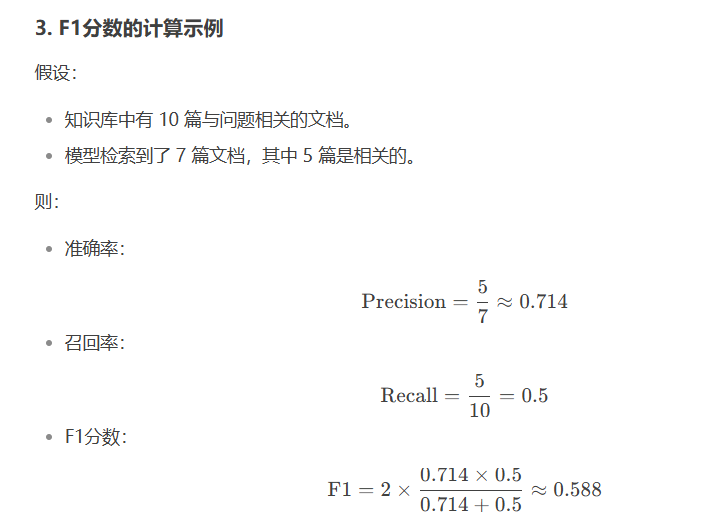
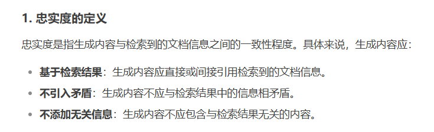
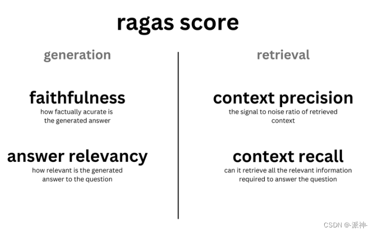
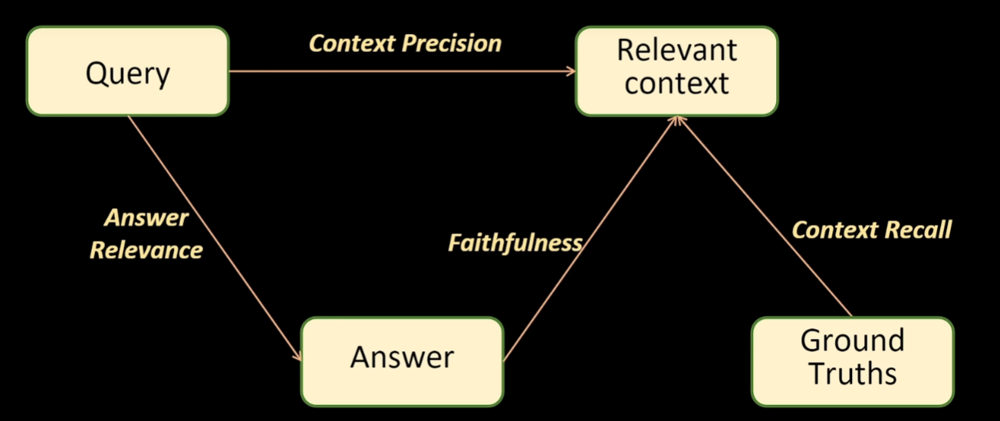
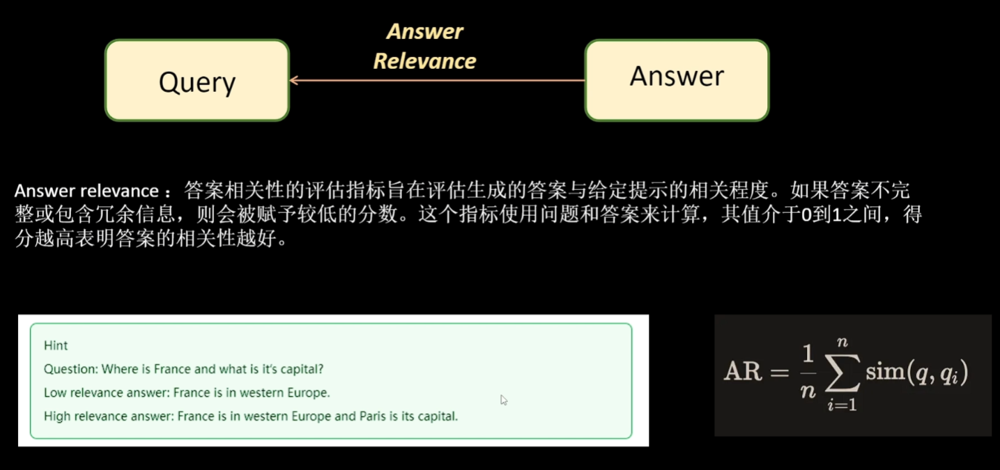
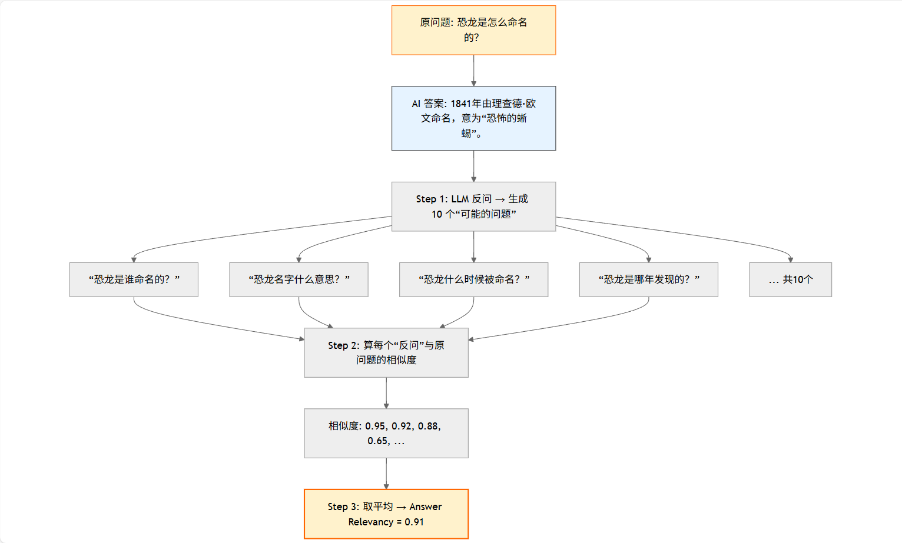
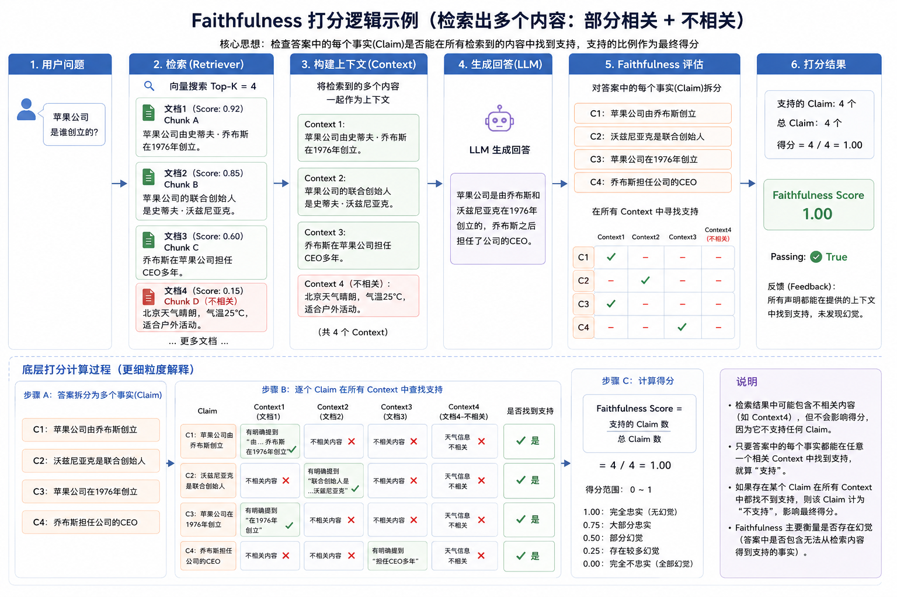
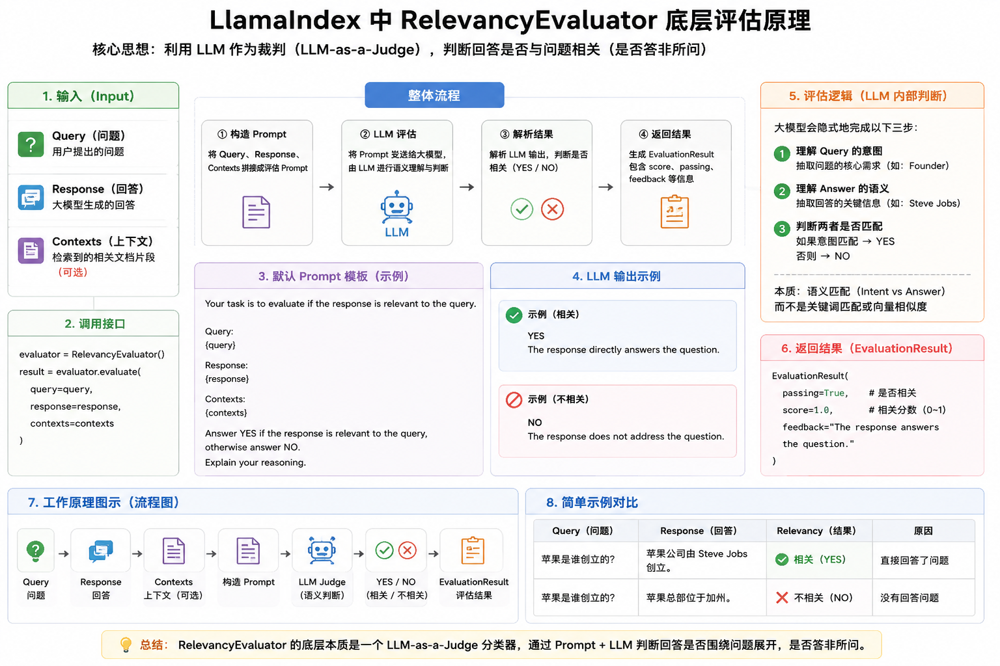
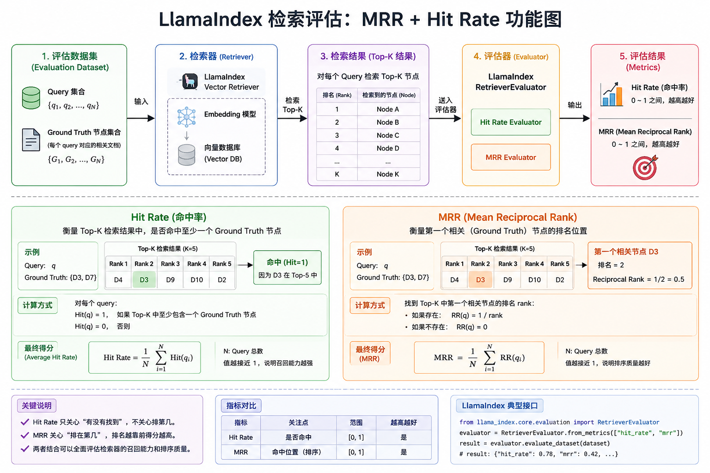

# 06\-RAG评估

## RAG评估和应用平台

**学习目标:**

1. 熟悉 RAG评估方式

2. 熟悉 RAG评估工具

3. 熟悉 RAGAS评估方法

4. 熟悉 llamaindex评估体系

### 一\. RAG评估

- RAG评估是对基于检索增强生成模型（RAG）的性能进行评估和全面分析的过程。也就是去判断RAG他的能力怎么样。RAG有检索和生成的两种能力，用于对话系统和问答等任务中。

- RAG评估的的目标是看检索相关文档和生成准确、连贯回答这方面的表现。

- 任何RAG系统的有效性和性能都严重依赖于这两个核心组件：**检索器和生成器**。检索器必须高效地识别和检索最相关的文档，而生成器应该使用检索到的信息生成连贯、相关和准确的响应。在部署之前，对这些组件进行严格评估对于确保RAG模型的最佳性能和可靠性至关重要。

#### 1\. 评估指标

- RAG评估的方式有很多种:

    - 检索评估\(检索到的内容\)

    - 响应评估\(模型响应的内容\)

    - 系统性能评估\(执行的效率\)

    - 鲁棒性评估\(纠错机制\)

    - \.\.\.\.\.\.

- 主要使用的是两种类型的评估

    - 检索评估

        - 精确度

        - 召回率

    - 响应评估

        - 忠诚度

        - 答案相关性

#### 2\. 检索评估

- 检索评估的主要目标是评估上下文相关性，即检索到的文档与用户查询的匹配程度。它确保提供给生成组件的上下文是相关和准确的。

##### 2\.1 精确度

- 精确度衡量了检索到的文档的准确性。它是检索到的相关文档数量与检索到的文档总数之比。定义如下：

- $精确度=\frac{检索到的相关文档数量}{检索到的文档总数}$

- 这意味着精确度评估了系统检索到的文档中有多少实际与用户查询相关。例如，如果检索器检索到了10个文档，其中7个是相关的，那么精确度将是0\.7或70%。

> 精确度评估的是“系统检索到的所有文档中，有多少实际上是相关的？

- 在可能导致负面后果的情况下，精确度尤为重要。例如，在医学信息检索系统中，高精确度至关重要，因为提供不相关的医学文档可能导致错误信息和潜在的有害结果。

##### 2\.2 召回率

- 召回率衡量了检索到的文档的覆盖率。它是检索到的相关文档数量与数据库中相关文档的总数之比。定义如下：

- $召回率=\frac{检索到的相关文档数量}{数据库中相关文档的总数}$

> 假设：

- 知识库中有 10 篇与问题相关的文档。

- 模型检索到了 7 篇相关文档。

- Recall=7/10=0\.7

- 这意味着召回率评估了数据库中存在的相关文档有多少被系统成功检索到。

- 召回率评估的是“数据库中存在的所有相关文档中，系统成功检索到了多少”

- 在可能错过相关信息会产生成本的情况下，召回率至关重要。例如，在法律信息检索系统中，高召回率至关重要，因为未能检索到相关的法律文件可能导致不完整的案例研究，并可能影响法律诉讼的结果。

##### 2\.3 F1分数

- F1分数用来平衡精确度和召回率，目标是找到适合特定应用需求的最佳平衡。F1分数是精确度和召回率的调和平均值：

$F1分数=2\frac{准确率 \times 召回率}{准确率 + 召回率}$



- 合理区间

|**F1 范围**|**性能评价**|**适用阶段**|**典型场景**|
|---|---|---|---|
|\<0\.5|需重大优化|模型原型/POC 阶段|初步实验、基线测试|
|0\.5\-0\.7|基本可用|内部测试/非关键场景|内部工具、非核心功能|
|0\.7\-0\.85|良好性能|准生产环境|电商推荐、客服问答|
|0\.85\-0\.93|优秀性能|生产环境关键系统|金融风控、医疗辅助诊断|
|\>0\.93|接近理论上限|高精度要求场景|工业质检、法律条款匹配|

> F1 分数的合适值**没有绝对标准**，完全取决于**业务场景需求**、**数据特性**和**错误容忍度**。

#### 3\. 响应评估

- 响应评估适用于系统的生成组件。这些评估衡量系统根据检索到的文档提供的上下文有效地生成响应的能力。我们将响应评估分为两种类型：

    - 忠实度



- 答案相关性


### 二\. 评估方法

#### 1\. 人工评估

- 人工评估是RAG评估的基础方法，通过邀请专家或人工评估员对RAG生成的结果进行质量评估。评估标准通常包括准确性、连贯性、相关性等。尽管人工评估能够提供高质量的反馈，但这种方法耗时费力，且受限于评估员的主观性和经验差异。

#### 2\. 自动化评估

- 自动化评估是当前RAG评估的主流和发展方向。通过利用大型语言模型和相关算法，自动化评估工具能够实现对RAG生成文本的质量评分，从而快速评估模型性能。这种方法不仅提高了评估效率，还降低了人力成本。

### 三\. 常用的评估工具介绍

- 目前开源社区已经出现了专业的工具，用户可以使用它们来方便快速进行定量评估。下面我们介绍目前比较常见好用的 RAG 评估工具，以及它们的一些特点。

#### 1\. Ragas

##### 1\. 简介

- RAGAs是一个用于评测检索增强生成（RAG）应用的评测框架，它的核心目标是提供一套综合性的评测指标和方法，以量化地评测RAG管道\(RAG Pipeline\)在不同组件层面上的性能。RAGAs特别适用于那些结合了检索（Retrieval）和生成（Generation）两个主要组件的RAG系统，支持Langchain 和 Llama\-Index。

- 开源链接：https://github\.com/explodinggradients/ragas

- 论文: https://arxiv\.org/pdf/2309\.15217

- 为了评估 RAG 系统，RAGAs 需要以下信息:

- question：用户输入的问题。

- answer：从 RAG 系统生成的答案\(由LLM给出\)。

- contexts：根据用户的问题从外部知识源检索的上下文即与问题相关的文档。

- ground\_truths： 人类提供的基于问题的真实\(正确\)答案。 这是唯一的需要人类提供的信息。



##### 2\. 评估指标

- **四个评估指标** :

    - 评估检索质量：

        - context\_precision（上下文相关性, 问题和检索内容的相关性）

        - context\_recall（召回性，越高表示检索出来的内容与正确答案越相关）

    - 评估生成质量：

        - faithfulness（忠实性，越高表示答案的生成使用了越多的参考文档（检索出来的内容））

        - answer\_relevancy（答案的相关性）



###### 2\.1 faithfulness


- 计算方式

- $\text{Faithfulness} = \frac{\text{被上下文支持的声明数}}{\text{答案中的总声明数}}$

- 举例


- 实际效果

    - 把答案「拆成一条条小句子」→ 逐条去检索结果（contexts）里找 → 看每条是不是“原样出现”或“语义支持” → 统计比例

    - Faithfulness = 检查大模型有没有「瞎编」不在检索结果里的内容

- 优化方式:

    - 优化提示词对模型输出的内容进行约束

    - 提高检索top\_k值

###### 2\.2 answer\_relevancy



- 计算方式


- 举例:



- 实际效果:

    - Answer Relevancy = 答案越能「反问」出原问题 → 分数越高

- 优化方式:

    - 预索引\(问题拓展\)

###### 2\.3 context\_precision


- 举例


- 实际效果

    - 评估对象：检索到的context与\*\*问题\(Question\)\*\*的相关性

    - 判断标准：LLM判断每个context能否帮助回答问题

    - 计算目标：衡量检索器是否把能回答问题的context排在前面

    - 分数含义： 分数高 = 相关内容排序靠前 ✅ 分数低 = 相关内容排序靠后 ❌

- 优化方向:

    - 使用重排模型进行重新排序

    - 混合检索

    - Query 改写与扩展

    - 优化 Embedding 模型

###### 2\.4 context\_recall


- 举例


- 实际效果

    - 需要 Ground Truth: Context Recall 必须有参考答案才能计算

    - 评估召回能力: 衡量检索系统是否找到了所有必要信息 LLM 

    - 作为判断器: 使用 LLM 判断陈述是否被支持

    - 原子化分解: Ground Truth 需要分解为独立的事实陈述

    - 取值范围: 0\-1，越接近 1 表示召回越完整

- 优化方向

    - 增加 Top\-K \+ Reranker

    - 混合检索

    - Query 改写与分解

    - Parent Document Retriever

#### 2\. Trulens

- TruLens是一款旨在评估和改进 LLM 应用的软件工具，它相对独立，可以集成 LangChain 或 LlamaIndex 等 LLM 开发框架。它使用反馈功能来客观地衡量 LLM 应用的质量和效果。这包括分析相关性、适用性和有害性等方面。TruLens 提供程序化反馈，支持 LLM 应用的快速迭代，这比人工反馈更快速、更可扩展。

- 开源链接：[https://github\.com/truera/trulens](https://github.com/truera/trulens)


使用的步骤：

（1）创建LLM应用

（2）将LLM应用与TruLens连接，记录日志并上传

（3）添加 feedback functions到日志中，并评估LLM应用的质量

（4）在TruLens的看板中可视化查看日志、评估结果等

（5）迭代和优化LLM应用，选择最优的版本

**三个评估指标**

- 上下文相关性（context relevance）：衡量用户提问与查询到的参考上下文之间的相关性

- 忠实性（groundedness ）：衡量大模型生成的回复有多少是来自于参考上下文中的内容

- 答案相关性（answer relevance）：衡量用户提问与大模型回复之间的相关性


### 四\. 评估案例

#### 4\.1 模块安装

```Plaintext
pip install ragas==0.3
```

#### 4\.2 完整代码

```Plaintext
from llama_index.core import SimpleDirectoryReader, VectorStoreIndex
from base_llm import llm, embed_model


documents = SimpleDirectoryReader(
    input_files=['../data_file/deepseek介绍.txt']  # 可选：限制文件类型
).load_data()

print(f"加载了 {len(documents)} 个文档")

# 构建向量索引（会自动 chunk + embedding）
index = VectorStoreIndex.from_documents(
    documents,
    embed_model=embed_model
)


# 创建 Query Engine，并使用自定义提示词
query_engine = index.as_query_engine(
    similarity_top_k=5,           # 检索前 5 个最相关片段
    streaming=True,               # 如果想流式输出可设为 True
    llm=llm
)

question = 'deepseek什么时候遭到攻击?'

response = query_engine.query(question)
print("\n回答：")
print(response)

from datasets import Dataset

# 问题
questions = [
  "DeepSeek 公司何时成立？由谁孕育创立？法定代表人是谁？",
  "DeepSeek 2024年12月26日发布了什么模型？生成速度有何提升？",
  "DeepSeek-R1 模型何时发布？后训练阶段用了什么关键技术？",
  "DeepSeek爆火后，英伟达和纳斯达克股价受何影响？",
  "DeepSeek在2025年1月底遭遇了什么安全事件？攻击来源哪里？",
  "截至2025年2月9日，DeepSeek App累计下载量和周活跃用户是多少？",
  "DeepSeek“开源周”何时进行？主要开源了什么？",
  "DeepSeek与哪些汽车企业有深度合作？举出至少3家。",
  "DeepSeek 2025年3月1日披露了什么推理系统信息？理论日利润多少？",
  "有哪些国家/地区限制DeepSeek？主要原因是什么？"
]
# 真实答案
ground_truths = [
  "DeepSeek成立于2023年7月17日，由幻方量化孕育创立，法定代表人为裴湉。",
  "发布了DeepSeek-V3模型。生成速度从V2.5的20 TPS提升至60 TPS（3倍提升）。",
  "2025年1月20日发布。在后训练阶段大规模使用强化学习（RL）技术。",
  "英伟达股价暴跌16.97%，市值蒸发近6000亿美元；纳斯达克大幅下跌。主要因市场担心AI芯片需求下降。",
  "遭受大规模恶意网络攻击。攻击IP主要来自美国，涉及僵尸网络。",
  "累计下载量超1.1亿次，周活跃用户最高近9700万。",
  "2025年2月下旬（2月21日启动，为期五天）。开源DeepGEMM、Flash MLA、DualPipe、DeepEP、3FS等。",
  "吉利汽车、比亚迪、岚图汽车、宝骏汽车、上汽荣威、江汽集团、极狐汽车、长安汽车、理想汽车等。",
  "发布《DeepSeek-V3/R1推理系统概览》，公布优化细节和成本信息。理论日利润346万元人民币（约47.5万美元）。",
  "澳大利亚、美国、意大利、韩国、台湾等。主要原因是数据隐私、国家安全、芯片来源担忧。"
]
# 模型回答
answers = []
# 文档内容
contexts = []

# 把检索到的内容和回答的问题进行存储
for query in questions:
    answers.append(str(query_engine.query(query)))
    contexts.append([node.text for node in index.as_retriever().retrieve(query)])
print("question", questions)
print("answer", answers)
print("contexts", contexts)
print("ground_truth", ground_truths)
# 转换成字典
data_samples = {
    "question": questions,
    "answer": answers,
    "contexts": contexts,
    "ground_truth": ground_truths
}

# 字典转换为Dataset对象，便于高效处理数据并适配模型训练、评估等任务。
dataset = Dataset.from_dict(data_samples)

from ragas import evaluate
from ragas.integrations.llama_index import LlamaIndexEmbeddingsWrapper, LlamaIndexLLMWrapper
from ragas.metrics import (
    faithfulness,
    answer_relevancy,
    context_recall,
    context_precision,

)

ragas_llm = LlamaIndexLLMWrapper(llm)
ragas_embeddings = LlamaIndexEmbeddingsWrapper(embed_model)

# 进行评估
result = evaluate(
    dataset,
    metrics=[
        context_precision,
        context_recall,
        faithfulness,
        answer_relevancy,
    ],
    llm=ragas_llm,
    embeddings=ragas_embeddings
)
df = result.to_pandas()
print(df)
df.to_csv('ragas_reval.csv', index=True)
```

### 五\. llamaindex评估体系

#### 1\. 简介

- LlamaIndex 的 RAG 评估（Evaluation）模块 是框架内置的核心功能之一，专为 RAG（Retrieval\-Augmented Generation）系统设计，用于量化、诊断和优化 RAG 应用的性能。

#### 2\. 评估指标

|评估方法|核心问题|评估对象|主要作用|是否需要参考答案|
|---|---|---|---|---|
|`FaithfulnessEvaluator(忠诚度)`|回答是否有上下文依据|生成答案 \+ 检索上下文|检测幻觉|否|
|`RelevancyEvaluator(相关性)`|回答是否切题|用户问题 \+ 生成答案 \+ 检索上下文|判断答非所问|否|
|`RetrieverEvaluator`|是否找回相关文档|Query \+ 检索结果 \+ 标注文档|评估召回、命中和排序|是|

- `FaithfulnessEvaluator`：答案中的关键结论，是否能在检索上下文中找到依据。

- `RelevancyEvaluator`：答案是否围绕用户问题展开，是否答非所问。

- `RetrieverEvaluator`：检索器是否把正确、相关的文档找回来，并排在较靠前的位置。

##### 1\. Faithfulness



##### 2\. Relevancy



##### 3\. Retriever评估



#### 3\. 响应评估

**实现代码:**

```Plaintext
import asyncio
import csv
from pathlib import Path
from llama_index.core.evaluation import FaithfulnessEvaluator, RelevancyEvaluator, BatchEvalRunner
from llama_index.core import VectorStoreIndex, SimpleDirectoryReader
from base_llm import llm, embed_model
from llama_index.core.prompts import PromptTemplate


async def main():


    # 准备索引
    print("正在构建索引...")
    documents = SimpleDirectoryReader(input_files=["../data_file/小说.txt"]).load_data()
    index = VectorStoreIndex.from_documents(documents, embed_model=embed_model)

    unknown_answer = "无法从上下文得出该答案"


    faithfulness_eval_template = PromptTemplate(f'''请判断“回答”是否忠实于“上下文”。
        你只能回答 YES 或 NO。
        
        判断规则：
        1. 如果回答是“{unknown_answer}”，表示模型拒绝使用上下文外信息，应回答 YES。
        2. 如果回答包含具体事实、人物、地点、时间、数量、关系等信息，必须能被上下文直接支持，才能回答 YES。
        3. 如果回答包含上下文没有支持的信息、猜测或外部知识，应回答 NO。
        
        回答：{{query_str}}
        上下文：{{context_str}}
        结论：''')

    query_engine = index.as_query_engine(llm=llm)

    # 初始化评估器
    # 建议：评估模型可以选比生成模型更强的（如 GPT-4），结果更客观
    faith_evaluator = FaithfulnessEvaluator(llm=llm, eval_template=faithfulness_eval_template)
    rel_evaluator = RelevancyEvaluator(llm=llm)


    # 批量查询与评估
    queries = [
        "萧炎的爸爸是谁？",  # 基础题（预期：1.0）
        "萧炎最喜欢的现代流行歌手是谁？",  # 跨时空无关（预期：Faithfulness 应该为 1.0，但回答应为“不知道”）
        "萧炎在第一章里一共喝了几杯咖啡？",  # 逻辑陷阱（玄幻小说没咖啡，看它是否产生幻觉）
        "作者天蚕土豆的家庭住址在哪里？",  # 外部元数据（文档里没写作者隐私，看它是否拒绝）
        "萧炎用什么牌子的智能手机和药老联系？"  # 严重干扰项
    ]

    print(f"\n开始批量执行 {len(queries)} 组评估...")

    # 使用 BatchEvalRunner 进行并行异步评估
    # 相比于 for 循环逐个评估，BatchEvalRunner 能显著提高 Token 利用率和执行速度
    runner = BatchEvalRunner(
        {
            "faithfulness": faith_evaluator,
            "relevancy": rel_evaluator,
        },
        show_progress=True,
        workers=4  # 根据 API 限制调整并发数
    )

    # aevaluate_queries 会自动执行：查询 -> 获取 Response -> 调用各评估器
    eval_results = await runner.aevaluate_queries(
        query_engine,
        queries=queries
    )

    #  格式化结果输出
    print("\n" + "=" * 50)
    print("评估报告汇总")
    print("=" * 50)

    csv_path = Path("响应评估结果.csv")
    rows = []

    for index, query in enumerate(queries):
        print(f"查询问题: {query}")

        # 提取各个维度的结果
        f_res = eval_results["faithfulness"][index]
        r_res = eval_results["relevancy"][index]
        response = f_res.response or r_res.response or ""

        print("RAG最终的回复：", response)

        # 打印详细打分
        print(f"  [忠实度 Faithfulness]: {'通过' if f_res.passing else '❌ 失败'} (得分: {f_res.score:.2f})")
        print(f"  [相关性 Relevancy   ]: {'通过' if r_res.passing else '❌ 失败'} (得分: {r_res.score:.2f})")

        rows.append({
            "查询问题": query,
            "RAG最终回复": response,
            "忠实度是否通过": "通过" if f_res.passing else "失败",
            "忠实度得分": f_res.score,
            "忠实度反馈": f_res.feedback,
            "相关性是否通过": "通过" if r_res.passing else "失败",
            "相关性得分": r_res.score,
            "相关性反馈": r_res.feedback,
        })

    print("\n" + "=" * 50)

    with csv_path.open("w", newline="", encoding="utf-8-sig") as csv_file:
        writer = csv.DictWriter(csv_file, fieldnames=rows[0].keys())
        writer.writeheader()
        writer.writerows(rows)

    print(f"评估结果已写入：{csv_path.resolve()}")


if __name__ == "__main__":
    asyncio.run(main())
```

#### 4\. 检索评估

**实现代码:**

```Plaintext
import asyncio
import pandas as pd
import random
from pathlib import Path
from llama_index.core import VectorStoreIndex, SimpleDirectoryReader
from llama_index.core.node_parser import SentenceSplitter
from llama_index.core.evaluation import (
    RetrieverEvaluator,
    generate_question_context_pairs
)
from base_llm import llm, embed_model

# --- 配置区 ---
DATA_PATH = "../data_file/小说.txt"
SAVE_PATH = "小说_eval_dataset.json"
CSV_PATH = "检索评估结果.csv"
SAMPLE_NODE_COUNT = 10  # 抽样节点数，设为 None 则处理全量
TOP_K = 5  # 固定展示前 5 条检索结果


async def main():
    # 2. 加载与解析文档
    print("加载文档中...")
    documents = SimpleDirectoryReader(input_files=[DATA_PATH]).load_data()
    splitter = SentenceSplitter(chunk_size=1024, chunk_overlap=50)
    nodes = splitter.get_nodes_from_documents(documents)

    # 抽样逻辑：节点太多是导致生成变慢的根本原因
    eval_nodes = random.sample(nodes, SAMPLE_NODE_COUNT)

    # 3. 自动化数据集处理
    print(f"开始生成评估数据集（节点数: {len(eval_nodes)}）...")
    # 优化提示词，确保生成质量
    qa_generate_prompt_tmpl = """
        你是检索评估数据集生成器。请只根据给定上下文生成 {num_questions_per_chunk} 个中文问题。
            严格要求：
            1. 每行只写一个问题。
            2. 不要写“根据上下文”“以下是问题”“生成的问题是”等前缀。
            3. 不要编号、不要解释、不要输出答案。
            4. 问题必须包含上下文中的具体人物、事件、地点、数字或概念，避免生成泛泛的问题。
            5. 问题必须能直接从上下文中找到答案。
            
            上下文：
            {context_str}
            
            问题：
        """

    qa_dataset = generate_question_context_pairs(
        eval_nodes,
        llm=llm,
        num_questions_per_chunk=1,  # 速度优先，每个块生成一个问题
        qa_generate_prompt_tmpl=qa_generate_prompt_tmpl
    )
    qa_dataset.save_json(SAVE_PATH)
    print(f"数据集已保存至 {SAVE_PATH}")

    # 4. 构建索引（仅需一次）
    index = VectorStoreIndex(nodes, embed_model=embed_model)

    # 5. 评估 Top-5 检索结果
    metrics = ["hit_rate", "mrr"]
    print(f"开始异步评估检索器 (Top-{TOP_K})...")

    retriever = index.as_retriever(similarity_top_k=TOP_K)
    evaluator = RetrieverEvaluator.from_metric_names(metrics, retriever=retriever)
    eval_results = await evaluator.aevaluate_dataset(qa_dataset)

    # 6. 将每个问题的 Top-5 检索结果横向展开到同一行
    rows = []
    for eval_result in eval_results:
        retrieved_nodes = await retriever.aretrieve(eval_result.query)
        expected_ids = set(eval_result.expected_ids)
        row = {
            "问题": eval_result.query,
            "期望节点ID": "\n".join(eval_result.expected_ids),
            "hit_rate": eval_result.metric_vals_dict.get("hit_rate"),
            "mrr": eval_result.metric_vals_dict.get("mrr"),
        }

        for rank, node_with_score in enumerate(retrieved_nodes, start=1):
            node = node_with_score.node
            node_id = node.node_id
            row[f"检索{rank}节点ID"] = node_id
            row[f"检索{rank}是否命中"] = "是" if node_id in expected_ids else "否"
            row[f"检索{rank}得分"] = node_with_score.score
            row[f"检索{rank}内容"] = node.get_content()

        rows.append(row)

    pd.DataFrame(rows).to_csv(CSV_PATH, index=False, encoding="utf-8-sig")

    print("\n" + "=" * 50)
    print("Top-5 检索评估结果")
    print(f"结果已保存至：{Path(CSV_PATH).resolve()}")


if __name__ == '__main__':
    asyncio.run(main())
```

### 六\. 优化方式

|评估维度|定义|优化目标|关键技术方案|
|---|---|---|---|
|**精确度** \(Context Precision\)|检索结果与问题的相关比例|提升TOP\-K结果的精准性|1\. 混合检索策略（向量\+关键词\+图）<br>2\. 嵌入模型微调（领域适配）<br>3\. 重排序模型|
|**召回率** \(Context Recall\)|关键信息是否被完整检索|覆盖核心证据文档|1\. 多粒度分块（父子索引）<br>2\. 多条检索|
|**忠诚度** \(Faithfulness\)|生成答案与检索内容一致性|消除幻觉/矛盾|1\. 尽量避免噪声数据<br>2\. 模型调试<br>3\. 提示词合理|
|**答案相关性** \(Answer Relevance\)|回答与问题匹配度|提升语义匹配完整性|1\. 指令微调<br>2\. 拒绝回答机制<br>3\. 偏好优化|

