# 07\-RAG应用平台 

## RAG评估和应用平台

**学习目标:**

1. 熟悉 RAG应用平台

2. 熟悉 平台应用差别

3. 熟悉 dify操作使用

### 一\. RAG应用平台

- 工作流平台的核心作用是**通过自动化、标准化和可视化手段，简化复杂任务的编排与管理**，从而提升效率、降低协作成本，并确保流程的可控性,对比四个知名平台：Dify、FastGPT、RagFlow和QAnything，以帮助用户理解它们的功能、优势和适用场景。

- 优缺点:

|**维度**|**RAG开发**|**RAG工作流平台**|
|---|---|---|
|开发速度|❌ 慢（需全链路实现）|✅ 快（开箱即用）|
|定制化能力|✅ 高（完全自主控制）|❌ 低（受限于平台功能）|
|工程复杂度|❌ 高（需处理部署、监控等）|✅ 低（平台自动化管理）|
|维护成本|❌ 高（需持续优化底层）|✅ 低（平台负责升级）|
|**性能调优能力**|✅ 强（可针对硬件/场景深度优化）|❌ 弱（受限于平台默认配置）|
|**数据隐私控制**|✅ 完全自主（本地化部署，无数据外流）|❌ 受限（依赖平台数据托管策略）|
|适用场景|超大规模、高定制化需求（如企业级知识库）|中小规模、快速验证需求（如MVP或PoC）|

#### 1\. QAnything

- QAnything\(Question 和 Answer based on Anything）是网易一个开源的本地知识库RAG问答系统，支持用户上传多种格式的文档，以构建知识库，并采用**两阶段检索**机制及**混合检索**技术，提升检索效率和准确性。

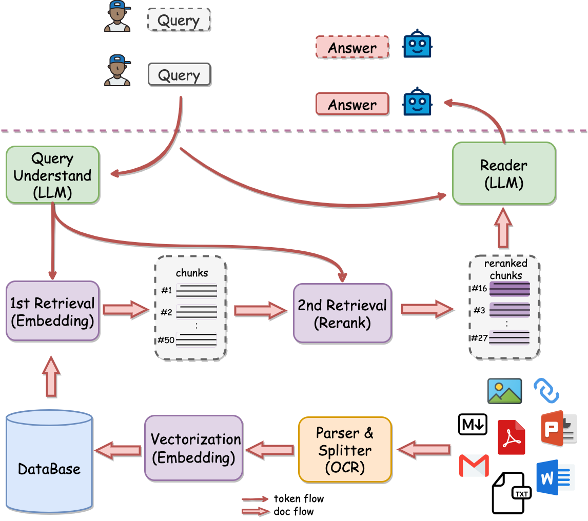

- 与常规的 RAG 流程图相比，明显更加突出了 `Rerank` 环节，将 `Rerank` 作为 `2nd Retrieval` 进行强调，看起来这是有道对 RAG 的独到理解。

- 另外 [QAnything 官方文档](https://github.com/netease-youdao/QAnything/tree/master?tab=readme-ov-file#rag-evaluations-in-llamaindexembedding-and-rerank) 中也强调，QAnything 使用的向量检索模型 `bce-embedding-base_v1` 向量排序模型 `bce-reranker-base_v1` 组合才是 SOTA。同样也印证了架构图， `Rerank` 是 QAnything 是相当重要的模块。

- 源码地址：https://github\.com/netease\-youdao/QAnything/

- 官方网址：https://qanything\.ai/

#### 2\. RagFlow

- RAGFlow 是一个基于对文档的深入理解的开源 RAG（检索增强生成）引擎。当与大语言模型集成时，它能凭借引用知识库中各种复杂格式的数据为后盾，为用户提供真实可信，少幻觉的答案。RAGFlow的技术原理涵盖了文档理解、检索增强、生成模型、注意力机制等，特别强调了深度文档理解技术，能够从复杂格式的非结构化数据中提取关键信息。

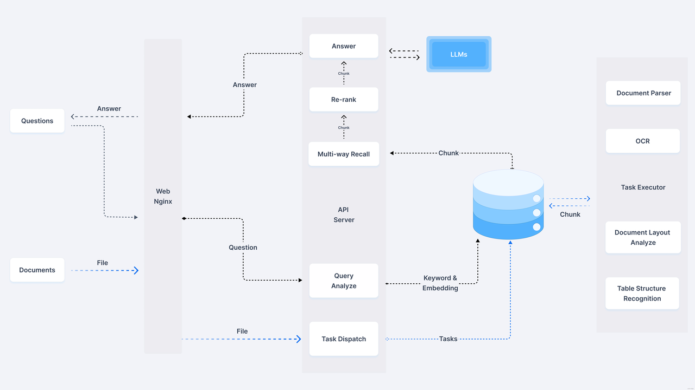

- 可以看到右侧知识库被明显放大，同时最右侧详细介绍了文件解析的各种手段，比如 OCR， Document Layout Analyze 等，这些在常规的 RAG 中可能会作为一个不起眼的 Unstructured Loader 包含进去，可以猜到 RagFlow 的一个核心能力在于文件的解析环节。

- 在 [官方文档](https://github.com/infiniflow/ragflow?tab=readme-ov-file#-key-features) 中也反复强调 Quality in, quality out, 反映出 RAGFlow 的独到之处在于细粒度文档解析。

- 另外 [介绍文章](https://www.aigcopen.com/content/corporate_news/23689.html) 中提到其没有使用任何 RAG 中间件，而是完全重新研发了一套智能文档理解系统，并以此为依托构建 RAG 任务编排体系，也可以理解文档的解析是其 RagFlow 的核心亮点。

- 源码地址：https://github\.com/infiniflow/ragflow

- 官方网址：https://ragflow\.io/

#### 3\. FastGPT

- FastGPT是一款基于LLM（Large Language Model）大语言模型的知识库问答系统。它提供了数据处理、模型调用、RAG（Retriever\-Augmented Generation）检索、可视化AI工作流编排等能力，使用户能够轻松构建复杂的AI应用。FastGPT不仅支持多轮对话，还能处理实时信息和企业内部资料，极大地提高了AI应用的实用性和效率。

- 与常规的 RAG 相比增加了额外工作流编排的能力，这部分类似 Dify。但是相对 Dify 而言可调用的第三方应用更少一些。按照习惯先查看项目的架构图：

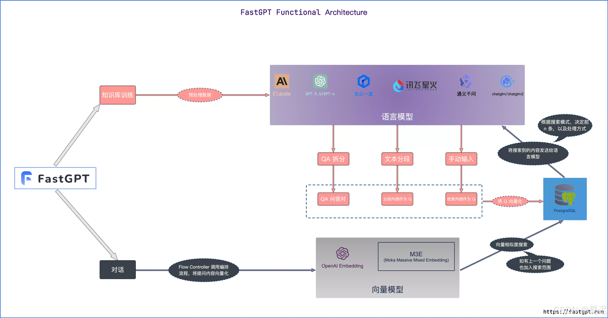

对于常规的 RAG 架构图，这张图可以明显看到大模型模块被放大，而且文件入库的流程都会先调用大模型。从大模型的输出来看，存在 QA 拆分，文本分段和手动输入三种情况：

- 文本分段是常规的 RAG 的处理方案

- QA 拆分看起来是基于原始文本生成问答对，这部分猜测应该是根据大模型生成问答对，之前 Dify 也有类似的功能，被称为 Q\&A 模式

- 手动输入则是直接输入问答对，这部分应该是手工输入数据进行补充

预计文件入库环节的大模型调用主要作用于 QA 拆分。

源码地址：https://github\.com/labring/FastGPT

官方网址：https://tryfastgpt\.ai/

### 二\.Dify使用

#### 1\. 简介

- Dify是一个流行的开源大模型应用开发平台，内置了构建 LLM 应用所需的关键技术栈，包括对数百个模型的支持、直观的 Prompt 编排界面、高质量的 RAG 引擎、稳健的 Agent 框架、灵活的流程编排，并同时提供了一套易用的界面和 API。这为开发者节省了许多重复造轮子的时间，使其可以专注在创新和业务需求上。

- 基于 Dify 可以在不需要太多开发的情况下，快速搭建一个大模型应用。应用中可以调用 Dify 中内置的大量基础能力，比如知识库检索 RAG，大模型调用。通过可插拔式的组合构建大模型应用。一个典型的应用如下所示：


- Dify源码地址：[https://github\.com/langgenius/dify](https://link.zhihu.com/?target=https%3A//github.com/langgenius/dify)

- 中文文档：[https://docs\.dify\.ai/v/zh\-hans](https://link.zhihu.com/?target=https%3A//docs.dify.ai/v/zh-hans)

- 官方地址: https://cloud\.dify\.ai/apps

#### 2\. 界面介绍

- 探索界面: dify提供的模版大家可以参考使用

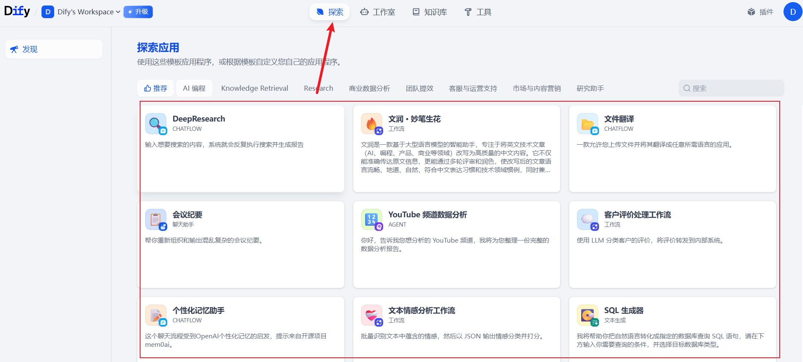

- 工作室: 我们自己创建的任务就在工作室当中

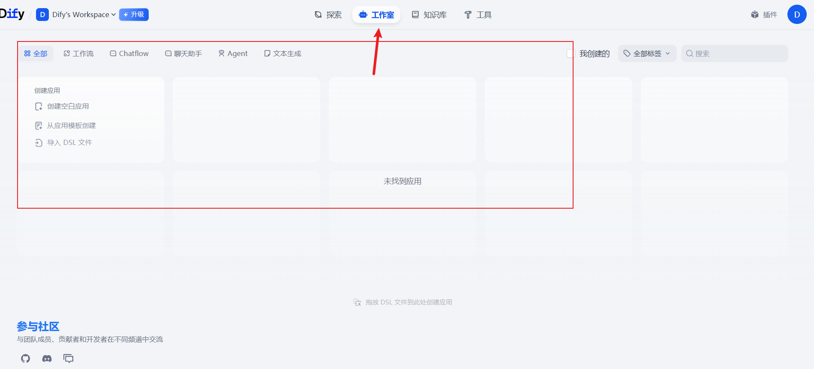

- 知识库: dify处理自己文档的地方

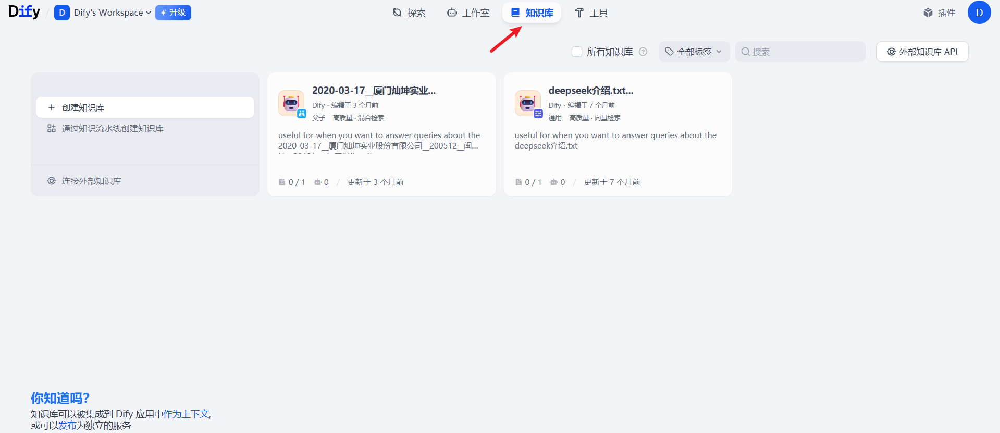

- 工具: 提供agent工具,可以自定义也可以市场下载

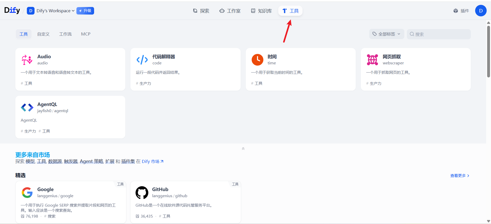

#### 3\. 新手适用

##### 1\. 模型设置

- 安装好对应的模型供应商,配置对应的`apikey`

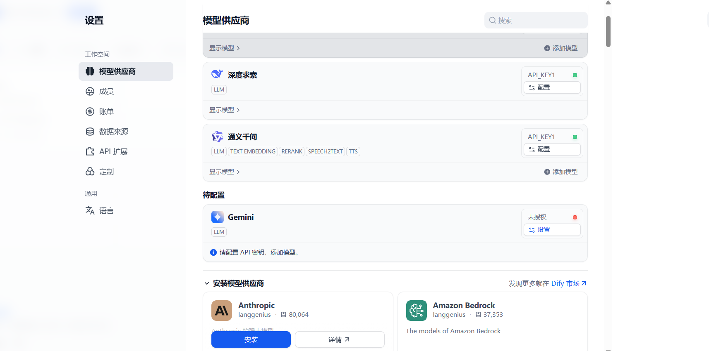

- 配置好之后点击工作室,点击创建空白应用

##### 2\. 聊天助手

- 聊天助手主要是让你快速创建一个可以和用户进行智能自然语言对话的机器人应用，支持多轮对话、上下文理解、知识接入、发布为服务等功能

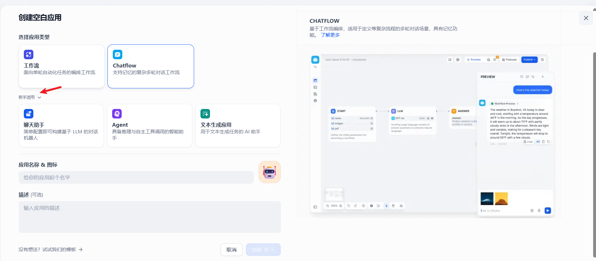

- 页面功能介绍

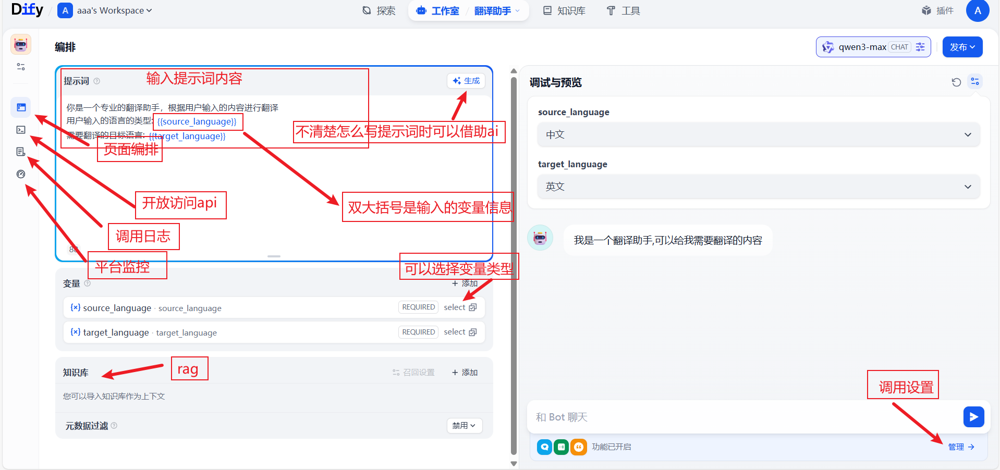

- 单次日志输出

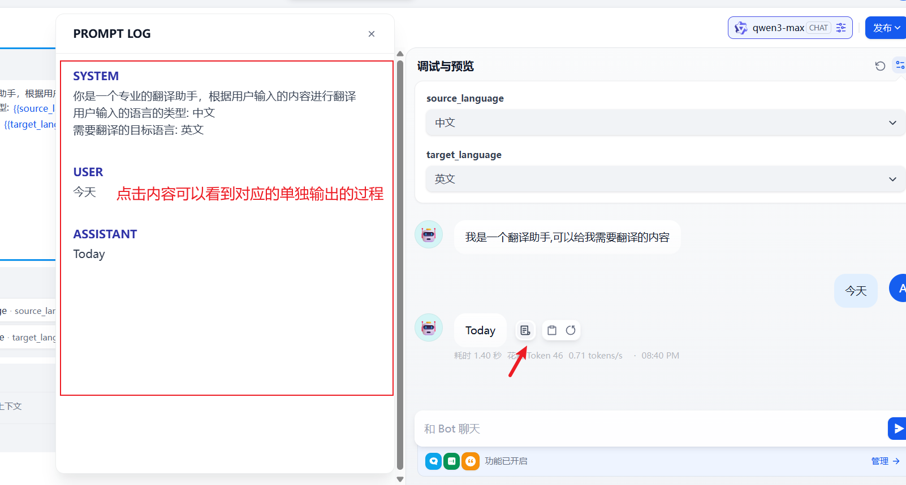

- 翻译提示词

```Plaintext
你是一个专业的翻译助手，根据用户输入的内容进行翻译
用户输入的语言的类型: {{source_language}}
需要翻译的目标语言: {{target_language}}
```

##### 3\. 文本生成

- Dify 的文本生成，本质就是把 AI 变成一个“稳定、可复用、自动化的写作能力模块”。

- 可以被反复执行很多次，但每一次都是“全新的一次”，没有记忆。

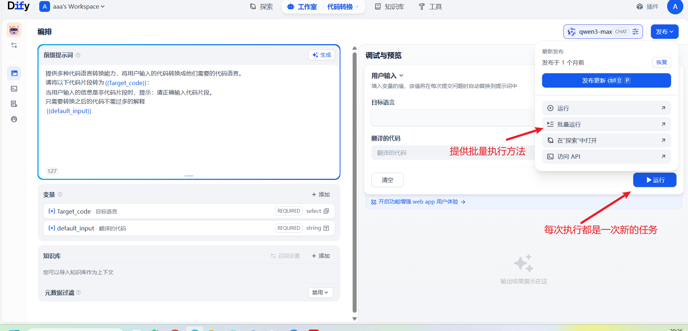

- 运行之后的日志内容会有区别之前是系统提示词,现在是用户提示词

- 提示词

```Plaintext
提供多种代码语言转换能力，将用户输入的代码转换成他们需要的代码语言。
请将以下代码片段转为{{Target_code}}:
当用户输入的信息是非代码片段时，提示：请正确输入代码片段。
只需要转换之后的代码不需过多的解释
{{default_input}}
```

- 如果你使用的是中文的显示名称会有编码冲突的问题可以自己用代码做批量,不使用平台提供的模版

```Plaintext
import csv

with open('input.csv', 'a', encoding='utf-8', newline='') as f:
    aa = csv.writer(f)
    aa.writerow(['目标语言', '翻译的代码'])
    aa.writerow(['java', 'print("hello world")'])
    aa.writerow(['JavaScript', 'print("hello world")'])
```

##### 4\. agent

- 本地工具使用

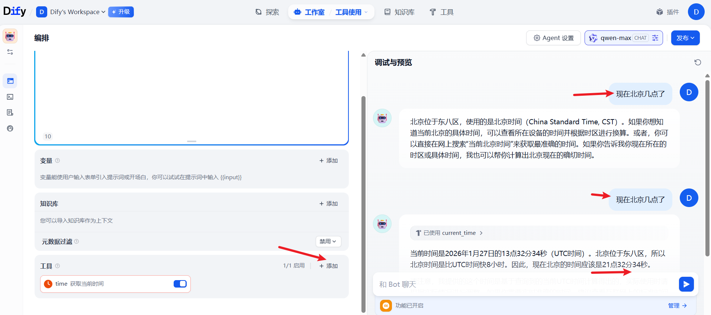

- 通过工具直接调用

- 工具下载

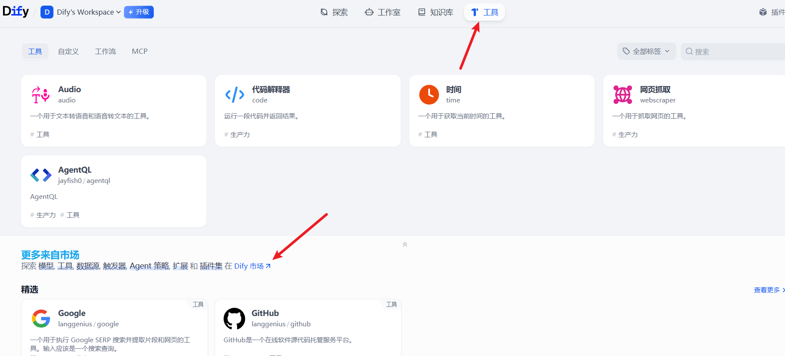


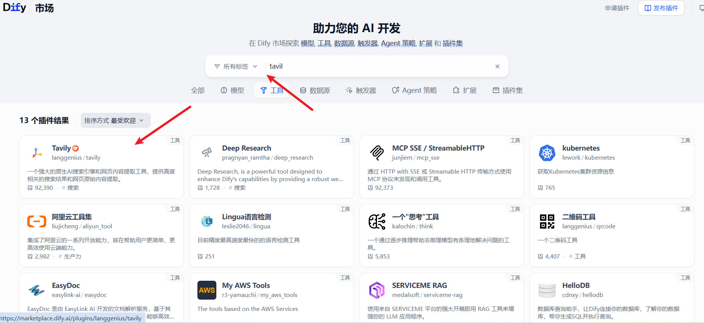

##### 5\. 知识库使用

- 创建空白知识库

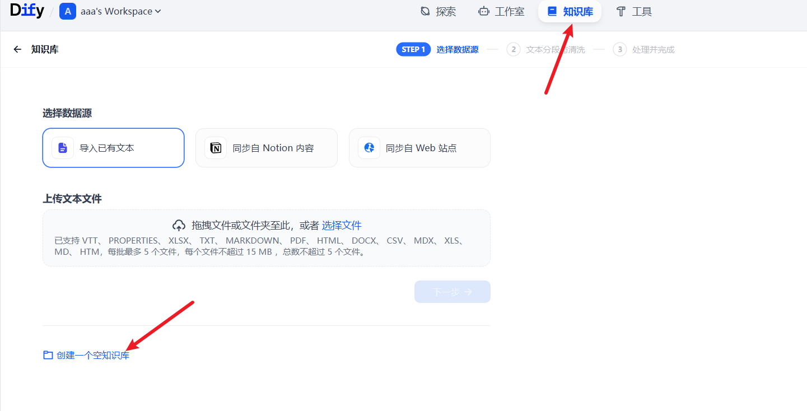

- 可以自己选检索方式,切片规则

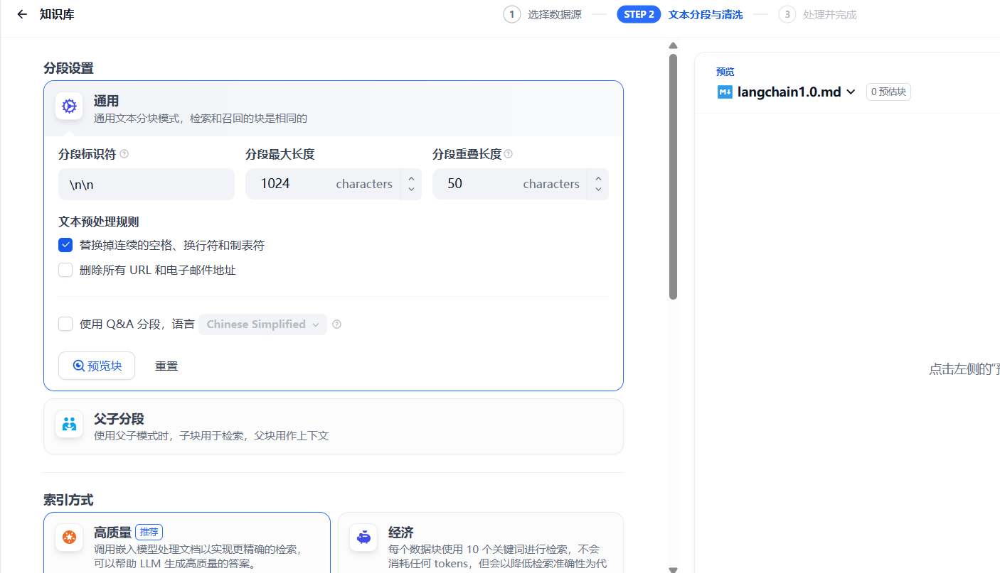

#### 4\. 工作流

- 用户只需要输入,按照固定的流程进行输出,有点类似与售货机\(投币 → 按按钮 → 出货 \)

- 高阶的使用页面可以进行自主编排

- 工作流触发方式有两种,一种是用户自己触发,一个是按照规则触发

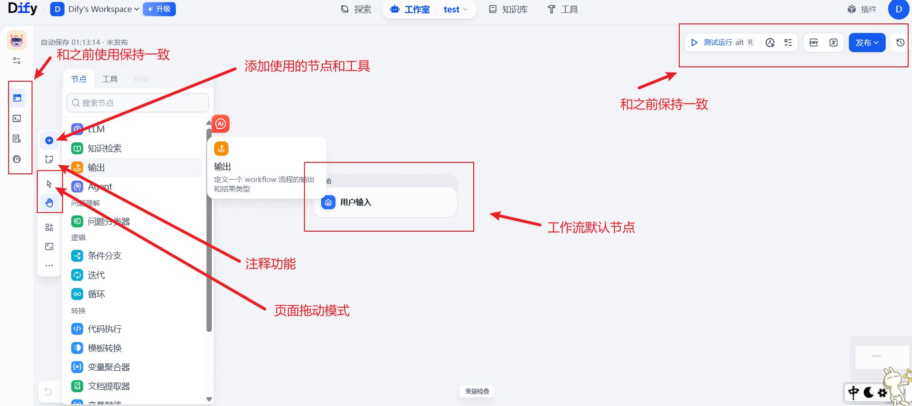

##### 1\. AI热点收集案例

- 流程分析

    - 网址: [AI最新资讯\_人工智能新闻头条\_AI行业动态 \| AIBase](https://news.aibase.com/zh/news)

    - 获取网址内容,让大模型提取"最新AI日报" 当中的链接地址和标题返回列表数据

    - 通过迭代进行循环,在对详情页面发送请求,通过大模型获取需要的内容

    - 输出内容

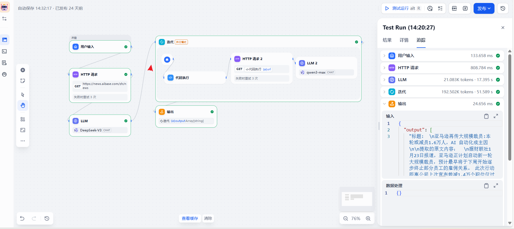

- 发送http请求可以直接抓包复制curl

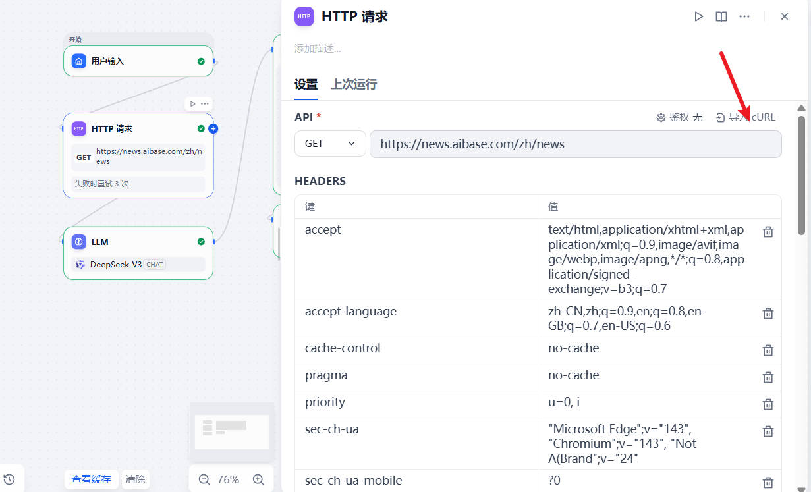

- 大模型提取内容

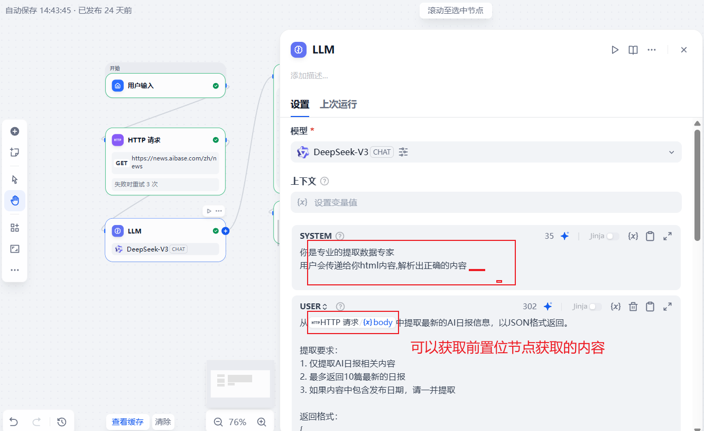

- 提示词内容

- 结构化输出内容

```Plaintext
# 系统提示词
你是专业的提取数据专家
用户会传递给你html内容,解析出正确的内容

# 用户提示词
从{{#1767515008721.body#}}中提取最新的AI日报信息，以JSON格式返回。

提取要求：
1. 仅提取AI日报相关内容
2. 最多返回10篇最新的日报
3. 如果内容中包含发布日期，请一并提取

返回格式：
{
  "ai_reports": [
    {
      "title": "日报标题",
      "url": "详情页面完整URL",
      "date": "发布日期(如有)"
    },
    ...
  ]
}

处理说明：
- 确保URL是完整的，如缺少域名请补全
- 按发布时间从新到旧排序
- 如果原始数据格式有问题，请尝试修复后再提取
```

- 迭代节点

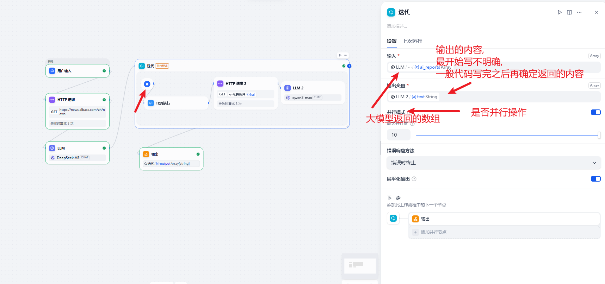

- 代码节点

```Plaintext
def main(arg1):
    return {
        "url":arg1['url'],
        'title':arg1['title'] 
    }
```

- 对详情页面发送请求

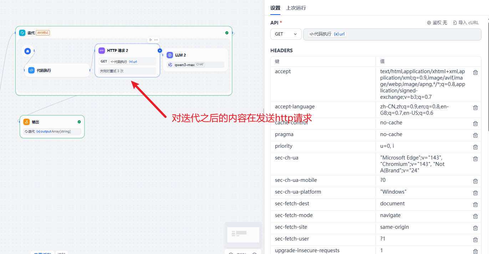

- 通过大模型提取数据内容

```Plaintext
# 系统提示词
作为文档提取与总结专家，请分析用户提供的HTML内容并执行以下任务：

1. 提取关键数据：
   - 标题、作者、发布日期
   - 主要段落内容
   - 列表项和表格数据
   - 嵌入的媒体链接

2. 结构化总结（500-800字）：
   - 核心主题和要点（3-5点）
   - 主要论点和支持证据
   - 数据和统计信息的解释
   - 文档的目的和目标受众

3. 数据可视化建议：
   - 指出哪些数据适合图表展示
   - 建议合适的可视化类型

输出格式：
- 使用清晰的标题和分节符号
- 对关键术语和概念进行加粗标记
- 如有表格数据，使用markdown表格格式呈现
- 在总结末尾提供3-5个关键词标签

如果HTML内容存在特定领域术语或专业知识，请一并解释这些术语。

请确保提取的信息准确反映原始内容，不添加未在文档中出现的信息，并保持原文的核心观点和立场。


# 用户提示词
作为文档提取与总结专家，请执行以下任务：

1. 从提供的HTML数据{{#1767515579213.body#}}中的文章内容。

2. 原文内容不需要标签内容只需要纯文本

3. 对提取的内容生成一个结构化总结（400-600字），包括：
   - 文章的主要主题和目的
   - 3-5个核心观点或要点
   - 重要数据或发现（如适用）
   - 结论或建议（如适用）

4. 如果文章包含专业术语或技术概念，请在总结后提供简短解释。

输出格式：
标题:
{{#1767515529032.title#}}
提取的原文内容
[此处呈现提取的原始内容]

内容总结
[此处呈现您的总结]

关键词
[3-5个代表文章核心内容的关键词]
```

#### 5\. 各个节点使用

##### 1\. llm节点

- 节点文档查询

- 选择模型

- 检索上下文内容

- 提示词

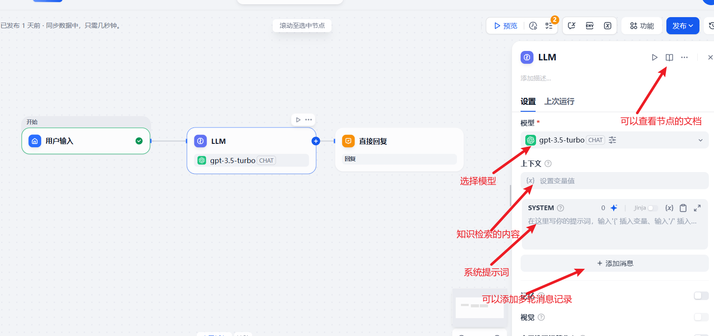

##### 2\. 知识检索

- 检索关键字

- 检索知识库

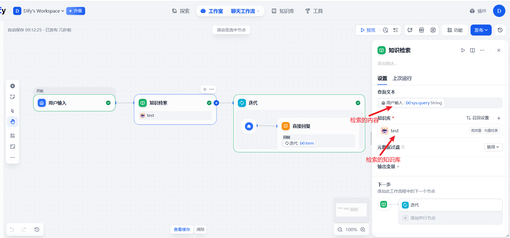

##### 3\. agent

- agent策略: agent调用方法

- 模型: 使用的大模型

- 工具:提供给agent使用的工具

- 指令:系统提示词

- 查询:用户提示词

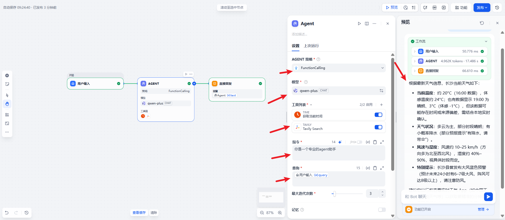

##### 4\. 问题分类器

- 根据用户输入的问题/意图，自动判断它属于哪一类，然后把流程引导到不同的分支去处理

- 分类:你在节点里定义几个类别，每个类别写一段描述/示例

```Plaintext
描述：用户在询问公司产品、功能、使用方法、价格、规则、文档内容、帮助中心相关问题。典型词：怎么用、是什么、价格多少、有没有、支持不支持、教程、手册

描述：用户打招呼、聊天、开玩笑、表达情绪、闲扯、不涉及任何具体业务或知识的问题。典型词：你好、哈哈、好无聊、今天天气、你真可爱
```

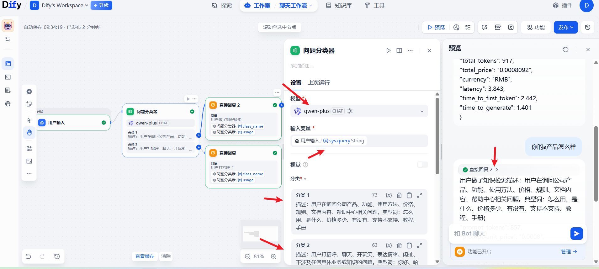

##### 5\. 条件分支

- 它让工作流从“一条直线”变成“多条可选路径”，根据实时变量的值自动决定走哪条路


##### 6\. 人工介入

- 是 Dify 在 v1\.13\.0正式引入的一个的节点

- 提交方式:当前需要人工选择的提交地址

    - webapp: WebApp 界面

    - 邮件:发一封邮件，里面带链接

- 表单内容:

    - 显示给人工看的信息

    - 让人工手动输入的字段

        - ctrl \+ /

    - 用户操作:给出按钮让用户选择,每个选择走不同的逻辑

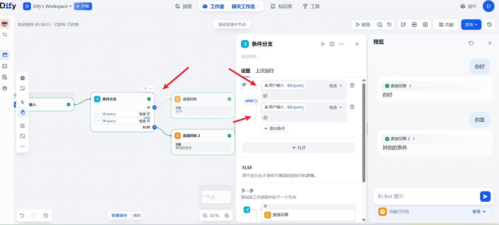

##### 7\. 循环节点\&变量赋值

- 迭代节点：针对按元素个数执行，核心是 “挨个处理”

- 循环节点：针对「条件判断」，按条件是否满足执行，核心是 “重复直到达标”；

- 输入节点

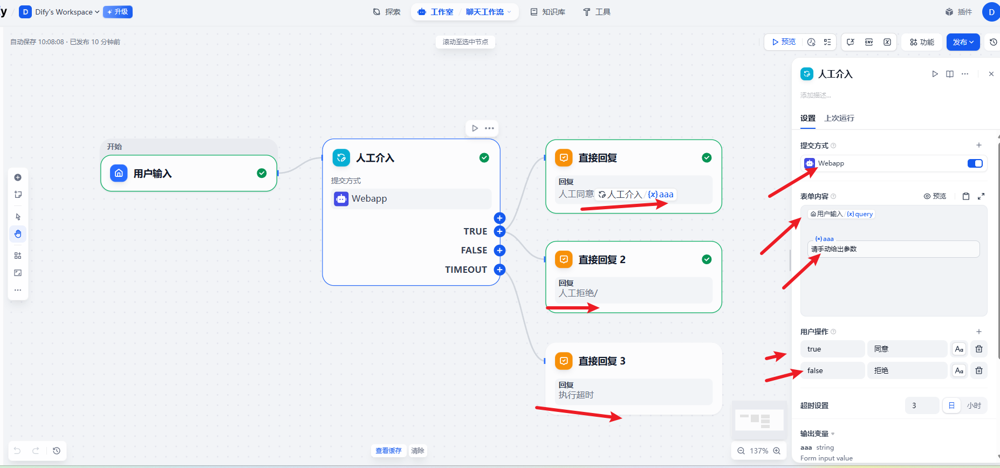

- 循环节点

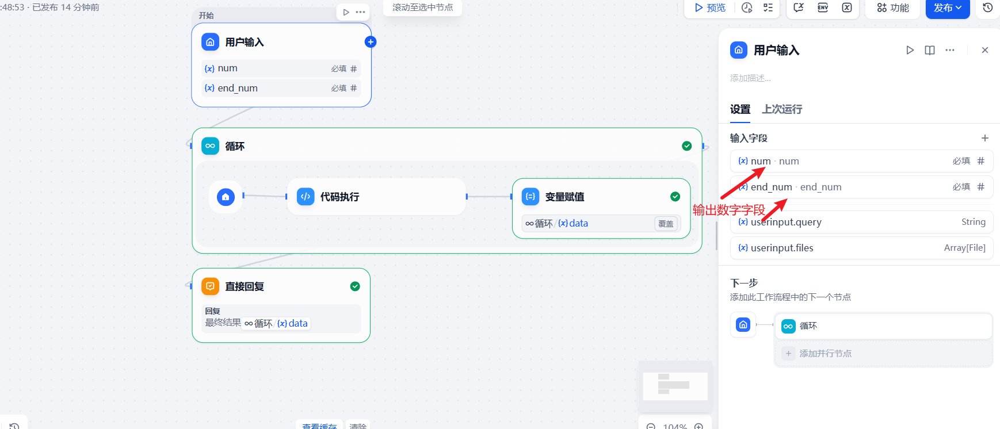

- 代码节点

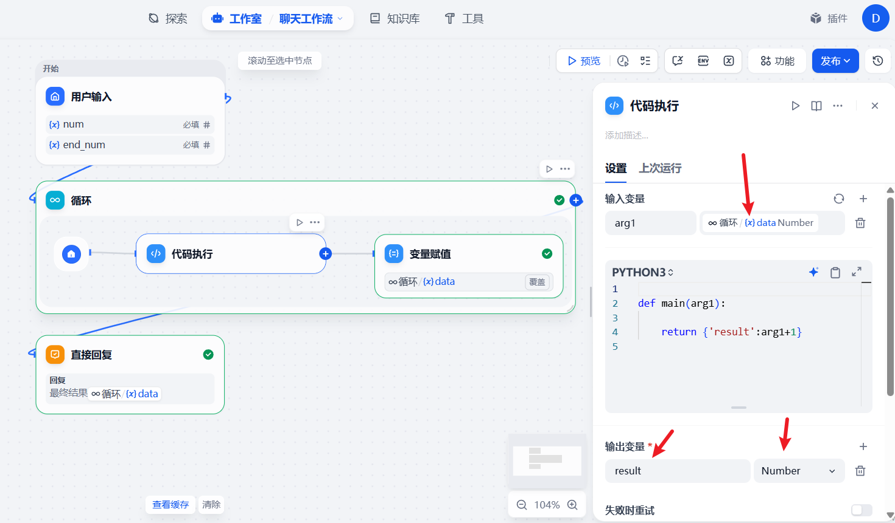

- 变量赋值节点

    - 把参数进行赋值

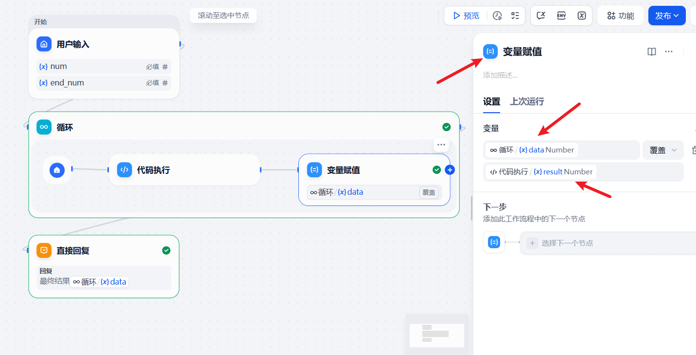

##### 8\. 模版转换

- 用 Jinja2 模板引擎，把上游传过来的各种数据（字符串、列表、JSON 对象、知识检索结果等）按照你定义的格式，灵活地转换成一个新的文本

- 和我们自己写的提示词有点像

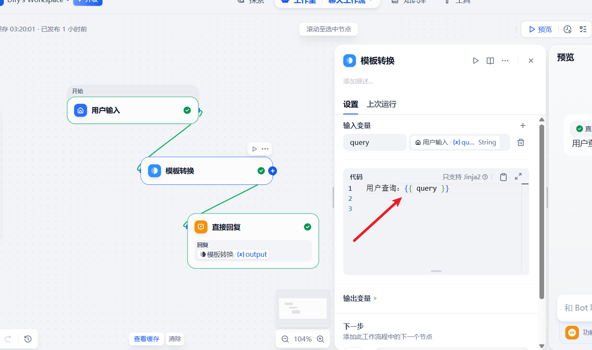

##### 9\. 变量聚合器

- 把多个互斥分支（或并行但最终只走一条路的分支）产生的“同类变量”合并/统一成一个变量

- 没使用集合器

- 每个内容都需要单独回复

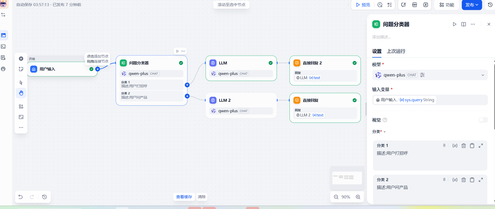

- 使用了聚合器

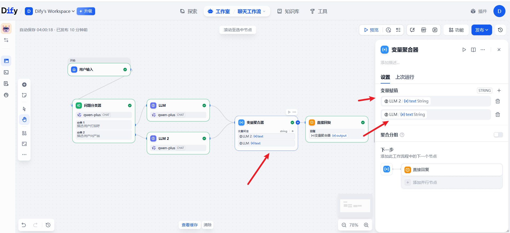

##### 10\. 参数提取器

- 用 LLM 的理解和结构化输出能力，从一段非结构化的文本（用户输入、LLM 回复、邮件内容等）中，按照你定义的字段规则，智能提取出结构化的参数（JSON 格式），直接供下游工具、HTTP 请求、迭代节点等使用

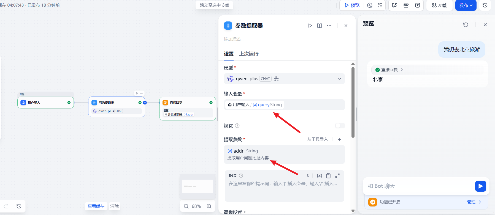

#### 6\. ChatFlow

- 和工作流相对提供了多轮对话功能,实现记忆功能类似柜台客服\(接受用户的问题\-\>给出回答\-\>用户在根据问题提问\)

- 使用方法和工作流一模一样

