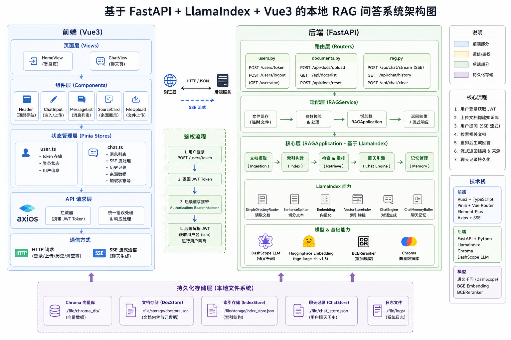

# 08\-RAG项目实战

## 实战项目：RAG 问答项目

**学习目标:**

1. 前端、FastAPI、LlamaIndex 之间协作方式

2. 前端回复流式输出

3. 文档上传读取、切分、向量化和持久化

### 一\. 系统架构

**项目简介:**

这是一个本地运行的 RAG 问答系统。

用户可以登录系统、上传本地文档，并在开启知识库模式后针对文档提问。前端使用 Vue3 构建聊天界面，后端使用 FastAPI 提供接口，LlamaIndex 负责文档摄取、索引、检索、重排、聊天引擎和聊天记忆。

项目当前包含以下能力：

- 用户登录和 JWT 鉴权。

- 文档上传和本地知识库构建。

- 普通聊天。

- 知识库增强聊天。

- 流式输出。

- 检索来源展示。

- 聊天历史恢复和清空。

当前设计原则：

- 聊天生成接口流式接口。

- 前端不传 `session_id`，后端使用 JWT 中的用户名隔离聊天记录。

- 后端使用 LlamaIndex 原生能力。

- 文档、索引和聊天记录持久化到后端 `file/` 目录。

#### 1\. 整体架构



#### 2\. 项目目录结构

```Plaintext
llamaindex-项目/
  llamaindex_project/                        后端项目
    app/
      main.py                                FastAPI 应用入口
      rag_service.py                         HTTP 层到 RAG 核心的适配器
      schemas.py                             请求和响应模型
      routers/
        users.py                             登录、JWT、退出
        documents.py                         文档上传、列表、系统重置
        rag.py                               流式聊天、历史、清空记录
    core/
      application.py                         LlamaIndex 核心实现
    config/
      settings.py                            模型、路径、检索参数配置
    utils/
      logger.py                              日志工具
    file/
      chroma_db/                             Chroma 向量数据
      storage/                               docstore 和 index_store
      chat_store.json                        聊天记录
      logs/                                  日志

  chat-ai-ui-main -llamaindex/
    chat-ai-ui-main/                         前端项目
      src/
        stores/
          user.ts                            登录 token 状态
          chat.ts                            聊天状态和 SSE 处理
        components/
          Header.vue                         顶栏和退出登录
          ChatInput.vue                      输入、上传、参数控制
        views/
          HomeView.vue                       登录页
          ChatView.vue                       聊天页
```

#### 3\. 三条核心数据流

##### 3\.1 文档上传流

```Plaintext
ChatInput.vue
  -> POST /api/docs/upload
  -> documents.py
  -> RAGService 临时保存文件
  -> RAGApplication 摄取文档
  -> SimpleDirectoryReader 读取
  -> SentenceSplitter 切分
  -> Embedding 向量化
  -> Chroma + docstore + index_store 持久化
```

##### 3\.2 流式聊天流

```Plaintext
ChatInput.vue
  -> chat.ts 添加 user 和空 assistant 消息
  -> POST /api/chat/stream
  -> JWT 解析当前用户
  -> RAGApplication 选择 ChatEngine
  -> LlamaIndex astream_chat()
  -> SSE 返回 text / sources / complete
  -> chat.ts 实时更新页面
```

##### 3\.3 聊天记忆流

```Plaintext
JWT.sub 用户名
  -> session_id
  -> ChatMemoryBuffer
  -> SimpleChatStore
  -> file/chat_store.json
  -> /api/chat/history 恢复
```

#### 4\. API 总览

用户接口：

```Plaintext
POST /users/token       登录，返回 JWT
POST /users/logout      退出登录
```

文档接口：

```Plaintext
POST /api/docs/upload   上传文档，字段名必须是 files
GET  /api/docs/list     获取已入库文档列表
POST /api/docs/reset    重置系统内存、检索器和聊天记录
```

聊天接口：

```Plaintext
POST /api/chat/stream   流式聊天
GET  /api/chat/history  获取当前用户历史消息
POST /api/chat/clear    清空当前用户聊天记录
```

#### 5\. 启动方式

##### 5\.1 后端

```Bash
uvicorn.run(
        "main:app",
        host="0.0.0.0",
        port=8000,
        reload=True,
        log_level="info"
    )
```

健康检查：

```Plaintext
GET http://localhost:8000/api/health
```

##### 5\.2 前端

```Bash
cd "项目地址"
npm run dev
```

---

### 二\. 前端核心内容

#### 1\. 前端职责和阅读顺序

前端只负责页面交互和接口调用，不直接执行 RAG 检索或模型推理。

推荐阅读顺序：

1. `src/views/HomeView.vue`：登录页面。

2. `src/stores/user.ts`：token 保存和登录状态。

3. `src/components/ChatInput.vue`：输入、模型参数、知识库开关、上传。

4. `src/stores/chat.ts`：聊天状态、SSE 解析、历史和清空。

5. `src/views/ChatView.vue`：消息、Markdown 和来源展示。

6. `src/components/Header.vue`：顶栏和退出登录。

页面组件负责展示，Pinia store 负责聊天业务和请求逻辑。

#### 2\. 登录和 token 状态

登录接口是：

```Plaintext
POST /users/token
```

登录成功后，后端返回 `access_token` 和用户名，前端保存 token：

```Plaintext
userStore.userId = JWT access_token
```

这里的字段名虽然叫 `userId`，实际保存的是 JWT token。后续请求统一带上：

```HTTP
Authorization: Bearer <token>
```

登录链路：

```Plaintext
HomeView.vue
  -> users/token
  -> userStore 保存 access_token
  -> 跳转 ChatView.vue
```

后端 JWT 的 `sub` 字段保存用户名。后端用这个用户名确定当前用户和聊天会话。

#### 3\. 聊天页面和组件协作

`ChatView.vue` 的职责：

- 检查登录状态。

- 页面挂载时加载聊天历史。

- 展示 user 和 assistant 消息。

- 使用 Markdown 渲染 assistant 内容。

- 展示可折叠的来源信息。

- 监听消息变化并滚动到底部。

`ChatInput.vue` 的职责：

- 读取用户输入。

- 控制模型、温度、最大 token 数。

- 控制 `knowledge_bool` 知识库开关。

- 上传文档。

- 发送消息。

- 清空当前用户聊天记录。

组件通过事件把动作交给 store 或页面：

```Plaintext
<ChatInput
  @send="chatStore.sendMessage"
  @clear-chat="clearChatHistory"
/>
```

#### 4\. 前端发送消息流程

`src/stores/chat.ts` 的消息发送过程：

```Plaintext
用户点击发送
  -> sendMessage()
  -> 添加 user 消息
  -> 预创建空 assistant 消息
  -> isLoading = true
  -> fetch POST /api/chat/stream
  -> 读取 response.body
  -> 解析 SSE 事件
  -> 更新 assistant content / sources
  -> isLoading = false
```

预创建 assistant 消息是流式更新：

```TypeScript
const aiMessageIndex = messages.value.length;
messages.value.push({
  role: 'assistant',
  content: '',
  sources_info_list: [],
});
```

之后每个 token 都追加到 `messages[aiMessageIndex].content`，页面即可实时显示回答。

#### 5\. 前端请求体和模型参数

输入组件维护以下参数：

```TypeScript
const model = ref('qwen-max');
const temperature = ref(0.7);
const maxTokens = ref(2000);
const knowledge_bool = ref(false);
```

发送请求时组成 JSON：

```TypeScript
body: JSON.stringify({
  query: message,
  model,
  temperature,
  max_tokens: maxTokens,
  knowledge_bool,
})
```

其中：

- `knowledge_bool = false`：普通聊天。

- `knowledge_bool = true`：启用知识库检索。

- `temperature`：控制回答随机性。

- `max_tokens`：控制回答长度。

前端上传文档时使用 `FormData`：

```TypeScript
const formData = new FormData();
formData.append('files', file);

await axios.post(
  `${import.meta.env.VITE_API_URL}/api/docs/upload`,
  formData,
  {
    headers: {
      Authorization: `Bearer ${useUserStore().userId}`,
    },
  },
);
```

不要手动设置 `Content-Type`，浏览器会自动补充 multipart boundary。

#### 6\. 前端读取 SSE

SSE 不是一次性 JSON，需要持续读取 `response.body`：

```TypeScript
const reader = response.body.getReader();
const decoder = new TextDecoder();
let buffer = '';

while (true) {
  const { done, value } = await reader.read();
  if (done) break;

  buffer += decoder.decode(value, { stream: true });
  const lines = buffer.split('\n');
  buffer = lines.pop() || '';

  for (const line of lines) {
    const trimmedLine = line.trim();
    if (trimmedLine.startsWith('data: ')) {
      const data = JSON.parse(trimmedLine.slice(6));
      // 根据 data.type 更新消息
    }
  }
}
```

为什么需要 `buffer`：

- 一次网络读取可能只得到半行 JSON。

- 一次网络读取也可能包含多条 SSE 事件。

- 只有完整的一行 `data: ...` 才能安全解析。

因此，处理方式是：追加到 `buffer`，按换行拆分，保留最后一段不完整内容到下一次读取。

#### 7\. 前端处理 text、sources 和 error

后端可能发送以下事件：

```JSON
{"type":"text","finished":false,"content":"部分回答"}
{"type":"sources","finished":false,"content":[]}
{"type":"complete","finished":true,"content":"完整回答"}
{"type":"error","finished":true,"content":"错误信息"}
```

前端处理逻辑：

```TypeScript
let hasStreamError = false;

if (data.type === 'sources') {
  if (Array.isArray(data.content)) {
    messages.value[aiMessageIndex].sources_info_list = data.content;
  }
} else if (data.type === 'text' || data.type === 'content') {
  if (data.content) {
    messages.value[aiMessageIndex].content += data.content;
  }
} else if (data.type === 'error') {
  messages.value[aiMessageIndex].content = data.content || '请求失败';
  hasStreamError = true;
}
```

如果需要立即结束外层读取循环，不能只在内部 `for` 循环中使用 `break`，应通过状态变量或封装函数控制外层 `while`。

来源对象主要包含：

```JSON
{
  "content": "来源节点文本",
  "score": 0.82,
  "metadata": {
    "file_name": "example.md"
  }
}
```

页面展示文件名时可以使用：

```Plaintext
{{ source.metadata?.file_name || '未知文档' }}
```

#### 8\. 历史记录和清空记录

进入聊天页时，前端请求：

```Plaintext
GET /api/chat/history
```

清空聊天时请求：

```TypeScript
await axios.post(
  `${import.meta.env.VITE_API_URL}/api/chat/clear`,
  {},
  {
    headers: {
      Authorization: `Bearer ${userStore.userId}`,
      'Content-Type': 'application/json',
    },
  },
);

messages.value = [];
```

清空动作必须同时完成三件事：

- 清空后端当前用户的内存 memory。

- 删除后端 `SimpleChatStore` 中当前用户的消息。

- 清空前端当前页面的 `messages`。

---

### 三\. 后端核心内容

前端已经明确了请求格式，后端部分再追踪这些请求如何进入 FastAPI、RAGService 和 LlamaIndex。

#### 1\. 后端分层和入口

```Plaintext
HTTP 入口层       app/main.py
路由层            app/routers/*.py
适配层            app/rag_service.py
核心业务层        core/application.py
配置层            config/settings.py
持久化层          file/
```

`app/main.py` 创建 FastAPI 应用并挂载路由：

```Python
app = FastAPI(title='RAG API', version='1.0.0')

app.add_middleware(
    CORSMiddleware,
    allow_origins=['*'],
    allow_credentials=True,
    allow_methods=['*'],
    allow_headers=['*'],
)

app.include_router(users.router, prefix='/users', tags=['users'])
app.include_router(documents.router, prefix='/api/docs', tags=['documents'])
app.include_router(rag.chat_router, prefix='/api/chat', tags=['chat'])
```

路由前缀：

- 用户：`/users`

- 文档：`/api/docs`

- 聊天：`/api/chat`

#### 2\. 登录鉴权

后端默认用户暂时保存在 `users.py` 的内存字典 `fake_users_db` 中。

登录过程：

```Plaintext
username + password
  -> fake_users_db 校验
  -> argon2 校验密码
  -> create_access_token({sub: username})
  -> 返回 access_token
```

后续受保护接口通过 `get_current_active_user` 解析：

```Plaintext
Authorization: Bearer <JWT>
  -> JWT.sub
  -> 当前用户名
  -> 当前用户的聊天 session
```

使用用户名作为会话 key 的好处：

- 前端不需要传 `session_id`。

- 后端可以避免前端伪造其他用户的会话 ID。

- 历史记录和清空操作天然按用户隔离。

当前限制是同一用户只有一个会话，用户数据也还没有进入数据库。

#### 3\. RAGService 适配层

`RAGService` 位于 HTTP 层和 `RAGApplication` 之间，主要负责：

- 接收上传文件内容和文件名。

- 把上传内容写入临时目录。

- 调用 RAG 核心完成文档摄取。

- 调用 RAG 核心完成流式聊天。

- 读取和清空聊天历史。

- 懒加载 RAG 核心，避免导入路由时立即加载模型。

懒加载入口：

```Python
_rag_service = None

def get_rag_service():
    global _rag_service
    if _rag_service is None:
        _rag_service = RAGService()
    return _rag_service
```

因此，后端进程启动后第一次访问相关接口可能较慢，因为这时才初始化 LLM、embedding、Chroma 和其他组件。

#### 4\. 文档上传接口

后端上传接口位于 `app/routers/documents.py`：

**实现代码:**

```Python
@router.post('/upload', response_model=UploadResponse)
async def upload_docs(
    files: List[UploadFile] = File(...),
    current_user: User = Depends(get_current_active_user),
    svc: RAGService = Depends(get_rag_service),
) -> UploadResponse:
    contents = [await file.read() for file in files]
    filenames = [file.filename for file in files]
    status_text, processed = svc.upload_and_process_files(contents, filenames)

    if any(keyword in status_text for keyword in ['失败', 'error', 'Error', 'ERROR']):
        status = 'failed'
    elif any(keyword in status_text for keyword in ['成功', '完成', 'success', 'done']):
        status = 'success'
    else:
        status = 'processing'

    return UploadResponse(
        status=status,
        message=status_text,
        processed_files=processed,
    )
```

接口设计要点：

- `File(...)` 表示必须上传文件。

- 参数名 `files` 必须和前端 `FormData.append('files', file)` 一致。

- `Depends(get_current_active_user)` 表示必须登录。

- router 不直接调用 LlamaIndex，而是调用 service 层。

- service 处理完成后删除临时目录。

#### 5\. 文档摄取和索引构建

核心类位于 `core/application.py`，主要步骤如下：

**核心代码:**

```Python
documents = SimpleDirectoryReader(
    input_files=valid_paths,
).load_data()

nodes = self.pipeline.run(documents=documents)

if self.index is None:
    self.index = VectorStoreIndex(
        nodes,
        storage_context=self.storage_context,
        store_nodes_override=True,
    )
else:
    self.index.insert_nodes(nodes)

self._persist_storage()
```

当前基本 pipeline：

```Python
self.pipeline = IngestionPipeline(
    transformations=[
        SentenceSplitter(
            chunk_size=AppSettings.CHUNK_SIZE,
            chunk_overlap=AppSettings.CHUNK_OVERLAP,
        ),
        Settings.embed_model,
    ]
)
```

文档摄取过程：

1. `SimpleDirectoryReader` 读取文件。

2. `SentenceSplitter` 将文档切成节点。

3. embedding 模型将节点转成向量。

4. `VectorStoreIndex` 创建或更新索引。

5. Chroma、docstore 和 index store 持久化。

`store_nodes_override=True` 很重要，因为当前检索不仅使用向量，还使用 BM25。BM25 需要从 docstore 读取节点原文。

关于 `TitleExtractor`：文档记录和实际代码可能存在差异，应以当前 `application.py` 中 pipeline 的实际配置为准。如果该 transformation 被注释，则当前没有启用标题抽取。

#### 6\. 本地持久化结构

```Plaintext
llamaindex_project/file/
  chroma_db/                  Chroma 向量数据
  storage/
    docstore.json             节点文本和 metadata
    index_store.json          LlamaIndex 索引结构
  chat_store.json             用户聊天历史
  logs/                       日志
```

各文件作用：

- `chroma_db`：语义向量检索。

- `docstore.json`：节点文本和 metadata，供 BM25 与来源展示使用。

- `index_store.json`：保存 LlamaIndex 索引结构。

- `chat_store.json`：保存按用户名隔离的聊天记录。

文档列表接口读取的是 `SimpleDocumentStore` 中的 metadata，不是直接查询 Chroma。

#### 7\. 两种聊天模式

核心选择逻辑：

```Python
memory = self._get_memory(session_id)

    if knowledge_bool:
        return ContextChatEngine.from_defaults(
            retriever=self._get_rag_retriever(),
            memory=memory,
            llm=Settings.llm,
            node_postprocessors=[self._get_reranker()],
        )

    return SimpleChatEngine.from_defaults(
        memory=memory,
        llm=Settings.llm,
    )
```

普通聊天：

```Plaintext
knowledge_bool = false
  -> SimpleChatEngine
  -> 当前用户 memory
  -> DashScope LLM
```

知识库聊天：

```Plaintext
knowledge_bool = true
  -> Vector + BM25 融合检索
  -> reranker 重排
  -> ContextChatEngine
  -> DashScope LLM
```

普通聊天不会读取知识库。知识库聊天需要先成功上传文档并初始化索引。

#### 8\. 融合检索和 Reranker

知识库模式使用向量检索和 BM25 关键词检索：

```Python
vector_retriever = VectorIndexRetriever(
    index=index,
    similarity_top_k=AppSettings.SIMILARITY_TOP_K,
)

bm25_retriever = BM25Retriever.from_defaults(
    nodes=bm25_nodes,
    similarity_top_k=AppSettings.SIMILARITY_TOP_K,
)

self.rag_retriever = QueryFusionRetriever(
    [vector_retriever, bm25_retriever],
    num_queries=1,
    use_async=True,
)
```

完整链路：

```Plaintext
用户问题
  -> VectorIndexRetriever 语义召回
  -> BM25Retriever 关键词召回
  -> QueryFusionRetriever 融合
  -> SentenceTransformerRerank 重排
  -> ContextChatEngine 生成回答
```

两种召回方式的侧重点不同：

- 向量检索擅长语义相似。

- BM25 擅长关键词和专有名词匹配。

- Reranker 对候选节点重新排序，减少低相关上下文。

Reranker 配置：

```Python
self.reranker = SentenceTransformerRerank(
    model=AppSettings.RERANK_MODEL_PATH,
    top_n=AppSettings.RERANK_TOP_K,
)
```

注意检查 `RERANK_MODEL_PATH` 是否真正指向 reranker 模型。当前配置路径可能与 embedding 模型路径相同，知识库问答在重排阶段报错时优先检查这里。

#### 9\. 后端 SSE 流式输出

路由位于 `app/routers/rag.py`：

**实现代码:**

```Python
async def event_generator():
    async for chunk in svc.query_stream(...):
        yield f'data: {json.dumps(chunk, ensure_ascii=False)}\n\n'

return StreamingResponse(
    content=event_generator(),
    media_type='text/event-stream',
    headers={
        'Cache-Control': 'no-cache',
        'Connection': 'keep-alive',
    },
)
```

RAG 核心使用 LlamaIndex 的异步流式接口：

```Python
stream_response = await chat_engine.astream_chat(query)

async for token in stream_response.async_response_gen():
    if token:
        yield {
            'type': 'text',
            'finished': False,
            'content': token,
        }

sources = self._source_nodes_to_dicts(
    getattr(stream_response, 'source_nodes', [])
)
if sources:
    yield {
        'type': 'sources',
        'finished': False,
        'content': sources,
        'sources_data': sources,
    }

self._persist_chat_store()
yield {
    'type': 'complete',
    'finished': True,
    'content': stream_response.response,
}
```

后端异常也可能作为 SSE 事件返回，而不是 HTTP 4xx/5xx：

```Python
yield {
    'type': 'error',
    'finished': True,
    'content': f'查询失败: {exc}',
}
```

因此前端必须处理 `type = error`。

#### 10\. 来源转换和聊天记忆

LlamaIndex 的 source node 不能直接作为前端 JSON 返回，需要转换：

```Python
@staticmethod
def _source_nodes_to_dicts(source_nodes):
    return [
        {
            'content': node.node.get_content(),
            'score': float(node.score)
            if node.score is not None else None,
            'metadata': node.node.metadata or {},
        }
        for node in source_nodes or []
    ]
```

`score` 显式转换成原生 `float`，避免 numpy 类型导致 JSON 序列化失败。

聊天存储初始化：

```Python
self.chat_store = self._load_chat_store()
self.memories = {}
```

创建用户 memory：

```Python
ChatMemoryBuffer.from_defaults(
    llm=Settings.llm,
    chat_store=self.chat_store,
    chat_store_key=session_id,
)
```

聊天完成后持久化：

```Python
self.chat_store.persist(str(self.chat_store_path))
```

清空当前用户聊天：

```Python
def clear_session(self, session_id: str) -> None:
    if session_id in self.memories:
        self.memories[session_id].reset()
    self.chat_store.delete_messages(session_id)
    self._persist_chat_store()
```

#### 11\. 后端配置

配置文件：`llamaindex_project/config/settings.py`

关键配置示例：

```Python
MODEL = 'qwen-plus-2025-07-14'
TEMPERATURE = 0.1
EMBEDDING_MODEL_PATH = r'D:\llm\Local_model\BAAI\bge-large-zh-v1___5'
RERANK_MODEL_PATH = r'D:\LLM\Local_model\BAAI\bge-large-zh-v1___5'

CHUNK_SIZE = 512
CHUNK_OVERLAP = 50
SIMILARITY_TOP_K = 5
RERANK_TOP_K = 3
SIMILARITY_CUTOFF = 0.5
CHROMA_COLLECTION = 'quickstart'
```

配置影响：

- LLM 配置影响回答质量和速度。

- `CHUNK_SIZE` 和 `CHUNK_OVERLAP` 影响切分粒度。

- `SIMILARITY_TOP_K` 影响召回数量和上下文长度。

- `RERANK_TOP_K` 影响最终进入上下文的节点数量。

- 模型路径错误是常见的启动和检索失败原因。

- 当前 `SIMILARITY_CUTOFF` 只是配置项，现有检索流程未实际使用它过滤结果。

外部依赖：

- `DASHSCOPE_API_KEY`

- `DASHSCOPE_BASE_URL`

- 本地 embedding 模型目录

- 正确的 reranker 模型目录

---


