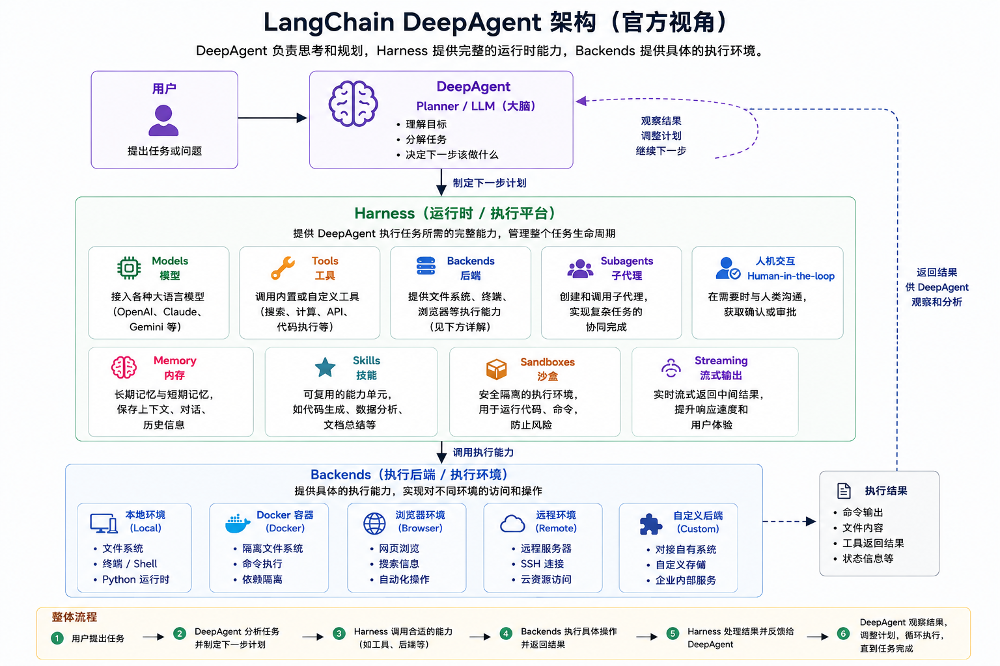

# DeepAgent框架

## **DeepAgents（深度智能体）介绍**

> 深度智能体（Deep Agents）是一个用于构建生产级智能体的库，基于 LangGraph 构建。
> 
> 

**Deep Agents**（简称 deepagents） 是 LangChain 官方在 2025 年后推出的独立库、企业级智能体套件（Agent Harness），专门用来做长周期、多步骤、高复杂度的任务（如深度研究、全栈项目开发、复杂工作流编排）。

## 为什么要用**DeepAgents？**


目前最常见的 **Agent **实现思路，是依托大模型推理**循环调用工具**以闭环任务。但面对复杂场景时（任务长、工具多等），该方案短板突出：容易出现**执行路径错乱、工具调用异常、上下文冗余膨胀、核心目标丢失**等问题，缺少**自主任务规划、中间状态管控与上下文精简优化**的原生能力。

在** LangChain **技术栈中，开发者可借助 **LangGraph **自定义工作流，灵活区分 AI 自主决策节点与固定流程节点，按需选用 **ReAct**、先规划后执行等经典架构，但其自定义开发成本偏高、落地复杂度大。

**DeepAgents **应运而生，核心设计目标：**大幅降低长周期、多步骤复杂 Agent 的开发落地门槛。**

如果说 LangChain 是你动手搭积木的框架，LangGraph 是让积木稳定运转的地基，那 DeepAgents 就像是直接给你准备好了一整套拼好的模型。

## **DeepAgents是什么？**

DeepAgents 是 LangChain 公司在 LangGraph 与 LangChain 之后推出的第三个独立开源 Agent 框架。

传统浅层 Agent 仅依靠大语言模型、工具调用以及循环推理完成简单任务，能力局限性显著。而 DeepAgents 集成**规划工具**、**文件操作系统**、**多级子代理**、**专业系统提示**四大核心能力；支持持久化保存运行状态、拓展上下文承载上限，同时能够自主完成复杂任务拆分，可稳定胜任深度研究、自动化作业、规模化代码开发等高难度复杂工作。


**LangChain 1\.0** 形成了三层递进的智能体开发体系：

1. **LangGraph **是底层基座，主打状态持久化与运行可观测，承载工作流与智能体的核心运行逻辑。

2. **LangChain **基于前者进行高层封装，对外提供易用的智能体创建接口和灵活的中间件扩展机制。

3. **DeepAgents **构建于前两者之上，主打深度复杂场景。核心方法 `create_deep_agent`，便是在标准接口基础上，集成了一系列预置中间件能力。

### Deep Agent 的核心组成部分

Deep Agents 是一种[“Agent harness”](https://docs.langchain.com/oss/python/concepts/products#agent-harnesses-like-the-deep-agents-sdk)。

**Harness就是一个能够控制Agent更稳定运行的一种思想架构。**




```Python
uv add deepagents  # 下载deepagents依赖
```

```Python
from deepagents import create_deep_agent
from langchain_qwq import ChatQwen
from langchain_tavily import TavilySearch
from dotenv import load_dotenv
import os

load_dotenv()

# 创建模型
llm = ChatQwen(
    model="glm-5.1",
    api_key=os.getenv("DASHSCOPE_API_KEY"),
    base_url=os.getenv("DASHSCOPE_BASE_URL"),
    max_tokens=3000,
    enable_thinking=False
)
# 创建系统提示词
system_prompt = """
    你是一个智能助手，能够很聪明的帮助用户解决他的问题。
    必须使用待办事项
    设计到要搜索的内容请使用搜索工具
"""
# 创建深度代理
agent = create_deep_agent(
    model=llm,
    tools=[TavilySearch(max_results=3)],
    system_prompt=system_prompt
)
# 进行交互
result = agent.invoke({"messages": [{"role": "user", "content": "为什么现在内存涨价很离谱？"}]})

print(result)
```

## DeepAgents 的核心组件

### Models模型

**DeepAgents 支持使用langchain的任何模型。**

**DeepAgents 推荐的模型**：


### Tools工具

**和langchian中使用一样，也支持MCP工具**

**内置工具：**

### Backends后端

**Backends **是 **Deep Agents** 文件系统工具的底层实现，用于决定 **Agent **的文件读写、存储位置以及代码执行环境。通过不同 **Backend**，可以让 **Agent **操作内存、磁盘、持久化存储或沙盒环境。


**预构建的Backend后端：**


**StateBackend 默认状态后端**

```Python
from langchain_qwq import ChatQwen
from deepagents import create_deep_agent
from deepagents.backends import StateBackend
from deepagents.backends.utils import create_file_data
from langgraph.checkpoint.memory import MemorySaver
from dotenv import load_dotenv
import os

load_dotenv()

# 创建模型
llm = ChatQwen(
    model="glm-5.1",
    api_key=os.getenv("DASHSCOPE_API_KEY"),
    base_url=os.getenv("DASHSCOPE_BASE_URL"),
    max_tokens=3000,
    enable_thinking=False
)
# 创建检查点和后端系统
checkpointer = MemorySaver()
backend = StateBackend()
# 读取本地skill的内容
skill_url = "./skills/travel-planner/SKILL.md"
with open(skill_url, "r", encoding="utf-8") as f:
    skill_content = f.read()

# 将skill内容添加成一个映射，Agent会自动将映射添加到state中
skills_files = {
    "/skills/travel-planner/SKILL.md": create_file_data(skill_content),
}
# 创建代理
agent = create_deep_agent(
    model=llm,
    backend=backend,
    skills=["/skills/"],
    checkpointer=checkpointer,
)
# 执行
result = agent.invoke(
    {
        "messages": [{"role": "user", "content": "帮我制定一个长沙至上海三天的旅游计划"}],
        # 把文件填充到state状态的file字段中，后续Agent就会从file中去读取相关的skill
        "files": skills_files,
    },
    config={"configurable": {"thread_id": "12345"}},
)
# 在langsmith中可以看到完整的执行过程
```

**FilesystemBackend 文件系统后端**

```Python
from langchain_qwq import ChatQwen
from deepagents import create_deep_agent
from deepagents.backends.filesystem import FilesystemBackend
from langgraph.checkpoint.memory import MemorySaver
from pathlib import Path
from dotenv import load_dotenv
import os

load_dotenv()

# 创建模型
llm = ChatQwen(
    model="glm-5.1",
    api_key=os.getenv("DASHSCOPE_API_KEY"),
    base_url=os.getenv("DASHSCOPE_BASE_URL"),
    max_tokens=3000,
    enable_thinking=False
)
# 创建检查点和后端系统
checkpointer = MemorySaver()
root_dir = "./"  # 设置文件系统的根目录
# virtual_mode 设置True后，文件后端就限制在你设置的root_dir目录下面
backend = FilesystemBackend(root_dir=root_dir, virtual_mode=True)
# 创建代理
agent = create_deep_agent(
    model=llm,
    backend=backend,
    skills=[str(Path(root_dir) / "skills")],
    interrupt_on={
        "write_file": True,
        "read_file": False,
        "edit_file": True,
    },
    checkpointer=checkpointer,  # 必须要添加, FilesystemBackend会操作本地文件，有安全风险，最好是加上人机交互进行人工确认，或者使用沙箱作为后端

)
# 执行
result = agent.invoke(
    {
        "messages": [{"role": "user", "content": "帮我制定一个长沙至上海三天的旅游计划"}]
    },
    config={"configurable": {"thread_id": "12345"}},
)
```

**StoreBackend 长期记忆后端**

```Python
from langchain_qwq import ChatQwen
from deepagents import create_deep_agent
from deepagents.backends import StoreBackend
from deepagents.backends.utils import create_file_data
from langgraph.store.memory import InMemoryStore
from dotenv import load_dotenv
import os

load_dotenv()

# 创建模型
llm = ChatQwen(
    model="glm-5.1",
    api_key=os.getenv("DASHSCOPE_API_KEY"),
    base_url=os.getenv("DASHSCOPE_BASE_URL"),
    max_tokens=3000,
    enable_thinking=False
)
# 创建检查点和后端系统
store = InMemoryStore()
backend = StoreBackend(namespace=lambda _rt: ("filesystem",))  # _rt等于runtime对象   前面下划线代表当前对象暂时没使用这个对象

# 读取本地skill的内容
skill_url = "./skills/travel-planner/SKILL.md"
with open(skill_url, "r", encoding="utf-8") as f:
    skill_content = f.read()

# 将skill内容添加到长期记忆中，可以跨线程访问
store.put(
    namespace=("filesystem",),
    key="/skills/travel-planner/SKILL.md",
    value=create_file_data(skill_content),
)
# 创建代理
agent = create_deep_agent(
    model=llm,
    backend=backend,
    store=store,
    skills=["/skills/"],
)
# 执行
result = agent.invoke(
    {
        "messages": [{"role": "user", "content": "帮我制定一个长沙至上海三天的旅游计划"}]
    },
    config={"configurable": {"thread_id": "12345"}},
)
```

**ContextHubBackend  LangSmith Hub 后端**

在开始之前： `ContextHubBackend` 需要在 LangSmith 中设置一个 Context Hub 仓库。并在env文件中配置`LANGSMITH_API_KEY` 

https://smith\.langchain\.com/context
文档：https://docs\.langchain\.com/langsmith/context\-engineering\-concepts

`ContextHubBackend` 在 LangSmith Context Hub 仓库中存储你的代理的文件系统。


**将本地文件内容上传至context hub中**

```Python
# 需要通过langsmith sdk将AGENTS.md和SKILL.md 上传至langsmith中
from langsmith import Client
from langsmith.schemas import FileEntry, SkillEntry
from dotenv import load_dotenv

load_dotenv()

# 读取AGENTS.md内容
agent_url = "./AGENTS.md"
with open(agent_url, "r", encoding="utf-8") as f:
    agent_content = f.read()
# 读取本地skill的内容
skill_url = "./skills/travel-planner/SKILL.md"
with open(skill_url, "r", encoding="utf-8") as f:
    skill_content = f.read()
# 创建连接
client = Client()

# 推送skills内容
client.push_skill(
    "travel-planner",
    files={
        "SKILL.md": FileEntry(content=skill_content),
    },
    description="当用户需要制定旅行计划、规划旅游行程、推荐景点、安排路线或生成旅游攻略时使用此 Skill。",
    tags=["travel", "planner"],
)

# Memory内存AGENT.md文件是智能体每次对话是始终加载到系统提示词中的内容；
# 用于将项目约束、用户偏好、技术架构，规范信息等前置信息加载到智能体中（长期不会变的内容）
# 推送AGENTS.md
client.push_agent(
    "my-agent",
    files={
        "AGENTS.md": FileEntry(
            content=agent_content,
        ),
        "skills/travel-planner": SkillEntry(repo_handle="travel-planner"),
        "tools.json": FileEntry(content='{"tools": []}'),
    },
    description="对用户提的旅游问题进行规划",
    tags=["travel", "planner"],
    is_public=False,
)
```

```Python
from langchain_qwq import ChatQwen
from deepagents import create_deep_agent
from deepagents.backends import ContextHubBackend
from dotenv import load_dotenv
import os

load_dotenv()

# 创建模型
llm = ChatQwen(
    model="glm-5.1",
    api_key=os.getenv("DASHSCOPE_API_KEY"),
    base_url=os.getenv("DASHSCOPE_BASE_URL"),
    max_tokens=3000,
    enable_thinking=False
)

# 创建代理
agent = create_deep_agent(
    model=llm,
    backend=ContextHubBackend("my-agent"),
    skills=["/skills/"],
    memory=["/AGENTS.md"]
)
# 执行
result = agent.invoke(
    {
        "messages": [{"role": "user", "content": "帮我制定一个长沙至上海三天的旅游计划"}],
    },
    config={"configurable": {"thread_id": "54321"}},
)
```

**CompositeBackend  复合后端（路由后端）\- 生产推荐**

> **一个统一的 Backend（后端），将多个 Backend 组合起来，让 Agent 像操作一个文件系统一样访问不同类型的存储。**
> 
> 

**CompositeBackend **用于把多个 Backend 组合成一个 Backend，相当一个**后端路由器。**

```Python
from deepagents import create_deep_agent
from langchain_qwq import ChatQwen
from langchain.messages import HumanMessage
from deepagents.backends import CompositeBackend, StateBackend, FilesystemBackend, ContextHubBackend
# 创建工具和上下文
from dataclasses import dataclass
from langchain.tools import tool, ToolRuntime
from langgraph.store.memory import InMemoryStore
from langgraph.checkpoint.memory import InMemorySaver
from dotenv import load_dotenv
import os

load_dotenv()

# 创建模型
llm = ChatQwen(
    model="glm-5.1",
    api_key=os.getenv("DASHSCOPE_API_KEY"),
    base_url=os.getenv("DASHSCOPE_BASE_URL"),
    max_tokens=3000,
    enable_thinking=False
)

# 创建系统提示词
# system_prompt参数是静态的，意味着它在每次调用时不会改变。  如果需要动态提示词请看langchain中介绍
system_prompt = """
你是一名专业的旅行规划助手。
帮助用户规划旅行路线、推荐景点，并根据任务选择合适的 Skills 和工具完成工作。
缺少必要信息时主动询问；涉及实时信息时使用工具获取最新数据；回答保持清晰、准确、结构化。
请读取并保存 AGENTS.md 内容到你的文件系统：[粘贴 AGENTS.md 的内容]
"""

# 存储用户长期记忆
user_id = "user-123456"
store = InMemoryStore()
store.put(namespace=("memories", user_id), key="favorite", value="我喜欢吃火锅")


@dataclass
class Context:
    user_id: str


@tool
def get_user_preference(runtime: ToolRuntime[Context]) -> str:
    *"""*
*    获取用户长期保存的旅行偏好。*

*    当用户希望制定旅行计划、推荐景点或需要根据历史偏好生成方案时，*
*    使用该工具获取用户长期记忆中的旅行偏好。*
*    """*
*    *# 从上下文中获取用户id
    user_id1 = runtime.context.user_id
    # 从长期记忆中查询用户偏好
    record = runtime.store.get(namespace=("memories", user_id1), key="favorite")
    if record:
        return record.value

    return "暂无用户旅行偏好。"


agent = create_deep_agent(
    model=llm,  # 模型
    system_prompt=system_prompt,  # 系统提示词
    tools=[get_user_preference],  # 工具列表
    backend=CompositeBackend(
        default=StateBackend(),
        routes={
            "/sk/": ContextHubBackend("my-agent"),  # 使用contexthub中的skills     /sk/代表在之前的路径前面加加上/sk/，后续在路由的时候会根据/sk/来找不同的后端
            "/memory/": FilesystemBackend(root_dir="./", virtual_mode=True),

        }
    ),
    skills=["/sk/skills/"],
    memory=["/memory/AGENTS.md"],
    store=store,  # 长期记忆
    checkpointer=InMemorySaver(),  # 短期记忆（状态）

)
config = {"configurable": {"thread_id": "321321"}}

messages = {"messages": [HumanMessage(content="帮我制定一个长沙至上海三天的旅游计划")]}
agent.invoke(messages,
             config=config,
             context=Context(user_id))
```

### Permissions权限

控制Agent可以读取和写入的文件和目录

> **权限仅适用于内置的文件系统工具（****`ls`****、****`read_file`****、****`glob`****、****`grep`****、****`write_file`****、****`edit_file`****、****`delete`****）**
> 
> 

使用`FilesystemPermission`规则列表传递给`create_deep_agent`，规则按声明顺序进行评估。第一个匹配的规则获胜。如果没有规则匹配，则操作被允许。

```Python
from langchain_qwq import ChatQwen
from deepagents import create_deep_agent, FilesystemPermission
from deepagents.backends.filesystem import FilesystemBackend
from langgraph.checkpoint.memory import MemorySaver
from langgraph.types import Command
from pathlib import Path
from dotenv import load_dotenv
import os

load_dotenv()

# 创建模型
llm = ChatQwen(
    model="qwen3.6-flash",
    api_key=os.getenv("DASHSCOPE_API_KEY"),
    base_url=os.getenv("DASHSCOPE_BASE_URL"),
    max_tokens=3000,
    enable_thinking=False
)
# 创建检查点和后端系统
checkpointer = MemorySaver()
root_dir = "./"  # 设置文件系统的根目录
backend = FilesystemBackend(root_dir=root_dir, virtual_mode=True)
# 创建代理
agent = create_deep_agent(
    model=llm,
    backend=backend,
    skills=[str(Path(root_dir) / "skills")],
    permissions=[
        FilesystemPermission(
            operations=["read"],  # 规则：read涵盖ls、read_file、glob、grep。write涵盖write_file、edit_file、delete。
            paths=["/skills/**"],  # 用于匹配文件路径的全局模式
            mode="interrupt",  # 是否允许：是否允许、拒绝或暂停以获得人工批准的匹配操作。 可选值：默认"allow" | "deny" | "interrupt"
        )
    ],
    checkpointer=checkpointer
)
# 执行
result = agent.invoke(
    {
        "messages": [{"role": "user", "content": "帮我制定一个长沙至上海三天的旅游计划"}]
    },
    config={"configurable": {"thread_id": "12345"}},
    version="v2",
)
# 进行人机交互
if result.interrupts:
    # 获取人机交互端点
    interrupt_value = result.interrupts[0].value
    action_requests = interrupt_value["action_requests"]  # 人机中断列表
    review_configs = interrupt_value["review_configs"]  # 需要审查的内容

    # 创建从工具名称到检查配置的查找映射
    config_map = {cfg["action_name"]: cfg for cfg in review_configs}

    # 获取用户的决断
    resolve = ""
    # 如果有多个中断，通过循环处理多个中断操作
    for action in action_requests:
        review_config = config_map[action["name"]]
        print(f"审批的工具: {action['name']}")
        print(f"对应参数: {action['args']}")
        print(f"选项: {review_config['allowed_decisions']}")

        resolve = input()
    # 组装用户决策
    decisions = [
        {
            "type": resolve,
        }
    ]

    # 用户确定后恢复执行
    result = agent.invoke(
        Command(resume={"decisions": decisions}),
        config={"configurable": {"thread_id": "12345"}},  # 配置必须相同
        version="v2",
    )

print(result.value["messages"][-1].content)
```

### Sandboxs沙**箱**


在 Deep Agents 中，沙箱是** ****后端**，定义了 代理操作的环境。与仅暴露文件操作的其他后端（状态、文件系统、存储）不同， 沙箱后端还为代理提供了一个`execute`运行 shell 命令的工具。当你配置沙箱后端时，代理将获得：

- 所有标准文件系统工具（`ls`、`read_file`、`write_file`、`edit_file`、`delete`、 `glob`、`grep`）

- 用于在沙箱中运行任意 shell 命令的`execute`工具

- 保护主机系统的安全边界


**langchian中提供的沙箱平台：**


以上的都是收费内容，需要自己在本地实现一个沙箱。

#### **opensandbox**

官网：https://open\-sandbox\.ai/ 

**opensandbox是阿里开源的一个沙箱，专为AI功能提供沙箱环境。支持多种开发语言；**

**前置条件：**

1. Docker Engine 20\.10\+

2. Python 3\.10\+

- Linux、macOS 或安装了 WSL2 的 Windows

##### **安装并配置沙箱服务器**

首先，在终端中安装 opensandbox\-server 包，并生成一个针对 Docker 运行时的示例配置文件。

```Shell
# 下载安装 opensandbox-server  在整个环境中使用
uv add opensandbox-server
# 生成docker配置文件
opensandbox-server init-config ./.sandbox.toml --example docker 
# 启动服务
opensandbox-server
```

**安装python SDK**

```Python
uv add opensandbox-code-interpreter
```

**拉取Docker镜像**

建议在使用沙盒的时候先预拉取镜像，如果直接使用`opensandbox`创建沙盒，可能会出现镜像拉取超时导致失败。

```Shell
# 使用国内镜像   需要下载几分钟时间，占用大概6-7G
docker pull sandbox-registry.cn-zhangjiakou.cr.aliyuncs.com/opensandbox/code-interpreter:v1.0.2

# 验证镜像是否拉取成功
docker images | grep code-interpreter
```

**使用脚本测试沙箱是否已经成功安装完成（第一次启动容器会稍慢）**

```Python
*"""Deep Agents 的 OpenSandbox 后端实现。

这个模块有意保持与官方 `langchain-daytona` 集成包相近的结构，

核心思路很简单：

1. Deep Agents 期待一个符合 `SandboxBackendProtocol` 的沙箱后端。
2. 如果某个提供方既能执行 shell 命令，也能读写文件，那么继承
   `BaseSandbox` 往往是最短路径。
3. 我们真正需要做的，只是把提供方 SDK 翻译成 Deep Agents 关心的
   三个核心能力：命令执行、文件上传、文件下载。
"""

from __future__ import annotations

from dataclasses import dataclass
from datetime import timedelta
from typing import Any

from deepagents.backends.protocol import (
    ExecuteResponse,
    FileDownloadResponse,
    FileUploadResponse,
)
from deepagents.backends.sandbox import BaseSandbox

from opensandbox.models.execd import (
    RunCommandOpts,
)


@dataclass(slots=True)
class OpenSandboxConnectionSettings:
    """创建本地 OpenSandbox 实例时使用的连接配置。

    把这些选项抽到 dataclass 里的教学目的，是让维护边界更清楚：

    - 学生可以一眼看出哪些值属于基础设施配置；
    - 后端类本身可以继续专注于 Deep Agents 协议适配；
    - 以后修改 host、timeout 或 image 名称时，入口更集中。
    """

    domain: str = "http://localhost:8080"
    use_server_proxy: bool = False
    request_timeout_seconds: int = 120
    sandbox_timeout_hours: int = 2
    ready_timeout_seconds: int = 500
    health_check_polling_interval_seconds: int = 5
    image: str = (
        "sandbox-registry.cn-zhangjiakou.cr.aliyuncs.com/opensandbox/"
        "code-interpreter:v1.0.2"
    )
    entrypoint: tuple[str, ...] = ("/opt/opensandbox/code-interpreter.sh",)
    python_version: str = "3.11"


class OpenSandboxBackend(BaseSandbox):
    """面向 OpenSandbox 的 Deep Agents 后端适配器。

    这个类包装了一个已经创建好的 OpenSandbox 沙箱对象。
    也就是说，它并不试图把提供方 SDK 完全藏起来。
    相反，它会把集成边界明确暴露出来，便于教学和维护：

    - 提供方实例的创建逻辑可以放在 `create()`；
    - 提供方资源的清理逻辑可以放在 `close()`；
    - 面向 Deep Agents 的协议转换，集中在 `execute()`、
      `upload_files()` 和 `download_files()` 里。

    这样的分层通常更利于后续维护这类 partner integration。
    """

    def __init__(
            self,
            *,
            sandbox: Any,
            timeout: int = 30 * 60,
    ) -> None:
        """包装一个已经存在的 OpenSandbox 沙箱实例。

        Args:
            sandbox: OpenSandbox SDK 返回的提供方沙箱对象。
            timeout: `execute()` 的默认命令超时时间，单位为秒。
        """
        self._sandbox = sandbox
        self._default_timeout = timeout

    @classmethod
    def create(
            cls,
            *,
            settings: OpenSandboxConnectionSettings | None = None,
            timeout: int = 30 * 60,
    ) -> OpenSandboxBackend:
        """创建一个全新的、由 OpenSandbox 驱动的后端实例。

        这个辅助方法有意保持轻量，主要服务于 demo 和课堂场景。
        它把“从零开始怎么接起来”这件事讲得很直接：

        1. 启动本地 `opensandbox-server`；
        2. 调用这个工厂方法；
        3. 把返回的 backend 交给 Deep Agents。

        Returns:
            一个可直接使用的后端实例，内部包装了新创建的沙箱。
        """
        settings = settings or OpenSandboxConnectionSettings()

        # 把导入放进工厂方法内部，这样即便运行环境还没有安装
        # OpenSandbox，整个包本身也依然可以被导入。
        # 这能让文档、测试和打包场景下的导入报错更温和一些。
        import httpx
        from opensandbox.config import ConnectionConfigSync
        from opensandbox.sync import SandboxSync

        connection_config = ConnectionConfigSync(
            domain=settings.domain,
            use_server_proxy=settings.use_server_proxy,
            request_timeout=timedelta(seconds=settings.request_timeout_seconds),
            transport=httpx.HTTPTransport(
                limits=httpx.Limits(max_connections=20)
            ),
        )

        sandbox = SandboxSync.create(
            settings.image,
            entrypoint=list(settings.entrypoint),
            env={"PYTHON_VERSION": settings.python_version},
            timeout=timedelta(hours=settings.sandbox_timeout_hours),
            connection_config=connection_config,
            ready_timeout=timedelta(seconds=settings.ready_timeout_seconds),
            health_check_polling_interval=timedelta(
                seconds=settings.health_check_polling_interval_seconds
            ),
        )
        return cls(sandbox=sandbox, timeout=timeout)

    @classmethod
    async def acreate(
            cls,
            *,
            settings: OpenSandboxConnectionSettings | None = None,
            timeout: int = 30 * 60,
    ) -> OpenSandboxBackend:
        """异步工厂方法，用于创建全新的 OpenSandbox 后端。"""
        settings = settings or OpenSandboxConnectionSettings()

        import httpx
        from opensandbox import Sandbox
        from opensandbox.config import ConnectionConfig

        connection_config = ConnectionConfig(
            domain=settings.domain,
            use_server_proxy=settings.use_server_proxy,
            request_timeout=timedelta(seconds=settings.request_timeout_seconds),
            transport=httpx.AsyncHTTPTransport(
                limits=httpx.Limits(max_connections=20)
            ),
        )

        sandbox = await Sandbox.create(
            settings.image,
            entrypoint=list(settings.entrypoint),
            env={"PYTHON_VERSION": settings.python_version},
            timeout=timedelta(hours=settings.sandbox_timeout_hours),
            connection_config=connection_config,
            ready_timeout=timedelta(seconds=settings.ready_timeout_seconds),
            health_check_polling_interval=timedelta(
                seconds=settings.health_check_polling_interval_seconds
            ),
        )
        return cls(sandbox=sandbox, timeout=timeout)

    @property
    def id(self) -> str:
        """返回 Deep Agents 所要求的提供方沙箱 id。"""
        return self._sandbox.id

    def execute(
            self,
            command: str,
            *,
            timeout: int | None = None,
    ) -> ExecuteResponse:
        """在 OpenSandbox 内部执行一条 shell 命令。

        这个方法之所以关键，是因为它正好处在适配层的核心位置：

        - Deep Agents 以“执行 shell 命令”的方式来思考沙箱能力；
        - OpenSandbox 有自己的一套命令结果结构；
        - 这里负责把提供方输出归一化成上游稳定依赖的
          `ExecuteResponse` 协议。
        """
        effective_timeout = timeout if timeout is not None else self._default_timeout
        result = self._sandbox.commands.run(command, opts=RunCommandOpts(timeout=effective_timeout))

        stdout = self._collect_text_stream(getattr(result.logs, "stdout", []))
        stderr = self._collect_text_stream(getattr(result.logs, "stderr", []))

        output = stdout
        if stderr:
            output = f"{output}\n<stderr>{stderr}</stderr>" if output else f"<stderr>{stderr}</stderr>"

        return ExecuteResponse(
            output=output,
            exit_code=getattr(result, "exit_code", 0),
            truncated=False,
        )

    async def aexecute(
            self,
            command: str,
            *,
            timeout: int | None = None,
    ) -> ExecuteResponse:
        """优先使用提供方异步 SDK 来执行 shell 命令。"""
        effective_timeout = timeout if timeout is not None else self._default_timeout

        result = await self._sandbox.commands.run(command, opts=RunCommandOpts(timeout=effective_timeout))

        stdout = self._collect_text_stream(getattr(result.logs, "stdout", []))
        stderr = self._collect_text_stream(getattr(result.logs, "stderr", []))

        output = stdout
        if stderr:
            output = f"{output}\n<stderr>{stderr}</stderr>" if output else f"<stderr>{stderr}</stderr>"

        return ExecuteResponse(
            output=output,
            exit_code=getattr(result, "exit_code", 0),
            truncated=False,
        )

    def upload_files(self, files: list[tuple[str, bytes]]) -> list[FileUploadResponse]:
        """把文件上传到沙箱中。

        我们会先做路径校验和规范化，确保返回结果列表始终与输入顺序
        一一对应。这个细节看起来不大，但其实很重要：一旦 LLM 开始
        同时处理多个文件操作，稳定的顺序会让后端更容易推理和调试。
        """
        from opensandbox.models import WriteEntry

        responses: list[FileUploadResponse] = []
        entries: list[WriteEntry] = []

        for path, content in files:
            if not path.startswith("/"):
                responses.append(FileUploadResponse(path=path, error="invalid_path"))
                continue

            entries.append(WriteEntry(path=path, data=content, mode=644))
            responses.append(FileUploadResponse(path=path, error=None))

        if entries:
            self._sandbox.files.write_files(entries)

        return responses

    async def aupload_files(
            self,
            files: list[tuple[str, bytes]],
    ) -> list[FileUploadResponse]:
        """优先使用提供方异步文件 API 来上传文件。"""
        from opensandbox.models import WriteEntry

        responses: list[FileUploadResponse] = []
        entries: list[WriteEntry] = []

        for path, content in files:
            if not path.startswith("/"):
                responses.append(FileUploadResponse(path=path, error="invalid_path"))
                continue

            entries.append(WriteEntry(path=path, data=content, mode=644))
            responses.append(FileUploadResponse(path=path, error=None))

        if entries:
            await self._sandbox.files.write_files(entries)

        return responses

    def download_files(self, paths: list[str]) -> list[FileDownloadResponse]:
        """从沙箱中下载文件。

        Deep Agents 在下载成功时期待拿到原始字节内容。这里会把
        提供方细节收口在内部，并把缺失文件之类的情况映射成一组更小、
        更适合重试与推理的错误词汇。
        """
        responses: list[FileDownloadResponse] = []

        for path in paths:
            if not path.startswith("/"):
                responses.append(
                    FileDownloadResponse(
                        path=path,
                        content=None,
                        error="invalid_path",
                    )
                )
                continue

            try:
                content = self._sandbox.files.read_file(path)
            except Exception:
                responses.append(
                    FileDownloadResponse(
                        path=path,
                        content=None,
                        error="file_not_found",
                    )
                )
                continue

            if isinstance(content, str):
                content = content.encode("utf-8")

            responses.append(
                FileDownloadResponse(
                    path=path,
                    content=content,
                    error=None,
                )
            )

        return responses

    async def adownload_files(self, paths: list[str]) -> list[FileDownloadResponse]:
        """优先使用提供方异步文件 API 来下载文件。"""
        responses: list[FileDownloadResponse] = []

        for path in paths:
            if not path.startswith("/"):
                responses.append(
                    FileDownloadResponse(
                        path=path,
                        content=None,
                        error="invalid_path",
                    )
                )
                continue

            try:
                content = await self._sandbox.files.read_file(path)
            except Exception:
                responses.append(
                    FileDownloadResponse(
                        path=path,
                        content=None,
                        error="file_not_found",
                    )
                )
                continue

            if isinstance(content, str):
                content = content.encode("utf-8")

            responses.append(
                FileDownloadResponse(
                    path=path,
                    content=content,
                    error=None,
                )
            )

        return responses

    def close(self, *, kill: bool = True) -> None:
        """释放提供方资源。

        官方协议并没有强制规定唯一的清理方法名，所以这里显式暴露一层
        helper，方便应用代码和测试代码调用。

        Args:
            kill: 在关闭本地 client/session 之前，是否先销毁远端沙箱。
        """
        if kill:
            try:
                self._sandbox.kill()
            except Exception:
                pass

        close_method = getattr(self._sandbox, "close", None)
        if callable(close_method):
            close_method()

    async def aclose(self, *, kill: bool = True) -> None:
        """面向提供方沙箱的异步资源清理方法。"""
        if kill:
            try:
                await self._sandbox.kill()
            except Exception:
                pass

        close_method = getattr(self._sandbox, "close", None)
        if callable(close_method):
            maybe_coro = close_method()
            if hasattr(maybe_coro, "__await__"):
                await maybe_coro

    async def __aenter__(self) -> OpenSandboxBackend:
        """支持在 demo 和应用代码中使用异步上下文管理。"""
        return self

    async def __aexit__(self, exc_type: Any, exc: Any, tb: Any) -> None:
        """确保异步上下文退出时能正确释放沙箱资源。"""
        await self.aclose()

    @staticmethod
    def _collect_text_stream(stream_items: Any) -> str:
        """把提供方的日志分片拼接成一个字符串。

        OpenSandbox 的日志项通常是带有 `text` 字段的结构化对象。
        不过这里仍然保留防御性写法，这样即便某些 SDK 版本返回的是
        纯字符串，适配层也依然能稳住。
        """
        parts: list[str] = []
        for item in stream_items or []:
            text = getattr(item, "text", item)
            if text is None:
                continue
            parts.append(str(text))
**        return "".join(parts).strip()*
```

**封装opensandbox为一个模块**


```Python
*"""Deep Agents 的 OpenSandbox 后端实现。*

*这个模块有意保持与官方 `langchain-daytona` 集成包相近的结构，*
*这样在教学或对照阅读时更直观。*

*核心思路很简单：*

*1. Deep Agents 期待一个符合 `SandboxBackendProtocol` 的沙箱后端。*
*2. 如果某个提供方既能执行 shell 命令，也能读写文件，那么继承*
*   `BaseSandbox` 往往是最短路径。*
*3. 我们真正需要做的，只是把提供方 SDK 翻译成 Deep Agents 关心的*
*   三个核心能力：命令执行、文件上传、文件下载。*
*"""*

from __future__ import annotations

from dataclasses import dataclass
from datetime import timedelta
from typing import Any

from deepagents.backends.protocol import (
    ExecuteResponse,
    FileDownloadResponse,
    FileUploadResponse,
)
from deepagents.backends.sandbox import BaseSandbox

from opensandbox.models.execd import (
    RunCommandOpts,
)


@dataclass(slots=True)
class OpenSandboxConnectionSettings:
    *"""创建本地 OpenSandbox 实例时使用的连接配置。*

*    把这些选项抽到 dataclass 里的教学目的，是让维护边界更清楚：*

*    - 学生可以一眼看出哪些值属于基础设施配置；*
*    - 后端类本身可以继续专注于 Deep Agents 协议适配；*
*    - 以后修改 host、timeout 或 image 名称时，入口更集中。*
*    """*

*    *domain: str = "http://localhost:8080"
    use_server_proxy: bool = False
    request_timeout_seconds: int = 120
    sandbox_timeout_hours: int = 2
    ready_timeout_seconds: int = 500
    health_check_polling_interval_seconds: int = 5
    image: str = (
        "sandbox-registry.cn-zhangjiakou.cr.aliyuncs.com/opensandbox/"
        "code-interpreter:v1.0.2"
    )
    entrypoint: tuple[str, ...] = ("/opt/opensandbox/code-interpreter.sh",)
    python_version: str = "3.11"


class OpenSandboxBackend(BaseSandbox):
    *"""面向 OpenSandbox 的 Deep Agents 后端适配器。*

*    这个类包装了一个已经创建好的 OpenSandbox 沙箱对象。*
*    也就是说，它并不试图把提供方 SDK 完全藏起来。*
*    相反，它会把集成边界明确暴露出来，便于教学和维护：*

*    - 提供方实例的创建逻辑可以放在 `create()`；*
*    - 提供方资源的清理逻辑可以放在 `close()`；*
*    - 面向 Deep Agents 的协议转换，集中在 `execute()`、*
*      `upload_files()` 和 `download_files()` 里。*

*    这样的分层通常更利于后续维护这类 partner integration。*
*    """*

*    *def __init__(
            self,
            *,
            sandbox: Any,
            timeout: int = 30 * 60,
    ) -> None:
        *"""包装一个已经存在的 OpenSandbox 沙箱实例。*

*        Args:*
*            sandbox: OpenSandbox SDK 返回的提供方沙箱对象。*
*            timeout: `execute()` 的默认命令超时时间，单位为秒。*
*        """*
*        *self._sandbox = sandbox
        self._default_timeout = timeout

    @classmethod
    def create(
            cls,
            *,
            settings: OpenSandboxConnectionSettings | None = None,
            timeout: int = 30 * 60,
    ) -> OpenSandboxBackend:
        *"""创建一个全新的、由 OpenSandbox 驱动的后端实例。*

*        这个辅助方法有意保持轻量，主要服务于 demo 和课堂场景。*
*        它把“从零开始怎么接起来”这件事讲得很直接：*

*        1. 启动本地 `opensandbox-server`；*
*        2. 调用这个工厂方法；*
*        3. 把返回的 backend 交给 Deep Agents。*

*        Returns:*
*            一个可直接使用的后端实例，内部包装了新创建的沙箱。*
*        """*
*        *settings = settings or OpenSandboxConnectionSettings()

        # 把导入放进工厂方法内部，这样即便运行环境还没有安装
        # OpenSandbox，整个包本身也依然可以被导入。
        # 这能让文档、测试和打包场景下的导入报错更温和一些。
        import httpx
        from opensandbox.config import ConnectionConfigSync
        from opensandbox.sync import SandboxSync

        connection_config = ConnectionConfigSync(
            domain=settings.domain,
            use_server_proxy=settings.use_server_proxy,
            request_timeout=timedelta(seconds=settings.request_timeout_seconds),
            transport=httpx.HTTPTransport(
                limits=httpx.Limits(max_connections=20)
            ),
        )

        sandbox = SandboxSync.create(
            settings.image,
            entrypoint=list(settings.entrypoint),
            env={"PYTHON_VERSION": settings.python_version},
            timeout=timedelta(hours=settings.sandbox_timeout_hours),
            connection_config=connection_config,
            ready_timeout=timedelta(seconds=settings.ready_timeout_seconds),
            health_check_polling_interval=timedelta(
                seconds=settings.health_check_polling_interval_seconds
            ),
        )
        return cls(sandbox=sandbox, timeout=timeout)

    @classmethod
    async def acreate(
            cls,
            *,
            settings: OpenSandboxConnectionSettings | None = None,
            timeout: int = 30 * 60,
    ) -> OpenSandboxBackend:
        *"""异步工厂方法，用于创建全新的 OpenSandbox 后端。"""*
*        *settings = settings or OpenSandboxConnectionSettings()

        import httpx
        from opensandbox import Sandbox
        from opensandbox.config import ConnectionConfig

        connection_config = ConnectionConfig(
            domain=settings.domain,
            use_server_proxy=settings.use_server_proxy,
            request_timeout=timedelta(seconds=settings.request_timeout_seconds),
            transport=httpx.AsyncHTTPTransport(
                limits=httpx.Limits(max_connections=20)
            ),
        )

        sandbox = await Sandbox.create(
            settings.image,
            entrypoint=list(settings.entrypoint),
            env={"PYTHON_VERSION": settings.python_version},
            timeout=timedelta(hours=settings.sandbox_timeout_hours),
            connection_config=connection_config,
            ready_timeout=timedelta(seconds=settings.ready_timeout_seconds),
            health_check_polling_interval=timedelta(
                seconds=settings.health_check_polling_interval_seconds
            ),
        )
        return cls(sandbox=sandbox, timeout=timeout)

    @property
    def id(self) -> str:
        *"""返回 Deep Agents 所要求的提供方沙箱 id。"""*
*        *return self._sandbox.id

    def execute(
            self,
            command: str,
            *,
            timeout: int | None = None,
    ) -> ExecuteResponse:
        *"""在 OpenSandbox 内部执行一条 shell 命令。*

*        这个方法之所以关键，是因为它正好处在适配层的核心位置：*

*        - Deep Agents 以“执行 shell 命令”的方式来思考沙箱能力；*
*        - OpenSandbox 有自己的一套命令结果结构；*
*        - 这里负责把提供方输出归一化成上游稳定依赖的*
*          `ExecuteResponse` 协议。*
*        """*
*        *effective_timeout = timeout if timeout is not None else self._default_timeout
        result = self._sandbox.commands.run(command, opts=RunCommandOpts(timeout=effective_timeout))

        stdout = self._collect_text_stream(getattr(result.logs, "stdout", []))
        stderr = self._collect_text_stream(getattr(result.logs, "stderr", []))

        output = stdout
        if stderr:
            output = f"{output}\n<stderr>{stderr}</stderr>" if output else f"<stderr>{stderr}</stderr>"

        return ExecuteResponse(
            output=output,
            exit_code=getattr(result, "exit_code", 0),
            truncated=False,
        )

    async def aexecute(
            self,
            command: str,
            *,
            timeout: int | None = None,
    ) -> ExecuteResponse:
        *"""优先使用提供方异步 SDK 来执行 shell 命令。"""*
*        *effective_timeout = timeout if timeout is not None else self._default_timeout

        result = await self._sandbox.commands.run(command, opts=RunCommandOpts(timeout=effective_timeout))

        stdout = self._collect_text_stream(getattr(result.logs, "stdout", []))
        stderr = self._collect_text_stream(getattr(result.logs, "stderr", []))

        output = stdout
        if stderr:
            output = f"{output}\n<stderr>{stderr}</stderr>" if output else f"<stderr>{stderr}</stderr>"

        return ExecuteResponse(
            output=output,
            exit_code=getattr(result, "exit_code", 0),
            truncated=False,
        )

    def upload_files(self, files: list[tuple[str, bytes]]) -> list[FileUploadResponse]:
        *"""把文件上传到沙箱中。*

*        我们会先做路径校验和规范化，确保返回结果列表始终与输入顺序*
*        一一对应。这个细节看起来不大，但其实很重要：一旦 LLM 开始*
*        同时处理多个文件操作，稳定的顺序会让后端更容易推理和调试。*
*        """*
*        *from opensandbox.models import WriteEntry

        responses: list[FileUploadResponse] = []
        entries: list[WriteEntry] = []

        for path, content in files:
            if not path.startswith("/"):
                responses.append(FileUploadResponse(path=path, error="invalid_path"))
                continue

            entries.append(WriteEntry(path=path, data=content, mode=644))
            responses.append(FileUploadResponse(path=path, error=None))

        if entries:
            self._sandbox.files.write_files(entries)

        return responses

    async def aupload_files(
            self,
            files: list[tuple[str, bytes]],
    ) -> list[FileUploadResponse]:
        *"""优先使用提供方异步文件 API 来上传文件。"""*
*        *from opensandbox.models import WriteEntry

        responses: list[FileUploadResponse] = []
        entries: list[WriteEntry] = []

        for path, content in files:
            if not path.startswith("/"):
                responses.append(FileUploadResponse(path=path, error="invalid_path"))
                continue

            entries.append(WriteEntry(path=path, data=content, mode=644))
            responses.append(FileUploadResponse(path=path, error=None))

        if entries:
            await self._sandbox.files.write_files(entries)

        return responses

    def download_files(self, paths: list[str]) -> list[FileDownloadResponse]:
        *"""从沙箱中下载文件。*

*        Deep Agents 在下载成功时期待拿到原始字节内容。这里会把*
*        提供方细节收口在内部，并把缺失文件之类的情况映射成一组更小、*
*        更适合重试与推理的错误词汇。*
*        """*
*        *responses: list[FileDownloadResponse] = []

        for path in paths:
            if not path.startswith("/"):
                responses.append(
                    FileDownloadResponse(
                        path=path,
                        content=None,
                        error="invalid_path",
                    )
                )
                continue

            try:
                content = self._sandbox.files.read_file(path)
            except Exception:
                responses.append(
                    FileDownloadResponse(
                        path=path,
                        content=None,
                        error="file_not_found",
                    )
                )
                continue

            if isinstance(content, str):
                content = content.encode("utf-8")

            responses.append(
                FileDownloadResponse(
                    path=path,
                    content=content,
                    error=None,
                )
            )

        return responses

    async def adownload_files(self, paths: list[str]) -> list[FileDownloadResponse]:
        *"""优先使用提供方异步文件 API 来下载文件。"""*
*        *responses: list[FileDownloadResponse] = []

        for path in paths:
            if not path.startswith("/"):
                responses.append(
                    FileDownloadResponse(
                        path=path,
                        content=None,
                        error="invalid_path",
                    )
                )
                continue

            try:
                content = await self._sandbox.files.read_file(path)
            except Exception:
                responses.append(
                    FileDownloadResponse(
                        path=path,
                        content=None,
                        error="file_not_found",
                    )
                )
                continue

            if isinstance(content, str):
                content = content.encode("utf-8")

            responses.append(
                FileDownloadResponse(
                    path=path,
                    content=content,
                    error=None,
                )
            )

        return responses

    def close(self, *, kill: bool = True) -> None:
        *"""释放提供方资源。*

*        官方协议并没有强制规定唯一的清理方法名，所以这里显式暴露一层*
*        helper，方便应用代码和测试代码调用。*

*        Args:*
*            kill: 在关闭本地 client/session 之前，是否先销毁远端沙箱。*
*        """*
*        *if kill:
            try:
                self._sandbox.kill()
            except Exception:
                pass

        close_method = getattr(self._sandbox, "close", None)
        if callable(close_method):
            close_method()

    async def aclose(self, *, kill: bool = True) -> None:
        *"""面向提供方沙箱的异步资源清理方法。"""*
*        *if kill:
            try:
                await self._sandbox.kill()
            except Exception:
                pass

        close_method = getattr(self._sandbox, "close", None)
        if callable(close_method):
            maybe_coro = close_method()
            if hasattr(maybe_coro, "__await__"):
                await maybe_coro

    async def __aenter__(self) -> OpenSandboxBackend:
        *"""支持在 demo 和应用代码中使用异步上下文管理。"""*
*        *return self

    async def __aexit__(self, exc_type: Any, exc: Any, tb: Any) -> None:
        *"""确保异步上下文退出时能正确释放沙箱资源。"""*
*        *await self.aclose()

    @staticmethod
    def _collect_text_stream(stream_items: Any) -> str:
        *"""把提供方的日志分片拼接成一个字符串。*

*        OpenSandbox 的日志项通常是带有 `text` 字段的结构化对象。*
*        不过这里仍然保留防御性写法，这样即便某些 SDK 版本返回的是*
*        纯字符串，适配层也依然能稳住。*
*        """*
*        *parts: list[str] = []
        for item in stream_items or []:
            text = getattr(item, "text", item)
            if text is None:
                continue
            parts.append(str(text))
        return "".join(parts).strip()
```

##### 配置opensandbox为Deepagents的后端沙箱

```Python
import asyncio
import os

from dotenv import load_dotenv
from langchain_qwq import ChatQwen
from langgraph.checkpoint.memory import MemorySaver

from deepagents import create_deep_agent
from deepAgent.langchain_opensandbox import (
    OpenSandboxBackend,
    OpenSandboxConnectionSettings,
)


load_dotenv()


def build_model() -> ChatQwen:
    return ChatQwen(
        model="qwen3.6-flash",
        api_key=os.getenv("DASHSCOPE_API_KEY"),
        base_url=os.getenv("DASHSCOPE_BASE_URL"),
        max_tokens=3000,
        enable_thinking=False,
    )


def build_backend() -> OpenSandboxBackend:
    settings = OpenSandboxConnectionSettings(
        domain="http://localhost:8080",
        use_server_proxy=False,
        request_timeout_seconds=120,
        sandbox_timeout_hours=2,
        ready_timeout_seconds=500,
        health_check_polling_interval_seconds=5,
    )
    return OpenSandboxBackend.create(settings=settings, timeout=120)


def smoke_test_backend(backend: OpenSandboxBackend) -> None:
    print("开始测试 OpenSandboxBackend 基础能力...")

    execute_result = backend.execute("echo 'hello from opensandbox'")
    print("命令执行结果:")
    print(execute_result.output)

    upload_result = backend.upload_files(
        [("/workspace/demo.txt", "hello deepagents".encode("utf-8"))]
    )
    print("文件上传结果:")
    print(upload_result)

    download_result = backend.download_files(["/workspace/demo.txt"])
    print("文件下载结果:")
    print(download_result)

    read_result = backend.read("/workspace/demo.txt")
    print("通过 BaseSandbox.read() 读取文件:")
    print(read_result)


def smoke_test_deep_agent(backend: OpenSandboxBackend) -> None:
    print("\n开始测试 deep agent 与自定义 sandbox 的集成...")

    system_prompt = """
        你是一个会在 OpenSandbox 中工作的智能助手。
        当用户要求你创建、读取、修改文件，或者执行命令时，优先使用文件系统和命令执行能力。
        回答使用中文，简洁说明你做了什么。
    """

    agent = create_deep_agent(
        model=build_model(),
        backend=backend,
        system_prompt=system_prompt,
        checkpointer=MemorySaver(),
    )

    result = agent.invoke(
        {
            "messages": [
                {
                    "role": "user",
                    "content": (
                        "请在 /workspace 下创建一个 notes.txt 文件，"
                        "内容是 'OpenSandbox 已接入 deepagents'，"
                        "然后读取这个文件并告诉我内容。"
                    ),
                }
            ]
        },
        config={"configurable": {"thread_id": "opensandbox-test-001"}},
    )

    print("Agent 调用完成，返回结果如下:")
    print(result)


async def async_backend_demo() -> None:
    print("\n开始测试异步接口...")
    backend = await OpenSandboxBackend.acreate(
        settings=OpenSandboxConnectionSettings(
            domain="http://localhost:8080",
            use_server_proxy=False,
            request_timeout_seconds=120,
            sandbox_timeout_hours=2,
            ready_timeout_seconds=500,
            health_check_polling_interval_seconds=5,
        ),
        timeout=120,
    )

    try:
        result = await backend.aexecute("python -c \"print(2 + 2)\"")
        print("异步命令执行结果:")
        print(result.output)
    finally:
        await backend.aclose()


def main() -> None:
    backend = build_backend()
    try:
        smoke_test_backend(backend)
        smoke_test_deep_agent(backend)
    finally:
        backend.close()

    asyncio.run(async_backend_demo())


if __name__ == "__main__":
    main()
```

### Subagents子代理

**DeepAgent **支持分层智能体架构：主代理（协调者）创建子代理，将复杂任务委派给子代理执行；


#### 为什么要使用子代理？

**问题现象：**主代理调用搜索、文件读取、数据库等工具时，大量中间原始数据存入上下文窗口，挤占 token，导致：

1. 模型推理成本升高、速度变慢

2. 关键信息被淹没，任务精度下降

3. 长任务极易触发上下文超限报错

**子代理解决方案：上下文隔离 **

所有多轮工具调用、原始数据全部隔离在子代理内部；主代理仅接收精简总结 / 结构化 JSON，不会存储中间过程。

#### 使用场景

推荐使用

1. 多步骤复杂任务，中间工具输出量大

2. 垂直专业领域任务（代码评审、市场调研、财务分析），需要专属提示词 / 工具

3. 不同任务需要差异化模型（长文档大上下文模型、高速推理小模型）

4. 主代理仅做顶层统筹，不处理细节执行

不推荐使用

1. 单步极简任务（单次工具调用即可完成）

2. 需要主代理全程查看每一步中间数据

3. 任务简单，代理调度开销大于收益


**Deep Agents **会自动默认添加一个同步的 **`general-purpose`** 子代理，除非你已经提供了一个同名的同步子代理。

#### 自定义子代理

1. **方式一：**字典式 **SubAgent**

轻量配置，无需手动构建 LangGraph，直接通过字典声明子代理能力，所有字段说明：

```Python
from typing import Literal

from deepagents import create_deep_agent
from langchain_tavily import TavilySearch
from langchain_qwq import ChatQwen
from langchain.messages import AIMessageChunk, ToolMessage, AIMessage
from dotenv import load_dotenv
import os

load_dotenv()

# 创建模型
llm = ChatQwen(
    model="kimi-k2.6",
    api_key=os.getenv("DASHSCOPE_API_KEY"),
    base_url=os.getenv("DASHSCOPE_BASE_URL"),
    max_tokens=3000,
    enable_thinking=False
)

tavily_client = TavilySearch()


# 创建搜索工具
def internet_search(
        query: str,
        max_results: int = 5,
        topic: Literal["general", "news", "finance"] = "general",
        include_raw_content: bool = False,
):
    *"""Run a web search"""*
*    *return tavily_client.invoke(
        query,
        max_results=max_results,
        include_raw_content=include_raw_content,
        topic=topic,
    )


# 创建研究搜索子代理
research_subagent = {
    "name": "research-agent",
    "description": (
        "擅长互联网搜索、事实核查、行业调研、技术研究和信息汇总。"
        "当任务需要查阅外部资料、获取最新信息或进行深入研究时，应优先调用该 Agent。"
    ),
    "system_prompt": """
你是一名专业的研究助手。

工作原则：
- 制定合理的搜索计划，必要时进行多轮搜索。
- 综合多个可靠来源的信息，避免仅依赖单一来源。
- 对结果进行分析、归纳和总结，而不是简单复制搜索内容。
- 对存在争议或不确定的信息进行说明。
- 输出简洁、准确、结构清晰，并附带引用来源。
- 不暴露内部搜索过程和推理，仅返回最终研究结果。
""",
    "tools": [internet_search],
    "model": llm,
}
subagents = [research_subagent]

# 创建主代理
agent = create_deep_agent(
    model=llm,
    name="main-agent",  # 代理名称
    system_prompt="""
    你是一名智能任务调度助手。
    
    你的职责：
    - 理解用户需求并制定解决方案。
    - 根据任务特点决定是否调用子代理。
    - 对于需要联网搜索、事实核查、行业调研、技术分析或获取最新信息的任务，优先调用 research-agent。
    - 对于无需调用子代理即可完成的问题，直接回答即可。
    - 综合子代理返回的结果，向用户输出最终答案，不要暴露内部调度过程。
    """,
    subagents=subagents,
)
# 普通输出
# result = agent.invoke(
#     {
#         "messages": [{"role": "user", "content": "帮我查询下AI harness是什么？"}]
#     },
# )
# print(result["messages"][-1].content)


# 可以使用流式输出获取子代理的内容
current_agent = None
for chunk in agent.stream(
    {
        "messages": [{"role": "user", "content": "帮我查询下AI harness是什么？"}]
    },
    stream_mode=["messages", "updates"],
    subgraphs=True,  # 重点开启子代理
    version="v2",
):
    if chunk["type"] == "messages":
        token, metadata = chunk["data"]

        agent_name = metadata.get("lc_agent_name")
        if agent_name and agent_name != current_agent:
            current_agent = agent_name
            print(f"\n当前代理:{agent_name}")

        if isinstance(token, AIMessageChunk) and token.text:
            print(token.text, end="", flush=True)

    elif chunk["type"] == "updates":
        for source, update in chunk["data"].items():
            if  source in ("model", "tools"):
                message = update["messages"][-1]
                if isinstance(message, AIMessage) and message.tool_calls:
                    for tool in message.tool_calls:
                        print(f"\n调用工具：{tool['name']}")

                elif isinstance(message, ToolMessage):
                    print("\n工具执行完成")
```

2. **方式二：CompiledSubAgent **编译图子代理

对于复杂的工作流程，使用预构建的 **`LangGraph图`** 或 **`langchain的create_agent`** 作为 **`CompiledSubAgent`****。**

```Python
from typing import Literal

from deepagents import create_deep_agent, CompiledSubAgent
from langchain_tavily import TavilySearch
from langchain_qwq import ChatQwen
from dotenv import load_dotenv
import os

load_dotenv()

# 创建模型
llm = ChatQwen(
    model="qwen3.6-flash",
    api_key=os.getenv("DASHSCOPE_API_KEY"),
    base_url=os.getenv("DASHSCOPE_BASE_URL"),
    max_tokens=3000,
    enable_thinking=False
)

tavily_client = TavilySearch()


# 创建搜索工具
def internet_search(
        query: str,
        max_results: int = 5,
        topic: Literal["general", "news", "finance"] = "general",
        include_raw_content: bool = False,
):
    *"""Run a web search"""*
*    *return tavily_client.invoke(
        query,
        max_results=max_results,
        include_raw_content=include_raw_content,
        topic=topic,
    )


# ----------------------------
# 创建研究 Agent（先创建）
# ----------------------------
research_graph = create_deep_agent(
    model=llm,
    tools=[internet_search],
    system_prompt="""
你是一名专业的研究助手。

工作原则：
- 制定合理的搜索计划，必要时进行多轮搜索。
- 综合多个可靠来源的信息，避免仅依赖单一来源。
- 对结果进行分析、归纳和总结，而不是简单复制搜索内容。
- 对存在争议或不确定的信息进行说明。
- 输出简洁、准确、结构清晰，并附带引用来源。
- 不暴露内部搜索过程和推理，仅返回最终研究结果。
""",
)

# ----------------------------
# 包装成 CompiledSubAgent
# ----------------------------
research_subagent = CompiledSubAgent(
    name="research-agent",
    description=(
        "擅长互联网搜索、事实核查、行业调研、技术研究和信息汇总。"
        "当任务需要查阅外部资料、获取最新信息或进行深入研究时，应优先调用该 Agent。"
    ),
    runnable=research_graph,
)

# ----------------------------
# 主 Agent
# ----------------------------
agent = create_deep_agent(
    model=llm,
    subagents=[research_subagent],
)

result = agent.invoke(
    {
        "messages": [
            {
                "role": "user",
                "content": "帮我查询下 AI Harness 是什么？"
            }
        ]
    }
)

print(result["messages"][-1].content)
```

**两种方式选型对比**

**字典式 SubAgent **

- 优点：代码简洁、开箱即用、配置直观、开发速度快

- 缺点：无法自定义 Agent 的构建过程，不适合已有复杂 LangGraph 工作流的场景。

- 适用：调研、代码执行、文档阅读等标准化单流程子代理

**CompiledSubAgent **

- 优点：完整自定义 LangGraph 工作流或LangGhain\-create\_agent，支持循环、分支、多节点

- 缺点：代码量更大，需要掌握 LangGraph或LangGhain完整语法

- 适用：多层校验、多步骤审批、带状态流转的复杂垂直任务

**SubAgent 更偏"配置（Configuration）"，描述"我要一个什么样的 Agent"；CompiledSubAgent 更偏"集成（Integration）"，把一个已经存在的 Agent 接入 DeepAgent。**

### Skills技能

技能帮助你避免上下文臃肿，通过在启动时仅加载摘要，并在任务需要时读取完整指令。

详细技能介绍请看[Agent智能体](https://my.feishu.cn/docx/ZRKqdGvxQoZc1xxtULKcyjtznDf?from=navigation)

**技能的构成**

```Shell
my-skill/
├── SKILL.md          # 必需：技能的**入口点**和**元数据中心**
├── scripts/          # 可选: 可执行的代码
├── references/       # 可选: 文档数据
├── assets/           # 可选: 模板或资源
└── ...               # 其他的文件或目录
```

**使用技能时加载references/assets并执行scripts下的脚本**

skil内容：

[sales\-analysis\.zip](图片和附件/sales-analysis.zip)

代码：

```Python
from __future__ import annotations

import os
from pathlib import Path

from dotenv import load_dotenv
from langchain.agents.middleware.types import AgentMiddleware
from langchain_qwq import ChatQwen
from langgraph.checkpoint.memory import MemorySaver
from langgraph.runtime import Runtime

from deepagents import create_deep_agent, DeepAgentState
from deepagents.backends import CompositeBackend
from deepagents.backends.filesystem import FilesystemBackend
from deepAgent.langchain_opensandbox import (
    OpenSandboxBackend,
    OpenSandboxConnectionSettings,
)


load_dotenv()


PROJECT_ROOT = Path(__file__).resolve().parents[1]
DEEPAGENT_ROOT = PROJECT_ROOT / "deepAgent"
SKILLS_ROOT = DEEPAGENT_ROOT / "skills"
MOCK_DATA_DIR = DEEPAGENT_ROOT / "mock_data"
LOCAL_EXCEL_PATH = MOCK_DATA_DIR / "mock_sales_data.xlsx"

# 这两个路径是“加载到应用中的基础资源路径”。
# `/skills/` 由 FilesystemBackend 提供给 SkillsMiddleware 读取元数据；
# `/input/` 由 FilesystemBackend 提供给中间件读取测试 Excel。
APP_SKILLS_ROOT = "/skills"
APP_INPUT_ROOT = "/input"

# 这些路径是智能体最终在 OpenSandbox 中要访问的路径。
# 也就是说，技能文件虽然来源于本地 FilesystemBackend，
# 但真正执行脚本与读 Excel 时，都会读取这些沙箱内路径。
SANDBOX_SKILLS_ROOT = "/workspace/skills"
SANDBOX_SKILL_DIR = f"{SANDBOX_SKILLS_ROOT}/sales-analysis"
SANDBOX_EXCEL_PATH = "/workspace/data/mock_sales_data.xlsx"


class UploadState(DeepAgentState, total=False):
    *"""给中间件增加一个轻量状态位，避免重复上传文件。*

*    deepagents 的中间件会在一个线程里多轮运行；如果每次都重新把 skill*
*    和 Excel 上传到 sandbox，会让日志变吵，也会拖慢调试体验。*
*    因此这里用一个布尔值记录：当前线程是否已经完成过初始化上传。*
*    """*

*    *sandbox_assets_uploaded: bool


class SandboxAssetUploadMiddleware(AgentMiddleware[UploadState, None, object]):
    *"""在代理真正开始工作前，把本地技能文件和 Excel 上传到 OpenSandbox。*

*    这个中间件承接的是“基础文件通过 FilesystemBackend 加载到应用中，*
*    最终还是要使用 OpenSandbox”这一需求：*

*    1. 本地目录结构由 FilesystemBackend 统一读取；*
*    2. 中间件在任务开始前把关键文件同步到 OpenSandbox；*
*    3. 后续智能体通过 execute/read_file 等能力，直接在 sandbox 内运行 skill。*
*    """*

*    *state_schema = UploadState

    def __init__(
        self,
        *,
        backend: CompositeBackend,
        sandbox_backend: OpenSandboxBackend,
        sandbox_skill_dir: str,
        sandbox_excel_path: str,
    ) -> None:
        self._backend = backend
        self._sandbox_backend = sandbox_backend
        self._sandbox_skill_dir = sandbox_skill_dir.rstrip("/")
        self._sandbox_excel_path = sandbox_excel_path

    def before_agent(self, state: UploadState, runtime: Runtime[None]) -> dict[str, object] | None:
        *"""在主代理执行前完成文件同步。*

*        这里只做一次性初始化：*
*        - 从 `/skills/` 路由读取 skill 包中的文档、脚本和模板*
*        - 从 `/input/` 路由读取 mock Excel*
*        - 把它们统一上传到 OpenSandbox 的 `/workspace` 目录下*

*        一旦上传完成，智能体后续就能像处理真实沙箱文件一样去读取和执行。*
*        """*
*        *if state.get("sandbox_assets_uploaded"):
            return None

        upload_payloads: list[tuple[str, bytes]] = []

        # 先从 CompositeBackend 的 `/skills/` 路由读取 skill 包内容。
        # 这一路由底层实际上由 FilesystemBackend 提供，因此符合
        # “基础文件通过 FilesystemBackend 加载到应用中”的设计。
        skill_listing = self._backend.ls(f"{APP_SKILLS_ROOT}/sales-analysis")
        if skill_listing.error:
            raise RuntimeError(f"列出 skill 目录失败: {skill_listing.error}")

        skill_file_paths: list[str] = []
        for subdir in ("", "/assets", "/references", "/scripts"):
            list_result = self._backend.ls(f"{APP_SKILLS_ROOT}/sales-analysis{subdir}")
            if list_result.error:
                raise RuntimeError(f"读取 skill 子目录失败: {subdir}, error={list_result.error}")
            for entry in list_result.entries or []:
                if not entry.get("is_dir"):
                    skill_file_paths.append(entry["path"])

        for app_skill_path in sorted(skill_file_paths):
            relative_path = app_skill_path.replace(f"{APP_SKILLS_ROOT}/sales-analysis/", "")
            sandbox_target_path = f"{self._sandbox_skill_dir}/{relative_path}"

            download_response = self._backend.download_files([app_skill_path])[0]
            if download_response.error or download_response.content is None:
                raise RuntimeError(
                    f"无法从 FilesystemBackend 路由读取 skill 文件: {app_skill_path}, "
                    f"error={download_response.error}"
                )

            upload_payloads.append((sandbox_target_path, download_response.content))

        # 再从 `/input/` 路由读取待分析 Excel，并同步到 OpenSandbox。
        excel_app_path = f"{APP_INPUT_ROOT}/mock_sales_data.xlsx"
        excel_response = self._backend.download_files([excel_app_path])[0]
        if excel_response.error or excel_response.content is None:
            raise RuntimeError(
                f"无法从 FilesystemBackend 路由读取 Excel 文件: {excel_app_path}, "
                f"error={excel_response.error}"
            )
        upload_payloads.append((self._sandbox_excel_path, excel_response.content))

        upload_results = self._sandbox_backend.upload_files(upload_payloads)
        failed = [result for result in upload_results if result.error]
        if failed:
            raise RuntimeError(f"上传文件到 OpenSandbox 失败: {failed}")

        return {"sandbox_assets_uploaded": True}


def build_model() -> ChatQwen:
    *"""创建示例中使用的模型实例。"""*
*    *return ChatQwen(
        model="qwen3.6-max-preview",
        api_key=os.getenv("DASHSCOPE_API_KEY"),
        base_url=os.getenv("DASHSCOPE_BASE_URL"),
        max_tokens=3000,
        enable_thinking=False,
    )


def build_sandbox_backend() -> OpenSandboxBackend:
    *"""创建真正负责执行代码和文件操作的 OpenSandbox 后端。"""*
*    *settings = OpenSandboxConnectionSettings(
        domain="http://localhost:8080",
        use_server_proxy=False,
        request_timeout_seconds=120,
        sandbox_timeout_hours=2,
        ready_timeout_seconds=500,
        health_check_polling_interval_seconds=5,
    )
    return OpenSandboxBackend.create(settings=settings, timeout=120)


def build_composite_backend(sandbox_backend: OpenSandboxBackend) -> CompositeBackend:
    *"""创建“FilesystemBackend 加载资源 + OpenSandbox 执行命令”的复合后端。*

*    路由设计如下：*
*    - `/skills/` -> 本地 `deepAgent/skills/`*
*    - `/input/` -> 本地 `deepAgent/mock_data/`*
*    - 其余路径   -> OpenSandbox*

*    这样 deepagents 在读取 skill 元数据时会走 FilesystemBackend，*
*    但执行 `execute`、读写 `/workspace/...` 时仍然会落到 OpenSandbox。*
*    """*
*    *skills_backend = FilesystemBackend(root_dir=str(SKILLS_ROOT), virtual_mode=True)
    input_backend = FilesystemBackend(root_dir=str(MOCK_DATA_DIR), virtual_mode=True)
    return CompositeBackend(
        default=sandbox_backend,
        routes={
            f"{APP_SKILLS_ROOT}/": skills_backend,
            f"{APP_INPUT_ROOT}/": input_backend,
        },
    )


def build_agent(
    backend: CompositeBackend,
    sandbox_backend: OpenSandboxBackend,
):
    *"""创建一个“本地加载 + 沙箱执行”的 deep agent。*

*    关键点有两个：*

*    1. `backend` 传入 CompositeBackend，让 `/skills/` 和 `/input/` 这样的*
*       基础资源路径由 FilesystemBackend 提供；*
*    2. 用自定义 middleware 在代理启动前，把本地 skill 和 Excel*
*       先同步进 sandbox，这样 skill 中引用的脚本和数据文件都能真的被执行。*
*    """*
*    *system_prompt = f"""
你是一个在 OpenSandbox 中执行销售数据分析任务的智能体。

请始终使用中文回答，并严格基于实际数据输出结论，不要臆测未验证的信息。

当前任务所需资源已同步到 sandbox：
- 销售分析 skill：`{SANDBOX_SKILL_DIR}`
- 待分析数据文件：`{SANDBOX_EXCEL_PATH}`

执行销售分析任务时，必须遵循以下规则：

1. 先阅读 `{SANDBOX_SKILL_DIR}/SKILL.md`，并按照其中定义的流程、规则和脚本完成分析。
2. 在未检查表头、字段和工作表之前，不要假设数据结构，也不要直接手写分析代码。
3. 需要计算 KPI、分组汇总、趋势分析或异常识别时，优先调用 skill 中的 `analyze_excel.py`。
4. 不要先全文读取脚本内容；只有在执行失败、参数不明确或输出字段不足时，才允许检查脚本源码。
5. 如果脚本首次执行失败，先判断是否缺少依赖或参数不完整：
   - 缺少 `pandas`、`openpyxl` 等依赖时，先在当前 sandbox 中安装依赖，再重新执行；
   - 字段识别不准确时，优先补充 `--sheet`、`--date-column`、`--revenue-column`、`--quantity-column`、`--group-fields` 等参数后重新执行。
6. 如果脚本已经成功返回结构化结果，例如 `detected_columns`、`kpis`、`top_breakdowns`、`monthly_trend`、`anomalies`、`anomaly_details`，必须优先直接使用这些结果继续分析和回答。
7. 不要为了重复计算已经存在的 KPI、维度汇总、趋势结果或异常明细，再额外编写临时 pandas 脚本。
8. 只有在以下条件同时满足时，才允许补写额外代码：
   - 用户明确需要的结果，当前脚本输出中不存在；
   - 该缺失结果无法通过补充脚本参数并重新执行获得。
9. 如果脚本结果已经足以回答用户问题，应直接基于结果生成中文业务结论，而不是重复读取原始文件再做一遍计算。
10. 最终输出应为结构化中文销售分析结论，重点包括：
   - 执行摘要
   - KPI 快照
   - 趋势分析
   - 维度拆解
   - 异常与风险
   - 建议动作
""".strip()

    middleware = [
        SandboxAssetUploadMiddleware(
            backend=backend,
            sandbox_backend=sandbox_backend,
            sandbox_skill_dir=SANDBOX_SKILL_DIR,
            sandbox_excel_path=SANDBOX_EXCEL_PATH,
        )
    ]

    # 这里的 `/skills/` 路径会被 CompositeBackend 路由到 FilesystemBackend，
    # 因此 SkillsMiddleware 看到的是本地 skill 目录；而真正的命令执行与
    # `/workspace/...` 文件访问仍然走默认的 OpenSandboxBackend。
    return create_deep_agent(
        model=build_model(),
        backend=backend,
        middleware=middleware,
        skills=[f"{APP_SKILLS_ROOT}/"],
        system_prompt=system_prompt,
        checkpointer=MemorySaver(),
        state_schema=UploadState,
    )


def ensure_mock_excel_exists() -> None:
    *"""检查 mock Excel 是否存在，不存在时给出明确提示。"""*
*    *if not LOCAL_EXCEL_PATH.exists():
        raise FileNotFoundError(
            "未找到 mock Excel 文件，请先运行 deepAgent/mock_data/生成mock销售Excel.py"
        )


def run_demo() -> None:
    *"""执行一次完整示例。*

*    演示目标：*
*    - 由 FilesystemBackend 提供本地 skill 与 Excel 资源*
*    - 由中间件负责把资源同步到 OpenSandbox*
*    - 由智能体在 OpenSandbox 中自主安装依赖、执行分析脚本并输出中文报告*
*    """*
*    *ensure_mock_excel_exists()

    sandbox_backend = build_sandbox_backend()
    backend = build_composite_backend(sandbox_backend)

    try:
        agent = build_agent(backend, sandbox_backend)
        result = agent.invoke(
            {
                "messages": [
                    {
                        "role": "user",
                        "content": f"请分析 {SANDBOX_EXCEL_PATH} 这个销售 Excel 文件，并输出中文销售分析报告。",
                    }
                ]
            },
            config={"configurable": {"thread_id": "sales-analysis-opensandbox-demo"}},
        )

        print("代理执行完成，返回结果如下：")
        print(result)
    finally:
        sandbox_backend.close()


if __name__ == "__main__":
    run_demo()
```


### Context engineering上下文工程

**上下文工程**是指以正确的格式提供正确的信息和工具，以便模型（LLM）能够准确的完成任务。

**上下文类型：**

1. 输入上下文：系统提示词、记忆、skills，静态上下文

2. 运行上下文：runtime，传递元数据、连接信息等

3. 上下文压缩：内置的上下文摘要和卸载

4. 上下文隔离：使用子代理分担繁重的工作

5. 长期记忆：跨线程的持久化存储

```Python
from deepagents import create_deep_agent
from langchain_qwq import ChatQwen
from langchain.messages import HumanMessage
from deepagents.backends import CompositeBackend, StateBackend, FilesystemBackend
from dotenv import load_dotenv
import os

load_dotenv()

# 创建模型
llm = ChatQwen(
    model="glm-5.1",
    api_key=os.getenv("DASHSCOPE_API_KEY"),
    base_url=os.getenv("DASHSCOPE_BASE_URL"),
    max_tokens=3000,
    enable_thinking=False
)

# 创建系统提示词
# system_prompt参数是静态的，意味着它在每次调用时不会改变。  如果需要动态提示词请看langchain中介绍
system_prompt = """
你是一名专业的旅行规划助手。
帮助用户规划旅行路线、推荐景点，并根据任务选择合适的 Skills 和工具完成工作。
缺少必要信息时主动询问；涉及实时信息时使用工具获取最新数据；回答保持清晰、准确、结构化。
"""

# Memory内存AGENT.md文件是智能体每次对话是始终加载到系统提示词中的内容；
# 用于将项目约束、用户偏好、技术架构，规范信息等前置信息加载到智能体中（长期不会变的内容）
memory = ["./AGENTS.md"]  # 支持多个md文件约束

# skills技能
skills = ["./skills/budget/"]

# 创建工具和上下文
from dataclasses import dataclass
from langchain.tools import tool, ToolRuntime
from langgraph.store.memory import InMemoryStore
from langgraph.checkpoint.memory import InMemorySaver

# 存储用户长期记忆
user_id = "user-123456"
store = InMemoryStore()
store.put(namespace=("memories", user_id), key="favorite", value="我喜欢藏族文化")


@dataclass
class Context:
    user_id: str


@tool
def get_user_preference(runtime: ToolRuntime[Context]) -> str:
    *"""*
*    获取用户长期保存的旅行偏好。*

*    当用户希望制定旅行计划、推荐景点或需要根据历史偏好生成方案时，*
*    使用该工具获取用户长期记忆中的旅行偏好。*
*    """*
*    *# 从上下文中获取用户id
    user_id1 = runtime.context.user_id
    # 从长期记忆中查询用户偏好
    record = runtime.store.get(namespace=("memories", user_id1), key="favorite")
    if record:
        return record.value

    return "暂无用户旅行偏好。"


agent = create_deep_agent(
    model=llm,  # 模型
    system_prompt=system_prompt,  # 系统提示词
    tools=[get_user_preference],  # 工具列表
    memory=memory,  # 内存初始化记忆
    skills=skills,  # 技能
    store=store,  # 长期记忆
    checkpointer=InMemorySaver(),  # 短期记忆（状态）
    backend=CompositeBackend(
        default=StateBackend(),
        routes={
            # 将 ./AGENTS.md和skills 所在的目录挂载到 FilesystemBackend
            "/": FilesystemBackend(root_dir="/", virtual_mode=True),
            "/skills/": FilesystemBackend(root_dir="/skills", virtual_mode=True),
        }
    ),
)
config = {"configurable": {"thread_id": "1"}}

messages = {"messages": [HumanMessage(content="帮我推荐下旅游路线")]}
stream = agent.stream_events(messages,
                             config=config,
                             context=Context(user_id),
                             version="v3")

for message in stream.messages:
    print(f"[{message.node}] ", end="")
    for delta in message.text:
        print(delta, end="", flush=True)

    full_message = message.output
    usage = full_message.usage_metadata
    if usage:
        print(usage)
```

## **什么时候选择DeepAgents？**


