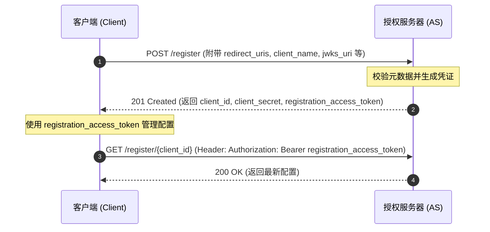

# Dynamic Client Registration (RFC 7591)

**动态客户端注册 (Dynamic Client Registration)** 是定义于 RFC 7591 的 [[OAuth-2.0]] 扩展协议。它允许客户端向 [[Authorization-Server-Metadata|授权服务器]] 自动化申请接入凭证。

## 交互过程

## 核心配置属性
- **注册输入**：`redirect_uris` (必须), `client_name`, `grant_types`, `response_types`, `token_endpoint_auth_method`, `jwks_uri` / `jwks`。
- **注册输出**：`client_id`, `client_secret` (若机密客户端), `client_id_issued_at`, `client_secret_expires_at`, `registration_access_token`, `registration_client_uri`。

## 安全考虑
- **初始化访问控制 (Initial Access Token)**：AS 可以要求客户端在请求 `/register` 时附带初始 Bearer Token，以防无差别注册滥用。
- **软件断言 (Software Statement)**：客户端可提交经过第三方 CA 或厂商签名的 JWT（`software_statement`），证明其合法来源与合规元数据。

---
**关联页面**：
- [[OAuth-2.0]] (授权框架)
- [[OpenID-Connect]] (OIDC 注册集成)
- [[OAuth-Client-ID-Metadata]] (去中心化对比)
