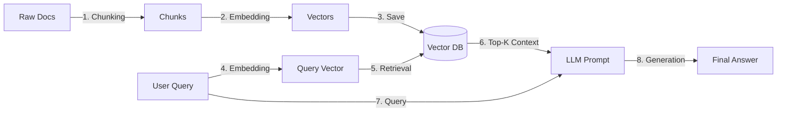

# Naive [[RAG]] (朴素 [[RAG]])

Naive [[RAG]] 是 [[RAG]] 的原始工程实现，采用最简单且直接的串行工作管道。

## 核心阶段流程


1. **索引构建阶段 (Indexing)**：
   - **分块 (Chunking)**：因为大模型输入有上下文窗口限制，所以必须将长篇文档切分为短的文本块（Chunk）。
   - **向量化 ([[Embedding]])**：利用 [[Embedding]] 模型将每个文本块编码为高维向量。
   - **存储**：将文本块与其向量数据成对存储在 [[Vector-Database]] 中。
2. **检索阶段 (Retrieval)**：
   - 将用户输入的 Query 进行同样的 [[Embedding]] 转化。
   - 利用向量距离算法（如余弦相似度）在数据库中检索最相似的前 K 个块（Top-K）。
3. **生成阶段 (Generation)**：
   - 将这几个块和 Query 装填进 Prompt 模板中：
     ```text
     根据以下已知信息回答用户问题。不要编造。
     【已知信息】：...
     【用户问】：...
     ```
   - 送给大模型（LLM）进行推理生成。

## 关键技术：分块策略 (Chunking)
分块是 [[RAG]] 系统的基石。常见的朴素分块手段有：
- **按句切分**：利用正则匹配句号、叹号等进行切分，保证了句子的语义相对完整。
- **固定字符数切分**：按固定的字符长度（例如每 100 字）无差别切断，速度最快，但可能将一句话从中截断导致语义支离破碎。
- **重叠滑动窗口（Sliding Window with Overlap）**：按固定大小切分，但每个块与上一个块保留一定比例的重叠字符（例如块大小 250，步长 100，即重叠 150）。这保证了段落交界处的上下文关系不会丢失。

## 局限性
朴素 [[RAG]] 存在诸多硬伤，如：检索精准度低（召回了不相关信息，或漏掉了关键信息）、块大小难以平衡、缺乏 Query 解析和多源路由等，这也促成了后续[[Advanced-RAG|高级 RAG]] 的诞生。

---
**关联页面**：
- [[RAG]] (核心概念)
- [[Embedding]] (数学表征基础)
- [[Vector-Database]] (存储底层)
