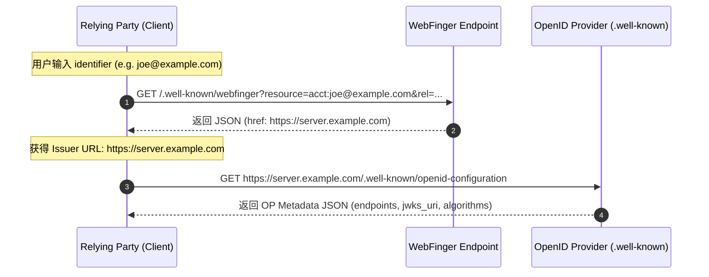

# OpenID Connect Discovery

**OpenID Connect Discovery** 是 [[OpenID-Connect|OpenID Connect 1.0]] 体系中用于解决“客户端如何自动发现身份提供者 (OP) 及其服务端点”的标准机制。

## 两个阶段的工作流程

### 阶段 1：Issuer Discovery (WebFinger)
- 目的：当用户仅提供 Email、域名或 URL 标识符时，确定处理该用户的 OP 所在地址。
- 端点：`/.well-known/webfinger`
- 参数：`resource` 与 `rel=http://openid.net/specs/connect/1.0/issuer`

### 阶段 2：OP Configuration Information
- 目的：获取该 OP 的所有技术参数。
- 端点：`/.well-known/openid-configuration`
- 关键字段：`issuer`, `authorization_endpoint`, `token_endpoint`, `userinfo_endpoint`, `jwks_uri`

## 关联标准
- [[Authorization-Server-Metadata]]：RFC 8414 对纯 [[OAuth-2.0]] 授权服务器元数据发现的泛化定义。
