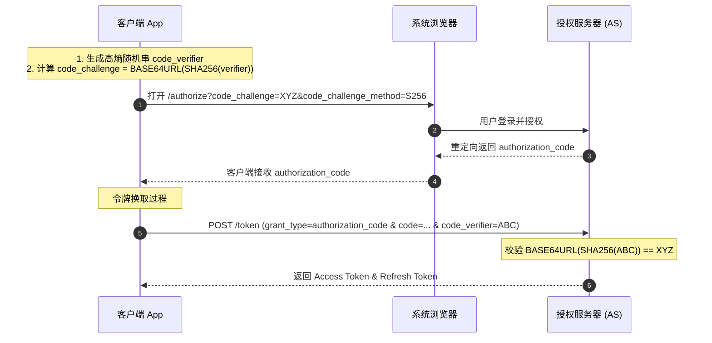

# PKCE (Proof Key for Code Exchange)

**PKCE**（读作 "pixy"，定义于 RFC 7636）是 [[OAuth-2.0]] 框架中最核心的安全增强协议之一，主要用于保护公共客户端（Public Clients）免受**授权码拦截攻击（Authorization Code Interception Attack）**。

## 防护原理与流程

## 核心技术细节
- **`code_verifier`**：由客户端生成的无规律随机字符串，长度必须在 43 到 128 字符之间，使用 `unreserved` 字符集 (`[A-Z]`, `[a-z]`, `[0-9]`, `-`, `.`, `_`, `~`)。
- **`code_challenge`**：对 `code_verifier` 进行转换后发送给 AS 的挑战码。
- **转换算法（`code_challenge_method`）**：
  - `S256`（**推荐且强制要求支持**）：`code_challenge = BASE64URL-ENCODE(SHA256(code_verifier))`。
  - `plain`（仅限无法实现 SHA-256 的极特殊环境，强烈**不推荐**）：`code_challenge = code_verifier`。

## 应用场景
- [[OAuth-Native-Apps|移动与桌面原生应用 (RFC 8252)]]：由于 Custom Scheme 容易被其他 App 注册拦截，必须强制配合 PKCE。
- **单页 Web 应用 (SPA)**：由于前端 JavaScript 代码完全公开且无 `client_secret`，使用 PKCE 替代隐式许可模式（Implicit Grant）。

---
**关联页面**：
- [[OAuth-2.0]] (授权框架)
- [[OAuth-Native-Apps]] (原生应用规范 RFC 8252)
- [[Authorization-Server-Metadata]] (元数据中声明 PKCE 算法 RFC 8414)
