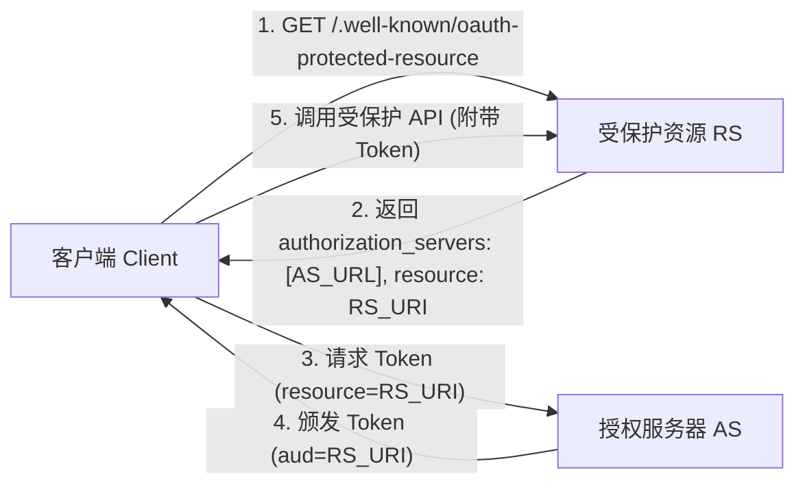

# Protected Resource Metadata (RFC 9728)

**OAuth 2.0 Protected Resource Metadata** (RFC 9728) 规定了 OAuth 2.0 中的受保护资源服务器（Resource Server, RS）如何向客户端公开其元数据描述。

## 适用场景与解决的痛点
在传统的 [[OAuth-2.0]] 交互中，客户端发起请求前必须硬编码知道某 API（RS）由哪一个 [[Authorization-Server-Metadata|授权服务器 (AS)]] 保护。当系统存在多个 AS 或复杂的微服务架构时，客户端缺乏标准手段动态确定目标 RS 所信任的 AS 列表。

## 路径格式与核心属性
- **发现路径**：`https://<resource-host>/.well-known/oauth-protected-resource`
- **核心 JSON 属性**：
  - `resource`: RS 的规范 URI 标识符（对应 [[Resource-Indicators|RFC 8707 Resource Indicator]]）。
  - `authorization_servers`: **核心字段**。包含该 RS 信任且可接受其颁发 Token 的 AS Issuer 地址数组。
  - `scopes_supported`: 该资源端点支持的 Scope 集合。
  - `bearer_methods_supported`: 传递 Access Token 的方式（如 `header`, `body`）。
  - `resource_documentation`: API 文档地址。

## 安全架构联动

1. **确定信任 AS**：客户端访问 RS 的 RFC 9728 元数据端点，获取信任的 `authorization_servers` 列表。
2. **结合 RFC 8707 请求 Token**：客户端向发现的 AS 发起授权请求，使用 [[Resource-Indicators|RFC 8707 `resource` 参数]] 指定该 RS 标识。
3. **实现受众隔离**：AS 生成带有 [[Audience-Restriction|`aud` 受众限制]] 的 Access Token，客户端持 Token 安全访问 RS。

---
**关联页面**：
- [[OAuth-2.0]] (授权框架)
- [[Authorization-Server-Metadata]] (AS端元数据发现 RFC 8414)
- [[Resource-Indicators]] (资源指示器 RFC 8707)
- [[Audience-Restriction]] (受众限制)
